# 指针进阶

> 我们已了解指针的：
>
> - 定义：指针变量，用于存放地址。地址唯一对应一块内存空间。
> - 大小：固定32位占4个字节，64位8个字节。
> - 类型：类型决定指针±整数的步长及解引用时访问的大小。
> - 运算：指针解引用，指针±整数，指针-指针，指针关系运算。
>
> 本章节在此基础上，对指针进行更深层次的研究。

## 字符指针

字符指针，存入字符的地址，类型为`char*`

### 字符指针的作用

1. 指向单个字符变量

```c
char ch = 'w';
const char* pch = &ch; // 这种容易理解，就是指针解引用访问字符变量
```

2. 指向字符串首字符

```c
char* pc = "hello";
printf("%s\n", pc);
```

类似于数组名，该指针存的是**常量字符串"hello"的首字符的地址**。通过对指针解引用访问首字符地址，从而找到整个字符串。

<center>
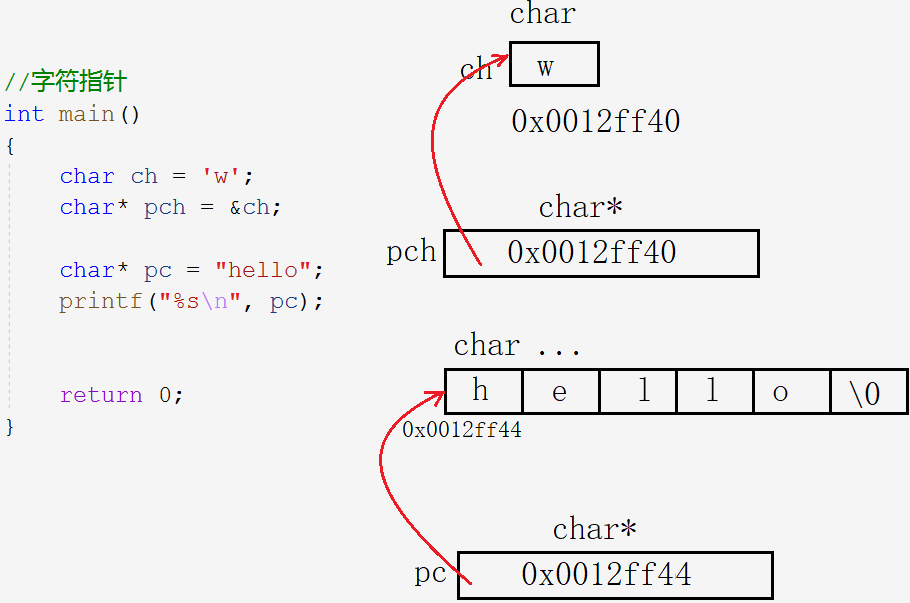
</center>

```c
char* pc = "hello";
printf("%c\n", *pc);//h
printf("%s\n", pc);//hello
```

字符串在空间上连续存放。把地址给`%s`会将其内容看作字符串并持续打印直到`\0` 。

### 字符指针的特点

```c
char str1[] = "hello bit";
char str2[] = "hello bit";

char* str3 = "hello bit";
char* str4 = "hello bit";

if (str1 == str2)
    printf("str1 == str2\n");//1
else
    printf("str1 != str2\n");//2

if (str3 == str4)
    printf("str3 == str4\n");//3
else
    printf("str3 != str4\n");//4
```

str1,str2,str3,str4都是指针，判断相等就是判断指针变量中存储的内容是否相同。

答案是`str1!=str2`和`str3==str4`。

- str1和str2是数组，先后开辟的两块不同的空间，地址当然不同。
- str3和str4字符串指针，其中存放的是存放在内存常量区、不可被修改、且具有唯一性的同一个常量字符串地址。

<center>
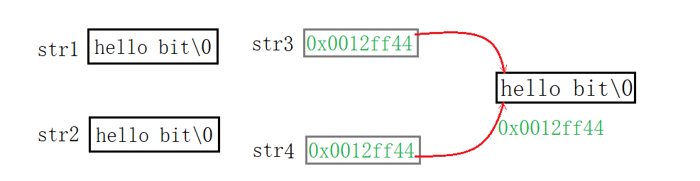
</center>

## 指针数组

### 指针数组的定义

```c
char* pch[5];
int* parr[10];
float* pf[20];
```

指针数组就是存放指针的数组。

```c
int arr[10];
int* arr[10];
```

- 整型数组的数组名`arr`，即首元素地址，是一级指针。
- 整型指针数组的数组名`parr`，也是首元素地址，不过首元素为`int*`类型变量，所以`parr`就是二级指针。

### 指针数组的使用

```c
int  arr1[] = { 1,2,3,4,5 };
int  arr2[] = { 2,3,4,5,6 };
int  arr3[] = { 3,4,5,6,7 };
int* parr[] = { arr1,arr2,arr3 };

for (int i = 0; i < 3; i++) {
    for (int j = 0; j < 5; j++) {
        printf("%d ", parr[i][j]); //1.
        printf("%d ", *(*(parr + i) + j)); //2.
    }
    printf("\n");
}
     parr[i] <=> *(parr+i)
*(parr[i]+j) <=> *(*(parr+i)+j) <=> (*parr+i)[j] <=> parr[i][j]
```

通过指针数组访问整型数组的每个元素。`parr[i][j]`和`*(*(parr+i)+j)`本质上是等价的。

```c
const char* pch[] = { "abcde", "bcdef", "cdefg" };
for (int i = 0; i < 3; i++) {

    printf("%s", pch[i]);//1.
    printf("%s", *(pch + i));//2.

    for (int j = 0; j < 5; j++) {
        printf("%c", pch[i][j]); //3.
        printf("%c", *(*(pch + i) + j));//4.
    }

    printf("\n");
}
```

> 打印字符串使用`%s`更简单，若要使用`%c`，就是得到每个字符串的起始地址，分别向后访问。

## 数组指针

> 数组指针是指向数组的指针，是指针而非数组。

### 数组指针的定义

**数组的地址存放在数组指针中**。且数组指针的类型为数组的类型再加个`*` 。

```c
//int a[10];
int* pa[10] = &arr; //[]的优先级比*高，故pa先与[]结合成数组名，所以pa是个指针数组
int(*pa)[10] = &arr;
```

数组指针的类型由数组类型决定，先找出数组类型`int[10]`，且不能让`[]`先与`pa`结合，所以用`()`先将`parr`和`*`结合，即成`int(*parr)[10]`。

C语言规定`[]`必须在最后面，所以不可写成`int[10]* parr`。

```c
int* parr[10];//指针数组
int(*parr)[10];//数组指针
```

去掉名字就是类型。所以`int[10]`是整型数组，`int*[10]`是指针数组，`int(*)[10]`是数组指针。

### 数组指针的使用

#### 反面用例

<center>
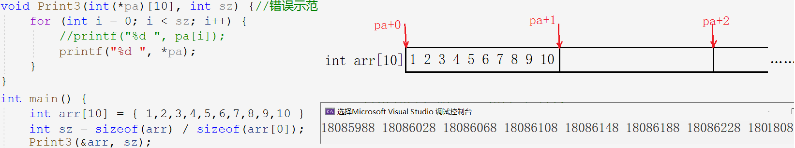
</center>

#### 正面用例

```c
// 二维数组传参,用二维数组接收
void Print(int arr[3][5], int r, int c) {
	for (int i = 0; i < r; i++) {
		for (int j = 0; j < c; j++) {
			printf("%d ", *(*(arr + i) + j));
		}
		printf("\n");
	}
}

//二维数组传参,用数组指针接收
void Print2(int(*pa)[5], int r, int c) {
	for (int i = 0; i < r; i++) {
		for (int j = 0; j < c; j++) {
            printf("%d ", pa[i][j]);//1.
			printf("%d ", *(*(pa + i) + j));//2.
		}
		printf("\n");
	}
}

int arr[3][5] = { 1,2,3,4,5, 2,3,4,5,6, 3,4,5,6,7 };
Print(arr, 3, 5);
```

- 把二维数组想象成**一个拥有三个元素的一维数组**（每个元素也为一维数组）。
- 由于其每个元素是有5个元素的一维数组，数组指针定义为`int(*p)[5]`，指向首行这个“一维数组”。（传参传的是数组名）
- 第一层循环用于“跳行”，即每次跳过5个元素。第二层循环遍历每行“一维数组”。

<center>
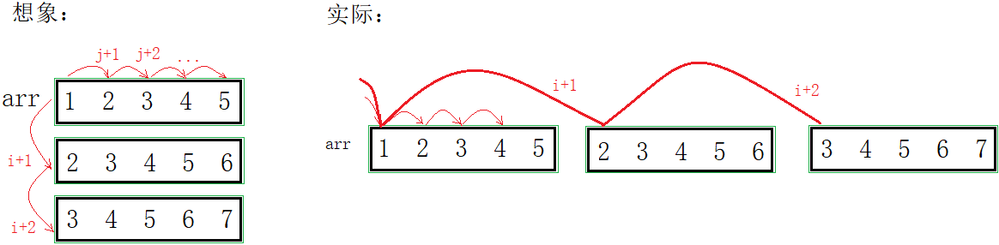
</center>

二维数组首元素为其首行，相当于一个一维数组，该一维数组的地址类型为`int(*)[5]`。

二维数组名作参数，降级为首元素指针即首行指针，所以它是数组指针，类型为`int(*)[5]`。

#### 举例

```c
int a[5]; //1. 整型数组
int *pa[5]; //2. 存放整型指针的数组
int (*pa)[10]; //3. 指向整型数组的指针
int (*pa[10])[5]; //4. 存放数组指针的数组
```

<center>
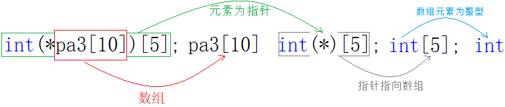
</center>

`pa`先和`[10]`结合为数组，剩下`int(*)[5]`是数组指针算pa数组的元素。所以是个元素个数为10的数组指针数组。

#### 类型辨别方法

1. 名称先和`[]`结合则为数组，只去掉数组名就是数组类型，去掉`[n]`和数组名便是其元素的类型。
2. 名称先和`*`结合则为指针，只去掉指针名就是指针类型，去掉`*`和指针名便是指向的变量的类型。

## 数组传参和指针传参

### 一维数组传参

```c
void test(int arr[]);   //1.
void test(int arr[10]); //2.
void test(int* arr);    //3.

int arr[10] = { 0 };
test(arr);
```

1. 用数组接收可行，但会降级优化成指针，编译器不会真创建一个数组。
2. 由于形参数组形同虚设，所以数组大小随便无意义。
3. 数组传参本质就是首元素地址，首元素类型为`int`，所以指针的类型为`int*`。

### 二维数组传参

```c
void test(int arr[ ][5]); //1.
void test(int arr[3][5]); //2.
void test(int (*arr)[5]); //3.

int arr[3][5] = { 0 };
test(arr);
```

- 二维数组传参可以用二维数组接收，**行可省略，但列不可以**。
- 二维数组传参用首行数组类型的数组指针接收。

### 一级指针传参

```c
void test(int* ptr, int n); //1.
void test(int arr[],int n); //2.

int a;
int arr[10];
test(&a);
test(arr);
```

- 一级指针传参，形参用指针和数组都行，但不提倡用数组。
- 若形参为指针，实参也可以是指针，也可以是数组。

### 二级指针传参

```c
void test(int** pp);
void test(int* arr[]);

int** pp;
test(pp);
```

当二级指针作函数参数时，形参可以是二级指针和指针数组。

> 当形参为二级指针，实参可以传什么呢？

```c
void test(int** pp);

int* p;
int** pp;
int* arr[10];

test(&p); //1.
test(pp); //2.
test(arr); //3.
```

当形参为二级指针时，实参可以是：二级指针、一级指针地址、指针数组首元素的地址。

## 函数指针

### 函数指针的定义

函数指针指向函数，存放函数的地址。搞懂函数指针，先了解函数的地址，**&函数名或函数名代表函数地址**。

<center>
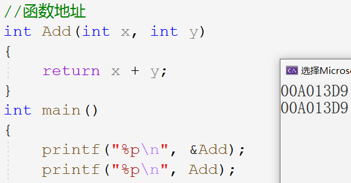
</center>

> 函数指针的类型该如何写呢？

```c
int(*pf)(int, int) = &Add;
int *pf(int, int) = &Add;
```

`int* pf(int, int)`，`pf`变成函数，返回类型是`int*`。所以必须带括号。函数指针去掉`*`和指针名，即函数类型`int(int,int)`。

### 函数指针的使用

```c
int(*pf)(int, int) = &Add;
int(*pf)(int, int) = Add;
int ret = (*pf)(2, 3);
int ret = pf(2, 3); //函数指针pf不解引用也可以直接调用函数
```

#### 举例

```c
(*(void(*)())0)(); //1.
void (*signal(int, void(*)(int)))(int); //2.
```

<center>
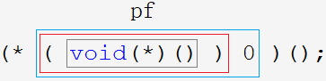
</center>

`void(*)()`是函数指针类型，放在`( )0`中，也就是把0强转成地址，该地址处存放一个函数其类型为`void(*)(void)`。

<center>
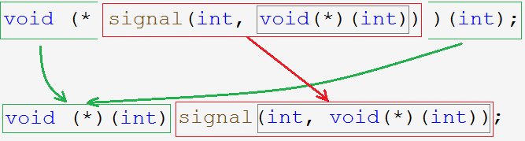
</center>

1. `signal`先和`()`结合，说明`signal`为函数名，其后`(int, void(*)(int))`，为其参数列表。
2. 去掉函数名称和参数列表，剩下的`void(*)(int)`就是返回类型，所以是一次函数声明。

## 函数指针数组

### 函数指针数组的定义

```c
int(*pfar[10])(int, int);
```
函数指针数组存放函数指针，故元素类型为函数指针类型。

### 函数指针数组的使用

```c
int Add(int x, int y);
int Sub(int x, int y);
int Mul(int x, int y);
int Div(int x, int y);

//函数指针数组 - pfArr
int(*pfArr[4])(int, int) = { Add,Sub,Mul,Div };
```
类型相同的函数，存放在同一个函数指针数组中。

## 指向函数指针数组的指针

```c
//函数指针
int (*pf)(int, int) = Add;
//函数指针数组
int (*pfArr[10])(int, int) = { Add };
//指向函数指针数组的指针
int(*(*ppfArr)[10])(int, int) = &pfArr;
```

<center>
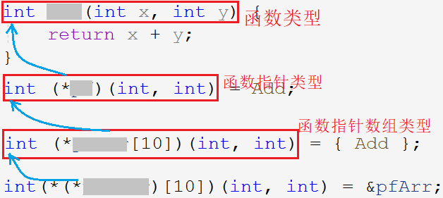
</center>

从后往前看，指向函数指针数组的指针去掉`*`和指针名就是函数指针数组的类型，函数指针数组去掉`*`和指针名就是函数指针类型，函数指针去掉`*`和指针名就是函数类型。

> 再研究下去就没有必要了。

## 回调函数

### 回调函数定义

如下图所示，被通过函数指针调用的函数叫做**回调函数**，第三方调用的参数也在其中被调用。

> 若想在调用函数中随条件变化而调用不同的函数，就必须使用回调函数的方法：调用函数中使用函数指针，指向不同函数。回调函数在大型工程中显得非常方便。

<center>
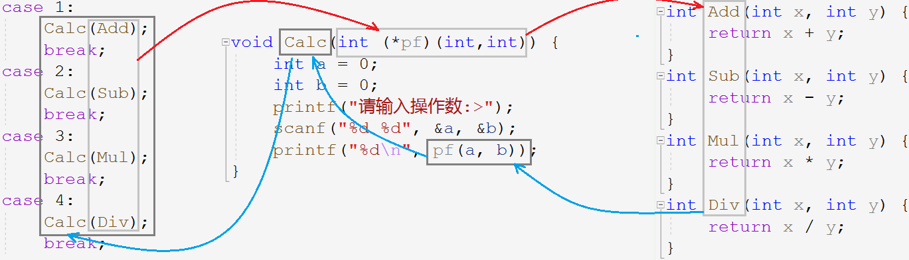
</center>

### 快速排序qsort

```c
void qsort(void* base, size_t num, size_t width, int (*cmp)(const void* e1, const void* e2));
```

<center>
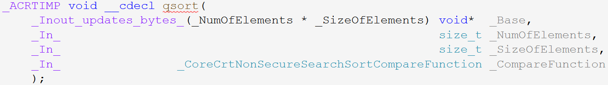
</center>

#### 模拟实现

```c
//打印函数
void print_arr(int arr[],int sz) {
	for (int i = 0; i < sz; i++) {
		printf("%d ", arr[i]);
	}
}
//交换函数
void Swap(char* buf1, char* buf2, size_t width) {
	for (size_t i = 0; i < width; i++) {//宽度次
		char tmp = *buf1;
		*buf1 = *buf2;
		*buf2 = tmp;
		buf1++;
		buf2++;
	}
}
//比较函数
int cmp(const void* e1, const void* e2) {
	return *(int*)e1 - *(int*)e2;
}
//排序函数
void my_sort(void* base, size_t num, size_t width, int(*cmp)(const void* e1, const void* e2)) {
	for (size_t i = 0; i < num - 1; i++) {
		for (size_t j = 0; j < num - 1 - i; j++) {
			if (cmp((char*)base + j * width, (char*)base + (j + 1) * width) > 0) {//以字节为单位
				Swap((char*)base + j * width, (char*)base + (j + 1) * width, width);
			}
		}
	}
}
int main() {
	int arr[10] = { 9,8,7,6,5,4,3,2,1,0 };
	int sz = sizeof(arr) / sizeof(arr[0]);
	my_sort(arr, sz, sizeof(arr[0]), cmp);
	print_arr(arr, sz);

	return 0;
}
```

## 指针和数组笔试题解析

### 数组辨析题

#### 一维数组

```c
int a[] = { 1,2,3,4 };
printf("%d\n", sizeof(a));//16
printf("%d\n", sizeof(a + 0));//4/8
printf("%d\n", sizeof(*a));//4
printf("%d\n", sizeof(a + 1));//4/8
printf("%d\n", sizeof(a[1]));//4
printf("%d\n", sizeof(&a));//4/8
printf("%d\n", sizeof(*&a));//16
printf("%d\n", sizeof(&a + 1));//4/8
printf("%d\n", sizeof(&a[0]));//4/8
printf("%d\n", sizeof(&a[0] + 1));//4/8
```

1. 只有数组名单独放在`sizeof`内部才是整个数组。

   `a+0`放在`sizeof`内部表示首元素地址+0。

2. 只要是地址，不管是什么类型的地址大小都是4/8

   基本类型指针，数组指针，函数指针大小都是4/8个字节，故`sizeof(&a)=sizeof(int(*)[4])=4`。`sizeof()`求指针所占字节而不是解引用访问权限大小。

3. `*`和`&`在一起会抵消。

   `sizeof(*&a)`，&a为整个数组的地址类型`int(*)[4]`，解引用后`int[4]`大小为16。

#### 字符数组

```c
char arr[] = { 'a','b','c','d','e','f' };
printf("%d\n", sizeof(arr));//6
printf("%d\n", sizeof(arr + 0));//4/8
printf("%d\n", sizeof(*arr));//1
printf("%d\n", sizeof(arr[1]));//1
printf("%d\n", sizeof(&arr));//4/8
printf("%d\n", sizeof(&arr + 1));//4/8
printf("%d\n", sizeof(&arr[0] + 1));//4/8

printf("%d\n", strlen(arr));//随机值x
printf("%d\n", strlen(arr + 0));//随机值x
printf("%d\n", strlen(*arr));//报错
printf("%d\n", strlen(arr[1]));//报错
printf("%d\n", strlen(&arr));//随机值x
printf("%d\n", strlen(&arr + 1));//随机值x-6
printf("%d\n", strlen(&arr[0] + 1));//随机值x-1
```

1. `sizeof(*arr)`，`*arr`对首元素地址解引用，计算首元素所占空间大小。

   `strlen(*arr)`，`*arr`依然是首元素，`strlen`把a也就是97当成地址，访问到非法内存所以报错。

<center>
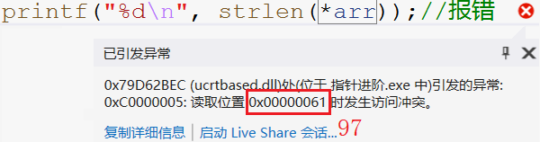
</center>

2.`strlen(&arr)`虽然是整个数组的地址，但依然是从首元素开始的，所以`strlen`依然从第一个元素开始找。

	`strlen(&arr+1)`，先计算`&arr+1`然后再传参过去，也就是跳过了整个数组去找。

**`sizeof`和`strlen`的区别**

- `sizeof` — 操作符 — 以字节为单位，求变量或类型所创建变量的所占空间的大小

> `sizoef`不是函数，计算类型是必须带上类型说明符`()`。`sizoef`内容不参与运算，在编译期间便转化完成。

<center>
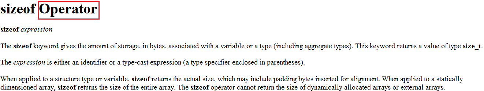
</center>

- `strlen` — 库函数 — 求字符串长度即字符个数，遇`\0`停止。

> 库函数，计算字符串长度没有遇到`\0`就会一直持续下去。返回类型`size_t`，参数`char* str` ，接收的内容都会认为是`char*`类型的地址。

<center>
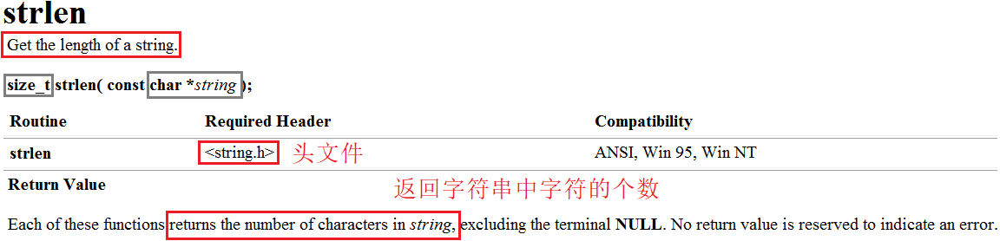
</center>

一个求变量所占空间，一个求字符串大小，二者本身是没有关系的，但总有人把二者绑在一起“混淆视听”。

#### 字符串数组

首先明确二者的区别：

```c
//1.字符初始化数组
char arr[] = { 'a','b','c','d','e','f' };//[a] [b] [c] [d] [e] [f]
//2.字符串初始化数组
char arr[] = "abcdef";//[a] [b] [c] [d] [e] [f] [\0]
```

> 字符初始化数组，存了什么元素数组里就是什么元素。而字符串初始化数组，除了字符串中可见的字符外，还有字符串末尾隐含的`\0`。`\0`存在于字符串的末尾，是自带的，虽不算字符串内容，但是字符串中的字符。

```c
char arr[] = "abcdef";
printf("%d\n", sizeof(arr));//7
printf("%d\n", sizeof(arr + 0));//4/8
printf("%d\n", sizeof(*arr));//1
printf("%d\n", sizeof(arr[1]));//1
printf("%d\n", sizeof(&arr));//4/8
printf("%d\n", sizeof(&arr + 1));//4/8
printf("%d\n", sizeof(&arr[0] + 1));//4/8

printf("%d\n", strlen(arr));//6
printf("%d\n", strlen(arr + 0));//6
printf("%d\n", strlen(*arr));//报错
printf("%d\n", strlen(arr[1]));//报错
printf("%d\n", strlen(&arr));//6
printf("%d\n", strlen(&arr + 1));//随机值
printf("%d\n", strlen(&arr[0] + 1));//5
```

1. `sizeof`计算变量的长度，变量可以是数组，数组元素以及指针。数组就是整个数组的大小，数组元素则是数组元素的大小，指针大小都为4/8。
2. `strlen`把传过来的参数都当作地址，是地址就从该地址处向后遍历找`\0`，不是地址当作地址非法访问就报错。

#### 常量字符串

```c
char* p = "abcdef";
```

> `"abcdef"`是常量字符串，用一个字符指针`p`指向该字符串，实质是`p`存入了首字符`a`的地址。由于字符串在内存中连续存放，依此特性便可以遍历访问整个字符串。

```c
char* p = "abcdef";
printf("%d\n", sizeof(p));//4/8
printf("%d\n", sizeof(p + 1));//4/8
printf("%d\n", sizeof(*p));//1
printf("%d\n", sizeof(p[0]));//1
printf("%d\n", sizeof(&p));//4/8
printf("%d\n", sizeof(&p + 1));//4/8
printf("%d\n", sizeof(&p[0] + 1));//4/8

printf("%d\n", strlen(p));//6
printf("%d\n", strlen(p + 1));//5
printf("%d\n", strlen(*p));//报错
printf("%d\n", strlen(p[0]));//报错
printf("%d\n", strlen(&p));//随机值
printf("%d\n", strlen(&p + 1));//随机值
printf("%d\n", strlen(&p[0] + 1));//5
```

1. `p`,`p+1`,`&p`,`&p+1`,`&p[0]+1`都是地址对于地址`sizeof`都求得4/8，`*p`,`p[0]`是数组元素，`sizeof`计算元素大小。
2. `p`,`p+1`,`&p`,`&p+1`,`&p[0]+1`都是地址对于地址`strlen`都向后遍历访问找`\0`，`*p`,`p[0]`是数组元素其对于ASCII值当作地址会访问到非法内存。
3. `p`,`p+1`,`&p[0]+1`都是字符串字符的地址，`&p`,`&p+1`都是指针变量`p`或其之后的地址。

<center>
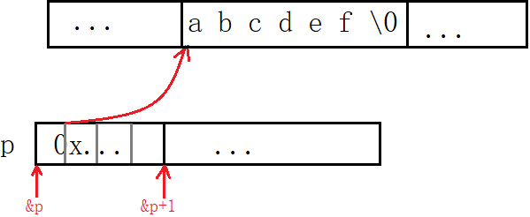
</center>

#### 二维数组

访问数组元素的方式是`数组名+[j]`。若将二维数组的每一行可以看成一个一维数组，则`a[0],a[1],a[2]`可以看成“每行“的数组名，和一维数组的数组名具有同样的效果。

> 1. 数组名单独放在`sizeof()`内部代表整个数组
> 2. `&`数组名同样代表整个数组（每行的数组名同样适用）

<center>
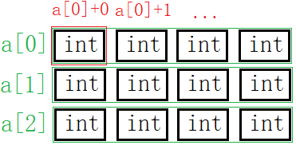
</center>

```c
int a[3][4] = { 0 };
printf("%d\n", sizeof(a));//12X4=48
printf("%d\n", sizeof(a[0][0]));//4
printf("%d\n", sizeof(a[0]));//16
printf("%d\n", sizeof(a[0] + 1));//4/8
printf("%d\n", sizeof(*(a[0] + 1)));//4
printf("%d\n", sizeof(a + 1));//4/8 - 第二行地址不代表第二行数组名
printf("%d\n", sizeof(*(a + 1)));//16
printf("%d\n", sizeof(&a[0] + 1));//4/8 - 第二行地址不代表第二行数组名
printf("%d\n", sizeof(*(&a[0] + 1)));//16 - 第二行数组地址解引用为数组名
printf("%d\n", sizeof(*a));//16
printf("%d\n", sizeof(a[3]));//16
```

- 对于二维数组来说，`sizeof(a[0])`求首行的整个数组大小。若是`sizeof(a[0]+1)`代表首行数组名没有单独放在`sizeof()`内部，故`a[0]`退化成了首元素地址。
- `sizeof(a+1)`代表第二行的地址仅为地址，但并不能第二行该“一维数组”的数组名，不可与`sizeof(a[1])`混淆。`&a[1]`等价于`a+1`。
- `sizeof(*(a+1))`，对第二行的地址解引用，相当于`sizeof(int[4])`。
- `*(&a[0]+1)`第二行数组地址解引用为数组名。**数组地址解引用代表整个数组，相当于数组名。切莫将数组地址和数组名混淆。**（`*&arr=arr`）

**总结**

搞清楚二维数组数组名的意义，必须搞清楚如下变量的含义。

```c
a[0]//首行数组名
a[0] + 1//首元素地址+1为第二个元素地址
&a[0] + 1//首行地址+1为第二行数组地址（a+1）
a//二维数组名
a + 1//首行地址+1为第二行数组地址
&a + 1//数组地址+1为第二个数组地址
*(a + 1) <=> *(&a[0] + 1)//第二行数组地址解引用为数组名
```

1. `a`是二维数组名，`a[0]`是首行数组名。
2. 参与运算后`a`退化为首行地址，`a[0]`退化为首元素地址。
3. `&a+1`跳过一个二维数组，`&a[0]+1`跳过一个一维数组。

### 指针笔试题

#### 例1

```c
int main()
{
	int a[5] = { 1, 2, 3, 4, 5 };
	int* ptr = (int*)(&a + 1);
	printf("%d,%d", *(a + 1), *(ptr - 1));
	return 0;
}
//程序的结果是什么？
```

指针运算要考虑指针类型，`&a+1`跳过了`int[4]`的长度，得到这个位置的地址后指针转化成`int*`型，此时再+1就只能跳过一个`int`。

本题考察指针类型决定指针±整数的长度。

#### 例2

```c
//由于还没学习结构体，这里告知结构体的大小是20个字节
struct Test
{
	int Num;
	char* pcName;
	short sDate;
	char cha[2];
	short sBa[4];
}*p;
//假设p 的值为0x100000。 如下表表达式的值分别为多少？
int main()
{
    p = 0x10000000;
	printf("%p\n",  (struct Test*)p + 0x1);
	printf("%p\n", (unsigned long)p + 0x1);
	printf("%p\n", (unsigned int*)p + 0x1);
	return 0;
}
```

p本是`struct Test*`的指针，后分别强制转换成`unsigned long`和`unsigned int*`类型分别+1跳过多少字节。`struct Test*`的指针+1跳过一个`struct Test`字节长度。`unsigned long`为整数类型+1即整数+1，不属于指针运算。

#### 例3

```c
int main()
{
	int a[4] = { 1, 2, 3, 4 };
	int* ptr1 = (int*)(&a + 1);
	int* ptr2 = (int*)((int)a + 1);
	printf("%x,%x", ptr1[-1], *ptr2);
	return 0;
}
```

`ptr1`和`ptr2`都是把不同的意义的变量强转成`int*`类型的地址。先进行一系列的操作后再读取该地址处的后4个字节。

> `&a`类型为`int(*)[4]`故+1跳过1个数组；`a`首先为首元素地址强转为`int`型整数再+1执行整数加法，由于内存以字节为单位，一个字节一个地址，故+1相当于下一个字节的地址。最后都强制转换为`int*`的指针，都向后访问4个字节。

由于系统为小端存储方案，也就按小端的方式读取数据。以%x的形式打印故不需要我们再去转换成十进制，答案分别为2000000，4。

<center>
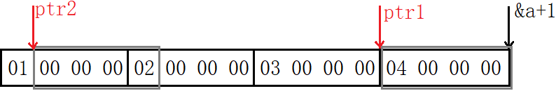
</center>

#### 例4

```c
#include <stdio.h>
int main()
{
	int a[3][2] = { (0, 1), (2, 3), (4, 5) };
	int* p;
	p = a[0];
	printf("%d", p[0]);
	return 0;
}
```

这题相对来说很简单，需注意到`()`内部为逗号表达式，所以数组元素分别为1,3,5,0,0,0 。

#### 例5

 ```c
 int main()
 {
 	int a[5][5];
 	int(*p)[4];
 	p = a;
 	printf("%p,%d\n", &p[4][2] - &a[4][2], &p[4][2] - &a[4][2]);
 	return 0;
 }
 ```

本题一眼就可以看到二维数组`a[5][5]`，本应用`int(*)[5]`的数组指针接收，为什么用4个元素的数组指针接收呢？

其实可以看出，数组在内存中都是连续存放的，对于这“一排“的数据，怎么看是我们的事，把它当成3列的4列的5列甚至是10列的都可以。所以数组指针大小仅仅决定一次访问几个元素，或是说决定了所指数组的列数。

>  本质上列数的改变并不会影响该二维数组，仅仅影响的是编译器如何看待该数组。

<center>
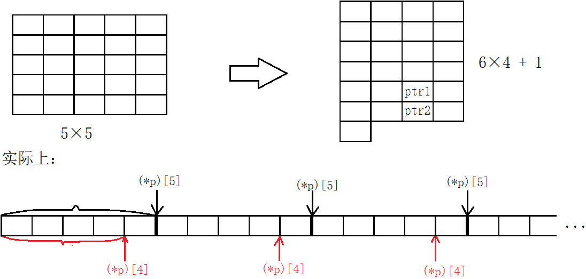
</center>

可以看出指针ptr1-ptr2为-4，故%d打印为-4，若以%p打印，因内存中存储的是-4的补码，再以无符号数的十六进制形式打印：

```
10000000 00000000 00000000 00000100
11111111 11111111 11111111 11111011
11111111 11111111 11111111 11111100
FF FF FF FC
```

#### 例6

```c
int main()
{
	int aa[2][5] = { 1, 2, 3, 4, 5, 6, 7, 8, 9, 10 };
	int* ptr1 = (int*)(&aa + 1);
	int* ptr2 = (int*)(*(aa + 1));
	printf("%d,%d", *(ptr1 - 1), *(ptr2 - 1));
	return 0;
}
```

&aa取出数组地址并+1跳过整个数组，aa相当于首行地址+1为第二行地址并解引用得第二行数组名，**数组地址解引用得数组名**。

<center>
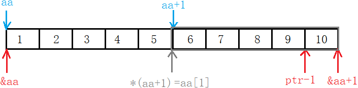
</center>

> aa+1得到第二行数组的数组地址，再解引用即对数组地址解引用，得到整个数组也就是数组名，`*(&arr)=arr` 。

<center>
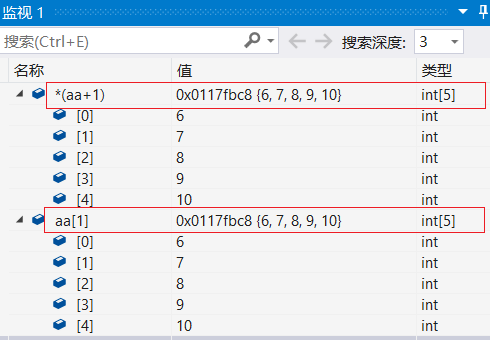
</center>

#### 例7

```c
#include <stdio.h>
int main()
{
	char* a[] = { "work","at","alibaba" };
	char** pa = a;
	pa++;
	printf("%s\n", *pa);
	return 0;
}
```

指针数组a分别存入`"work"`,`"at"`,`"alibaba"`三个字符串的首字符地址。又将指针数组名即首元素地址存入二级指针变量中。指针++访问第二个元素a的地，随后%s打印整个字符串。

#### 例8

```c
int main()
{
	char* c[] = { "ENTER","NEW","POINT","FIRST" };
	char** cp[] = { c + 3,c + 2,c + 1,c };
	char*** cpp = cp;
    //1.
	printf("%s\n", **++cpp);
	//2.
    printf("%s\n", *-- * ++cpp + 3);
	//3.
    printf("%s\n", *cpp[-2] + 3);
	//4.
    printf("%s\n", cpp[-1][-1] + 1);
	return 0;
}
```

> 首先字符指针数组`c`存有字符串首地址，其次指针数组`cp`存有”与指针c相关“的二级指针，最后三级指针`cpp`指向二级指针`cp`。

本题是最有难度的一题，需要注意到的是指针`++--`属于自增自减，会影响到本值。

1. `cpp`+1指向了数组`cp`的第二个元素，并解引用得到`c+2`。再解引用得到`"POINT"`的首地址。

<center>
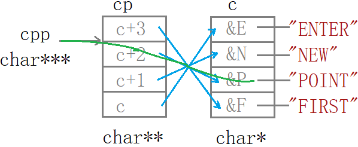
</center>

2. `cpp`+1指向数组`cp`的第三个元素并解引用得到`c+1`，`(c+1)--`后将数组`cp`的第三个元素修改为`c`，解引用访问数组`c`的首元素即`"ENTER"`的首地址再+3，打印出`ER`。

<center>
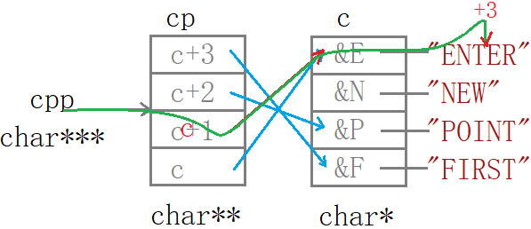
</center>

3. `cp[-2]=*(cp-2)`即`cpp`前移2个元素指向并访问了`c+3`，并解引用得数组`c`的第4个元素也就得到了`"FIRST"`的首地址+3，访问到`ST`并打印。

<center>
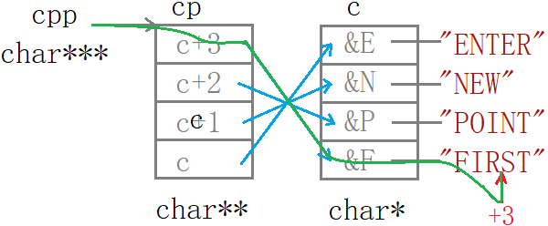
</center>

> `cpp-1`不是`cpp--`，虽然效果一样，但是对`cpp`的意义不同。`(cpp-2)`并没有改变`cpp`，所以`cpp`仍指向`cp`的第三个元素。

4. `cpp[-1][-1]`就相当于`*(*(cpp-1)-1)`即`cpp`-1解引用访问到了`c+2`-1再解引用访问到了数组`c`的第二个元素再+1，打印出`EW`。

<center>
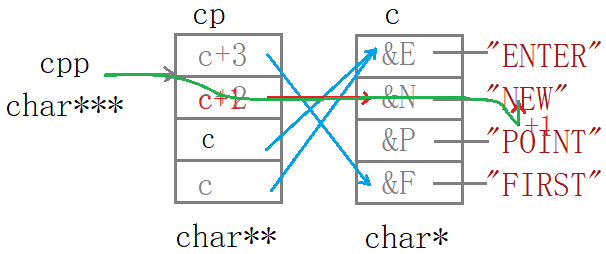
</center>

研究清楚之后再回头看代码其实非常简单，首先了解`cpp`和`cp`和`c`的关系：都是指针并从左向右一次指向，再看有关的操作。

```c
**++cpp;
*--*++cpp+3;
*cpp[-2]+3;
cpp[-1][-1]+1;
```

这四行代码其实本质上完全相同，都是1.`cpp`±整数并解引用；2.`cp`元素±整数并解引用；3.`c`元素±整数并解引用。如图所示：

<center>
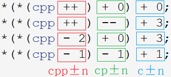
</center>
