# 指针进阶

> 我们在初阶时就已经接触过指针，了解了指针的相关内容，有：
>
> - 指针定义：指针变量，用于存放地址。地址唯一对应一块内存空间。
> - 指针大小：固定32位平台下占4个字节，64位8个字节。
> - 指针类型：类型决定指针±整数的步长及指针解引用时访问的大小。
> - 指针运算：指针解引用，指针±整数，指针-指针，指针关系运算。

本章节在此基础上，对C语言阶段指针进行更深层次的研究。

## 1. 字符指针

字符指针，存入字符的地址，类型为`char *`

### 1.1 字符指针的作用

1. 指向单个字符变量

~~~c
char ch = 'w';
const char* pch = &ch;
~~~

> 这种很容易理解，就是指针解引用访问字符变量。

2. 指向字符串首字符

~~~c
char* pc = "hello";
printf("%s\n", pc);
~~~

> 这种是把字符串`"hello"`放进指针嘛？
>
> 其实不然，类似于数组名，该指针存的是**常量字符串`"hello"`的首字符的地址**。通过对指针解引用访问首字符地址，从而找到整个字符串。

~~~c
char* pc = "hello";
printf("%c\n", *(pc + 1));//e
printf("%s\n", pc);//hello
printf("%s\n", pc + 1);//ello
~~~

> 字符串本质上还是在空间上连续存放，所以指针±整数同样有访问的效果。由此也可以看出`%s`的用法，把地址给`%s`会将其后的内容看作字符串并打印直到`\0` 。（所以我猜测%s的s是string的意思）

### 1.2 字符指针的特点

**例题**

~~~c
char str1[] = "hello bit";
char str2[] = "hello bit";

char* str3 = "hello bit";
char* str4 = "hello bit";

if (str1 == str2)
    printf("str1 = str2\n");//1
else
    printf("str1 != str2\n");//2

if (str3 == str4)
    printf("str3 = str4\n");//3
else
    printf("str3 != str4\n");//4
~~~

`str1(3)==str2(4)`，比较的是二者其实位置地址是否相同。（地址才是真正判断二者是否相同的要素）

> 答案是2和3。因为1和2是用字符串初始化数组，3和4是指针指向常量字符串。
>
> - str1和str2是普通的数组，是在内存上开辟了两块空间不过存放了一样的数据。
> - str3和str4指向常量字符串，存放在内存的常量区，是不可被修改且具有唯一性即常量区只存放一个。所以str3和str4指向的都是同一个字符串。

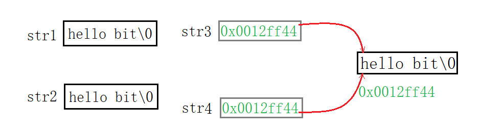

常量区的存储特点：存放在常量区的数据不可被修改，正因为不可修改所以存一份就够了。后期如果需要，使用的是同一数据。（数据还是同一个数据，只是用不同的指针维护）

**总结**

1. 常量字符串不可被修改，存放在内存的常量区。
2. 具有唯一性即常量区只存放一个。

## 2. 指针数组

### 2.1 指针数组的定义

~~~c
int arr[10];//整型数组
char ch[5];//字符数组
float f[20];//浮点型数组
~~~

> 可见，元素类型也就是数组的“类型”。

~~~c
char* pch[5];
int* parr[10];
float* pf[20];
~~~

指针数组就是存放指针的数组。

~~~c
int arr[10];
int* arr[10];
~~~

整型数组的数组名`arr`，即首元素地址，是一级指针。

指针数组的数组名`parr`，也是首元素地址，不过其首元素为`int*`类型变量，所以`parr`就是二级指针。

### 2.2 指针数组的使用

~~~c
int arr1[] = { 1,2,3,4,5 };
int arr2[] = { 2,3,4,5,6 };
int arr3[] = { 3,4,5,6,7 };

int* parr[] = { arr1,arr2,arr3 };

for (int i = 0; i < 3; i++) {
    for (int j = 0; j < 5; j++) {
        //1.
        printf("%d ", parr[i][j]);
        //2.
        printf("%d ", *(*(parr + i) + j));
    }
    printf("\n");
}
//答案
1 2 3 4 5
2 3 4 5 6
3 4 5 6 7
ps:
parr[i] <==> *(parr+i)
*(parr[i]+j) <==> *(*(parr+i)+j) <==> (*parr+i)[j] <==> parr[i][j]
~~~

> 通过指针数组访问整型数组的每个元素。`parr[i][j]`和`*(*(parr+i)+j)`本质上是等价的。

~~~c
const char* pch[] = { "abcde", "bcdef", "cdefg" };
for (int i = 0; i < 3; i++) {
    //1.
    printf("%s", pch[i]);
    //2.
    printf("%s", *(pch + i));
    for (int j = 0; j < 5; j++) {
        //3.
        printf("%c", pch[i][j]);
        //4.
        printf("%c", *(*(pch + i) + j));
    }
    printf("\n");
}
~~~

> 打印字符串使用`%s`更简单，若要使用`%c`，就是得到每个字符串的起始地址，分别向后访问。

从这里也可以看出数组和指针的关系，我愿称之为`*`和`[]`的爱恨情仇！

&nbsp;

## 3. 数组指针

> 由前面的例子，不难得出，数组指针是指向数组的指针，是指针而非数组。

### 2.1 数组指针的定义

~~~c
char ch = 'w';
char* pch = &ch;//字符地址存放在字符指针中

int a = 10;
int* pint = &a;//整型地址存放在整型指针中

float f = 0.0;
float* pf = &f;//浮点型地址存放在浮点型指针中
~~~

> 什么变量的地址存放在什么指针中。指针指向变量的类型，决定了指针的类型。顾名思义，数组指针指向的是数组。

递推可得，**数组的地址存放在数组指针中**。且数组指针的类型为数组的类型再加个`*` 。

> 下面那种定义方法是对的呢？

~~~c
int arr[10] = { 0 };
//1.
int* pa = arr;
//2.
&arr;//整个数组的地址
int* parr = &arr;
//3.
int* parr[10] = &arr;
//4.
int(*parr)[10] = &arr;
~~~

>
> 1. 取出的是首元素的地址，而非整个数组的地址
> 2. 整型指针应存放整型变量的地址，数组的地址无法存入整型指针中。
> 3. `[]`的优先级比`*`高，故`parr`先与`[]`结合成数组名，所以`parr`是个指针数组。

数组指针的类型由数组类型决定，先找出数组的类型`int[10]`（去掉名就是类型）。且不能让`[]`先与`parr`结合，所以用`()`先将`parr`和`*`结合，即成`int(*parr)[10]`。

> C语言规定`[]`必须再最后面，所以不可写成`int[10](*parr)`。

~~~c
int* parr[10];//指针数组
int(*parr)[10];//数组指针
~~~

我们前面强调过，**去掉名字就是类型**。所以`int[10]`是整型数组的类型，`int*[10]`是指针数组的类型，`int(*)[10]`是数组指针的类型。

#### &数组名和数组名

> 之前介绍过不止一遍，所以这次只说重点。

指针类型决定了指针±整数的步长。

~~~c
//首元素地址+1
printf("%p\n", arr);//0073FCA4
printf("%p\n", arr + 1);//0073FCA8
//整个数组地址+1
printf("%p\n", &arr);//0073FCA4
printf("%p\n", &arr + 1);//0073FCCC
~~~

1. 首元素地址就是整型指针+1，自然只能向后访问4shou个字节
2. 整个数组地址+1，即`int(*)[10]`型指针+1，向后访问了$int×10$即40个字节。

> `sizeof(arr)`也代表整个数组，现在去理解为什么`sizeof`里数组名代表的是整个数组呢？数组这种结构保存了数组的大小，`sizeof`求所占空间的长度，那自然要严谨一些了。

### 2.1 数组指针的使用

> 遍历数组，使用数组或是指针作形参接收就行了。且所谓的用数组接收仅是理解层面，本质上都是指针。

~~~c
void Print1(int arr[], int sz) {
	for (int i = 0; i < sz; i++) {
		//printf("%d ", arr[i]);
		printf("%d ", *(arr + i));

	}
}
void Print2(int* arr, int sz) {
	for (int i = 0; i < sz; i++) {
		printf("%d ", arr[i]);
		//printf("%d ", *(arr + i));
	}
}
int main() {
	int arr[10] = { 1,2,3,4,5,6,7,8,9,10 };
	int sz = sizeof(arr) / sizeof(arr[0]);
	Print1(arr, sz);
	Print2(arr, sz);
	return 0;
}
~~~

#### 反面用例

> 数组作实参，用数组或指针接收即可。数组指针使用对了很好用，但如果随便用可能会很别扭。下面先介绍强行使用数组指针的用法。

~~~c
//错误示范
void Print3(int(*pa)[10], int sz) {
	for (int i = 0; i < sz; i++) {
		//printf("%d ", pa[i]);
		printf("%d ", *(pa + i));
	}
}
~~~

> 将整个数组地址传过去，则用数组指针接收，然后呢，直接对`pa`解引用吗？

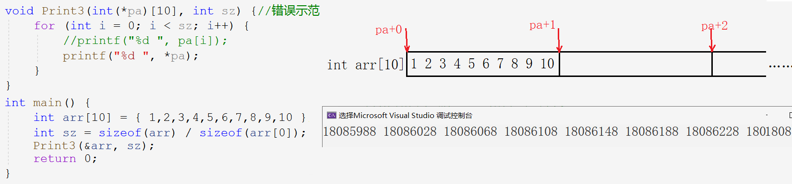

结果显然是错误的，从结果中也可以看出打印的是十进制下的地址，+1跳过40个字节。

> 这里笔者在学习的时候产生了个疑问，传过去数组的地址，为什么解一层引用后还是地址呢？
>
> `&arr`解引用`*`后相当于找到首元素的地址，可以理解为`&`和`*`相互抵消只剩下`arr`不就是首元素的地址嘛~

~~~c
void Print4(int(*pa)[10], int sz) {
	for (int i = 0; i < sz; i++) {
		printf("%d ", *(*(pa)+j));
	}
}
~~~

> 倘若我们把一维数组看作是二维数组第一行。由于二维数组在内存中是连续存放的，我们只打印二维数组的第一行，便可以避免上面的错误。

`*(pa)`相当于数组指针所指向数组的数组名。数组指针指向整个数组，将其看作二维数组并解引用得到一行的首元素，从而遍历访问。

#### 正面用例

> 从上面的例子也可以看出，**用数组指针访问二维数组**时，效果便不错。

~~~c
//二维数组传参,用二维数组接收
void Print1(int arr[3][5], int r, int c) {
	for (int i = 0; i < r; i++) {
		for (int j = 0; j < c; j++) {
			//printf("%d ", arr[i][j]);
			printf("%d ", *(*(arr + i) + j));
		}
		printf("\n");
	}
}
~~~

> 上面的例子，是正常二维数组传参，二维数组接收的情况。下面我们用数组指针接收。

~~~c
//二维数组传参,用数组指针接收
void Print2(int(*pa)[5], int r, int c) {
	for (int i = 0; i < r; i++) {
		for (int j = 0; j < c; j++) {
            //1.
            printf("%d ", pa[i][j]);
            //2.
			printf("%d ", *(*(pa + i) + j));
		}
		printf("\n");
	}
}
int main()
{
	int arr[3][5] = { 1,2,3,4,5, 2,3,4,5,6, 3,4,5,6,7 };
	Print2(arr, 3, 5);//二维数组首元素是首行

	return 0;
}
~~~

- 把二维数组想象成**一个拥有三个元素的一维数组**（每个元素也为一维数组），即一维数组的一维数组。
- 由于其每个元素是有5个元素的一维数组，数组指针定义为`int(*p)[5]`，指向首行这个“一维数组”。（传参传的是数组名）
- 第一层循环用于“跳行”，即每次跳过5个元素。第二层循环遍历每行“一维数组”。

> 1. 用二维数组和数组指针接收的都是首行地址。
> 2. 数组指针的类型`int(*)[5]`，和二维数组首元素地址的类型相同。

故可得，二维数组首元素地址和数组指针是等价的，即**数组指针**`pa`**就是数组名**。

二维数组首元素为其首行，相当于一个一维数组，该一维数组的地址类型为`int(*)[5]`。且实参为二维数组名，降级为指向首行的指针，所以它是数组指针，类型为`int(*)[5]`。

> 数组指针指向二维数组，才是使用数组指针的正确示范。

#### Example

> 下列示例分别是什么？

~~~c
//1.
int arr[5];
//2.
int *pa1[5];
//3.
int (*pa2)[10];
//4.
int (*pa3[10])[5];
~~~

1. 整型数组
2. 存放整型指针的数组

> `*`靠左靠右无所谓，`pa1`先和`[]`结合为数组，剩下`int*`为数组元素类型。

3. 指向整型数组的指针

> `(*pa2)`，`*`先和`pa2`结合为指针，剩下`int[10]`，指向的是元素个数为10的整型数组。

4. 存放数组指针的数组

> `pa3`先和`[10]`结合为数组，剩下`int(*)[5]`是指向数组的指针为数组的元素。所以是个元素个数为10的数组指针数组。
>
> 逆向思考，有整型数组`arr[5]`和指向该数组的类型为`int(*)[5]`的数组指针，还有数组指针数组`pa3[10]`用于存放该数组指针。

#### 类型辨别方法

1. 名称先和`[]`结合则为数组，只去掉数组名就是数组类型，去掉`[n]`和数组名便是其元素的类型。
2. 名称先和`*`结合则为指针，只去掉指针名就是指针类型，去掉`*`和指针名便是指向的变量的类型。

&nbsp;

## 4. 数组传参和指针传参

> 实践之中不免会碰到数组和指针作函数参数而如何设计形参的问题。

### 4.1 一维数组传参

> 一维数组传参，下列接收方式是否可行呢？

~~~c
//1.
void test(int arr[])
{}
//2.
void test(int arr[10])
{}
//3.
void test(int* arr)
{}
int main()
{
	int arr[10] = { 0 };
	test(arr);
	return 0;
}
~~~

1. 数组传参数组接收，可行但其实都会降级优化成指针，编译器不会真正创建一个数组。

2. 由于形参数组形同虚设，所以数组大小无意义，任意大小或无。（有歧义）

3. 数组传参本质就是首元素地址，首元素类型为`int`，所以指针的类型为`int*`。

> 所以可以看出`[]`和`*()`是等价的。我愿称之为`*`和`[]`的爱恨情仇！（‐＾▽＾‐）

~~~c
//1.
void test2(int* arr[2])
{}
//2.
void test2(int** arr)
{}
int main()
{
	int* arr2[10] = { 0 };
	test2(arr2);
	return 0;
}
~~~

指针数组，每个元素类型为`int*`，故用二级指针接收数组名。

> 一维数组传参，数组和指针接收。

### 4.2 二维数组传参

~~~c
//1.
void test(int arr[3][5])
{}
//2.
void test(int arr[][])
{}
//3.
void test(int arr[][5])
{}
int main() {
	int arr[3][5] = { 0 };
	test(arr);
}
~~~

- 二维数组传参用二维数组接收，**行可省略，但列不可以**。

~~~c
//4.
void test(int* arr)
{}
//5.
void test(int* arr[5])
{}
//6.
void test(int(*arr)[5])
{}
//7.
void test(int** arr)
{}
int main() {
	int arr[3][5] = { 0 };
	test(arr);
}
~~~

4. 整型指针接收的应该是整型变量的地址，而二维数组数组名为首行的数组地址。
5. 指针数组和二维数组无关。
6. 二维数组传参用首行数组大小的数组指针接收。
7. 二级指针和二维数组无关。

- 二维数组数组名`arr`为首行“一维数组”的地址，数组的地址用数组指针接收。

> `int(*)[5]`型数组指针指向元素个数为5的一维数组。指针+1访问到下一行，每次跳一行。再解一层引用访问一行里每个元素。

### 4.3 一级指针传参

> 反向思考，若函数形参为指针，传参时实参可以如何设计呢？

~~~c
void test(int* ptr, int sz)
{}
void test(int arr[],int sz)
{}
int main()
{
    //1.
    int a = 10;
    test(&a);
    //2.
	int arr[10] = { 0 };
	test(arr);
	return 0;
}
~~~

- 一级指针传参，形参用指针和数组都行，但不提倡用一维数组。
- 若形参为指针，实参也可以是指针（地址），也可以是数组。

### 4.4 二级指针传参

> 当二级指针作参数时，形参如何设计呢？

~~~c
void test(int** pp) {
	printf("%d\n", **pp);
}
void test(int* arr[]) {//用法不好
	printf("%d\n", *arr[0]);
}
int main() {
	int a = 10;
	int* p = &a;
	int** pp = &p;
	test(pp);
	return 0;
}
~~~

- 当二级指针作函数参数时，形参可以是二级指针和指针数组。

> 当形参为二级指针，实参可以传什么呢？

~~~c
void test(int** pp) {
	printf("%d\n", **pp);
}
int main() {
	int a = 10;
	int* p = &a;
	int** pp = &p;
	int* arr[10] = { &a };
    //1.
	test(&p);
    //2.
	test(pp);
    //3.
	test(arr);
	return 0;
}
~~~

- 当形参为二级指针时，实参可以是：二级指针（一级指针地址），指针数组首元素的地址。

&nbsp;

## 5. 函数指针

### 5.1 函数指针的定义

> 整型指针存放整型的地址；数组指针存放数组的地址；那么类比可得，函数指针存放函数的地址。

显然，函数指针指向函数，存放函数的地址。搞懂函数指针，先了解函数的地址。

**&函数名或函数名代表函数地址**，与&数组名和数组名略有不同，&函数名和函数名完全一致。

> 函数的地址必然要放到函数指针里，函数指针的类型该如何写呢？（以Add函数为例）

~~~c
//整型指针
int* pa = &a;
//字符指针
char* pc = &ch;
//数组指针
int(*pa)[10] = &arr;
//函数指针 - 存放函数地址
int(*pf)(int, int) = &Add;
~~~

#### 函数指针的类型

~~~c
int Add(int x, int y);
//1.
int(*pf)(int, int) = &Add;
//2.
int *pf(int, int) = &Add;
~~~

> 倘若，去掉括号`int* pf(int, int)`，`pf`就变成函数名，返回类型是`int*`。所以指针必须带括号。

前文已交代，指针，去掉指针名和`*`就是指针所指向的变量类型。

- 整型指针，去掉`*`和指针名，即为整型变量类型`int`。字符指针，为字符类型`char`。数组指针，去掉后为数组类型`int[10]`。
- 函数指针，去掉`*`和指针名，即为函数的类型`int(int,int)`。

**总结**

- 去掉指针名`pf`，即为指针类型`int(*)(int, int)`
- 去掉指针名`pf`和`*`，即为指针所指向的函数类型为`int(int, int)`

### 5.2 函数指针的使用

> 计算机硬件程序经常通过调用地址的方式来调用函数，因此需要使用函数指针调用函数。

~~~c
int Add(int x, int y)
{
	return x + y;
}
int main()
{
    //1.
    int(*pf)(int, int) = &Add;//函数指针指向Add函数
    //2.
    int(*pf)(int, int) = Add;

    //1.
	int ret = (*pf)(2, 3);
	//2.
    int ret = pf(2, 3);

    printf("%d\n", ret);
	return 0;
}
~~~

> 前面已经交代，&函数名和函数名都是函数的地址，完全等价。所以两种初始化函数指针的方式都可以。

既然函数名`Add`可以直接赋值给函数指针`pf`，说明二者等价。函数指针名`pf`不解引用也可以使用，`*`在此处形同虚设，甚至于不写或写多个都并无大碍，仅为理解。

> 既然函数名也是函数地址，所以对其解引用也是可以的。我们甚至可以这样写，但仅限娱乐，没有必要。

~~~c
Add(2, 3);//1
(*Add)(2, 3);//2
(*&Add)(2, 3);//3
~~~

#### Example

> 解释下列代码

~~~c
//1.
(*(void(*)())0)();
//2.
void (*signal(int, void(*)(int)))(int);
~~~

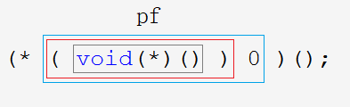

1. `void(*)()`是函数指针类型，放在`( )0`中，也就是把0强制转换成地址，该地址处存放一个函数其类型为`void(*)(void)`。

2. 这样`(void(*)())0`就变成了指针，指向该地址的函数，且对其解引用访问此函数。

3. `(*(void(*)())0)`也相当于`(*pf)`，通过函数指针解引用代替函数名，函数名后面带上`();`，相当于`(*pf)();`也就是一次不传参的**函数调用**。

1. `signal`先和`()`结合，说明`signal`为函数名，其后`(int, void(*)(int))`，为其参数列表。
2. 去掉函数名称和参数列表，剩下的`void(*)(int)`就是返回类型，所以是一次**函数声明**。

~~~c
void (* signal(int, void(*)(int)) ) (int);

typedef void(* pf_t)(int);//typedef简化代码
pf_t signal(int, pf_t);
~~~

&nbsp;

## 6. 函数指针数组

~~~c
//整型数组 - 存放整型变量
int arr[10];
//字符数组 - 存放字符变量
char ch[5];
//指针数组 - 存放指针变量
int* arr[10];
//函数指针数组 - 存放函数指针
int(*pfar[10])(int, int);
~~~

> 指针数组存放指针变量，函数指针数组存放函数指针，故元素类型为函数指针类型。

### 6.1 函数指针数组的定义

~~~c
int Add(int x, int y) {//int(*)(int,int)
	return x + y;
}
int Sub(int x, int y) {//int(*)(int,int)
	return x - y;
}
int Mul(int x, int y) {//int(*)(int,int)
	return x * y;
}
int Div(int x, int y) {//int(*)(int,int)
	return x / y;
}
int main() {
	//函数指针数组 - pfArr
	int(*pfArr[4])(int, int) = { Add,Sub,Mul,Div };
	return 0;
}
~~~

> 类型相同的函数，存放在同一个函数指针数组中。一般功能相似的函数，其类型也相同。

### 6.2 函数指针数组的使用

> 利用函数指针数组实现计算器，以简化调用过程。

#### 转移表

~~~c
//计算器实现1.0
void menu() {
	printf("**********************************\n");
	printf("*****  1.Add  ******  2.Sub  *****\n");
	printf("*****  3.Mul  ******  4.Div  *****\n");
	printf("************  0.exit  ************\n");
	printf("**********************************\n");
}
int main() {
	int (*pfArr[10]) (int, int) = { 0,Add,Sub,Mul,Div };//数组下标和选项序号匹配
	int input = 0;
	int a = 0;
	int b = 0;
	do {
		menu();
		printf("请选择:>");
		scanf("%d", &input);
		if (0 <= input && input <= 4) {
			if (input == 0) {
				printf("退出游戏\n");
				break;
			}
			else {
				printf("请输入操作数\n");
				scanf("%d %d", &a, &b);
				printf("ret == %d\n", pfArr[input](a, b));
				break;
			}
		}
		else {
			printf("输入错误\n");
			break;
		}
	} while (input);
	return 0;
}
~~~

> 函数指针数组实现不同选择情况下，通过函数地址“跳转”到不同的函数的功能。

这样的函数指针数组成为**转移表**。（跳转功能）

#### 回调函数

> 若不想舍弃switch语句，还可以这样简化代码3.0，代价为创建全局变量。若不想创建全局变量，可以使用2.0

~~~c
/******
* 计算器实现
* 2.0
******/
void Calc(int (*pf)(int,int)) {
	int a = 0;
	int b = 0;
	printf("请输入操作数:>");
	scanf("%d %d", &a, &b);
	printf("%d\n", pf(a, b));
}
int main() {
	int input = 0;
	do {
		menu();
		printf("请选择:>");
		scanf("%d", &input);
		switch (input) {
		case 0:
			printf("退出成功\n");
			break;
		case 1:
			Calc(Add);
			break;
		case 2:
			Calc(Sub);
			break;
		case 3:
			Calc(Mul);
			break;
		case 4:
			Calc(Div);
			break;
		default:
			printf("请重新选择\n");
			break;
		}
	} while (input);
	return 0;
}

/******
* 计算器实现
* 3.0
******/
int (*pfArr[10])(int, int) = { 0,Add,Sub,Mul,Div };
int input = 0;

void Call() {
	int a = 0;
  int b = 0;
	printf("请输入操作数:>");
	scanf("%d %d", &a, &b);
	printf("%d\n", pfArr[input](a, b));
}
int main() {
	do {
		menu();
		printf("请选择:>");
		scanf("%d", &input);
		switch (input) {
		case 0:
			printf("退出成功\n");
			break;
		case 1:
		case 2:
		case 3:
		case 4:
			Call();
			break;
		default:
			printf("请重新选择\n");
			break;
		}
	} while (input);
	return 0;
}
~~~

如下图所示，被通过函数指针调用的函数叫做**回调函数**，回调函数即使第三方调用调用函数的参数也在其中被调用。

> 若想在调用函数中随条件变化而调用不同的函数，就必须使用回调函数的方法：调用函数中使用函数指针，指向不同函数。回调函数在大型工程中显得非常方便。

&nbsp;

## 7. 指向函数指针数组的指针

~~~c
int arr[10];
int(*parr)[10] = &arr;//整型数组指针
char(*pch)[10] = &ch;//字符数组指针
//指向整型数组指针的指针
int(*(*pparr))[10] = &parr;
//指向字符数组指针的指针
char(*(*ppch))[10] = &pch;

//函数1.
int Add(int x, int y) {
	return x + y;
}
//函数指针2.
int (*pf)(int, int) = Add;
//函数指针数组3.
int (*pfArr[10])(int, int) = { Add };
//指向函数指针数组的指针4.
int(*(*ppfArr)[10])(int, int) = &pfArr;
~~~

> 前面已经交代，指针去掉`*`号和指针名，就是指向的变量类型；去掉指针名就是指针的类型。
>
> 反过来，定义数组指针，需要得到指针所指向的数组的类型。1.先写出指针名，在其前面加`*`；2.写出数组的类型`int()[10]`

定义指向函数指针数组的指针，依次写出如下内容：

1. 函数 —— 得到函数类型：`int(int, int)`
2. 函数指针 —— 得到函数指针类型：`int(*)(int, int)`
3. 函数指针数组 —— 得到函数指针数组的类型：`int(*[10])(int, int)`
4. 指向函数指针数组的指针

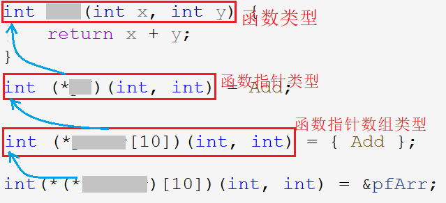

从后往前看，指向函数指针数组的指针去掉`*`和指针名就是函数指针数组的类型，函数指针数组去掉`*`和指针名就是函数指针类型，函数指针去掉`*`和指针名就是函数类型。

> 在研究下去就没有必要了，指针放在数组里，数组被指针所指向 ……

> 续前文《C语言进阶：指针进阶》

## 8. 回调函数

### 8.1 回调函数定义

回调函数：通过函数指针调用的函数，或者说使用函数指针调用函数这样的机制被称为回调函数。回调函数不由实现方直接调用，而是作为特殊条件下的响应。

> 概念无关紧要，理解并熟练运用这种方法才更为重要。

### 8.1 快速排序 `qsort`

#### `qsort`函数逻辑

~~~c
void qsort(void* base, size_t num, size_t width, int (*cmp)(const void* e1, const void* e2));
~~~

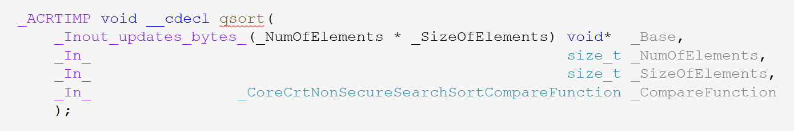

> `qsort`无返回值，有四个参数。分别为`base`：起始地址，`num`：元素个数，`width`：元素大小以及`compare`：比较函数。可与冒泡排序作对比。

~~~c
//冒泡排序
void Bubble_sort(int arr[], int sz) {
	for (int i = 0; i < sz - 1; i++) {
		for (int j = 0; j < sz - 1 - i; j++) {
			//比较函数
			if (arr[j] > arr[j + 1]) {
				int tmp = arr[j];
				arr[j] = arr[j + 1];
				arr[j + 1] = tmp;
			}
        }
    }
}
~~~

> 与冒泡排序作对比发现，冒泡排序仅需起始地址和元素个数即可，暗含了其他信息。由于过度具体化，冒泡排序只能排序整型数组，且比较函数过于简单无需单独列出。

因为`qsort`排序可适用于多种类型如浮点型，字符型，自定义类型的数据，故无法规定具体类型，所以需要多个参数去描述元素的基本信息。

`qsort`之所以能够适应多种数据，是因为参数`void* base`再搭配上`num`和`width`就描述出任意一种类型。

> 为什么将参数`base`的类型定义为`void*`呢？如下述代码所示。

~~~c
char* p1 = &a;
//从int*到char*类型不兼容
char* p2 = &f;
//从float*到char*类型不兼容
void* p1 = &a;
void* p2 = &f;
~~~

> 确定类型的地址之间直接赋值会提示类型不兼容，强制转化也可能会导致精度丢失。

故使用无（具体）类型`void*`，又称通用类型，即**可以接收任意类型的指针，但是无法进行指针运算**（解引用，$±$整数等）。

~~~c
p1++;   *p1;   p1 - p2;   p1 > p2;//表达式必须是指向完整对象类型的指针
~~~

1. `base`：用于存入数据的起始地址。类型定义为`void*`，可接受任意类型的指针。

2. `num`：待排序的元素个数。

3. `width`：元素宽度，所占字节大小。

> 明确了排序的起始位置，元素个数和元素大小，貌似已经够了。但是并无法排序所有类型，因此必须自定义一个抽象的比较函数指定元素的比较方式。

4. `cmp`：比较函数，用于指定元素的比较方式。

   - `elem1`小于`elem2`，返回值小于0
   - `elem1`大于`elem2`，返回值大于0
   - `elem1`等于`elem2`，返回值为0
5. `elem1`，`elem2`：进行比较的两个元素的地址作参数。

`qsort`可以说是一个半库函数半自定义函数。自定义在于其函数最后一个参数为比较函数，该函数内部实现自由，但返回值必须按照规定返回相应的数值。

#### 小结

需要`qsort`函数排序各种类型的数据，

- 故`base`起始地址不可为固定的指针类型，只能用`void*`。
- 既然是通用类型还要明确比较元素的个数和大小。
- 最后，排序最核心的比较大小，为适应不同的类型元素必须自定义专门的比较函数。

#### `qsort`实现冒泡排序

~~~c
//比较函数：整型
#include <stdlib.h>
int int_cmp(const void* e1, const void* e2) {
	return *(int*)e1 - *(int*)e2;
}
int main() {
	int arr[10] = { 9,8,7,6,5,4,3,2,1,0 };
	int sz = sizeof(arr) / sizeof(arr[0]);
	qsort(arr, sz, sizeof(arr[0]), int_cmp);
	return 0;
}
~~~

比较函数`int_com`不需要传参，作为回调函数由`qsort`直接调用。比较函数的传参过程由`qsort`内部实现。

#### `qsort`实现结构体排序

~~~c
#include <stdlib.h>
struct stu {
	char* name;
	short age;
	float score;
};
//按照成绩排序
int score_cmp(const void* e1, const void* e2) {
	//1.升序
    return ((struct stu*)e1)->score - ((struct stu*)e2)->score;
	//2.降序
    return ((struct stu*)e2)->score - ((struct stu*)e1)->score;
}
//按照名字排序
int name_cmp(const void* e1,const void* e2) {
	return strcmp(((struct stu*)e1)->name, ((struct stu*)e2)->name);
}
int main() {
	struct stu s[3] = {
        { "张三", 22, 99.5f },{ "李四", 21, 66.4f },{ "王五", 18, 80.1f }
    };
	int sz = sizeof(s) / sizeof(s[0]);
	//1.
    qsort(s, sz, sizeof(s[0]), name_cmp);
	//2.
    qsort(s, sz, sizeof(s[0]), score_cmp);
	return 0;
}
~~~

由此可得，提取出一个比较函数，具体交换的方式由`qsort`内部实现。

#### 模拟实现`qsort`

> 用`qsort`的函数逻辑，实现冒泡排序。

~~~c
//打印函数
void print_arr(int arr[],int sz) {
	for (int i = 0; i < sz; i++) {
		printf("%d ", arr[i]);
	}
}
//交换函数
void Swap(char* buf1, char* buf2, size_t width) {
	for (size_t i = 0; i < width; i++) {//宽度次
		char tmp = *buf1;
		*buf1 = *buf2;
		*buf2 = tmp;
		buf1++;
		buf2++;
	}
}
//比较函数
int cmp(const void* e1, const void* e2) {
	return *(int*)e1 - *(int*)e2;
}
//排序函数
void my_bubble_sort(void* base, size_t num, size_t width, int(*cmp)(const void* e1, const void* e2)) {
	for (size_t i = 0; i < num - 1; i++) {
		for (size_t j = 0; j < num - 1 - i; j++) {
			if (cmp((char*)base + j * width, (char*)base + (j + 1) * width) > 0) {//以字节为单位
				Swap((char*)base + j * width, (char*)base + (j + 1) * width, width);
			}
		}
	}
}
int main() {
	int arr[10] = { 9,8,7,6,5,4,3,2,1,0 };
	int sz = sizeof(arr) / sizeof(arr[0]);
	my_bubble_sort(arr, sz, sizeof(arr[0]), cmp);
	print_arr(arr, sz);

	return 0;
}
~~~

地址统一强转为`char*`，以最小字节单位一个字节进行比较和交换，使代码更具有普适性。

如果需要排序结构体则只需要在前文代码中主函数里替换`my_qsort`且把比较函数替换`Name_cmp`即可。

~~~c
//1.
my_qsort(s, sz, sizeof(s[0]), name_cmp);
//2.
my_qsort(s, sz, sizeof(s[0]), score_cmp);
~~~

&nbsp;

## 9. 指针和数组笔试题解析

### 9.1 数组辨析题

> 注意点。数组名代表整个数组：
>
> 1. `sizeof(数组名)`
> 2. `&数组名`
>
> 除此以外，数组名都是代表首元素地址。

#### 一维数组

~~~c
int a[] = { 1,2,3,4 };
printf("%d\n", sizeof(a));//16
printf("%d\n", sizeof(a + 0));//4/8
printf("%d\n", sizeof(*a));//4
printf("%d\n", sizeof(a + 1));//4/8
printf("%d\n", sizeof(a[1]));//4
printf("%d\n", sizeof(&a));//4/8
printf("%d\n", sizeof(*&a));//16
printf("%d\n", sizeof(&a + 1));//4/8
printf("%d\n", sizeof(&a[0]));//4/8
printf("%d\n", sizeof(&a[0] + 1));//4/8
~~~

1. 只有数组名单独放在`sizeof`内部才是整个数组。

   `a+0`放在`sizeof`内部表示首元素地址+0。

2. 只要是地址，不管是什么类型的地址大小都是4/8

   基本类型指针，数组指针，函数指针大小都是4/8个字节，故`sizeof(&a)=sizeof(int(*)[4])=4`。`sizeof()`求指针所占字节而不是解引用访问权限大小。

3. `*`和`&`在一起会抵消。

   `sizeof(*&a)`，&a为整个数组的地址类型`int(*)[4]`，解引用后`int[4]`大小为16。

#### 字符数组

~~~c
char arr[] = { 'a','b','c','d','e','f' };
printf("%d\n", sizeof(arr));//6
printf("%d\n", sizeof(arr + 0));//4/8
printf("%d\n", sizeof(*arr));//1
printf("%d\n", sizeof(arr[1]));//1
printf("%d\n", sizeof(&arr));//4/8
printf("%d\n", sizeof(&arr + 1));//4/8
printf("%d\n", sizeof(&arr[0] + 1));//4/8

printf("%d\n", strlen(arr));//随机值x
printf("%d\n", strlen(arr + 0));//随机值x
printf("%d\n", strlen(*arr));//报错
printf("%d\n", strlen(arr[1]));//报错
printf("%d\n", strlen(&arr));//随机值x
printf("%d\n", strlen(&arr + 1));//随机值x-6
printf("%d\n", strlen(&arr[0] + 1));//随机值x-1
~~~

1. `sizeof(*arr)`，`*arr`对首元素地址解引用，计算首元素所占空间大小。

   `strlen(*arr)`，`*arr`依然是首元素，`strlen`把a也就是97当成地址，访问到非法内存所以报错。

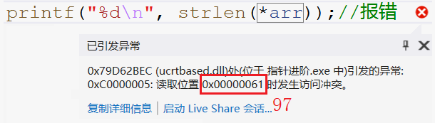

2.`strlen(&arr)`虽然是整个数组的地址，但依然是从首元素开始的，所以`strlen`依然从第一个元素开始找。

	`strlen(&arr+1)`，先计算`&arr+1`然后再传参过去，也就是跳过了整个数组去找。

**`sizeof`和`strlen`的区别**

- `sizeof` — 操作符 — 以字节为单位，求变量或类型所创建变量的所占空间的大小

> `sizoef`不是函数，计算类型是必须带上类型说明符`()`。`sizoef`内容不参与运算，在编译期间便转化完成。

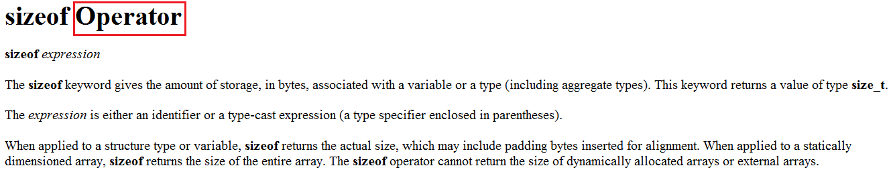

- `strlen` — 库函数 — 求字符串长度即字符个数，遇`\0`停止。

> 库函数，计算字符串长度没有遇到`\0`就会一直持续下去。返回类型`size_t`，参数`char* str` ，接收的内容都会认为是`char*`类型的地址。

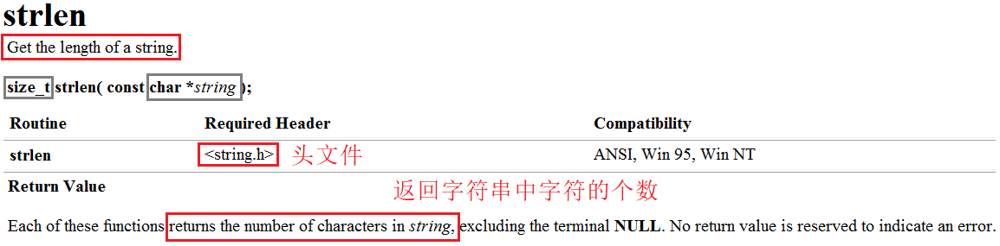

一个求变量所占空间，一个求字符串大小，二者本身是没有关系的，但总有人把二者绑在一起“混淆视听”。

#### 字符串数组

首先明确二者的区别：

~~~c
//1.字符初始化数组
char arr[] = { 'a','b','c','d','e','f' };//[a] [b] [c] [d] [e] [f]
//2.字符串初始化数组
char arr[] = "abcdef";//[a] [b] [c] [d] [e] [f] [\0]
~~~

> 字符初始化数组，存了什么元素数组里就是什么元素。而字符串初始化数组，除了字符串中可见的字符外，还有字符串末尾隐含的`\0`。`\0`存在于字符串的末尾，是自带的，虽不算字符串内容，但是字符串中的字符。

~~~c
char arr[] = "abcdef";
printf("%d\n", sizeof(arr));//7
printf("%d\n", sizeof(arr + 0));//4/8
printf("%d\n", sizeof(*arr));//1
printf("%d\n", sizeof(arr[1]));//1
printf("%d\n", sizeof(&arr));//4/8
printf("%d\n", sizeof(&arr + 1));//4/8
printf("%d\n", sizeof(&arr[0] + 1));//4/8

printf("%d\n", strlen(arr));//6
printf("%d\n", strlen(arr + 0));//6
printf("%d\n", strlen(*arr));//报错
printf("%d\n", strlen(arr[1]));//报错
printf("%d\n", strlen(&arr));//6
printf("%d\n", strlen(&arr + 1));//随机值
printf("%d\n", strlen(&arr[0] + 1));//5
~~~

1. `sizeof`计算变量的长度，变量可以是数组，数组元素以及指针。数组就是整个数组的大小，数组元素则是数组元素的大小，指针大小都为4/8。
2. `strlen`把传过来的参数都当作地址，是地址就从该地址处向后遍历找`\0`，不是地址当作地址非法访问就报错。

#### 常量字符串

~~~c
char* p = "abcdef";
~~~

> `"abcdef"`是常量字符串，用一个字符指针`p`指向该字符串，实质是`p`存入了首字符`a`的地址。由于字符串在内存中连续存放，依此特性便可以遍历访问整个字符串。

~~~c
char* p = "abcdef";
printf("%d\n", sizeof(p));//4/8
printf("%d\n", sizeof(p + 1));//4/8
printf("%d\n", sizeof(*p));//1
printf("%d\n", sizeof(p[0]));//1
printf("%d\n", sizeof(&p));//4/8
printf("%d\n", sizeof(&p + 1));//4/8
printf("%d\n", sizeof(&p[0] + 1));//4/8

printf("%d\n", strlen(p));//6
printf("%d\n", strlen(p + 1));//5
printf("%d\n", strlen(*p));//报错
printf("%d\n", strlen(p[0]));//报错
printf("%d\n", strlen(&p));//随机值
printf("%d\n", strlen(&p + 1));//随机值
printf("%d\n", strlen(&p[0] + 1));//5
~~~

1. `p`,`p+1`,`&p`,`&p+1`,`&p[0]+1`都是地址对于地址`sizeof`都求得4/8，`*p`,`p[0]`是数组元素，`sizeof`计算元素大小。

2. `p`,`p+1`,`&p`,`&p+1`,`&p[0]+1`都是地址对于地址`strlen`都向后遍历访问找`\0`，`*p`,`p[0]`是数组元素其对于ASCII值当作地址会访问到非法内存。

   `p`,`p+1`,`&p[0]+1`都是字符串字符的地址，`&p`,`&p+1`都是指针变量`p`或其之后的地址。

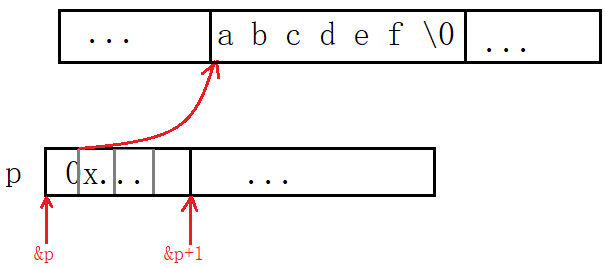

#### 二维数组

访问数组元素的方式是`数组名+[j]`。若将二维数组的每一行可以看成一个一维数组，则`a[0],a[1],a[2]`可以看成“每行“的数组名，和一维数组的数组名具有同样的效果。

> 1. 数组名单独放在`sizeof()`内部代表整个数组
> 2. `&`数组名同样代表整个数组（每行的数组名同样适用）

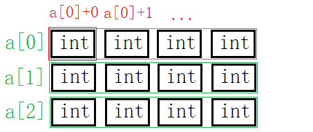

~~~c
int a[3][4] = { 0 };
printf("%d\n", sizeof(a));//12X4=48
printf("%d\n", sizeof(a[0][0]));//4
printf("%d\n", sizeof(a[0]));//16
printf("%d\n", sizeof(a[0] + 1));//4/8
printf("%d\n", sizeof(*(a[0] + 1)));//4
printf("%d\n", sizeof(a + 1));//4/8 - 第二行地址不代表第二行数组名
printf("%d\n", sizeof(*(a + 1)));//16
printf("%d\n", sizeof(&a[0] + 1));//4/8 - 第二行地址不代表第二行数组名
printf("%d\n", sizeof(*(&a[0] + 1)));//16 - 第二行数组地址解引用为数组名
printf("%d\n", sizeof(*a));//16
printf("%d\n", sizeof(a[3]));//16
~~~

- 对于二维数组来说，`sizeof(a[0])`求首行的整个数组大小。若是`sizeof(a[0]+1)`代表首行数组名没有单独放在`sizeof()`内部，故`a[0]`退化成了首元素地址。
- `sizeof(a+1)`代表第二行的地址仅为地址，但并不能第二行该“一维数组”的数组名，不可与`sizeof(a[1])`混淆。`&a[1]`等价于`a+1`。
- `sizeof(*(a+1))`，对第二行的地址解引用，相当于`sizeof(int[4])`。
- `*(&a[0]+1)`第二行数组地址解引用为数组名。**数组地址解引用代表整个数组，相当于数组名。切莫将数组地址和数组名混淆。**（`*&arr=arr`）

**总结**

搞清楚二维数组数组名的意义，必须搞清楚如下变量的含义。

~~~c
a[0]//首行数组名
a[0] + 1//首元素地址+1为第二个元素地址
&a[0] + 1//首行地址+1为第二行数组地址（a+1）
a//二维数组名
a + 1//首行地址+1为第二行数组地址
&a + 1//数组地址+1为第二个数组地址
*(a + 1) <=> *(&a[0] + 1)//第二行数组地址解引用为数组名
~~~

1. `a`是二维数组名，`a[0]`是首行数组名。
2. 参与运算后`a`退化为首行地址，`a[0]`退化为首元素地址。
3. `&a+1`跳过一个二维数组，`&a[0]+1`跳过一个一维数组。

&nbsp;

### 9.2 指针笔试题

#### Example 1

~~~c
int main()
{
	int a[5] = { 1, 2, 3, 4, 5 };
	int* ptr = (int*)(&a + 1);
	printf("%d,%d", *(a + 1), *(ptr - 1));
	return 0;
}
//程序的结果是什么？
~~~

指针运算要考虑指针类型，`&a+1`跳过了`int[4]`的长度，得到这个位置的地址后指针转化成`int*`型，此时再+1就只能跳过一个`int`。

本题考察指针类型决定指针±整数的长度。

#### Example 2

~~~c
//由于还没学习结构体，这里告知结构体的大小是20个字节
struct Test
{
	int Num;
	char* pcName;
	short sDate;
	char cha[2];
	short sBa[4];
}*p;
//假设p 的值为0x100000。 如下表表达式的值分别为多少？
int main()
{
    p = 0x10000000;
	printf("%p\n",  (struct Test*)p + 0x1);
	printf("%p\n", (unsigned long)p + 0x1);
	printf("%p\n", (unsigned int*)p + 0x1);
	return 0;
}
~~~

p本是`struct Test*`的指针，后分别强制转换成`unsigned long`和`unsigned int*`类型分别+1跳过多少字节。`struct Test*`的指针+1跳过一个`struct Test`字节长度。`unsigned long`为整数类型+1即整数+1，不属于指针运算。

#### Example 3

~~~c
int main()
{
	int a[4] = { 1, 2, 3, 4 };
	int* ptr1 = (int*)(&a + 1);
	int* ptr2 = (int*)((int)a + 1);
	printf("%x,%x", ptr1[-1], *ptr2);
	return 0;
}
~~~

`ptr1`和`ptr2`都是把不同的意义的变量强转成`int*`类型的地址。先进行一系列的操作后再读取该地址处的后4个字节。

> `&a`类型为`int(*)[4]`故+1跳过1个数组；`a`首先为首元素地址强转为`int`型整数再+1执行整数加法，由于内存以字节为单位，一个字节一个地址，故+1相当于下一个字节的地址。最后都强制转换为`int*`的指针，都向后访问4个字节。

由于系统为小端存储方案，也就按小端的方式读取数据。以%x的形式打印故不需要我们再去转换成十进制，答案分别为2000000，4。

#### Example 4

~~~c
#include <stdio.h>
int main()
{
	int a[3][2] = { (0, 1), (2, 3), (4, 5) };
	int* p;
	p = a[0];
	printf("%d", p[0]);
	return 0;
}
~~~

这题相对来说很简单，需注意到`()`内部为逗号表达式，所以数组元素分别为1,3,5,0,0,0 。

#### Example 5

 ~~~c
 int main()
 {
 	int a[5][5];
 	int(*p)[4];
 	p = a;
 	printf("%p,%d\n", &p[4][2] - &a[4][2], &p[4][2] - &a[4][2]);
 	return 0;
 }
 ~~~

本题一眼就可以看到二维数组`a[5][5]`，本应用`int(*)[5]`的数组指针接收，为什么用4个元素的数组指针接收呢？

其实可以看出，数组在内存中都是连续存放的，对于这“一排“的数据，怎么看是我们的事，把它当成3列的4列的5列甚至是10列的都可以。所以数组指针大小仅仅决定一次访问几个元素，或是说决定了所指数组的列数。

>  本质上列数的改变并不会影响该二维数组，仅仅影响的是编译器如何看待该数组。

可以看出指针ptr1-ptr2为-4，故%d打印为-4，若以%p打印，因内存中存储的是-4的补码，再以无符号数的十六进制形式打印：

~~~
10000000 00000000 00000000 00000100
11111111 11111111 11111111 11111011
11111111 11111111 11111111 11111100
FF FF FF FC
~~~

#### Example 6

~~~c
int main()
{
	int aa[2][5] = { 1, 2, 3, 4, 5, 6, 7, 8, 9, 10 };
	int* ptr1 = (int*)(&aa + 1);
	int* ptr2 = (int*)(*(aa + 1));
	printf("%d,%d", *(ptr1 - 1), *(ptr2 - 1));
	return 0;
}
~~~

&aa取出数组地址并+1跳过整个数组，aa相当于首行地址+1为第二行地址并解引用得第二行数组名，**数组地址解引用得数组名**。

> aa+1得到第二行数组的数组地址，再解引用即对数组地址解引用，得到整个数组也就是数组名，`*(&arr)=arr` 。

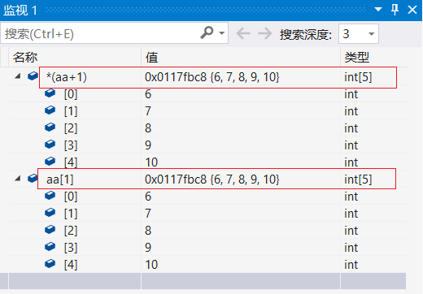

#### Example 7

~~~c
#include <stdio.h>
int main()
{
	char* a[] = { "work","at","alibaba" };
	char** pa = a;
	pa++;
	printf("%s\n", *pa);
	return 0;
}
~~~

指针数组a分别存入`"work"`,`"at"`,`"alibaba"`三个字符串的首字符地址。又将指针数组名即首元素地址存入二级指针变量中。指针++访问第二个元素a的地，随后%s打印整个字符串。

#### Example 8

~~~c
int main()
{
	char* c[] = { "ENTER","NEW","POINT","FIRST" };
	char** cp[] = { c + 3,c + 2,c + 1,c };
	char*** cpp = cp;
    //1.
	printf("%s\n", **++cpp);
	//2.
    printf("%s\n", *-- * ++cpp + 3);
	//3.
    printf("%s\n", *cpp[-2] + 3);
	//4.
    printf("%s\n", cpp[-1][-1] + 1);
	return 0;
}
~~~

> 首先字符指针数组`c`存有字符串首地址，其次指针数组`cp`存有”与指针c相关“的二级指针，最后三级指针`cpp`指向二级指针`cp`。

本题是最有难度的一题，需要注意到的是指针`++--`属于自增自减，会影响到本值。

1. `cpp`+1指向了数组`cp`的第二个元素，并解引用得到`c+2`。再解引用得到`"POINT"`的首地址。

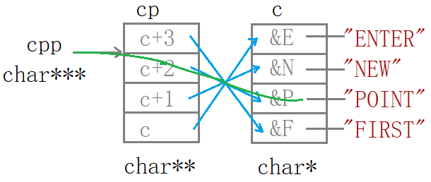

2. `cpp`+1指向数组`cp`的第三个元素并解引用得到`c+1`，`(c+1)--`后将数组`cp`的第三个元素修改为`c`，解引用访问数组`c`的首元素即`"ENTER"`的首地址再+3，打印出`ER`。

3. `cp[-2]=*(cp-2)`即`cpp`前移2个元素指向并访问了`c+3`，并解引用得数组`c`的第4个元素也就得到了`"FIRST"`的首地址+3，访问到`ST`并打印。

> `cpp-1`不是`cpp--`，虽然效果一样，但是对`cpp`的意义不同。`(cpp-2)`并没有改变`cpp`，所以`cpp`仍指向`cp`的第三个元素。

4. `cpp[-1][-1]`就相当于`*(*(cpp-1)-1)`即`cpp`-1解引用访问到了`c+2`-1再解引用访问到了数组`c`的第二个元素再+1，打印出`EW`。

研究清楚之后再回头看代码其实非常简单，首先了解`cpp`和`cp`和`c`的关系：都是指针并从左向右一次指向，再看有关的操作。

~~~c
**++cpp;
*--*++cpp+3;
*cpp[-2]+3;
cpp[-1][-1]+1;
~~~

这四行代码其实本质上完全相同，都是1.`cpp`±整数并解引用；2.`cp`元素±整数并解引用；3.`c`元素±整数并解引用。如图所示：

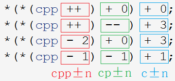
