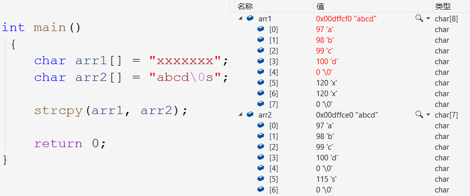
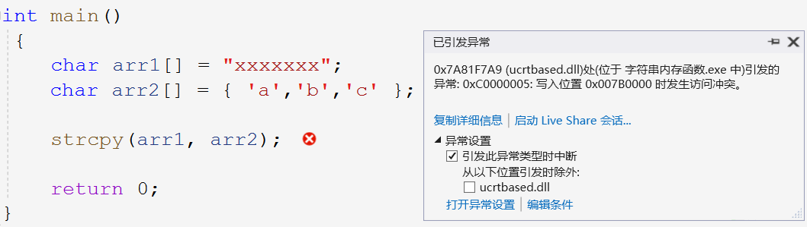
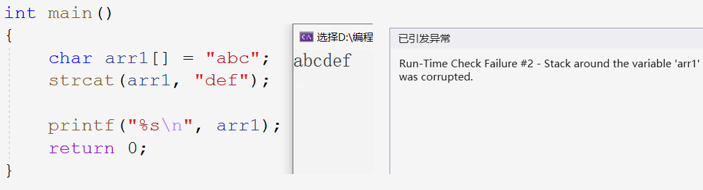
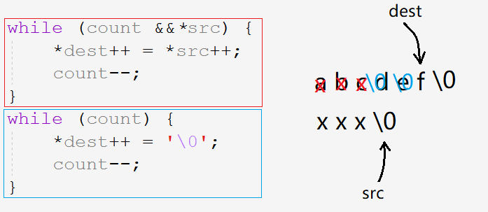
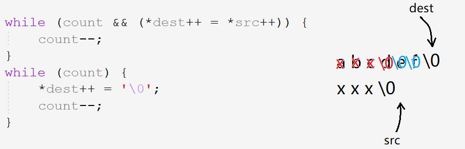
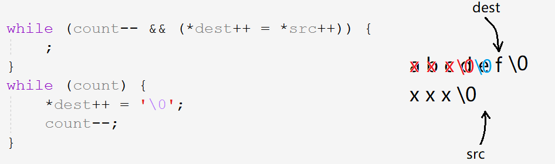
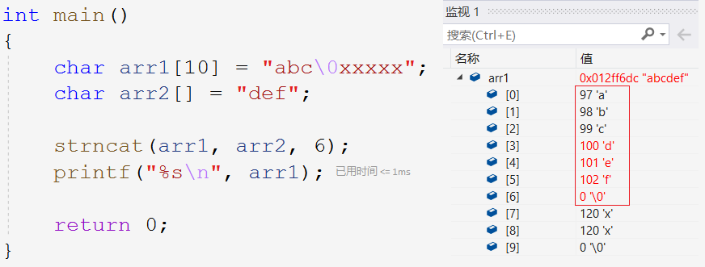
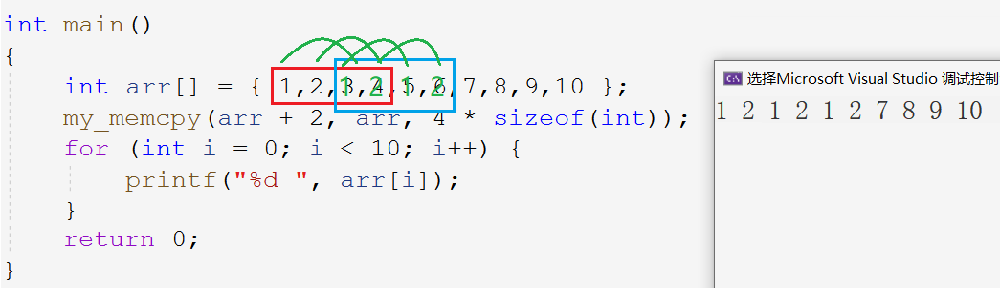
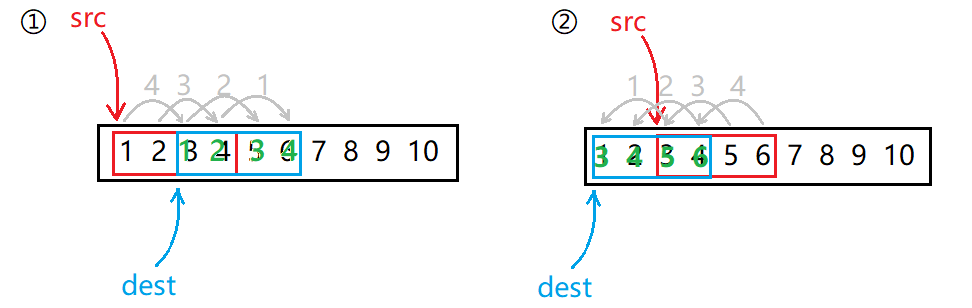
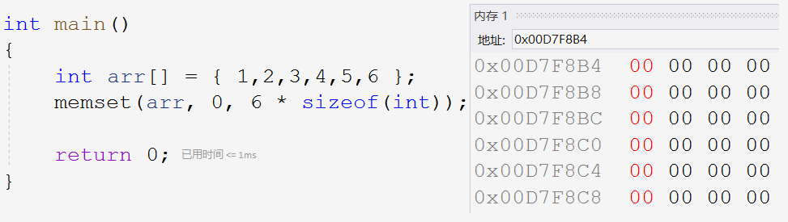

# 1.1 字符串和内存函数

> C语言本身并无字符串类型但其对字符串的操作却较为频繁。本章节介绍这些函数的用法和实现。

## 1. 字符串函数

### 1.1 字符串求长`strlen`

#### 函数声明

~~~c
size_t strlen ( const char* string );
~~~

~~~
Return Value
This function returns the number of characters in string, excluding the terminal NULL. No return value is reserved to indicate an error.

Parameter
string - Null-terminated string
~~~

- `'\0'`为字符串结束标志，故`strlen`函数计算`\0`之前的字符个数。

- 参数是字符串的地址，而字符串必须为以`\0`结尾的字符串。

~~~c
//1.
char arr1[] = "abcd";
printf("%d\n", strlen(arr1));//4
//2.
char arr2[] = { 'a','b','c','d' };
printf("%d\n", strlen(arr2));//随机值
//3.
int a = 10;
printf("%d\n", strlen(a));//报错
~~~

> 1. 传参过去的是以`\0`结尾的字符串地址，满足strlen的要求。
> 2. 传参的虽然是字符串的地址但未以`\0`结尾，故strlen会一直找下去，直至找到`\0`。
> 3. 传参根本不是地址，该整型会被strlen当作地址看待，故访问到`0x0A`地址处的非法内存。如图：

- strlen函数返回类型为`size_t`，注意无符号数的用法。

~~~c
size_t ret = strlen("abcdef");
printf("%u\n", ret);
~~~

> 无符号数接收，以无符号的形式打印。不要使用无符号数运算结果比大小：

~~~c
 if (strlen("abc") - strlen("abcdef") < 0) {
    printf("hehe\n");
}
else {
    printf("haha\n");
}
~~~

> 无符号数的运算结果被整形提升为无符号数，故二者相减所得被视为无符号数是不会小于零的。

#### 模拟实现

~~~c
//1.计数器
size_t my_strlen(const char* str) {
	assert(str);
	size_t count = 0;
	while (*str) {
		count++;
		str++;
	}
	return count;
}
//2.指针相减
size_t my_strlen(const char* str) {
	assert(str);
	char* begin = str;
	while (*str) {
		str++;
	}
	return str - begin;
}
//3.递归
size_t my_strlen(const char* str) {
	assert(str);
    if (*str) {
		return 1 + my_strlen(str + 1);
	}
	else {
		return 0;
	}
}
~~~

&nbsp;

> 字符串函数分为长度不受限制的字符串函数和长度受限制的字符串函数。先介绍长度不受限制的字符串函数。

### 1.2 字符串拷贝`strcpy`

#### 函数声明

~~~c
char* strcpy ( char* strDestination, const char* strSource );
~~~

~~~
Return Value
This function returns the destination string. No return value is reserved to indicate an error.

Parameters
1. strDestination - Destination string
2. strSource - Null-terminated source string

Remarks
1The strcpy function copies the string pointed by strSource to the array pointed by strDestination,including the terminating null character.
No overflow checking(溢出检查) is performed when strings are copied. The behavior of strcpy is undefined(未定义的) if the source and destination strings overlap(重叠).
~~~

> `strcpy`将源字符串的内容（包括`\0`）依次拷贝到目标空间。

- 源字符串以`'\0'`结尾，且strcpy会将源字符串中`\0`也拷贝到目标空间。

> 拷贝时会把`\0`也一同拷贝。若源字符串中有`\0`，其后的元素自然是不会被拷贝的，因为在读取时也就把`\0`作为结束标志。

> 若源字符串不以`\0`结尾，则strcpy会向后一直访问到非法内存。

- 目标空间可修改且足够大，确保能够且足以存放源字符串。

~~~c
//1.
char arr1[] = "xxx";//目标空间不够大
char arr2[] = "abcdef";
//.2
const char arr1[] = "xxxxxxxxxx";//目标空间不可修改
char arr2[] = "abcdef";

strcpy(arr1, arr2);
~~~

> 以上两种情况同样是需要避免的。

`strcpy`在`vs2019`环境下使用会报出不安全的警告，该函数在拷贝前不会去检查是否会发生数组越界，警告也是正常的。但作为合格的程序员，我们有义务排除风险。

#### 模拟实现

~~~c
char* my_strcpy(char* dest, const char* src) {
	assert(dest && src);
    char* begin = dest;
	while (*dest++ = *src++) {
		;
	}
	return begin;
}
~~~

&nbsp;

### 1.3 字符串追加`strcat`

#### 函数声明

~~~c
char* strcat ( char* strDestination, const char* strSource );
~~~

~~~
Return Value
This function returns the destination string. No return value is reserved to indicate an error.

Parameters
1. strDestination - Null-terminated destination string
2. strSource - Null-terminated source string

Remarks
The strcat function appends strSource to strDestination and terminates the resulting string with a null character.
The initial character of strSource overwrites the terminating null character of strDestination.
No overflow checking is performed when strings are copied or appended. The behavior of strcat is undefined if the source and destination strings overlap.
~~~

> `strcat`将源字符串包括`\0`，追加到目标字符串的结尾并覆盖掉目标空间的`\0`。

- 源字符串必须以`'\0'`结尾，strcat会将`\0`追加到目标空间的末尾作字符串结束标志。

> 该例子同样是源字符串不以`\0`结尾，从而访问到非法空间。

- 目标空间必须足够大且可修改，确保能够且足以追加字符串。

> 目标字符串以初始化内容确定大小，这种初始化的方式显然是不能追加字符串的。同样目标字符串不可加`const`修饰。`strcat`在调用时仍然不作溢出检查，只有到溢出后才报错。

#### 模拟实现

~~~c
char* my_strcat (char* dest, const char* src) {
	assert(dest && src);
	char* begin = dest;
	//移到末尾
	while (*dest) {
		dest++;
	}
	//追加
	while (*dest++ = *src++) {
		;
	}
	return begin;
}
~~~

> 下面三种while循环的特点：

~~~c
//1.
while (*dest++) {
	;
}
//2.
while (*dest) {
    dest++;
}
//3.
while (*dest++ = *src++) {
    ;
}
~~~

- 第一种和第二种的区别在于，第一种指针解引用后就`++`，第二种指针解引用后判断为真才能`++` 。故第一种解引用的次数和`++`的次数是相等的，当指针指向`\0`时也要`++`访问下一个元素。而第二种为真后`++`，指向`\0`时便停留在`\0`处	。
- 将赋值运算`*dest=*src`放入while循环内，当`src`指向`\0`时也要赋值给`dest`，在这之后判断整个表达式为假，退出循环。

&nbsp;

### 1.4 字符串比较`strcmp`

#### 函数声明

~~~c
int strcmp ( const char* string1, const char* string2 );
~~~

~~~
Return Value
The return value for this function indicates the relation of string1 to string2.
+-------+------------------------------------+
| Value | Relationship of string1 to string2 |
+-------+------------------------------------+
|  <0   |    string1 less than string2       |
|   0   |    string1 identical to string2    |
|  >0   |    string1 greater than string2    |
+-------+------------------------------------+

Parameters
1. string1, string2
2. Null-terminated strings to compare

Remarks
The strcmp function compares string1 and string2, what starts comparing the first character of each string, if are equal, continuing with the follows until the differ or a null-character is reached, and returns a value indicating their relationship.
~~~

> `strcmp`遍历比较两个字符串对应位置的字符的ASCII码值是否相等。

* 函数的返回值
  1. 字符串1小于字符串2时，返回小于0的数字
  2. 字符串1等于字符串2时，返回0
  3. 字符串1大于字符串2时，返回大于0的数字
* 二者都要以`\0`作为字符串的结尾，否则仍会越界访问。

#### 模拟实现

~~~c
int my_strcmp(const char* str1, const char* str2) {
	assert(str1 && str2);
	while (*str1 == *str2) {
		if (*str1 == '\0') {
			return 0;
		}
		str1++;
		str2++;
	}
	return *str1 - *str2;
}
~~~

> 都是`\0`就返回0，不是就都`++`，直到不等时返回二者之差。

不安全是长度不受限制的字符串函数的通病，因为这些函数在调用时一直向后遍历访问且不做溢出检查直到程序出错才被迫停止。所以C语言还内置了相对安全的长度受限制的字符串函数，以及更加通用的内存函数。

&nbsp;

### 1.5 字符串拷贝`strncpy`

#### 函数声明

~~~c
char* strncpy ( char* strDest, const char* strSource, size_t count );
~~~

~~~
Return Value
This function returns strDest. No return value is reserved to indicate an error.

Parameters
1. strDest - Destination string
2. strSource - Source string
3. count - Number of characters to be copied

Remarks
The strncpy function copies the initial count characters of strSource to strDest and returns strDest.
If count is less than or equal to the length of strSource, a null character is not appended automatically to the copied string.
If count is greater than the length of strSource, the destination string is padded(填充) with null characters up to length count.
The behavior of strncpy is undefined if the source and destination strings overlap.
~~~

> `strcpy`函数从源字符串拷贝`count`个字符到目标字符串，若`count`大于源字符串长度则以`\0`填充。

- 目标字符串可修改且足够大
- 若`count`小于源字符串个数则不追加`\0`，若大于源字符串个数则以`\0`填充到`count`个字符。

#### 模拟实现

~~~c
char* my_strncpy(char* dest, const char* src, size_t count) {
	char* begin = dest;
	assert(dest && src);
	while (count && (*dest = *src)) {
		dest++, src++;
		count--;
	}
	while (count--) {
		*dest++ ='\0';
  }
	return begin;
}
int main()
{
	char arr1[10] = "abcdef";
	char arr2[] = "xxx";

	my_strncpy(arr1, arr2, 5);
	printf("%s\n", arr1);
 	return 0;
}
~~~

> 下列三种是进行字符串拷贝时的代码。当`count`小于源字符串个数时三者都没问题，但当`count`大于源字符串个数时，三者的情况却是不一样的。

~~~c
//1.
while (count && *src) {
    *dest++ = *src++;
    count--;
}
//2.
while (count && (*dest++ = *src++)) {
    count--;
}
//3.
while (count-- && (*dest++ = *src++)) {
    ;
}
~~~

1. 当指向源字符串的指针遇到`\0`时，不进行赋值和`++`也不进行`count--`操作。

> 赋值赋了3次，`count`也减了3次。此时`count`为2，随后追加了2个`\0`。

2. 指针指向`\0`时执行赋值操作后，赋值表达式为假，结束循环。

> 由于赋值操作放在循环的判断部分，故赋值执行了4次，而`count`减了3次。

即源字符串末尾`\0`也被拷贝了过去，但`count`仍为2，所以最后还要追加2个`\0`。但这样就改变了6个字符，显然是错误的。

3. 将第二种代码稍作修改，将`count--`的操作也放入判断部分，这样就避免了上述问题。

>
> 1. 如果循环条件只有循环变量`count`大小的判断，则进步条件放在判断部分还是循环体内没有影响。
> 2. 但如果还有赋值或是其他语句，那么该语句相对于将其放在循环体内部的情况多被执行一次。
> 3. 由于`count`是无符号数当条件为假退出后，随即`--`就会变成很大的数字。后续再使用该循环变量的时候就会出错。
>

&nbsp;

### 1.6 字符串追加`strncat`

#### 函数声明

~~~c
char* strncat ( char* strDest, const char* strSource, size_t count );
~~~

~~~
Return Value
This function returns a pointer to the destination string. No return value is reserved to indicate an error.

Parameters
1. strDest - Null-terminated destination string
2. strSource - Null-terminated source string
3. count - Number of characters to append

Remarks
The strncat function appends, at most, the first count characters of strSource to strDest. The initial character of strSource overwrites the terminating null character of strDest.
If a null character appears in strSource before count characters are appended, strncat appends all characters from strSource, up to the null character.
If count is greater than the length of strSource, the length of strSource is used in place of count. The resulting string is terminated with a null character.
If copying takes place between strings that overlap, the behavior is undefined.
~~~

> 在目标字符串末尾追加`count`个源字符串的字符，结尾默认添加`\0`。

- 追加到目标字符串末尾默认补`'\0'`，`count`超出源字符串个数不在追加。

#### 模拟实现

~~~c
char* my_strncat(char* dest, const char* src, size_t count) {
	assert(dest && src);
	char* begin = dest;
	//1. 来到目标字符串末尾
	while (*dest) {
		dest++;
	}
	//2. 追加
	while (count && (*dest++ = *src++)) {
		count--;
	}
	//3. count小于字符个数补0
	if (count == 0) {
		*dest = '\0';
	}
	return begin;
}
~~~

&nbsp;

### 1.7 字符串比较`stnrcmp`

#### 函数声明

~~~c
int strncmp ( const char* string1, const char* string2, size_t count );
~~~

~~~
Return Value
The return value for each of these functions indicates the relation of string1 to string2.
+-------+------------------------------------+
| Value | Relationship of string1 to string2 |
+-------+------------------------------------+
|  <0   |    string1 less than string2       |
|   0   |    string1 identical to string2    |
|  >0   |    string1 greater than string2    |
+-------+------------------------------------+

Parameters
1. string1, string2 - Null-terminated strings to compare.
2. count - Number of characters to compare

Remarks
The strncmp function lexicographically compares, at most, the first count characters in string1 and string2 and returns a value indicating the relationship between the substrings.
~~~

> 比较两个字符串的前`count`个字符，并返回相关的数值。

#### 模拟实现

~~~c
int my_strncmp(const char* str1, const char* str2, size_t count) {
	assert(str1 && str2);
    while (count-- && (*str1 == *str2)) {
		str1++;
		str2++;
	}
	return *str1 - *str2;
}
~~~

&nbsp;

### 1.8 字符串查找`strstr`

#### 函数声明

~~~c
char* strstr ( const char* string, const char* strCharSet );
~~~

~~~
Return Value
This function returns a pointer to the first occurrence of strCharSet in string, or NULL if strCharSet does not appear in string.
If strCharSet points to a string of zero length, the function returns string.

Parameters
1. string - Null-terminated string to search
2. strCharSet - Null-terminated string to search for

Remarks
The strstr function returns a pointer to the first occurrence of strCharSet in string. The search does not include terminating null characters.
~~~

> 查找子字符串在目标字符串中首次出现的位置，有则返回之起始位置，无则返回空指针。

#### 模拟实现

~~~c
char* my_strstr(const char* str, const char* set) {
	assert(str && set);
	char* s1 = str;
	char* s2 = set;
	while (*s1) {
		//归位
		str = s1;
		set = s2;
		//防止s1=s1=\0
		while ((*str && *set) && (*str == *set)) {
			str++;
			set++;
		}
		//判断
		if (*set == '\0') {
			return s1;
		}
		//进位
		s1++;
	}
	return NULL;
}
~~~

> `s1`和`s2`存放`str`和`set`每次归位时的位置，以便匹配错误时返回重新开始。

- 特殊情况`set="\0"`时，\0是任意字符串的子字符串，即无任何字符的字符串是任意字符串的子字符串。所以返回母字符串
- 一次匹配错误时，str和set要归位初始位置，即`str=++s1;set=s2;`要放在判断部分的后面。（`set=s2`下次循环再执行就相当于在后面）

> KMP算法专门针对字符串匹配和查找这种功能。

&nbsp;

### 1.9 字符串分割`strtok`

#### 函数声明

~~~c
char* strtok ( char* strToken, const char* strDelimit );
~~~

~~~
Return Value
This function returns a pointer to the next token found in strToken. They return NULL when no more tokens are found. Each call modifies(修改) strToken by substituting(替换) a NULL character for each delimiter(分割符) that is encountered(遇到).

Parameters
1. strToken - String containing token(s)(标记)
2. strDelimit -String Set of delimiter characters

Remarks
The strtok function finds the next token in strToken. The set of characters in strDelimit specifies(指定) possible delimiters of the token to be found in strToken on the current call.
~~~

> `strtok`函数通过以`\0`替换分隔符的方式修改需分割的字符串，并返回该标记的地址。

> 如字符串`"192.168.11.1"`或者`"yourfriendyo@ms.com"`二者字符串都有相似之处，即整个字符串由分隔符`.`,`@`分割。如果需要得到分隔符所分割出的每个小字符串，则可以用`strtok`函数切分。

- 参数`strDelimit`是所有分隔符所组成字符串，参数`strToken`是由一个或多个分隔符和标记组成的字符串。

> 类似于`.`,`@`称为分隔符，而分隔符所分割出的子字符串如`192`,`com`被称作标记。

- `strstr`将标记以`\0`结尾且返回指向该标记的指针。故被操作字符串会发生修改，故一般使用临时拷贝的内容。

- 首个参数传入字符串地址时，找到其首个标记。随后保存分隔符的位置，此时仅需传入`NULL`则可访问该字符串的下一个标记。

> 第一次调用传入需分割字符串的地址，函数保存首个标记后的分隔符被`\0`替换的位置。之后的调用就无需在传入地址。当访问到最后一个标记时，返回`NULL`。

~~~c
char arr[] = "www.yourfriendyo.top";
printf("%s\n", strtok(arr2, "."));
printf("%s\n", strtok(NULL, "."));
printf("%s\n", strtok(NULL, "."));
~~~

~~~c
int main()
{
	char arr[] = "yourfriendyo@ms.com";
	char* sep = "@.";
	for (char* i = strtok(arr, sep); i != NULL; i = strtok(NULL, sep)) {
		printf("%s\n", i);
	}
	return 0;
}
~~~

&nbsp;

### 1.10 字符串报错`strerror`

#### 函数声明

~~~c
char *strerror ( int errnum );
~~~

~~~
Return Value
strerror returns a pointer to the error-message string. Subsequent calls to strerror can overwrite the string.

Parameters
1. errnum - Error number
2. strErrMsg - User-supplied message

Remarks
The strerror function maps errnum to an error-message string, returning a pointer to the string. strerror  can't actually prints the message: For that, you need to call an output function such as printf.
If strErrMsg is passed as NULL, strerror returns a pointer to a string containing the system error message.
~~~

> `strerror`返回内置错误码所对应的错误信息的字符串地址。

~~~c
printf("%s\n", strerror(40));//Function not implemented
printf("%s\n", strerror(30));//Read - only file system
printf("%s\n", strerror(20));//Not a directory
~~~

> 一个错误码对应一个错误信息，手动传参并打印函数的返回值。当然没有人会这样使用报错函数，这也不是报错函数设计的初衷。

- 当程序发生错误时，程序会自动将错误码存入内置全局变量`errno`中，此时我们调用`strerror`函数即可获得此次错误的报错信息。

- 更为直接的报错函数`perror`，优点简单方便加入自定义信息，缺点必须打印错误信息。

~~~c
int main()
{
	FILE* pFile = fopen("D:test.txt", "r");
	if (pFile == NULL) {
		//text.txt: No such file or directory
		printf("text.txt: %s\n", strerror(errno));
		perror("text.txt");
	}
	return 0;
}
~~~

&nbsp;

## 2. 内存函数

> 字符串操作函数适用于字符串内容，而内存操作函数适用于任意类型的数据如整形数据或是结构体，更具普适性。

### 2.1 内存拷贝`memcpy`

#### 函数声明

~~~c
void* memcpy ( void* dest, const void* src, size_t count );
~~~

~~~
Return Value
memcpy returns the value of dest.

Parameters
1. dest - New buffer
2. src - Buffer to copy from
3. count - Number of characters to copy(bytes)

Remarks
The memcpy function copies count bytes of src to dest.
If the source and destination overlap(重叠), this function does not ensure that the original source bytes in the overlapping region(区域) are copied before being overwritten. Use memmove to handle overlapping regions.
~~~

> `memcpy`将源内存的前`count`个字节的内容拷贝到目标内存中。

- 若源空间和目标空间有重叠，则拷贝时会覆盖源字符串内容。

> C标准并未要求`memcpy`完成发生内存重叠的内容拷贝，但编译器也可能对其进行优化。对内存重叠的内容进行拷贝时，可以使用`memmove`。

#### 模拟实现

以字节为单位拷贝内存中的内容，以适用所有类型的数据。

~~~c
void* my_memcpy(void* dest, const void* src, size_t count) {
	void* begin = dest;
	while (count--) {
		*(char*)dest = *(char*)src;
		dest = (char*)dest + 1;
		src = (char*)src + 1;
	}
	return begin;
}
~~~

&nbsp;

### 2.2 内存移动`memmove`

#### 函数声明

~~~c
void* memmove ( void* dest, const void* src, size_t count );
~~~

~~~
Return Value
memmove returns the value of dest.

Parameters
1. dest - Destination object
2. src - Source object
3. count - Number of bytes of characters to copy

Remarks
The memmove function copies count bytes of characters from src to dest.
If some regions of the source area and the destination overlap, memmove ensures that the original source bytes in the overlapping region are copied before being overwritten.
~~~

> `memmove`将源空间的前`count`个字节的内容拷贝到目标空间中，并支持完成内存重叠的拷贝。

#### 模拟实现

当发生内存重叠时，在源空间该字节未拷贝之前要保护其不被修改。

> 当目标空间在源空间的后边时，从后向前拷贝，当目标空间在源空间的前面时，从前向后拷贝。

#### 实现方案

~~~c
void* my_memmove(void* dest, const void* src, size_t count) {
	assert(dest && src);
	char* begin = dest;
	if (dest > src) {
        //后->前
		while (count--) {
			*((char*)dest + count) = *((char*)src + count);
		}
	}
	else {
        //前—>后
        while (count--) {
			*(char*)dest = *(char*)src;
			(char*)dest += 1;
			(char*)src += 1;
		}
	}
	return begin;
}
int main() {
	int arr[] = { 1,2,3,4,5,6,7,8,9,10 };
	//1234->3456
	my_memmove(arr + 2, arr, 4 * sizeof(int));
	//3456->1234
	my_memmove(arr, arr + 2, 4 * sizeof(int));
	for (int i = 0; i < 10; i++) {
		printf("%d ", arr[i]);
	}
	return 0;
}
~~~

> C语言没有字符串类型，但凡遇到对字符串的操作都要细化到操作每个字符。

&nbsp;

### 2.3 内存比较`memcmp`

#### 函数声明

~~~c
int memcmp ( const void* buf1, const void* buf2, size_t count );
~~~

~~~
Return Value
The return value indicates the relationship between the buffers.
+-------+------------------------------------+
| Value | Relationship of string1 to string2 |
+-------+------------------------------------+
|  <0   |    string1 less than string2       |
|   0   |    string1 identical to string2    |
|  >0   |    string1 greater than string2    |
+-------+------------------------------------+

Parameters
1. buf1 - First buffer
2. buf2 - Second buffer
3. count - Number of characters

Remarks
The memcmp function compares the first count bytes of buf1 and buf2 and returns a value indicating their relationship.
~~~

> 比较两块内存空间的前`count`个对应字节内容，并返回相关的数值。

#### 模拟实现

~~~c
int my_memcmp(const void* buf1, const void* buf2, size_t count) {
	assert(buf1 && buf2);
	while (count-- && (*(char*)buf1 == *(char*)buf2)) {
		(char*)buf1 += 1;
		(char*)buf2 += 1;
	}
	return *(char*)buf1 - *(char*)buf2;
}
int main()
{
	int arr1[] = { 1,2,3,4,5 };
	int arr2[] = { 1,2,3,4,6 };
	int ret = my_memcmp(arr1, arr2, 1 * sizeof(int));
	printf("%d\n", ret);
	return 0;
}
~~~

&nbsp;

### 2.4 内存初始化`memset`

#### 函数声明

~~~c
void* memset ( void* dest, int c, size_t count );
~~~

~~~
Return Value
memset returns the value of dest.

Parameters
1. dest - Pointer to destination
2. c - Character to set
3. count - Number of characters

Remarks
The memset function sets the first count bytes of dest to the character c.
~~~

> 将目标空间前`count`个字节初始化为整形数据`c`。

