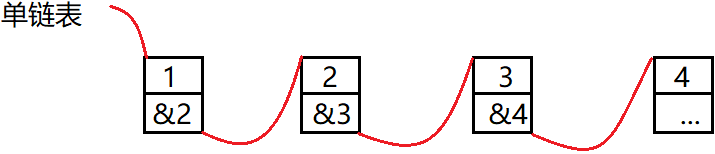
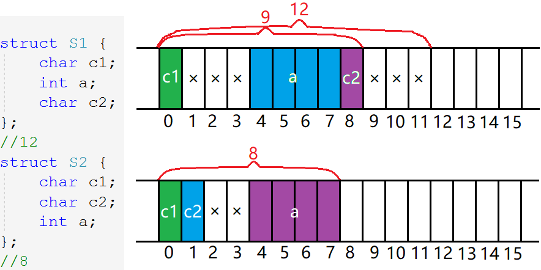
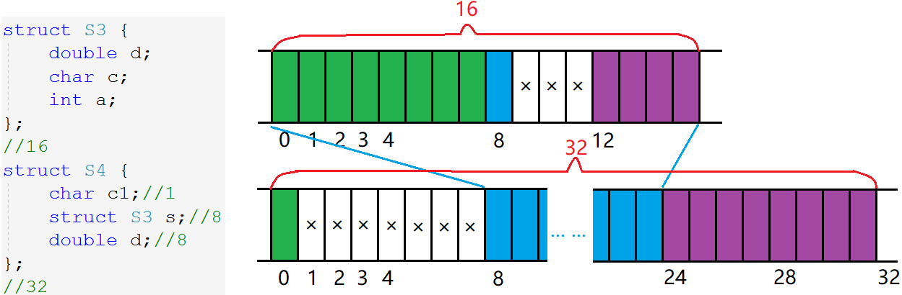
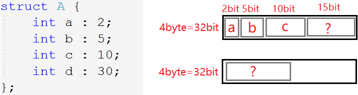
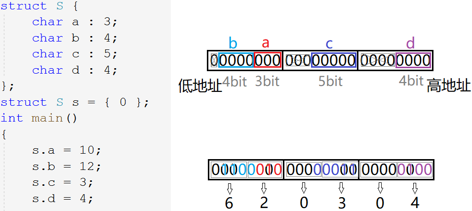
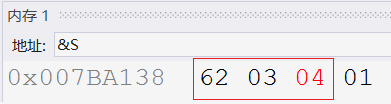
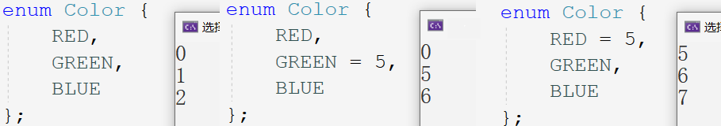
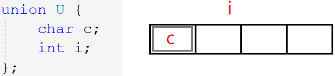
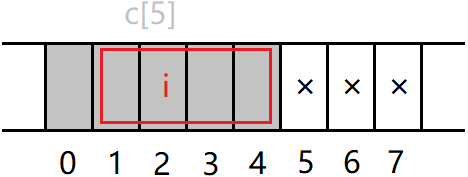
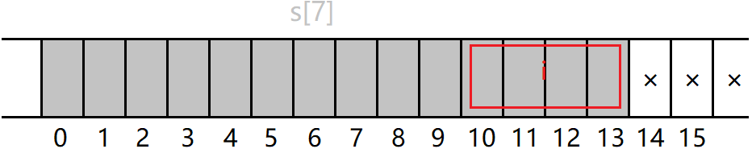

# 自定义类型

## 结构体

结构体是值的集合，这些值称为成员变量。结构体的每个成员类型可不同。结构体可用来描述复杂对象，成员即是对象的属性。

### 结构体的声明

```c
struct tag {

  member_list;

}value_list;
```

- `struct`是结构体的关键词，`tag`是结构体的标签名，
- `member_list`是定义成员变量的列表，`value_list`是用该结构体类型创建的全局变量的列表，可缺省。

#### 匿名结构体

```c
struct {
	int a;
	char c;
	double d;
} s1, s2;
```

定义匿名结构体类型，省去标签名，所以只能在成员列表处创建变量。

```c
struct { int a; char c; double d; } s1, s2;
struct { int a; char c; double d; } *ps;

s2 = s1; //类型不兼容
```

两个匿名结构体虽成员相同，但本质是两个结构体类型，故二者类型不兼容。

### 结构体自引用

> 结构体中该如何引用自身类型的变量呢？或者说，在定义结构体时包含自身类型的成员变量是否可行呢？

```c
struct Node
{
	int data;
	struct Node next;
};
```

自身嵌套一个同类型的结构体变量，如果一直嵌套下去是无法计算出大小的，所以是错误的。

```c
struct Node
{
	int data;
    struct Node* next;
};
```

这才是结构体自引用的正确方法。类似于数据结构中链表的使用方法，使用指针存入下一个节点的地址。如图：

<center>

</center>

```c
typedef struct {
	int data;
	Node* next;
}Node;
```

`typedef`对结构体的重命名，必须在结构体定义之后才生效，所以在结构体内，编译器无法识别该类型名。

### 结构体内存对齐

> 探讨结构体的大小有一个不可避免的问题：内存对齐。而内存对齐一般体现在结构体这里，所以也叫结构体内存对齐。

#### 内存对齐的规则

简单版规则请看[计组第二章 边界对齐](/docs/408/2-计算机组成原理#边界对齐)。

1. 结构体第一个成员永远位于结构体距起始位置偏移量为0的位置。

> 即首个成员一定放在为结构体所开辟的内存空间的第一个位置。

2. 从第二个成员开始，各自放在偏移量为对齐数的整数倍处。对齐数为变量自身大小和默认对齐数的较小值。

> Linux环境下无默认对齐数，Windows环境下对齐数为8。而一般无变量类型所占字节大于8，故对齐数一般为变量的自身大小。

3. 结构体的总大小必须为所有成员变量的对齐数的最大值的整数倍。

> 笔者猜测是为了凑齐读取域宽的整数倍，不至于让之后创建的变量紧随其后而造成不必要的麻烦。

4. 若结构体嵌套，内嵌结构体对齐到其成员最大对齐数的整数倍处，整体结构体总大小须为其成员最大对齐数的整数倍。

> 由第3条可推得，**内嵌结构体和整个结构体同样都是结构体，都要对齐到各自成员变量对齐数的最大值的整数倍处**。而一般整个结构体的最大成员变量都是内嵌结构体。

```c
//1.
struct S1 {
	char c1;
	int a;
	char c2;
};
//2.
struct S2 {
	char c1;
	char c2;
	int a;
};
```

<center>

</center>

求出下列结构体所创建的变量的大小。

```c
//3.
struct S3 {
	double d;
	char c;
	int a;
};
//4.
struct S4 {
	char c1;//1
	struct S3 s;//8
	double d;//8
};
```

<center>

</center>

#### 存在内存对齐的原因

1. 移植原因

不是所有硬件平台都能任意的读取地址上的任意数据。某些平台只能在特定的地址处以特定的方式读取特定的数据。如只在地址为4的倍数处读取，且每次读取4个字节的数据。平台之间移植性差。

2. 性能原因

数据应尽可能地存储在地址的自然边界上并对齐，以防止同一块空间的数据要作两次访问，提升读取数据的效率。

> 总结就是内存对齐是为了牺牲空间复杂度降低时间复杂度，以空间换取时间。当然我们要做的就是尽己所能既节省空间又节省时间。

结构体中不同的变量放在不同的位置，结构体所占的大小不同。**让占用空间小的成员集中在后面**，可以是实现一定程度上的节约空间。

#### 默认对齐数的修改

```c
//设置默认对齐数
#pragma pack(n);

struct Tag {
  member_list;
};

//恢复默认对齐数
#pragma pack();
```

默认对齐数是可以被修改的，使用前设置，使用后取消。当认为结构体的默认对齐数不适当时，可自行设置。同时对齐数 $n$ 一般都设置为 $2^n$ 。

宏计算结构体中某变量相对于首地址的偏移量。

```c
#include <stddef.h>
struct S1 {
	char c1;
	int a;
	char c2;
};
int main()
{
	printf("%d\n", offsetof(struct S1, c1));
	printf("%d\n", offsetof(struct S1, c2));
	printf("%d\n", offsetof(struct S1, a));
	return 0;
}
```

## 位段

### 位段的定义

位段的声明和结构体类似，但又两点不同。

1. 类型不同：位段的成员必须是整型变量，如`char,int,unsigned int`等。
2. 写法不同：位段的成员名后使用`:`和`数字`来规定分配的空间。如：

```c
struct A {
	int _a : 2;
	int _b : 5;
	int _c : 10;
	int _d : 30;
};
```

计算位段`A`的大小得8，而4个整形变量最小占16个字节。说明**位段一定程度上可以节省空间**。

位段中的“位”表示二进制位，而`:`后的数字代表系统分配给该变量的比特位数。

> 在描述对象时，属性变量中的所有位数不一定全部使用，使用位段可以规定系统分配给变量的空间。当然数据过大仍会溢出。

### 位段的内存分配

- 系统按成员变量类型来为位段开辟空间，一次性开辟一个变量类型大小的空间。

> 如该成员为`int`型，则一次开辟4个字节，若不够则再开辟4个字节。若为`char`类型，则开辟1个字节。

- 位段使用时涉及很多不确定因素，程序可移植性差，故位段是不跨平台的。

<center>

</center>

> 如图所示，先开辟4个字节的空间，`a`占用2bit，`b`占用5bit,`c`占用10bit。这4个字节还剩15个bit不够`d`的存放，必然要在开辟4个字节的空间。这就是算出来的8个字节。

问题是`d`接着一半存放在第一个字节一半存放在第二个字节，还是全部存放在新开辟的空间内?

> 不同的编译环境下可能会产生不同的结果，这是C标准中未规定的内容。笔者在此仅考虑Windows环境的情况，请看接下来的例子。

```c
struct S {
	char a : 3;
	char b : 4;
	char c : 5;
	char d : 4;
};
struct S s = { 0 };
int main() {
	s.a = 10;
	s.b = 12;
	s.c = 3;
	s.d = 4;
	return 0;
}
```

> 对位段变量进行赋值操作，就又带来了一个问题单个字节内先使用高地址还是低地址？这也是标准未规定的。
>
> 我们先进行假设：位段中先使用高地址再使用低地址，同时剩余空间不足则将其抛弃并重新开辟。如果vs中的最后结果和预期一致，则假设正确。

<center>

</center>

我们按照假设写出位段的内存情况：
$$
(\ 0110\ 0010\ 0000\ 0011\ 0000\ 0100\ )_{2}
\\(\quad 6 \;\quad 2 \qquad 0 \qquad 3 \qquad 0 \quad\; 4\quad)_{10}
$$
<center>

</center>

> vs显示结果和我们的假设完全相符。故假设正确。所以可以得出结论，在vs环境下：

1. 每次开辟空间所开辟的字节个数，由需开辟空间的成员变量的类型所决定。
2. 内存使用时，先使用低字节再使用高字节，单个字节内从高位到低位使用。
3. 所开辟内存空间不足时，抛弃剩余内存，重新开辟类型大小的空间。

> 由于这些规则C标准并未明确规定，因而这些结论因编译器而异。所以位段的平台移植性差。

### 位段的跨平台问题

1. `int`位段的最高位是否被当做符号位不确定。
2. 位段中成员类型的所占比特位数目不确定。

> 早期16位机器`int`占2个字节共16个比特位，而变量分配bit位数目不得多于最大值。

3. 位段成员在内存中先使用高地址还是低地址不确定。
4. 所开辟内存空间不足时，是否抛弃剩余内存重新开辟还是接着使用剩余内存不确定。

### 位段的应用

和结构相比，位段可达到同样的效果，可以节省空间，但是需使用小心且跨平台性差。而位段可以应用到网络协议中，不至于浪费大量的空间，网络传输协议中每几个比特位成一组用于传输不同的数据。

## 枚举类型

> 枚举顾名思义一一列举，有很多数据可以列举出来，如：性别，月份，颜色等。

### 枚举的定义

```c
enum Tag {
    con1,
    con2,
    ...
    con3
};
```

- `enum`是枚举关键字，`Tag`是枚举对象名；
- `con1,con2,...,con3`是枚举常量列表。

> 同时枚举就相当于整形常量，故所有枚举常量都是4个字节。

```c
//星期
enum Day {
	Mon,
	Tues,
	Wed,
	Thur,
	Fri,
	Sat,
	Sun
};
//性别
enum Sex {
	FAMALE,
	MALE,
	SECRET
};
//颜色
enum Color {
	RED,
	GREEN,
	BLUE
};
```

> 上述定义的`enum Day`,`enum Sex`,`enum Color`都是枚举类型。`{}`内是枚举类型的可能取值，即枚举常量。

枚举常量取值默认从0开始，依次递增。也可进行（完全或不完全）初始化对其赋初值，所初始化常量之前的常量取值不受影响，之后的常量仍然依次递增。

<center>

</center>

当然常量只能进行初始化，而不能进行赋值操作。

```c
//1.
enum Color c = GREEN;
//2.
enum Color c = 1;
```

上述操作为创建枚举类型的变量，赋值为`GREEN`。

> C语言对语法的检测没有那么严格。所以1和2都行。在C++中认为`1`是字面常量而`GREEN`为枚举常量。二是不相等的，所以不能赋值。

### 枚举的优点

| 枚举的优点               | 解释                                                         |
| ------------------------ | ------------------------------------------------------------ |
| 提高代码可读性和可维护性 | `#define`定义的常量不如枚举常量有意义，且枚举常量是具有类型的更严谨。 |
| 防止命名污染             | `#define`定义的常量属于全局常量，易冲突。                    |
| 便于调试                 | `#define`定义的常量在预编译期间就已经被替换。而枚举类型一直存在有值有类型便于调试。 |
| 使用方便                 | 一次可定义多个常量，且便于管理。                             |

## 联合体

联合是一种特殊的自定义类型，同样包含一系列成员，特殊在于这些成员共用同一块空间。所以联合体也叫共用体。

### 联合的定义

```c
union Un {
	char c;//1
	int i;//4
};
int main()
{
	union Un u = { 0 };
	printf("%d\n", sizeof(u));
	return 0;
}
```

算出该联合体变量大小为4个字节，可一个整型和字符型变量最少也要5个字节，为什么会这样呢？

### 联合的特点

```c
printf("%p\n", &u);//00EFF934
printf("%p\n", &u.c);//00EFF934
printf("%p\n", &u.i);//00EFF934
```

> 从上述代码可以看出`c`,`i`共用4个字节。

<center>

</center>

- 改变`i`就会改变`c`，改变`c`就会改变`i`。故使用时仅可以使用1个成员，另一个成员也会被修改。
- 联合的成员共用一块空间，故联合体变量的大小是至少是最大成员的大小。

利用联合体判断当前机器的大小端存储。

```c
int check_sys() {
	union U {
		char c;
		int i;
	}u;
	u.i = 1;
	return u.c;
}
int main()
{
	if (check_sys() == 1) {
		printf("小端存储\n");
	}
	else {
		printf("大端存储\n");
	}
	return 0;
}
```

### 联合大小的计算

而联合体也存在内存对齐。这个内存对齐相对结构体来说就简单一些了。

```c
//1.
union Un1 {
	char c[5];
	int i;
};
//2.
union Un2 {
	short c[7];
	int i;
};
int main() {
	printf("%d\n", sizeof(union Un1));
	printf("%d\n", sizeof(union Un2));
	return 0;
}
```

- 联合体变量大小至少是最大成员的大小。
- 当最大成员大小不够最大对齐数的整数倍时，对齐到最大对齐数的整数倍处。

> 因为联合体所有成员共用一块空间，故算出最大成员大小后，只在最后需要再浪费几个字节的空间以对齐到最大对齐数的整数倍。

<center>

</center>

原大小应为5个字节，最大对齐数应为4，则要对齐到8个字节。

<center>

</center>

原大小应为14个字节，最大对齐数应为4，则要对齐到16个字节。