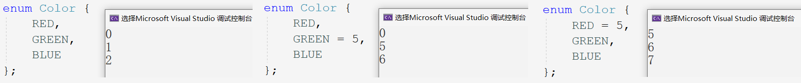
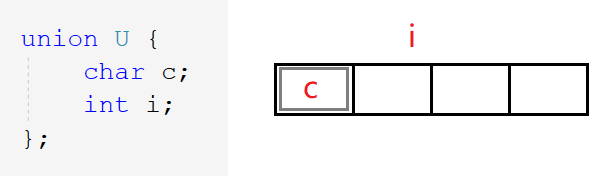

# 自定义类型

> C语言本身具有的内置类型如`int, float, double...`，同时也提供可自定义的自定义类型或构造类型如结构体，枚举，联合体。

## 1. 结构体

结构是一些值的集合，这些值被统称为成员变量。结构的每个成员可以是不同类型的变量。所以结构可以用来描述一个复杂的对象，其中成员即是对象的各种属性。

### 1.1 结构体的声明

~~~c
struct tag {

  member_list;

}value_list;
~~~

- `struct`是结构体的关键词，`tag`是结构体的标签名，
- `member_list`是定义成员变量的列表，`value_list`是用该结构体类型创建的全局变量的列表，可缺省。

~~~c
struct Book {
	char name[20];
	char author[20];
	double price;
}b1, b2;
struct Book b3 = { 0 };
int main() {
    struct Book b4 = { 0 };
    return 0;
}
~~~

> 上述是结构体描述书籍的例子，这里的`b1`,`b2`和`b3`完全等价都是全局变量，而在`main`函数中定义的`b4`为局部变量。

#### 匿名形式声明

~~~c
struct {
	int a;
	char c;
	double d;
}s1, s2;
~~~

> 定义匿名结构体类型，省去标签名，所以只能在成员列表处创建变量。

##### Example

~~~c
struct {
	int a;
	char c;
	double d;
}s1, s2;
struct {
	int a;
	char c;
	double d;
}*ps;
int main() {
	ps = &s1;//指针类型不兼容
	return 0;
}
~~~

如上述代码所示，使用同样的匿名结构体创建一个结构体指针`ps`，并存入`s1`的地址。

乍一看貌似可以，也就是说两个匿名结构体虽然成员相同，但编译器默认为两个结构体类型。二者属于两种类型的变量，所以会提示指针类型不兼容。

### 1.2 结构体自引用

> 结构体中该如何引用自身类型的变量呢？或者说，在定义结构体时包含自身类型的成员变量是否可行呢？

#### Example 1

~~~c
struct Node
{
	int data;
	struct Node next;
};
~~~

如果可行的话，如何计算该结构体所创建的变量的大小呢？自身嵌套一个同类型的结构体变量，如果一直嵌套下去是无法计算出大小的。所以显然是错误的。

#### Example 2

~~~c
struct Node
{
    //数据域
	int data;
	//指针域
    struct Node* next;
};
~~~

类似于数据结构中链表的使用方法，使用指针存入下一个节点的地址。如图：

`data`被成为数据域，结构体指针`next`被成为指针域。这才是结构体自引用的正确方法。

#### 注意

~~~c
typedef struct {
	int data;
	Node* next;

}Node;
~~~

`typedef`将结构体重命名为`Node`，但这在定义结构体之后才能生效，所以在结构体定义中，编译器无法识别该类型名。

~~~c
typedef struct Node {
	int data;
	struct Node* next;
}Node;
~~~

上述方案才是正确方法，当然这里的`typedef`重命名对于结构体定义部分来说仍然是无意义的，所以说匿名结构体的功能非常鸡肋，不用也罢。

### 1.3 结构体变量的定义

~~~c
struct Point {
	int x;
	int y;
}p2 = { 3,3 }, p3 = { 4,4 };
struct Point p4 = { 1,2 };

struct S {
	double d;
	struct Point p;
	char n[10];
};

int main()
{
	struct Point p1 = { 3,4 };
	struct S s = { 3.14, {1,1}, "zhangsan"};
    printf("%lf %d,%d %s\n", s.d, s.p.x, s.p.y, s.n);
	return 0;
}
~~~

- `p1`,`p2`和`p3`,`p4`分别采用不同的定义和初始化方式。

> `p1`是`main`函数内部定义的局部变量，`p2`和`p3`是在结构体变量列表内定义的全局变量，`p4`是直接用结构体类型定义的全局变量。

- 结构体`s`内部嵌套了一个`p`变量。

### 1.4 结构体传参

> 在C语言初阶时，就已经介绍过结构体传参的两种方式：传值调用和传值调用。如：

~~~c
struct S {
	int data[1000];
	int num;
};
void Print1(struct S tmp) {
	for (int i = 0; i < 10; i++) {
		printf("%d ", tmp.data[i]);
	}
	printf("\n%d\n", tmp.num);
}
void Print2(struct S* ps) {
	for (int i = 0; i < 10; i++) {
		printf("%d ", ps->data[i]);
	}
	printf("\n%d\n", ps->num);
}
int main()
{
	struct S s = { {1,2,3,4,5,6,7,8,9,10},100 };
	Print1(s);
	Print2(&s);
	return 0;
}
~~~

通过结构体内存对齐，可以看出结构体传值调用时，不止开辟了表面大小的空间。结构体过大，参数压栈的系统开销就大，导致性能下降。结构体传参还是选择传址调用。

&nbsp;

### 1.5 结构体内存对齐

> 在掌握结构体的基本使用后，进一步深入探讨结构体的大小，所占的内存空间。那就要研究一个不可避免的问题：内存对齐。而内存对齐在结构体这里体现的尤为明显，所以也叫结构体内存对齐。

~~~c
struct S1 {
	char c1;
	int a;
	char c2;
};
struct S2 {
	char c1;
	char c2;
	int a;
};
int main()
{
	struct S1 s = { 'x',100,'y' };
	printf("%d\n", sizeof(struct S1));//12
	printf("%d\n", sizeof(struct S2));//8
	return 0;
}
~~~

上述代码可以，看出结构体的成员变量位置不同，结构体大小也不同。至于原因，且看下文分解：

#### 内存对齐的规则

1. 结构体第一个成员永远位于结构体距起始位置偏移量为0的位置。

> 即首个成员一定放在为结构体所开辟的内存空间的第一个位置。

2. 从第二个成员开始，各自放在偏移量为对齐数的整数倍处。对齐数为变量自身大小和默认对齐数的较小值。

> Linux环境下无默认对齐数，Windows环境下对齐数为8。而一般无变量类型所占字节大于8，故对齐数一般为变量的自身大小。

3. 结构体的总大小必须为所有成员变量的对齐数的最大值的整数倍。

> 笔者猜测是为了凑齐读取域宽的整数倍，不至于让之后创建的变量紧随其后而造成不必要的麻烦。

4. 若结构体嵌套，内嵌结构体对齐到其成员最大对齐数的整数倍处，整体结构体总大小须为其成员最大对齐数的整数倍。

> 由第3条可推得，**内嵌结构体和整个结构体同样都是结构体，都要对齐到各自成员变量对齐数的最大值的整数倍处**。而一般整个结构体的最大成员变量都是内嵌结构体。

偏移量：距起始位置的字节个数，相当于下标位置。如第1个字节的偏移量为0，第2个字节的偏移量为1。

现在再来看上面的例子：

~~~c
//1.
struct S1 {
	char c1;
	int a;
	char c2;
};
//2.
struct S2 {
	char c1;
	char c2;
	int a;
};
~~~

- `c1`放在偏移量为0的地址处，`a`的对齐数为4则放在偏移量为4的地址处浪费3个字节，次之`c2`对齐数为1偏移量为任意位置故紧随其后。共占9个字节，但总大小需为4的倍数，所以再浪费3个字节，共12个字节。
- `c1`和`c2`对齐数都为1，随后`a`对齐数为4故放在偏移量为4的地址处，正好一共8个字节。

##### Example

求出下列结构体所创建的变量的大小。

~~~c
//3.
struct S3 {
	double d;
	char c;
	int a;
};
//4.
struct S4 {
	char c1;//1
	struct S3 s;//8
	double d;//8
};
~~~

- 嵌套结构体所占内存为16个字节，但其最大对齐数为8，所以整个结构体的成员变量对齐数的最大值即为8。

#### 存在内存对齐的原因

> 这样的内存对齐的机制，显得又浪费空间又使得计算繁琐，但是它的存在是有很必要的，虽没有官方明确的解释，但是也可总结为以下两点：

1. 移植原因

不是所有硬件平台都能任意的读取地址上的任意数据。某些平台只能在特定的地址处以特定的方式读取特定的数据。如只在地址为4的倍数处读取，且每次读取4个字节的数据。平台之间移植性差。

2. 性能原因

数据应尽可能地存储在地址的自然边界上并对齐，以防止同一块空间的数据要作两次访问，提升读取数据的效率。

> 总结就是内存对齐是为了牺牲空间复杂度降低时间复杂度，以空间换取时间。当然我们要做的就是尽己所能既节省空间又节省时间

结构体中不同的变量放在不同的位置，结构体所占的大小不同。**让占用空间小的成员集中在后面**，可以是实现一定程度上的节约空间。

#### 默认对齐数的修改

~~~c
//设置默认对齐数
#pragma pack(n);

struct Tag {
  member_list;
};

//恢复默认对齐数
#pragma pack();
~~~

默认对齐数是可以被修改的，使用前设置，使用后取消。当认为结构体的默认对齐数不适当时，可自行设置。同时对齐数 $n$ 一般都设置为 $2^n$ 。

##### Example

实现宏计算结构体中某变量相对于首地址的偏移量。

~~~c
#include <stddef.h>
struct S1 {
	char c1;
	int a;
	char c2;
};
int main()
{
	printf("%d\n", offsetof(struct S1, c1));
	printf("%d\n", offsetof(struct S1, c2));
	printf("%d\n", offsetof(struct S1, a));
	return 0;
}
~~~

&nbsp;

## 2. 位段

### 2.1 位段的定义

位段的声明和结构体类似，但又两点不同。

1. 类型不同：位段的成员必须是整型变量，如`char,int,unsigned int`等。
2. 写法不同：位段的成员名后使用`:`和`数字`来规定分配的空间。如：

~~~c
struct A {
	int _a : 2;
	int _b : 5;
	int _c : 10;
	int _d : 30;
};
~~~

计算位段`A`的大小得8，而4个整形变量最小占16个字节。说明**位段一定程度上可以节省空间**。

位段中的“位”表示二进制位，而`:`后的数字代表系统分配给该变量的比特位数。

> 在描述对象时，属性变量中的所有位数不一定全部使用，使用位段可以规定系统分配给变量的空间。当然数据过大仍会溢出。

### 2.2 位段的内存分配

- 系统按成员变量类型来为位段开辟空间，一次性开辟一个变量类型大小的空间。

> 如该成员为`int`型，则一次开辟4个字节，若不够则再开辟4个字节。若为`char`类型，则开辟1个字节。

- 位段使用时涉及很多不确定因素，程序可移植性差，故位段是不跨平台的。

> 如图所示，先开辟4个字节的空间，`a`占用2bit，`b`占用5bit,`c`占用10bit。这4个字节还剩15个bit不够`d`的存放，必然要在开辟4个字节的空间。这就是算出来的8个字节。

问题是`d`接着一半存放在第一个字节一半存放在第二个字节，还是全部存放在新开辟的空间内?

> 不同的编译环境下可能会产生不同的结果，这是C标准中未规定的内容。笔者在此仅考虑Windows环境的情况，请看接下来的例子。

~~~c
struct S {
	char a : 3;
	char b : 4;
	char c : 5;
	char d : 4;
};
struct S s = { 0 };
int main() {
	s.a = 10;
	s.b = 12;
	s.c = 3;
	s.d = 4;
	return 0;
}
~~~

> 对位段变量进行赋值操作，就又带来了一个问题单个字节内先使用高地址还是低地址？这也是标准未规定的。
>
> 我们先进行假设：位段中先使用高地址再使用低地址，同时剩余空间不足则将其抛弃并重新开辟。如果vs中的最后结果和预期一致，则假设正确。

我们按照假设写出位段的内存情况：
$$
(\ 0110\ 0010\ 0000\ 0011\ 0000\ 0100\ )_{2}
\\(\quad 6 \;\quad 2 \qquad 0 \qquad 3 \qquad 0 \quad\; 4\quad)_{10}
$$

> vs显示结果和我们的假设完全相符。故假设正确。所以可以得出结论，在vs环境下：

1. 每次开辟空间所开辟的字节个数，由需开辟空间的成员变量的类型所决定。
2. 内存使用时，先使用低字节再使用高字节，单个字节内从高位到低位使用。
3. 所开辟内存空间不足时，抛弃剩余内存，重新开辟类型大小的空间。

> 由于这些规则C标准并未明确规定，因而这些结论因编译器而异。所以位段的平台移植性差。

### 2.3 位段的跨平台问题

1. `int`位段的最高位是否被当做符号位不确定。
2. 位段中成员类型的所占比特位数目不确定。

> 早期16位机器`int`占2个字节共16个比特位，而变量分配bit位数目不得多于最大值。

3. 位段成员在内存中先使用高地址还是低地址不确定。
4. 所开辟内存空间不足时，是否抛弃剩余内存重新开辟还是接着使用剩余内存不确定。

### 2.4 位段的应用

和结构相比，位段可达到同样的效果，可以节省空间，但是需使用小心且跨平台性差。而位段可以应用到网络协议中，不至于浪费大量的空间，网络传输协议中每几个比特位成一组用于传输不同的数据。

&nbsp;

## 3. 枚举类型

> 枚举顾名思义一一列举，有很多数据可以列举出来，如：性别，月份，颜色等。

### 3.1 枚举的定义

~~~c
enum Tag {
    con1,
    con2,
    ...
    con3
};
~~~

- `enum`是枚举关键字，`Tag`是枚举对象名；
- `con1,con2,...,con3`是枚举常量列表。

> 同时枚举就相当于整形常量，故所有枚举常量都是4个字节。

~~~c
//星期
enum Day {
	Mon,
	Tues,
	Wed,
	Thur,
	Fri,
	Sat,
	Sun
};
//性别
enum Sex {
	FAMALE,
	MALE,
	SECRET
};
//颜色
enum Color {
	RED,
	GREEN,
	BLUE
};
~~~

> 上述定义的`enum Day`,`enum Sex`,`enum Color`都是枚举类型。`{}`内是枚举类型的可能取值，即枚举常量。

枚举常量取值默认从0开始，依次递增。也可进行（完全或不完全）初始化对其赋初值，所初始化常量之前的常量取值不受影响，之后的常量仍然依次递增。

当然常量只能进行初始化，而不能进行赋值操作。

~~~c
//1.
enum Color c = GREEN;
//2.
enum Color c = 1;
~~~

上述操作为创建枚举类型的变量，赋值为`GREEN`。

> C语言对语法的检测没有那么严格。所以1和2都行。在C++中认为`1`是字面常量而`GREEN`为枚举常量。二是不相等的，所以不能赋值。

### 3.2 枚举的优点

1. 提高代码可读性和可维护性

> `#define`定义的常量不如枚举常量有意义，且枚举常量是具有类型的更严谨。

2. 防止命名污染

> `#define`定义的常量属于全局常量，易冲突。

3. 便于调试

> `#define`定义的常量在预编译期间就已经被替换，该常量已不复存在。而枚举类型一直存在有值有类型便于调试。

4. 使用方便

> 一次可定义多个常量，且便于管理。

### 3.3 枚举的使用

~~~c
/*
* 计算器
* 使用枚举常量
* */
enum Option {
	EXIT,//0
	ADD,//1
	SUB,//2
	MUL,//3
	DIV,//4
};

int Add(int x, int y) {
	return x + y;
}
int Sub(int x, int y) {
	return x - y;
}
int Mul(int x, int y) {
	return x * y;
}
int Div(int x, int y) {
	return x / y;
}
void Calc(int (*pf)(int, int)) {
	int a = 0;
	int b = 0;
	printf("请输入操作数:>");
	scanf("%d %d", &a, &b);
	printf("%d\n", pf(a, b));
}

void menu() {
	printf("*************************\n");
	printf("**** 1.ADD     2.SUB ****\n");
	printf("**** 3.MUL *** 4.DIV ****\n");
	printf("*******  0.exit  ********\n");
	printf("*************************\n");
}
int main()
{
	int input = 0;

	do {
		menu();
		printf("请选择\n");
		scanf("%d", &input);
		switch (input) {
		case ADD:
			Calc(Add);
			break;
		case SUB:
			Calc(Sub);
			break;
		case MUL:
			Calc(Mul);
			break;
		case DIV:
			Calc(Div);
			break;
		case EXIT:
			break;
		default :
			printf("选择错误\n");
			break;
		}
	} while (input);
	return 0;
}
~~~

&nbsp;

## 4. 联合体

联合是一种特殊的自定义类型，同样包含一系列成员，特殊在于这些成员共用同一块空间。所以联合体也叫共用体。

### 4.1 联合的定义

~~~c
union Un {
	char c;//1
	int i;//4
};
int main()
{
	union Un u = { 0 };
	printf("%d\n", sizeof(u));
	return 0;
}
~~~

算出该联合体变量大小为4个字节，可一个整型和字符型变量最少也要5个字节，为什么会这样呢？

### 4.2 联合的特点

~~~c
printf("%p\n", &u);//00EFF934
printf("%p\n", &u.c);//00EFF934
printf("%p\n", &u.i);//00EFF934
~~~

> 从上述代码可以看出`c`,`i`共用4个字节。

- 改变`i`就会改变`c`，改变`c`就会改变`i`。故使用时仅可以使用1个成员，另一个成员也会被修改。

- 联合的成员共用一块空间，故联合体变量的大小是至少是最大成员的大小。

#### Example

利用联合体判断当前机器的大小端存储。

~~~c
int check_sys() {
	union U {
		char c;
		int i;
	}u;
	u.i = 1;
	return u.c;
}
int main()
{
	if (check_sys() == 1) {
		printf("小端存储\n");
	}
	else {
		printf("大端存储\n");
	}
	return 0;
}
~~~

### 4.3 联合大小的计算

而联合体也存在内存对齐。这个内存对齐相对结构体来说就简单一些了。

~~~c
//1.
union Un1 {
	char c[5];
	int i;
};
//2.
union Un2 {
	short c[7];
	int i;
};
int main() {
	printf("%d\n", sizeof(union Un1));
	printf("%d\n", sizeof(union Un2));
	return 0;
}
~~~

- 联合体变量大小至少是最大成员的大小。
- 当最大成员大小不够最大对齐数的整数倍时，对齐到最大对齐数的整数倍处。

> 因为联合体所有成员共用一块空间，故算出最大成员大小后，只在最后需要再浪费几个字节的空间以对齐到最大对齐数的整数倍。

原大小应为5个字节，最大对齐数应为4，则要对齐到8个字节。

原大小应为14个字节，最大对齐数应为4，则要对齐到16个字节。