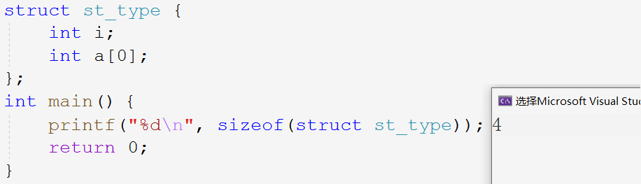

## 动态内存管理

### 动态内存分配的意义

当我们用类型如`int`,`char`创建变量时，所开辟的空间都是固定的。而开辟动态内存就是为了灵活的使用内存，以满足程序的需要。

在语言学习时，对于内存的划分为上述三者：栈区，堆区，静态区。栈区存放临时变量，静态区存放静态变量，堆区用来动态开辟。

> 动态内存开辟是在堆区上开辟空间，具体如何开辟请看下列函数。

### 动态内存函数的介绍

#### 开辟释放函数 `malloc` & `free`

##### 函数声明

~~~c
void* malloc( size_t size );
~~~

~~~
Return Value
malloc returns a void pointer to the allocated space, or NULL if there is insufficient(不充足) memory available. To return a pointer to a type other than void, use a type cast(转换) on the return value. Always check the return from malloc, even if the amount of memory requested is small.

Parameter
size - Bytes to allocate

Remarks
The malloc function allocates a memory block of at least size bytes. The block may be larger than size bytes because of space required for alignment and maintenance information.
~~~

~~~c
void free( void* memblock );
~~~

~~~
Return Value
None

Parameter
memblock - Previously allocated memory block to be freed

Remarks
The free function deallocates(解除) a memory block that was previously allocated. If memblock is NULL, the pointer is ignored. Attempting to free a memblock isn't allocated on heap may cause errors.
~~~

> `malloc`函数在堆区上申请`size`个字节的空间，并返回该空间的起始地址。
>
> `free`函数释放指针指向的动态开辟的空间，但不对指针造成任何影响。

##### 函数用法

- `malloc`返回通用类型的指针，将其强制转换为所需类型，并用该类型的指针维护该内存空间。
- 开辟成功返回空间起始地址，开辟失败则返回`NULL`。
- 使用结束`free`释放内存以防内存泄漏，将指针置空避免成为野指针。

~~~c
//申请空间
int* p = (int*)malloc(40);
//检查
if (p == NULL) {
    printf("%s\n", strerror(errno));
    return -1;
}
//使用
for (int i = 0; i < 10; i++) {
    *(p + i) = i;
    printf("%d ", *(p + i));
}
//释放空间
free(p);
//置空
p = NULL;
~~~

#### 内存开辟函数 `calloc`

##### 函数声明

~~~c
void* calloc( size_t num, size_t size );
~~~

~~~
Return Value
calloc returns a pointer to the allocated space. To get a pointer to a type other than void, use a type cast on the return value.

Parameters
1. num - Number of elements
2. size - Length in bytes of each element

Remarks
The calloc function allocates storage space for an array of num elements, each of length size bytes. Each element is initialized to 0.
~~~

> `calloc`函数在堆区上申请`num`个`size`大小的空间，返回起始地址并将内容初始化为0。

##### 函数用法

~~~c
int* p = (int*)calloc(10, sizeof(int));
if (p == NULL) {
    perror("");
    return -1;
}
for (int i = 0; i < 10; i++) {
    *(p + i) = i;
    printf("%d ", p[i]);
}
free(p);
p = NULL;
~~~

#### 内存调整函数 `realloc`

##### 函数声明

~~~c
void* realloc( void* memblock, size_t size );
~~~

~~~
Return Value
realloc returns a void pointer to the reallocated memory block. The return value is NULL if there is not enough available memory to expand the block to the given size, then the original block is unchanged.

Parameters
1. memblock - Pointer to previously allocated memory block
2. size - New size in bytes

Remarks
The realloc function changes the size of an allocated memory block. The memblock parament points to the beginning of the memory block. If memblock is NULL, realloc behaves the same way as malloc. The contents of the block are unchanged, although the new block can be in a different location.
~~~

> `realloc`函数为已开辟的空间重新开辟大小。

##### 函数用法

- 当原空间后有足够大小时，就紧接原空间开辟剩余空间，并返回整个空间的起始地址。

- 当原空间后无足够大小时，就在堆区寻找新空间，再将原空间的内容移动到新空间，返回新空间的地址且释放原空间。

- 当剩余空间不够无法开辟时，增容失败，返回`NULL`。

~~~c
//1.
p = (int*)realloc(p, 20 * sizeof(int));
//2.
int* ptr = (int*)realloc(p, 20 * sizeof(int));
if (ptr == NULL) {
    return -1;
}
p = ptr;
~~~

> 防止增容失败将原空间指针置空，故不可直接使用原指针接受返回值。判断非空后再赋给原指针。

&nbsp;

### 常见的动态内存错误

#### 1.不检查空指针

~~~c
void test() {
	int* p = (int*)malloc(INT_MAX / 4);
	*p = 20;
	free(p);
}
~~~

对指向动态开辟的空间的指针一定要做有效的判断。

#### 2.越界访问

~~~c
void test() {
	int i = 0;
	int* p = (int*)malloc(10 * sizeof(int));
	if (NULL == p) {
		exit(EXIT_FAILURE);
	}
	for (int i = 0; i <= 10; i++) {
		*(p + i) = i;
	}
	free(p);
    p = NULL;
}
~~~

作为程序员必须有意识地检查所写的代码是否有越界访问的问题。

#### 3.释放非动态开辟内存

~~~c
void test() {
	int a = 10;
	int* p = &a;
	free(p);
    p = NULL;
}
~~~

不可用`free`释放非动态开辟的空间。

#### 4.释放部分内存

~~~c
int main()
{
	int* p = (int*)malloc(100);
	p++;
	free(p);
	return 0;
}
~~~

改变指向动态开辟内存的指针，内存将无法管理。释放不完全导致内存泄漏。

#### 5.重复释放内存

~~~c
void test() {
	int* p = (int*)malloc(100);
	free(p);
	free(p);
}
~~~

使用`free`释放已释放的空间，即访问非法内存。建议释放内存和指针置空搭配使用。

#### 6.忘记释放内存

~~~c
void test() {
    int *p = (int*)malloc(100);
    if(NULL != p) {
        *p = 20;
    }
}
int main() {
    test();
    while(1);
}
~~~

使用结束不释放内存造成内存泄漏。程序不停止，系统也不会自动回收。

&nbsp;

### 笔试题

> 调用下列`test`函数，解释运行结果。

#### Example 1

~~~c
void GetMemory(char* p) {
	p = (char*)malloc(100);
}
void test() {
	char* str = NULL;
	GetMemory(str);
	strcpy(str, "hello world");
	printf(str);
    free(str);
    str = NULL;
}
~~~

> 程序报错。

**传值调用**：并没有改变`str`的值仍为不予修改的空指针，可以使用二级指针接收`str`的地址。函数调用结束后指针销毁故无法释放空间以致内存泄漏。

#### Example 2

~~~c
char* GetMemory() {
	char p[] = "hello world";
	return p;
}
void test() {
	char* str = NULL;
	str = GetMemory();
	printf(str);
    free(str);
    str = NULL;
}
~~~

> 程序打印随机值。

**返回栈空间地址**：数组`p`在函数内创建，出函数销毁，返回这部分空间的地址 ，属于访问非法空间。

#### Example 3

~~~c
void GetMemory(char** p,int num) {
	*p = (char*)malloc(num);
}
void test() {
	char* str = NULL;
	GetMemory(&str, 100);
	strcpy(str, "hello");
	printf(str);
	free(str);
    str = NULL;
}
~~~

> 程序运行成功，打印`"hello"`。

**传址调用**：本题是例一的正确写法。

#### Example 4

~~~c
void test(void) {
	char* str = (char*)malloc(100);
	strcpy(str, "hello");
	free(str);
	if (str != NULL) {
		strcpy(str, "world");
		printf(str);
	}
}
~~~

> 程序报错。

**野指针**：动态开辟的内存释放后指针不置空，造成野指针访问非法内存。释放内存和指针置空应该搭配起来使用。

> 释放空间，销毁空间都是将内存空间归还给操作系统，即将此空间的使用权限归还操作系统。虽不会改变空间内容以致打印出所谓的“正确结果”，但可能在之后被操作系统分配给其他程序时发生修改。但无论改变与否，一旦空间归还后再去访问就是访问非法内存。

&nbsp;

### C/C++内存划分

#### 用例展示

> 根据下列创建的各种变量，分析内存的划分。

~~~c
int globalVar = 1;
static int staticGlobalVar = 1;
int main()
{
	static int staticVar = 1;

	int localVar = 1;
	int num1[10] = { 1,2,3,4 };
	char char2[] = "abcd";
	char* pChar3 = "abcd";
	int* ptr1 = (int*)malloc(4 * sizeof(int));
	int* ptr2 = (int*)calloc(4, sizeof(int));
	int* ptr3 = (int*)realloc(ptr2, 4 * sizeof(int));

	free(ptr1);
	free(ptr3);
	return 0;
}
~~~

1. `globalVal`,`staticGobalVar`,`staticVar`分别是全局变量和静态变量，在数据段上创建。
2. `localVar`和`num`,`char2`,`pchar`以及`ptr`本身都是局部变量，都是在栈区上创建的。
3. `malloc`,`calloc`,`realloc`都是在堆区上开辟的内存块，由指针`ptr`指向而已。

#### 内存划分图示

1. 栈区（`stack`）：执行函数时，函数的局部变量都会在栈区上创建。压栈：从栈顶向下开辟空间，弹栈：从栈底向上释放空间。
2. 堆区（`heap`）：一般由程序员分配和释放，从堆低向上开辟空间，堆顶向下释放空间。在程序结束后也被操作系统会自动回收。
3. 数据段（静态区）：存放全局变量，静态数据。变量本在栈上创建，被`static`修饰后放在常量区，程序结束后由系统释放。
4. 代码段（常量区）：存放可执行代码和只读常量。

值得注意的是，字符串数组`char2`的内容`"abcd"`也是存储在栈上的，是从常量区拷贝过来的。

> 语言学习时期，仅对内存作此了解即可。内核空间和内存映射段会在操作系统中学习，此处不再深入研究。

&nbsp;

### 柔性数组

> C99中引入柔性数组。**柔性数组**（flexible array）面试中虽不是重要的考点，但仍需掌握最基本的使用。

#### 柔性数组的定义

在`C99`中，结构中最后一个元素允许是未知大小的数组，被称为柔性数组成员。例如：

~~~c
//1.
struct st_type {
	int i;
	int a[0];//柔性数组成员
};
//2.
struct st_type {
	int i;
	int a[];//柔性数组成员
};
~~~

语法规定数组大小中写0和不写都代表不指定大小。意味数组可大可小，这便是柔性的含义。

> 有些编译器可能只支持一种写法。当然柔性数组前必须有其他成员，类型一致是为了避免考虑内存对齐。既然把柔性数组放在动态内存管理一章，可见二者有必然的联系。

#### 柔性数组的特点

- 结构中柔性数组成员前必须至少有一个成员。
- `sizeof`计算结构所占空间时不包含柔性数组的大小。

- 包含柔性数组的结构用`malloc`进行动态内存分配，且分配的内存应大于结构大小，以满足柔性数组的预期。

> 使用含柔性数组的结构体，需配合以`malloc`等动态内存分配函数。分配空间减去其他成员的大小，即为为柔性数组开辟的空间。

#### 柔性数组的使用

> `malloc`开辟的大小写成如图所示的形式，增加代码的可阅读性。
>
> 结构体所分配空间减去其他成员的大小，所剩即为为柔性数组开辟的空间大小，若不够还可以用`realloc`调整大小，以满足柔性数组“柔性”的需求。

~~~c
struct st_type {
	int i;
	int a[0];
};
int main() {
	printf("%d\n", sizeof(struct st_type));
	//1.
	struct st_type st;
	//2.
	struct st_type* pst = (struct st_type*)malloc(sizeof(struct st_type) + 10 * sizeof(int));
	if (pst == NULL) {
		perror("pst");
		return -1;
	}
	return 0;
}
~~~

含柔性数组结构体当然不可像第一种那样使用，这样结构体变量`st`仅有4个字节，不包含柔性数组。

##### Example

~~~c
struct st_type {
	int i;
	int a[0];
};
int main() {
	struct st_type* pst = (struct st_type*)malloc(sizeof(struct st_type) + 10 * sizeof(int));
	if (pst == NULL) {
		perror("pst");
		return -1;
	}
	pst->i = 10;
	for (int i = 0; i < 10; i++) {
		printf("%d ", pst->a[i] = i);
	}
	//调整空间大小
	struct st_type* ptr = (struct st_type*)realloc(pst, sizeof(struct st_type) + 20 * sizeof(int));
	if (ptr == NULL) {
		perror("ptr");
		return -1;
	}
	pst = ptr;
	for (int i = 10; i < 20; i++) {
		printf("%d ", pst->a[i] = i);
	}
	//释放
	free(pst);
	pst = NULL;
	return 0;
}
~~~

#### 柔性数组的优势

> 柔性数组成员利用动态内存可大可小，那同样将柔性数组成员替换成指向动态开辟内存的指针也可达到同样的效果。下文将对比二者都有何优劣。（为突出对比，已省略不必要的代码）

##### 柔性数组版本

~~~c
struct st_type {
	int i;
	int a[];
};
int main() {
	struct st_type* pst = (struct st_type*)malloc(sizeof(struct st_type) + 10 * sizeof(int));
	for (int i = 0; i < 10; i++) {
		printf("%d ", pst->a[i] = i);
	}
	//调整空间大小
	struct st_type* ptr = (struct st_type*)realloc(pst, sizeof(struct st_type) + 20 * sizeof(int));
	pst = ptr;
	for (int i = 10; i < 20; i++) {
		printf("%d ", pst->a[i] = i);
	}
	//释放
	free(pst);
	pst = NULL;
	return 0;
}
~~~

##### 指针版本

~~~c
struct st_type {
	int i;
	int* pa;
};
int main() {
	struct st_type* pst = (struct st_type*)malloc(sizeof(struct st_type));
    pst->pa = (int*)malloc(10 * sizeof(int));
    for (int i = 0; i < 10; i++) {
		printf("%d ", *(pst->pa + i) = i);
	}
	//调整空间大小
    int* ptr = (int*)realloc(pst->pa, 20 * sizeof(int));
	pst->pa = ptr;
	for (int i = 10; i < 20; i++) {
		printf("%d ", *(pst->pa + i) = i);
	}
    //释放
	free(pst);
	pst = NULL;
	free(pst->pa);
	pst->pa = NULL;
	return 0;
}
~~~

1. 从用户的角度看，函数中不应作二次内存分配（不便一次释放完毕）。
2. 多次开辟动态内存，内存碎片增多，也增加内存泄漏的风险。内存不连续，拖慢访问速度（局部性原理）。
