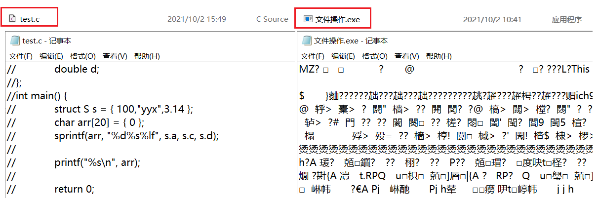
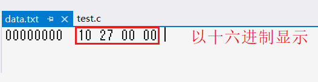

# 文件操作

> 文件操作在实际工作中，用到的并不多。但没有它C语言又不完整。所以本次我们研究一下C语言的文件操作。

## 1. 文件的相关概念

### 1.1 文件的定义

> 将数据存储到外存（写入文件），每次程序结束后可以避免数据丢失，可以在程序运行时将数据加载到内存中，这是文件存在的意义。

在程序设计中，从文件功能的角度分类，一般谈到的文件有两种：程序文件和数据文件。

- **程序文件**：跟程序有关的文件，如源文件`.c`，编译产生的目标文件`.obj`，可执行程序`.exe`等。

- **数据文件**：配合程序进行读写操作的，存储程序运行时所读写数据的文件，如`.txt`。

注意，数据文件和程序文件之间的操作，被称为读和写。以程序为对象，向外修改数据或输出内容被称为写入，从数据文件到程序文件的获取数据被称为读取。而**写即为输出，读被称为输入**。

和之前不同的是，数据所输入输出的对象从终端变成了文件。如`printf`,`scanf`分别是将数据输出到屏幕和从键盘输入数据。 如今我们可以将屏幕和键盘换成文件，对文件进行输入和输出。

> 而本章所讨论的文件就是数据文件。

#### 文件名

每个文件有且仅有一个唯一的文件标识，用于描述文件。文件标识包含3个部分：文件路径+文件名主干+文件后缀。

例如：`D:\code\data.txt`。 方便起见，文件标识通常成为文件名。如图：

&nbsp;

### 1.2 文件的分类

根据数据的组织形式，数据文件被分为两种：文本文件或者二进制文件。

- **二进制文件**：数据在内存中以二进制的形式存储，再直接输出到外存，就是二进制文件。
- **文本文件**：数据转换成ASCII码的形式再存储到外存中，就是文本文件。

> 如上图所示，`test.c`打开后可以看懂，则是文本文件，`*.exe`打开后显示乱码，则是二进制文件。

#### 数据的存储

数据在内存中存储时，字符一律以ASCII码的形式存储，而数值可以以ASCII码的形式也可以以二进制的形式存储。

例有整数10000，若以ASCII码的形式存储，则5个字符共需5个字节。若以二进制的形式存储，则转化成补码，整型数据共需4个字节。

> 使用下列代码，将10000以二进制的形式存入文件`data.txt`中。

~~~c
int main() {
	FILE* pf = fopen("data.txt", "wb");
	if (pf == NULL) {
		perror("fopen");
		return -1;
	}
	int a = 10000;
	fwrite(&a, 4, 1, pf);
	fclose(pf);
	pf = NULL;
	return 0;
}
~~~

我们用二进制编辑器查看以二进制形式写入文件的10000，可以看到如下现象：可以按照如下推理得出答案。

~~~c
//1.
00000000 00000000 00100111 00010000 - 10000原码
//2.c
00010000 00100111 00000000 00000000 - 小端存储
//3.
1   0    2   7    0   0    0   0    - 转化成十六进制
10 27 00 00
~~~

&nbsp;

### 1.3 文件缓冲区

C标准规定采用**“缓冲文件系统”**处理数据文件，缓冲文件系统即是系统自动为程序所使用每一个文件开辟一块**“文件缓冲区”**。

1. 从内存向外存输出数据会先经过输出缓冲区，装满输出缓冲区后才一起输送到外存。同样，
2. 从外存向内存输入数据会先经过输入缓冲区，装满输入缓冲区后再一起输入到内存。

> 缓冲区的大小由编译系统决定，具体多少算“满”，C语言阶段不深入研究。

二者之间传递数据的操作是由程序调起操作系提供的输入输出的接口完成的。目的是使之不会频繁地传输打断操作系统。

&nbsp;

### 1.4 文件信息区

> 缓冲文件系统中，有个关键的概念叫“**文件类型指针**”，简称“**文件指针**”。

当程序操作一个文件的时候，都在内存中开辟了一个与该文件相对应的文件信息区，用于存放文件的相关信息（如文件名称，状态，位置等）。这些信息都是一个结构体的成员，该结构体类型由系统声明，取名为"**FILE**"。

每一个文件被操作时，都会先创建好一个文件信息区，所谓文件信息区其实就是一个被封装好的结构体类型所创建的变量，该变量与所属文件强关联。操作文件其实就是操作文件信息区，打开文件其实返回了文件信息区的地址。如图：

> 从内存读取方式中也可窥探一番，内存中数据也是一级一级读取的，先将内存中的数据提至缓存区，再放到寄存器中。读取文件也是这样的逻辑，不然直接读取整个文件，加载慢占存大也容易出错。

`vs2013`中仍可以看到文件信息区的结构体封装内容，可以看出都是文件的相关信息。**文件信息区就是`FILE`类型的结构体变量**。

#### 文件指针

这些变量都是由系统封装好自动创建的，不必关注细节。一般都是通过`FILE*`的指针来维护该`FILE`结构体变量，这就是文件指针。

~~~c
FILE* pf;//指向文件信息区的指针
~~~

通过`FILE`类型的结构体指针变量`pf`，可指向某个文件信息区从而操作该文件。如图：

&nbsp;

## 2. 文件的开关操作

> 想要通过文件指针进行文件操作，必须先打开文件，使用结束后关闭文件。操作文件的步骤分为：1. 打开文件 2. 读写文件 3. 关闭文件。

C语言标准规定，使用`fopen`和`fclose`来打开和关闭文件。

#### 2.1 文件的打开 fopen

##### 函数声明

~~~c
FILE* fopen (const char* filename, const char* mode);
~~~

~~~
Return Value
This function returns a pointer to the open file. A null pointer value indicates an error.

Parameters
1. filename - Filename
2. mode - Type of access permitted

Remarks
The fopen function opens the file specified by filename.
~~~

> `fopen`函数以`mode`的方式打开名为`filename`的文件，并返回文件信息区的起始地址。

##### 函数用法

- 打开文件以读还是写的方式由`mode`决定。打开方式如下：

| 模式 | 方式 | 含义                                 | 备注                   |
| ---- | ---- | ------------------------------------ | ---------------------- |
| **"r"** | **只读** | 输入数据，打开已存在的文本文件       | 文件不存在，则调用失败 |
| **"w"** | **只写** | 输出数据，“新建”一个文本文件         | 文件已存在，则销毁内容 |
| **"a"** | **追加** | 输出数据，向文本文件末尾添加数据     | 文件不存在，则创建文件 |
| "rb" | 只读 | 输入数据，打开已存在的二进制文件     | 文件不存在，则调用失败 |
| "wb" | 只写 | 输出数据，“新建”一个二进制文件       | 文件已存在，则销毁内容 |
| "ab" | 追加 | 输出数据，向二进制文件末尾添加数据   | 文件不存在，则创建文件 |
| "r+" | 读写 | 兼具输入输出，打开已存在的文本文件   | 文件不存在，则调用失败 |
| "w+" | 读写 | 兼具输入输出，“新建”一个文本文件     | 文件已存在，则销毁内容 |
| "a+" | 读加 | 兼具输入输出，向文本文件末尾添加数据 | 文件不存在，则创建文件 |
| ... ||||

- 文件名`filename`可采用相对路径即解决方案目录下文件夹和绝对路径即文件路径+文件名主干+后缀。

~~~c
//打开文件
//1. 绝对路径
FILE* pf = fopen("C:\\Users\\w3395\\Desktop\\data.txt", "w");
//2. 相对路径
FILE* pf = fopen("data.txt", "w");
~~~

#### 2.2 文件的关闭 fclose

##### 函数声明

~~~c
int fclose (FILE* stream);
~~~

~~~
Return Value
fclose returns 0 if the stream is successfully closed.

Parameter
1. stream - Pointer to FILE structure

Remarks
The fclose function closes stream.
~~~

> `fclose`函数关闭对文件信息区的输入输出流。

##### 函数用法

- `fclose`仅关闭了关于文件的输入输出流，不会将文件指针置空。为防止出现野指针，需置空文件指针。

~~~c
int main() {
	//打开文件
	FILE* pf = fopen("data.txt", "w");
	//打开失败
	if (pf == NULL) {
		perror("fopen");
		return -1;
	}
	//操作文件
	//...
	//关闭文件
	fclose(pf);
	pf = NULL;
	return 0;
}
~~~

&nbsp;

## 3. 文件的读写操作

### 3.1 流的定义

> “流是磁盘或其它外围设备中存储的数据的源点或终点” —— 《C语言程序设计》

流主要是指一种逻辑上的概念，产生数据的叫输入流，消耗数据的叫输出流。至于产生和消耗，因设备不同而有所差异，但C语言中对它们一视同仁，以“流”代之。

将字符放入文件中，或打印到屏幕上，这里的文件和屏幕就是外部设备。如屏幕、网络、文件，硬盘都是外部设备。不同设备的读写方式肯定不一样，为方便起见，故抽象出“流”的概念，以一个“流”字来概括它们的特征。故可把流看作是一种数据的载体，通过它可以实现数据交换和传输，传递数据的方式由“流”决定。我们仅需将数据放入“流”当中即可。

程序与数据的交互是以“流”的形式进行的。对象间进行数据的交换时总是先将数据转换为某种形式的流，再通过流的传输，到达目标对象后再将流转换为对象数据。C语言中文件读写时，都会先进行“打开文件”操作，这个操作就是在打开数据流，而“关闭文件”操作就是关闭数据流。

> 当我们使用`printf`,`scanf`时即是通过标准输入输出流在屏幕键盘和程序之间传递的。一般程序中会有三种流：标准输出流`stdout`，标准输入流`stdin`，标准错误流`stderr`，三种流都是`FILE*`的指针。

### 3.2 文件的顺序读写

> 下列是成对的，顺序读取和写入操作函数，分别适用于不同类型的数据。所有输出流包括文件输出流和标准输出流。

| 函数名    | 功能           | 适用范围   |
| --------- | -------------- | ---------- |
| `fgetc`   | 字符输入函数   | 所有输入流 |
| `fputc`   | 字符输出函数   | 所有输出流 |
| `fgets`   | 文本行输入函数 | 所有输入流 |
| `fputs`   | 文本行输出函数 | 所有输出流 |
| `fscanf`  | 格式化输入函数 | 所有输入流 |
| `fprintf` | 格式化输出函数 | 所有输出流 |
| `fread`   | 二进制输入     | 文件       |
| `fwrite`  | 二进制输出     | 文件       |

#### 字符输入输出  fputc & fgetc

##### 函数声明

~~~c
int fputc (int c, FILE* stream);
~~~

~~~
Return Value
This function returns the character written.

Parameters
1. c - Character to be written
2. stream - Pointer to FILE structure

Remarks
This function writes the single character c to a file at the position pointed by the associated file position pointer (if defined) and advances the pointer appropriately(适当).
~~~

~~~c
int fgetc (FILE* stream);
~~~

~~~
Return Value
fgetc return the character read as an int or return EOF to indicate an error or end of file.

Parameter
stream - Pointer to FILE structure

Remarks
This function reads a single character from the current position of a file; The function then increments(递增) the associated file pointer (if defined) to point to the next character.
~~~

> `fputc`将字符`c`放到文件指针`stream`所指向的文件中。
>
> `fgetc`返回文件指针所指向的字符。

##### 函数用法

- `fputc`每写入一个字符文件指针就向后移动一个字符的位置。`fgetc`每读取一个字符文件指针就向后移动一个字符的位置。
- `fputc`适用于所有输出流，可以输出到任意设备上。`fgetc`同样适用于所有输入流，可以从任意设备上读取数据。

~~~c
int main() {
	FILE* pf = fopen("data.txt", "w");
	if (pf == NULL) {
		perror("fopen");
		return -1;
	}
	fputc('a', pf);
	fputc('b', pf);
	fputc('c', pf);
	fclose(pf);
	pf = NULL;
	return 0;
}
int main() {
	FILE* pf = fopen("data.txt", "r");
	if (pf == NULL) {
		perror("fopen");
		return -1;
	}
	int ch = fgetc(pf);
	printf("%c ", ch);
	ch = fgetc(pf);
	printf("%c ", ch);
	ch = fgetc(pf);
	printf("%c ", ch);
	fclose(pf);
	pf = NULL;
	return 0;
}
~~~

~~~c
//标准输出流
fputc('b', stdout);
fputc('i', stdout);
fputc('t', stdout);
//标准输入流
printf("%c\n", fgetc(stdin));
printf("%c\n", fgetc(stdin));
printf("%c\n", fgetc(stdin));
~~~

#### 字符串输入输出 fputs & fgets

##### 函数声明

~~~c
int fputs (const char* string, FILE* stream);
~~~

~~~
Return Value
This function returns a nonnegative(非负) value if it is successful. On an error, fputs returns EOF.

Parameters
1. string - Output string
2. stream - Pointer to FILE structure

Remarks
This function copies string to the output stream at the current position.
~~~

~~~c
char* fgets (char* string, int n, FILE* stream);
~~~

~~~
Return Value
This function returns string. NULL is returned to indicate an error or an end-of-file condition.

Parameters
1. string - Storage location for data
2. n - Maximum number of characters to read
3. stream - Pointer to FILE structure

Remarks
The fgets function reads a string from the input stream argument and stores it in string. fgets reads characters from the current stream position to and including the first newline character, to the end of the stream, or until the number of characters read is equal to n – 1, whichever comes first. The result stored in string is appended with a null character. The newline character, if read, is included in the string.
~~~

> `fputc`将字符串`string`放到文件指针`stream`所指向的文件中。
>
> `fgets`将`stream`文件中指向的字符串的前`n-1`个字符放入`string`中，并以返回值的形式返回。

##### 函数用法

- `fputs`一次写入一行，若需换行可以加上`\n`，文件指针移动到末尾。
- `fgets`每次只读取规定字符数 $n-1$ 个字符最后第 $n$ 个字符为`\0`作为字符串结束标志。

- `fputs`适用于所有输出流，可以输出到任意设备上。`fgets`同样适用于所有输入流，可以从任意设备上读取数据。

~~~c
int main() {
	FILE* pf = fopen("data.txt", "w");
	if (pf == NULL) {
		perror("fopen");
		return -1;
	}
	fputs("hello world!\n", pf);
	fputs("hello bit!\n", pf);
	fclose(pf);
	pf = NULL;
	return 0;
}
int main() {
	FILE* pf = fopen("data.txt", "r");
	if (pf == NULL) {
		perror("fopen");
		return -1;
	}
	char arr[20] = { 0 };
	fgets(arr, 5, pf);
	printf("%s\n", arr);
	fgets(arr, 5, pf);
	printf("%s\n", arr);
	fclose(pf);
	pf = NULL;
	return 0;
}
~~~

#### 格式化输入输出 fprintf & fscanf

##### 函数声明

~~~c
int fprintf (FILE* stream, const char* format [, argument ]...);
~~~

~~~
Return Value
fprintf returns the number of bytes written. This function returns a negative value instead when an output error occurs.

Parameters
1. stream - Pointer to FILE structure
2. format - Format-control string
3. argument - Optional arguments

Remarks
fprintf formats(格式化) and prints all characters and values to the output stream. Each argument(参数) is converted(转换) and output according to the corresponding format specification(规范). For fprintf, the format argument has the same syntax(语法) that it has in printf.
~~~

~~~c
int fscanf (FILE* stream, const char* format [, argument ]...);
~~~

~~~
Return Value
This function returns the number of fields(字段数) successfully converted(转化) and assigned(分配);

Parameters
1. stream - Pointer to FILE structure
2. format - Format-control string
3. argument - Optional arguments

Remarks
The fscanf function reads data from the current position of stream into the locations given by argument (if any). It has the same form and function as the format argument for scanf;
~~~

> `fprintf`,`fscanf`是以格式化的形式，例如：`"%d,%f",a,f`，输出输入到所有输入输出流。

##### 函数用法

- `fprintf`,`fscanf`和 printf,scnaf 的参数差别仅是前面带有文件指针`pf`，故写好 printf,scanf 的形式再在参数列表最前添上文件指针`pf`。如：

~~~c
struct S {
	int a;
	char c;
	double d;
};
int main() {
	FILE* pf = fopen("data.txt", "w");
	if (pf == NULL) {
		perror("fopen");
		return -1;
	}
	struct S s = { 100,'w',3.14 };
	fprintf(pf, "%d %c %lf", s.a, s.c ,s.d);

	return 0;
}
int main() {
	FILE* pf = fopen("data.txt", "r");
	if (pf == NULL) {
		perror("fopen");
		return -1;
	}
	struct S s = { 0 };
	fscanf(pf, "%d %c %lf", &s.a, &s.c, &s.d);
	printf("%d %c %lf", s.a, s.c, s.d);
	return 0;
}
~~~

- `fprintf`适用于所有输出流，可以输出到任意设备上。`fscanf`同样适用于所有输入流，可以从任意设备上读取数据。

> 以上有适用于单个字符的，适用于字符串的以及适用于任意格式的字符，字符串，格式化输入输出函数。但都是文本形式的输入输出函数，接下来的是以二进制的形式的输入输出函数。

#### 二进制输入输出 fwrite & fread

##### 函数声明

~~~c
size_t fwrite (const void* buffer, size_t size, size_t count, FILE* stream);
~~~

~~~
Return Value
fwrite returns the number of full items actually written.

Parameters
1. buffer - Pointer to data to be written(指向待写数据的指针)
2. size - Item size in bytes(元素宽度)
3. count - Number of items to be written(元素个数)
4. stream - Pointer to FILE structure(文件指针)

Remarks
The fwrite function writes up to count items, of size length each, from buffer to the output stream. The file pointer associated with stream (if there is one) is incremented by the number of bytes actually written.
~~~

~~~c
size_t fread (void* buffer, size_t size, size_t count, FILE* stream);
~~~

~~~
Return Value
fread returns the number of full items actually read, which may be less than count if an error occurs or if the end of the file is encountered before reaching count.

Parameters
1. buffer - Storage location for data
2. size - Item size in bytes
3. count - Maximum number of items to be read
4. stream - Pointer to FILE structure

Remarks
The fread function reads up to count items of size bytes from the input stream and stores them in buffer. The file pointer associated with stream (if there is one) is increased by the number of bytes actually read.
~~~

##### 函数用法

- `fwrite`把从`buffer`位置的`count`个大小为`size`的元素以二进制的形式写入文件`stream`中。

- `fread`把从文件`stream`的中`count`个大小为`size`的元素以二进制的形式读取到`buffer`中。

~~~c
struct S {
	int a;
	char c[20];
	double d;
};
int main() {
	FILE* pf = fopen("data.txt", "wb");
	if (pf == NULL) {
		perror("fopen");
		return -1;
	}
	struct S s = { 100,"yyx",3.14 };
	fwrite(&s, sizeof(s), 1, pf);
	return 0;
}
int main() {
	FILE* pf = fopen("data.txt", "rb");
	if (pf == NULL) {
		perror("fopen");
		return -1;
	}
	struct S s = { 0 };
	fread(&s, sizeof(s), 1, pf);
	printf("%d %s %lf", s.a, s.c, s.d);
	return 0;
}
~~~

#### 输入输出函数的对比

~~~c
//1.
scanf/fscanf/sscanf
//2.
printf/fprintf/sprintf
~~~

| 函数名    | 内容                                         | 备注         |
| :-------- | :------------------------------------------- | ------------ |
| `scanf`   | 从**标准输入流**（键盘）读取格式化的数据     | 省略standard |
| `fscanf`  | 从**所有输入流**读取读取格式化数据           | f：file      |
| `sscanf`  | 从**字符串**中读取格式化的数据               | s：string    |
| `printf`  | 将格式化的数据输出到**标准输出流**（屏幕）上 | 省略standard |
| `fprintf` | 将格式化数据输出到**所有输出流**上           | f：file      |
| `sprintf` | 将格式化的数据输出到**字符串**中             | s：string    |

~~~c
int main() {
    //sprintf
    struct S s = { 100,"yyx",3.14 };
	char arr[20] = { 0 };
	sprintf(arr, "%d%s%lf", s.a, s.c, s.d);
	printf("%s\n", arr);
	//sscanf
	sscanf(arr, "%d %s %lf", &s.a, s.c, &s.d);
	printf("%d %s %lf", s.a, s.c, s.d);
	return 0;
}
~~~

> `sprintf`把格式化的数据输出到字符串中，`sscanf`把字符串中的数据输入到程序（格式化形式读取）。

### 3.3 文件的随机读写

随机读写，即随意改变文件指针的位置进行自定义位置的读写。

#### 更改文件指针 fseek

##### 函数声明

~~~c
int fseek (FILE* stream, long offset, int origin);
~~~

~~~
Return Value
If successful, fseek returns 0. Otherwise, it returns a nonzero value.

Parameters
1. stream - Pointer to FILE structure
2. offset - Number of bytes from origin
3. origin - Initial position

Remarks
The fseek function moves the file pointer (if any) associated with stream to a new location that is offset bytes from origin.
~~~

> `fseek`通过文件指针距起始位置的偏移量来完成对文件指针的重定位。

##### 函数用法

- 起始位置`origin`可以传三种值：`SEEK_SET`,`SEEK_END`,`SEEK_CUR`，分别对应文件起始，文件末尾，文件当前位置。

- 文件指针偏移量即两个指针相减的结果。输入输出函数也会影响文件指针当前的位置。

> `'f'`相对于起始位置`SEEK_SET`的偏移量为4，相对于文件末尾`SEEK_END`的偏移量为-8。

- `fseek`函数仅是重定位文件指针，不包含任何的输入输出语句。

~~~c
int main()
{
	FILE* pf = fopen("C:\\Users\\w3395\\Desktop\\data.txt", "r");
	if (pf == NULL) {
		perror("fopen");
		return -1;
	}
    //读取字符
	printf("%c", fgetc(pf));//y
	fseek(pf, 1, SEEK_SET);
	printf("%c", fgetc(pf));//o
	fseek(pf, 2, SEEK_SET);
	printf("%c", fgetc(pf));//u
	fseek(pf, 3, SEEK_SET);
	printf("%c", fgetc(pf));//r
	fseek(pf, -2, SEEK_CUR);
	printf("%c", fgetc(pf));//u
	fseek(pf, -2, SEEK_CUR);
	printf("%c", fgetc(pf));//o
	fseek(pf, -2, SEEK_CUR);
	printf("%c", fgetc(pf));//y
    fclose(pf);
	pf = NULL;
	return 0;
}
~~~

#### 定位文件指针 ftell

##### 函数声明

~~~c
long ftell (FILE* stream);
~~~

~~~
Return Value
ftell returns the current file position.

Parameter
stream - Target FILE structure

Remarks
The ftell function gets the current position of the file pointer (if any) expressed as an offset relative to the beginning of the stream.
~~~

> `ftell`以距起始位置的偏移量的形式返回当前文件指针的位置。

##### 函数用法

~~~c
int main()
{
	FILE* pf = fopen("data.txt", "r");
	if (pf == NULL) {
		perror("fopen");
		return -1;
	}
	fseek(pf, 3, SEEK_SET);
	int ret = ftell(pf);
	printf("%d\n", ret);
    return 0;
}
~~~

#### 重置文件指针 rewind

##### 函数声明

~~~c
void rewind (FILE* stream);
~~~

~~~
Return Value
None

Parameter
stream - Pointer to FILE structure

Remarks
The rewind function repositions(重置) the file pointer associated with stream to the beginning of the file.
~~~

##### 函数用法

- `rewind`将文件指针恢复初始状态。

&nbsp;

## 4. 文件结束的判断

#### 4.1 输入函数返回值的判断

类似于`oj`题中，多次输入的方法，利用`scanf`的返回值进行判断：

~~~c
while (scanf("%d", &n) != EOF)} {
    ;
}
~~~

> 由于在`oj`题中输入由系统控制（类似于读取文件），当读取结束时会返回EOF，所以在循环判断部分对`scanf`的返回值进行判断，可以达到多次读入的效果。

文件输入函数具有同样的特点，也可以利用其返回值进行判断，以达到循环读入的目的。

| 输入函数 | 利用返回值判断                                               |
| -------- | :----------------------------------------------------------- |
| `fgetc`  | 以整型的形式返回读到的字符，遇到错误或文件结束时返回**EOF**  |
| `fgets`  | 返回读到的字符串，遇到错误或文件结束时返回**NULL**           |
| `fscanf` | 返回成功读到并转化的字段数，当小于规定字段数时读取失败，没有字段时返回**0** |
| `fread`  | 返回实际读到的元素个数，若小于参数**count**则无可再读。      |

具体实现如下列代码：

~~~c
//fgetc
int ch = 0;
while ((ch = fgetc(pf)) != EOF) {
    printf("%c ", ch);
}
//fgets
char arr[2][20] = { 0 };
while ((fgets(arr, 3, pf)) != NULL) {
    printf("%s\n", arr);
}
//fscanf
int ch = 0;
while (fscanf(pf, "%c", &ch) == 1) {
    printf("%c\n", ch);
}
//fread
int ch = 0;
while (fread(&ch, 1, 1, pf) == 1) {
    printf("%c\n", ch);
}
~~~

#### 4.2 判断文件结束 feof

`feof`不是用于判断文件是否读取结束的。而是**当文件读取结束时，用于判断结束的原因是遇到错误还是到达文件末尾的**。

##### 函数声明

~~~
Return Value
feof returns a nonzero value after the first read operation that attempts to read past the end of the file. It returns 0 if the current position is not end of file. There is no error return.
~~~

##### 函数用法

~~~c
int main()
{
	FILE* pf = fopen("data.txt", "r");
	if (pf == NULL) {
		perror("fopen");
		return -1;
	}
	int ch = 0;
	while ((ch = fgetc(pf)) != EOF) {
		printf("%c ", ch);
	}
	if (feof(pf)) {
		printf("\n%s\n", "end of file reached successfully");
	}
	if (ferror(pf)) {
		printf("\n%s\n", "unknowed error");
	}
	fclose(pf);
	pf = NULL;
	return 0;
}
~~~

- `feof`：是当文件结束时，判断是否是遇到文件末尾而结束的。

> 遇到文件末尾而结束时，返回一个非零值，其他情况返回0。

- `ferror`：是当文件结束时，判断是否是遇到错误而结束的。

> 遇到错误而结束时，返回一个非零值，其他情况返回0。
