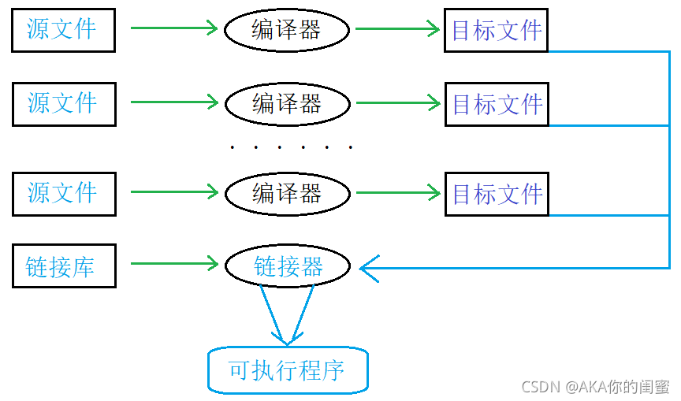
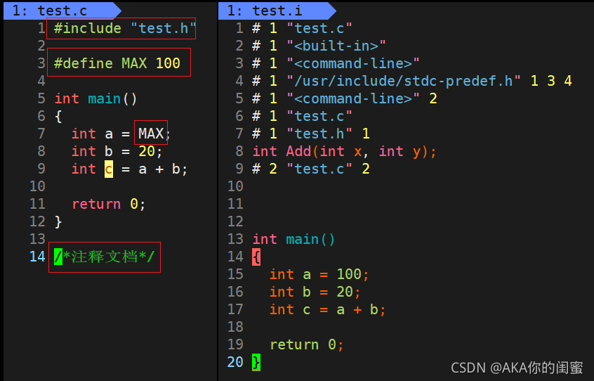
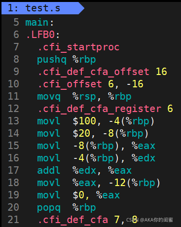
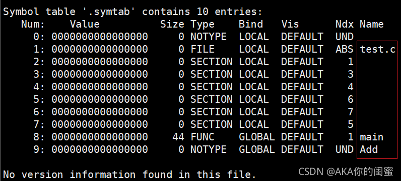
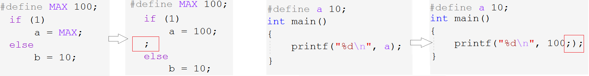
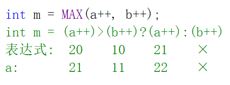
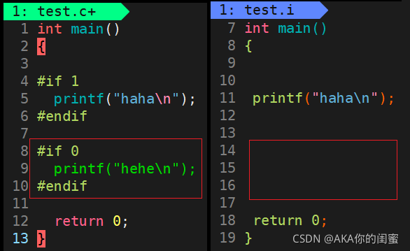

## 程序预处理

> 本章节研究的是，源代码文件`test.c`是如何一步步得到一个可执行程序`test.exe`的。在之前的学习中可知`.c`文件要先后经过编译链接成`.exe`文件再执行。

程序的编译链接运行如下图所示。翻译中编译又包括预编译、编译、汇编。

编译链接执行三个步骤，都需要为其配置不同的环境。编译和链接在翻译环境中，而执行在运行环境中发生。

> - 翻译环境：在该环境中源代码被转换成可执行的机器指令。
> - 执行环境：用于实际执行代码。

### 程序的翻译环境

> 翻译阶段的大致流程如下图所示。

组成一个程序的每个`.c`源文件都会被编译器编译，分别生成对应的`.obj`目标文件。多个目标文件以及引入的链接库被链接器链接在一起，形成一个单一的`.exe`可执行程序。

> 编译器即是一个用于编译代码的工具，在vs环境下为`cl.exe`的可执行程序。连接器则是用于链接所有目标文件的工具，在vs中为`link.exe`的可执行程序，链接库是标准中任何被该程序用到的函数。如图：

> 而若想观察翻译代码过程中的每一个流程的具体细节，在集成开发环境`vs`中不便展示，当然我们可以使用`Linux`环境下的`gcc`编译器。

此次演示就采用加法函数，分别存放在两个文件`test.c`和`add.c`。

~~~c
//1. add.c
int Add(int x, int y)
{
	int sum = x + y;
	return sum;
}

//2. test.c
#include <stdio.h>
//声明函数
extern int Add(int x, int y);
int main()
{
	int a = 10;
	int b = 20;
	int ret = 0;
	ret = Add(a, b);
	printf("ret = %d\n", ret);
	return 0;
}
~~~

##### 预编译

> Linux环境下编写完`test.c`文件的代码后，输入`gcc test.c -E `可以将代码预编译的结果输出到屏幕上。还可以用`gcc test.c -E -o test.i`是将结果输出到文件`test.i`。

如`#include`,`#define`,`#pragma`的语句被称为预处理指令，还有注释文本的删除，都在此阶段完成替换。

所有可以看出预编译阶段的动作都是**文本操作**：

1. `#include`头文件的包含
2. `#define`预处理符号的替换
3. 删除注释

> 预编译，顾名思义，是在编译前删减代码中的不必要的与机器识别代码无关的内容。被称为**文本操作**。

##### 编译

> 对预编译产生的文件`test.i`再编译`gcc test.i -S`，会自动生成汇编代码`test.s`。

故编译阶段是将C语言代码转化为汇编代码，这是整体现象。实际上会发生这四个动作：

1. 词法分析，语法分析，语义分析

> 词法分析，语法分析，语义分析都是编译器识别语句的操作。重点是接下接下来的符号汇总。

2. 符号汇总

符号汇总，是只对全局符号进行汇总，局部符号是不进行汇总的。目的是能够将所有文件中的代码组合到一起成一个完整的程序。如`add.c`文件中的函数名`Add`，还有`test.c`文件中的`Add`和`main`。

##### 汇编

> `gcc test.s -C `将编译结束产生的汇编代码转化成了二进制指令（机器指令）存入二进制文件`test.o`中。

汇编阶段会形成符号表，因为机器在调用指令时需要知道其存放的位置，所谓符号表大概就是**符号和其地址的集合**。如图，可以假设：

##### 链接

> 链接将二进制指令目标文件`test.o`等，链接在一起形成可执行程序`test.out`。目标文件`test.o`是`elf`格式文件，在Linux平台下可以用`readelf`翻译并查看其内容。

链接阶段的动作是：

1. 合并段表

> 所谓的链接，就是将对应的段合并起来。

2. 符号表的合并和重定位

符号表的合并，是将各自的符号表合并到一起。如`test.o`中的`Add`的无效地址，需把`add.o`中`Add`的地址合并过去再重定位到变量的真实地址，才是有意义的。

> 从编译期间的符号汇总，到汇编时的形成符号表，再到链接时的合并和重定位符号表，都是为了最后生成可执行程序时能够找到并链接各个文件中的符号。

#### 程序的执行环境

1. 程序首先载入内存

   有的机器上有操作系统，这个动作就是由操作系统完成，没有的由手工完成。

2. 执行调用`main`函数

3. 创建函数栈帧

   程序使用一个运行时堆栈，存储函数的局部变量和返回地址。

4. 终止程序

   可以正常也可以意外终止程序。

> 程序的执行并不是本章的要点，所以就大概介绍一下。

&nbsp;

### 程序的预处理

> 上面总体介绍了程序的编译链接运行，下面详细的讲解程序预处理时所发生的事情。

#### 预定义符号

下面所列举的是一些预定义符号，之所以叫预定义，是因为只在预定义阶段有效，而预编译时就将其转换为相应的值。

~~~c
//1.
__FILE__ //代码所在文件的文件名
//2.
__LINE__ //当前代码所在的行号
//3.
__DATE__ //文件被编译的日期
//4.
__TIME__ //文件被编译的时间
//5.
__STDC__ //当前编译器支持ANSI C,则值为1,否则未定义
~~~

使用场景，如图所示：

> 当然vs对C标准并不是完全支持的，所以最后一个在vs中无法显示。

#### #define

##### #define 定义符号

~~~c
#define MAX 100
int main()
{
	int m = MAX;
	return 0;
}
~~~

`#define`定义的符号在预编译期间会完成替换。如图所示：

###### 注意

- `#define`定义标识符时，最好不要在最后加上`;`

> 若加上`;`，那么`;`也就是标识符内容的一部分。这样会在实际代码中多出一个分号，空语句。

- 当定义类型时，`#define`和`typedef`的区别

`#define`和`typedef`一个是定义标识符，一个是定义类型，二者本身并无任何联系。

~~~c
#define INT int
typedef int int_t;
~~~

当#define定义类型时，除了语法形式不同外，

#define定义的`INT`是个标识符，在预处理阶段就被替换成`int`。typedef定义的`int_t`本身编译器认定为类型，编译到运行都不会变。

##### #define 定义的宏

`#define`定义宏和标识符常量的区别是宏有参数。将参数替换到文本中，这种实现被称为宏。

~~~c
//声明形式
#define Name(para1,...) stuff
~~~

> 参数列表需紧靠左边宏名，不然会被解析为宏体的一部分。

宏形式类型于数学中的函数 $f(x)=x^2$ ，都是将参数带入计算结果。如图：

###### 错误形式

~~~c
//1.
#define SQUARE(x) x*x
int main()
{
	int ret = SQUARE(5 + 1);
	printf("%d\n", ret);

    return 0;
}
~~~

上述代码，计算的结果并非36，而是11。因为在替换的过程中`SQUARE(5+1)`替换成立`5+1*5+1`，遂得11。

为避免参数为表达式时由运算符优先级差异而产生歧义，需要对宏体中的单项`x`加`(x)`。

~~~c
//2.
#define DOUBLE(x) (x)+(x)
int main()
{
	int ret = 2 * DOUBLE(5);
	printf("%d\n", ret);

	return 0;
}
~~~

上述代码计算结果也不是我们想要的`2*(5+5)=20`，而是`2*5+5=15`。这次是宏名外的运算符产生的歧义，故得出宏体整体还需加`()`。

所以正确的写法为

~~~c
#define DOUBLE(x) ((x)+(x))
~~~

正确形式是：宏体中的单项参数和整个宏体都需要加上`()`。

##### #define  的替换规则

1. 宏调用时，首先检查并替换参数和宏体中用#define定义的符号。

2. 然后再将宏和参数的值替换过去。

3. 扫描结果文本，若仍包含#define定义内容，就重复上述处理。

###### 注意

- 宏参数和宏体中允许出现其他#define定义的宏或标识符。但宏不允许递归。
- 预处理器搜索#define定义符号时，字符串常量中的内容不被搜索。

##### 宏操作符 `#`和`##`

`#`可以将参数插入字符串中。

~~~c
int a = 10;
printf("The value of a is %d\n", a);
int b = 10;
printf("The value of b is %d\n", b);
int c = 10;
printf("The value of c is %d\n", c);
~~~

如这样的代码，我们如何将自动将字符串中的a,b,c替换而不用每次都修改字符串呢？

首先，C语言中两个字符串放在一起会自动视为一个字符串，如：

~~~c
printf("Hello world\n");
printf("Hello ""world\n");
~~~

当然**`#`的作用是将`#`后面的参数转化成对应的字符串**，如果前后都是字符串，那么自动拼接为一个字符串。

这样上述需求我们就找到了解决方法。

~~~c
#define PRINT(n) printf("The value of "#n" is %d\n",n);
int main()
{
    int a = 10;
    PRINT(a);
    int b = 20;
    PRINT(b);
}
~~~

首先传参将n替换为a，故`#a`被转化为字符串`"a"`。`PRINT(a)`会被替换成`printf("The value of ""a"" is %d\n",a)`。

**`##`将位于其两边的符号合成一个符号。**

~~~c
#define CAT(X,Y) X##Y
int main()
{
	int class102 = 100;
	printf("%d\n", CAT(class,102));//100

    printf("%d\n", CAT(1, 0));//10

	CAT(class, 102) = 200;
	printf("%d\n", CAT(class, 102));//200
	return 0;
}
~~~

可见，拼接起来的不仅可以视为符号，也可以视为数字，字符串等。个人认为既然`##`拼接行为是在预处理阶段完成的，对于正在编译的代码来说`##`合成的结果和代码敲出来的是一样的。

> 宏操作符`#`和`##`只能在宏中使用。

##### 带副作用的宏参数

宏的参数传入一些带有副作用的操作符，可能会导致一些未知的错误。

~~~c
a = 1;
//1.
b = a + 1;//b=2, a=1
//2.
b = a++;//b=2, a=2
~~~

如此，二者相比b虽然都是2，但后者a自增了1，这就是带有副作用的表达式。

~~~c
//1. 宏
#define MAX(X,Y) ((X)>(Y)?(X):(Y))
//2. 函数
int Max(int x, int y) {
    return x>y?x:y;
}
int main()
{
	int a = 20;
	int b = 10;
	int m1 = MAX(a++, b++);
    int m2 = Max(a++, b++);
	return 0;
}
~~~

> 因为都是后置`++`，所以`a++`,`b++`的值还是20和10，当然判断之后`a`,`b`的值分别+1，整个表达式的值就是后面的`a++`的值即21，然后a的值又+1，当然后面b++的表达式不执行。

可以看出，宏的参数是不计算，直接预编译时整体替换后在编译期间计算的。而函数传参同样因为后置++，而传的是`a++`,`b++`的值，传完之后a,b分别+1。

##### 宏和函数的对比

> 宏常被用于执行相对简单的运算，正如上面的例子。当然函数同样也能执行这样的任务，如何选择，请看下列二者优劣的分析。

宏的优势：

1. 使用函数要建立栈帧，销毁栈帧，一系列的准备工作比实际任务大得多。故宏在程序规模和执行速度方面更胜一筹。
2. 函数参数必须声明类型，且只能适用一种类型，而宏无类型检查，只要满足运算的类型都可以作参数。

宏的劣势：

1. 每次调用宏时，都会将宏的代码替换到调用处。若宏代码量大，可能会大幅增加代码长度。
2. 宏替换发生在预编译期间，故无法调试。
3. 宏的类型无关性，也会导致其不够严谨。
4. 宏可能由于运算符优先级的问题，会导致程序出错。

> 当然宏可以做到函数做不到的事情，如宏的参数可以是类型。下列宏`offsetof`计算成员的偏移量的模拟实现。

~~~c
#define offsetof(StructType, MemberName) (size_t)&(((StructType*)0)->MemberName)
~~~

| 分类         | 宏                                                       | 函数                                           |
| ------------ | -------------------------------------------------------- | ---------------------------------------------- |
| 代码长度     | 宏代码插入后，程序长度可能**大幅增加**                   | 函数代码仅存一份，每次调用同一位置             |
| 执行速度     | 简单更快                                                 | 栈帧的创建和销毁的**额外开销**                 |
| 操作符优先级 | 周围表达式中操作符优先级可能会致错，故要**加全括号**     | 参数在调用处求值一次并传递表达式的值           |
| 参数副作用   | **直接替换**后再对参数进行处理，副作用的参数可能会致错   | 参数在传参处求值后再传参处理数据               |
| 参数类型     | 宏参数与**类型无关**，在操作合法的情况下，适用于任意类型 | 函数参数受类型限制，参数类型不同需要不同的函数 |
| 调试         | 宏**无法调试**                                           | 函数可以调试                                   |
| 递归         | 宏**无法递归**                                           | 函数可以递归                                   |

> 所以对于二者的好坏我们要辩证的看待。

###### 命名规范

宏与函数的使用方式很类似，语法无法将二者区分开来。故一般规定宏名字母全部大写，而函数采用大小驼峰形式。

> 命名规范是约定俗成的东西，真正凸显实力的是写出效率高量少的代码，而不是任性违背规范。

#### #undef

`#undef`用于移除宏定义。故一般和`#define`搭配使用。

~~~c
#define MAX 100
int main()
{
	int a = MAX;
#undef MAX
    //int b = MAX;Err

    return 0;
}
~~~

这样可以使预定义符号`MAX`在不同的代码处，可以拥有不同的定义。先移除再重新定义即可。

#### 命令行定义

命令行定义是指在启动编译时对代码文本中的符号进行定义。

如上列代码所示，数组大小`SZ`未定义，我们可以在编译该源文件时添上对`SZ`的定义：`gcc test.c -D SZ=10`

根据不同的情况给变量赋不同的值。这使得对于同一段代码编译出不同结果时，更加方便。

#### 条件编译

条件编译指令使得让某段代码参与或不参与编译的操作变得相对容易，类似于注释代码，达到选择性编译的效果。

##### 常见编译指令

常见的条件编译指令如下，类似于if语句也有单分支多分支的情况：

~~~c
//1.
#if 常量表达式
#endif
//2.
#if 常量表达式
#elif 常量表达式
#else
#endif
~~~

`#if,#elif,#else`类似于if语句结构，`#endif`用于结束条件编译。

~~~c
//单分支
int main() {
#if 1
	printf("haha\n");
#endif

#if 0
	printf("hehe\n");
#endif
	return 0;
}
//多分支
int main() {
#if 1==2
	printf("hehe\n");
#elif 2==3
	printf("haha\n");
#else
	printf("...\n");

#endif
	return 0;
}
~~~

满足条件则执行，不满足条件则不执行。注意条件只能是常量表达式，因为预编译指令只在预处理阶段中起作用，而变量是在运行期间创建的。

还有更特殊化的条件编译指令，单独用于判断符号是否被定义，如`#if defined`,`#if !defined`等。

~~~c
//3.1
#if defined (symbol)
#endif
//3.2
#ifdef symbol
#endif
//4.1
#if !defined(symbol)
#endif
//4.2
#ifndef symbol
#endif
~~~

语法规定每一个条件编译指令`#if...`都要搭配上`#endif`使用。

~~~c
#define MAX 100
int main() {
//1.定义
#if defined (MAX)
	printf("haha\n");
#endif

#ifdef MAX
	printf("hehe\n");
#endif

//2.未定义
#if !defined (MAX)
	printf("dada\n");
#endif

#ifndef MAX
	printf("titi\n");
#endif
	return 0;
}
~~~

- `#if define..`代表当其后条件满足时，执行下面语句，`#ifdef..`是其简写形式。
- `#if !define..`代表当其后条件不满足时，执行下面语句，`#ifndef..`是其简写形式。

##### 嵌套指令

~~~c
#define SBL 100
#define OPTION 100
int main() {
#if defined (SBL1)
    #ifdef OPTION1
		option1();
	#endif
	#ifdef OPTION2
		option2();
	#endif
#elif defined (SBL2)
    #ifdef OPTION3
		option3();
	#endif
	#ifdef OPTION4
		option4();
	#endif
#endif
	return 0;
}
~~~

同样条件编译指令也是预处理指令，预处理后自然将不满足条件的内容删去。

#### 文件包含

`#include..`也是预处理指令，用于包含代码所需头文件。一般有两种形式：

1. `#include <filename>`

2. `#include "filename"`

二者查找策略不同，`<>`首先在安装目录的链接库目录下查找，找不到则报错。`""`首先在工程目录下查找，如果找不到则去安装目录下查找。

> 库文件也可以用`""`的方式包含，但这样会降低效率，也不易区分。

头文件一多容易出现重复包含，解决方案有两种：

~~~c
//1. 条件编译指令
#ifndef __TEST.H__
#define __TEST.H__
#endif
//2. 预处理指令
#pragma once
~~~
