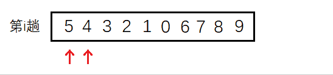
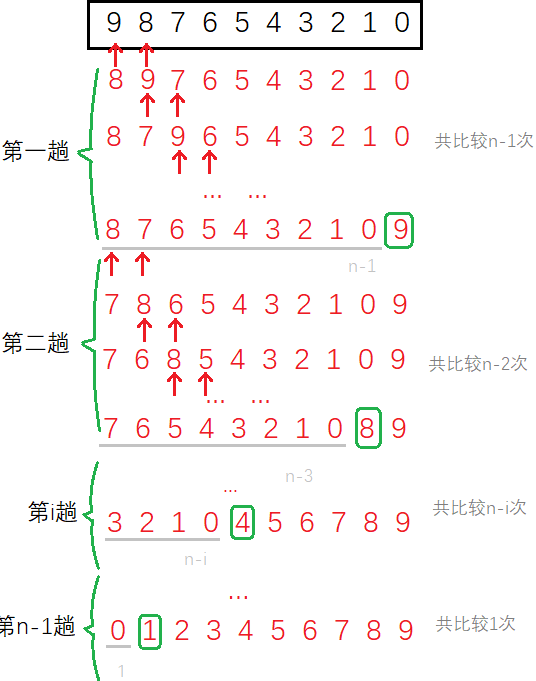
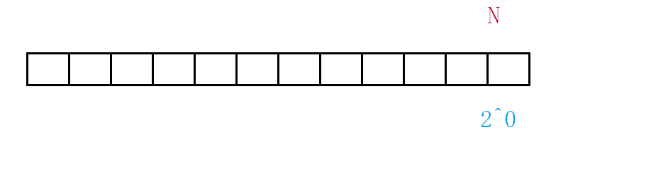
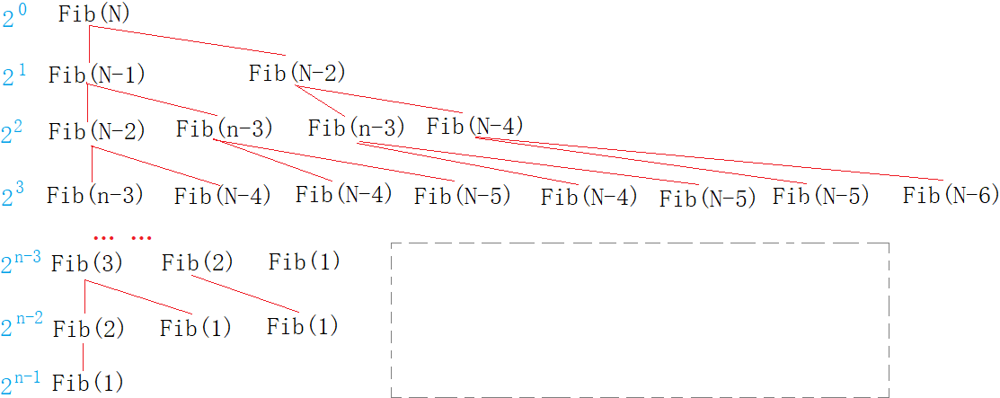
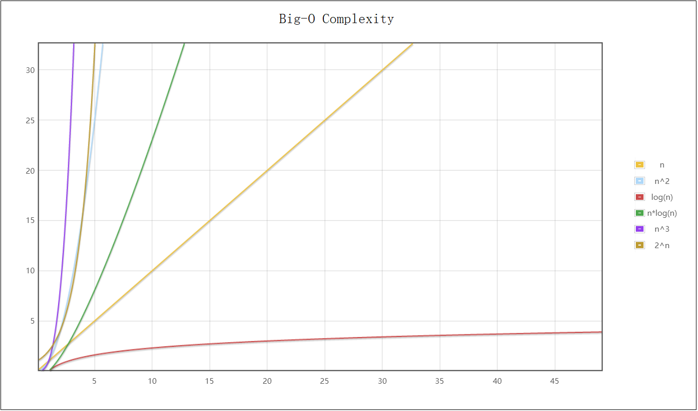

# 算法复杂度

## 1. 复杂度概念

程序的运行时需要耗费一定的时间资源和空间(内存)资源 。因此衡量一个算法的好坏，一般是从时间和空间两个维度来衡量的，即时间复杂度和空间复杂度。

1. 时间复杂度主要衡量一个算法的运行快慢；
2. 空间复杂度主要衡量一个算法运行所需要的额外空间。

> 在计算机发展的早期，计算机的存储容量很小，所以对空间复杂度很是在乎。现如今计算机的存储容量已经达到了很高的程度，已不需要特别关注空间复杂度。

### 1.1 时间复杂度

#### 时间复杂度定义

> 从理论上说，算法执行所耗费的具体时间是不能算出来的，而即使真实测算出程序的运行时间，也因如机器的性能等种种原因无法描述算法的优劣。而且机器测算过于繁琐，所以才有了时间复杂度这个分析方式。

算法的时间复杂度是一个函数，它定量描述了该算法的运行时间。

**时间复杂度不计算具体时间而是算法中的基本操作的执行次数**。找到某条基本语句与问题规模 $N$ 之间的数学表达式，就是算出了该算法的时间复杂度。

如下列代码：计算代码中`++count`语句的执行次数。

~~~c
void Func(int N) {
	int count = 0;
	for (int i = 0; i < N; ++i) {
		for (int j = 0; j < N; ++j) {
			++count;
		}
	}
	for (int k = 0; k < 2 * N; ++k) {
		++count;
    }
	int M = 10;
	while (M--) {
		++count;
        printf("hehe\n");
	}
}
~~~

从数学角度看，算法的时间复杂度其实就是一个关于`N`的数学函数，如本题就是 $F(N)=N^2+2N+10$。

### 1.2 大O渐进表示法

> 当N=10时F(N)=130，当N=100时F(N)=10210，当N=1000时F(N)=1002010。

当代码的执行次数大到一定程度时，等式后面小项的影响就变得很小，保留最大项也就基本确定了结果。

为了更方便的计算和描述算法的复杂度，故提出了大O渐进表示法。

#### 大O阶的推导规则

> 大O符号：用于描述函数渐进行为的数学符号。

1. **执行次数与N无关且为常数次时，用常数1表示**。
2. **只保留函数中最高阶项并舍去其系数**。
3. 若算法存在最好最坏情况，则关注最坏情况。

> 由此可得上述算法时间复杂度的大O阶为 $O(N^2)$。

#### 示例

##### Example 1

~~~c
void Func1(int N, int M)
{
	int count = 0;
	for (int k = 0; k < M; ++k)
		++count;

	for (int k = 0; k < N; ++k)
		++count;

	printf("%d\n", count);
}
~~~

本题的时间复杂度是 $O(N+M)$。

若标明 $N>>M$ 则复杂度是 $O(N)$，反之则是 $O(M)$。若标明二者相近则是 $O(N)$或$O(M)$。若 $M$ , $N$ 都是已知常数，则复杂度是 $O(1)$。

> 一般通常用 $N$ 表示未知数，但 $M$ , $K$ 等等也行。

##### Example 2

~~~c
void Func2(int N) {
	int count = 0;
	for (int k = 0; k < 100; ++ k)
		++count;

	printf("%d\n", count);
}
~~~

本题的运行次数是常数次，不管该常数多大，时间复杂度都是 $O(1)$ 。

##### Example 3

~~~c
void BubbleSort(int* a, int n) {
	assert(a);
	for (size_t end = n; end > 0; --end)
    {
		int exchange = 0;
		for (size_t i = 1; i < end; ++i)
        {
			if (a[i - 1] > a[i])
            {
				Swap(&a[i - 1], &a[i]);
				exchange = 1;
			}
		}
		if (exchange == 0)
			break;
	}
}
~~~

有的算法会有最好情况，最坏情况。对于复杂度的计算我们通常采用最坏的情况作悲观预期。很少有算法会看平均情况。

冒泡排序就是其中之一，我们对其最差的情况分析。相邻两数相比，第一趟交换 $N-1$ 次，第二趟交换 $N-2$ 次，……，第 $i$ 趟交换 $N-i$ 次。故精确的算法次数应为 $F(N)=N-1+N-2+...+N-i+...+1+0=N×(N-1)/2$ 。故复杂度为 $O(N^2)$ 。

> 也可以看比较的次数，由于每趟最后一次只比较不交换，所以每趟比较的次数都比交换的次数多一次。但是并不影响其的复杂度。

##### Example 4

~~~c
int BinarySearch(int* a, int n, int x)
{
	int begin = 0;
	int end = n - 1;
	while (begin < end)
    {
		int mid = begin + ((end - begin) >> 1);
		if (a[mid] < x)
			begin = mid + 1;
		else if (a[mid] > x)
			end = mid;
		else
			return mid;
	}
	return -1;
}
~~~

> 计算算法的复杂度不可仅看循环的层数，还要看算法的思想。 二分查找同样具有最好情况和最坏情况，仍然要对其最坏情况（找不到）进行分析。

对于这样的每次折半的情况，可以形象的用“折纸法”理解，一张纸对折一次去掉一半再对折再舍弃，假设一共折了 $x$ 次，就找到了该数字。也就是 $2^x=N$，所以次数$x=log_2N$ 。

> 对数阶 $O(log_2N)$，也可以省略底数写成 $O(logN)$。二分查找这个对数阶是非常优秀的算法，$20=log_2(1000000)$，一百万个数仅需查找20次。

##### Example 5

~~~c
long Factorial(size_t N)
{
	if (0 == N)
		return 1;
	return Fac(N - 1) * N;
}
~~~

 递归算法的复杂度取决于两个因素：递归深度和每次递归调用次数。

> 递归深度即是一共递归的层数，也就是创建栈帧的次数。每次递归调用次数是递归函数内调用自身的次数。

显然本题的深度是 $O(N)$，调用次数是 $1$，故复杂度是 $O(N)$ 。

##### Example 6

~~~c
long Fibonacci(size_t N)
{
    if(N < 3)
        return 1;
    return Fib(N-1) + Fib(N-2);
}
~~~

斐波那契递归的思想是类似于二叉树的，但是后面缺少了一部分，如图所示：

如果没有缺失的话就是完整二叉树，将缺少的部分设为 $X$，精确次数就是：
$$
F(N)=2^0+2^1+2^2+...+2^{N-1}-X=2^N-1-X
$$
由于 $X$ 远小于 $2^N-1$，故算法复杂度 $O(N)=2^N$。

&nbsp;

## 2. 空间复杂度

### 2.1 空间复杂度定义

空间复杂度也是数学表达式，**用来度量算法运行时额外使用空间的大小**。

同样，空间复杂度不是无意义的实际的精确的字节数。**空间复杂度计算临时开辟变量的个数**，基本规则规则和时间复杂度类似，也采用大O渐进表示法。

#### 示例

##### Example 1

~~~c
void BubbleSort(int* a, int n) {
	assert(a);
	for (size_t end = n; end > 0; --end) {
		int exchange = 0;
		for (size_t i = 1; i < end; ++i) {
			if (a[i - 1] > a[i]) {
				Swap(&a[i - 1], &a[i]);
				exchange = 1;
			}
		}
		if (exchange == 0)
			break;
	}
}
~~~

冒泡排序算法仅创建了常数个变量，所以空间复杂度是 $O(1)$。

> 虽然变量`end`,`i`每次循环都创建一次，但其实从内存角度看，每次所占空间并不会发生变化，一般都开辟在同一块空间。

##### Example 2

~~~c
long long* Fibonacci(size_t n) {
    if (n == 0)
        return NULL;
    long long* fibArray = (long long*)malloc((n + 1) * sizeof(long long));
    fibArray[0] = 0;
    fibArray[1] = 1;
    for (int i = 2; i <= n; ++i) {
        fibArray[i] = fibArray[i - 1] + fibArray[i - 2];
    }
    return fibArray;
}
~~~

包括循环变量和该斐波那契数组，开辟量级为$N$个的变量。故空间复杂度为 $O(N)$ 。

##### Example 3

~~~c
long long Factorial(size_t N)
{
    if(N == 0)
        return 1;
    return Fac(N - 1) * N;
}
~~~

每次递归创建一个栈帧，每个栈帧中都是常数个变量，$N$次递归的空间复杂度为 $O(N)$ 。

>  递归的空间复杂度与递归深度有关。

##### Example 4

~~~c
long Fibonacci(size_t N)
{
    if(N < 3)
        return 1;
    return Fib(N-1) + Fib(N-2);
}
~~~

斐波那契每次递归同样创建常数个变量，从斐波那契栈帧创建图中可以看出，递归中会有重复的项，这些重复的栈帧创建又销毁。

空间不同于时间是可以重复利用的，所以这些重复的栈帧仅占用一次的空间。所以$Fib(N)$,$Fib(N-1)$,...,$Fib(1)$这些栈帧都分配一次的空间足矣。故时间复杂度为 $O(N)$ 。

&nbsp;

### 2.2 常见复杂度

常见的算法复杂度如下表，复杂度由上到下依次递增：

| 简称   | 大O表示    | 示例      |
| :----- | :--------- | :-------- |
| 常数阶 | $O(1)$     | $k$       |
| 对数阶 | $O(logn)$  | $klog_2n$ |
| 线性阶 | $O(n)$     | $kn$      |
| 对数阶 | $O(nlogn)$ | $klog_2n$ |
| 平方阶 | $O(n^2)$   | $kn^2$    |
| 立方阶 | $O(n^3)$   | $kn^3$    |
| 指数阶 | $O(2^n)$   | $k2^n$    |
| 阶乘阶 | $O(n!)$    | $kn!$     |

最低的是常数次$O(1)$，其次是对数阶$O(logn)$，然后是线性阶$O(n)$，再高就是平方阶$O(n^2)$，最大是指数阶$O(2^n)$ 。

> 前三个算是优秀算法，而平方阶是复杂的算法，指数阶阶乘阶的算法万万不可取。

&nbsp;

## 3. 复杂度OJ题

### 3.1 消失的数字

#### 思路 1

先排序数组，检查排序结果相邻元素的差值。若差值不为1二者之间的缺值就是消失的数字。

> 时间复杂度为 $O(nlog_2n)$，空间复杂度 $O(1)$

~~~c
int cmp_int(const void* e1, const void* e2) {
    return *(int*)e1 - *(int*)e2;
}
int missingNumber(int* nums, int numsSize) {
    int flag = 1;
    //qsort
    qsort(nums, numsSize, sizeof(nums[0]), cmp_int);
    //元素个数为1
    if (numsSize == 1) {
        return numsSize - nums[0];
    }
    for (int i = 0; i < numsSize - 1; i++) {
        if (nums[i +1] - nums[i] != 1) {
            flag = 0;
            return nums[i] + 1;
        }
    }
    //缺失的数字为最大值或0
    if (flag == 1) {
        if (nums[0] == 0) {
            return numsSize;
        }
        else {
            return 0;
        }
    }
    return 0;
}
~~~

#### 思路 2

将数组中的元素写到另一个数组的对应下标位置上，没有值的位置下标即为消失的数字。

> 时间复杂度为 $O(n)$，空间复杂度 $O(n)$

~~~c
int missingNumber(int* nums, int numsSize) {
    int tmp[200000] = { 0 };
    memset(tmp, -1, 200000 * sizeof(int));
    //移入元素
    for (int i = 0; i < numsSize; i++) {
        tmp[nums[i]] = nums[i];
    }
    //寻找位置
    for (int i = 0; i <= numsSize; i++) {
        if(tmp[i] == -1) {
            return i;
        }
    }
    return 0;
}
~~~

#### 思路 3

将0到n的元素之和减去数组元素之和，得到的结果即为消失的数字。

> 时间复杂度为 $O(n)$，空间复杂度 $O(1)$

~~~c
int missingNumber(int* nums, int numsSize) {
    int sumOfNum = 0;
    int sumOfNums = 0;
    for (int i = 0; i <= numsSize; i++) {
        sumOfNum += i;
    }
    for (int i = 0; i < numsSize; i++) {
        sumOfNums += nums[i];
    }
    return sumOfNum - sumOfNums;
}
~~~

#### 思路 4

将$x$与 $[0,n]$ 的数字遍历异或，在与数组元素遍历异或，最后结果即为消失的数字。

> 时间复杂度为 $O(n)$，空间复杂度 $O(1)$

~~~c
int missingNumber(int* nums, int numsSize) {
    int xor = 0;
    //和[0,n]异或
    for (int i = 0; i <= numsSize; i++) {
        xor ^= i;
    }
    //和数组异或
    for (int i = 0; i < numsSize; i++) {
        xor ^= nums[i];
    }
    return xor;
}
~~~

### 3.2 旋转数组

#### 思路 1

数组尾删一次在头插原数组的尾元素，循环 $k$ 次。

> 时间复杂度为 $O(k×n)$，空间复杂度 $O(1)$

~~~c
void rotate(int* nums, int numsSize, int k) {
    while (k--) {
        int tmp = nums[numsSize - 1];
        int end = numsSize - 1;
        while (end > 0) {
            nums[end] = nums[end - 1] ;
            end--;
        }
        nums[end] = tmp;
    }
}
~~~

#### 思路 2

开辟同等大小的数组，后 $n-k$ 个元素先转移过去，在转移前 $k$ 个元素，在返回数组。

> 时间复杂度为 $O(n)$，空间复杂度 $O(n)$

~~~c
void rotate(int* nums, int numsSize, int k) {
    int tmp[200] = { 0 };
    //后k个
    for (int i = 0; i < k; i++) {
        tmp[i] = nums[numsSize - k + i];
    }
    //前k个
    for (int i = 0; i < numsSize - k; i++) {
        tmp[i + k] = nums[i];
    }
    //转移
    for (int i = 0; i < numsSize; i++) {
        nums[i] = tmp[i];
    }
}

~~~

#### 思路 3

前 $n-k$ 个元素逆置，后 $k$ 个元素逆置，再整体逆置。

> 时间复杂度为 $O(n)$，空间复杂度 $O(1)$

~~~c
void reserve(int* nums, int left, int right) {
    while (left < right) {
        int tmp = nums[left];
        nums[left] = nums[right];
        nums[right] = tmp;
        left++;
        right--;
    }
}
void rotate(int* nums, int numsSize, int k) {
    //1. 前n-k个逆置
    reserve(nums, 0, numsSize -k - 1);
    //2. 后k个逆置
    reserve(nums,numsSize - k, numsSize - 1);
    //3. 再整体逆置
    reserve(nums, 0, numsSize - 1);
}
~~~
