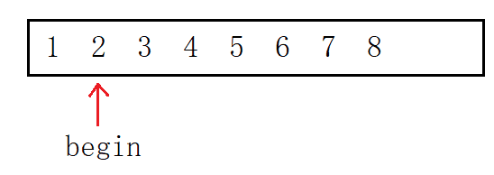
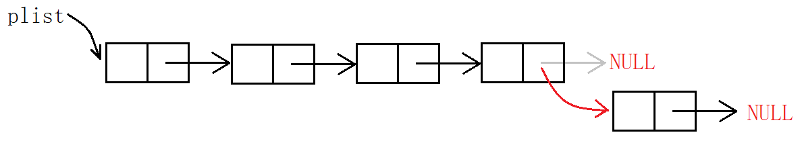
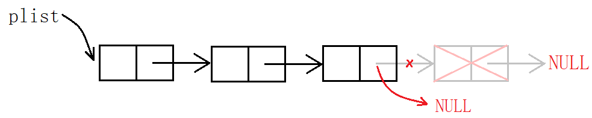
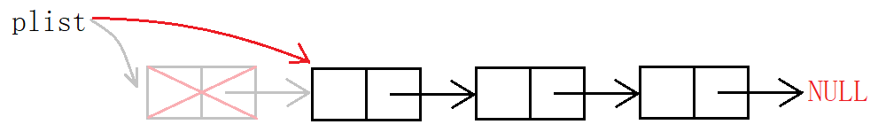
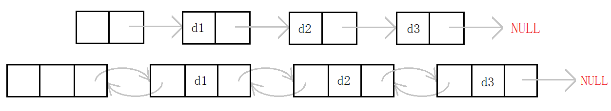
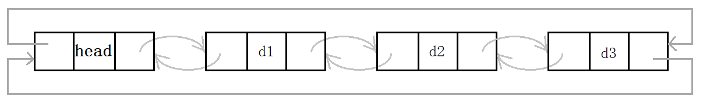
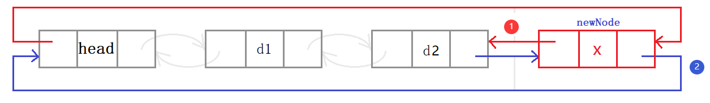
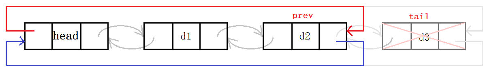
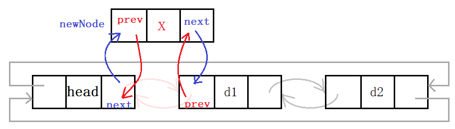
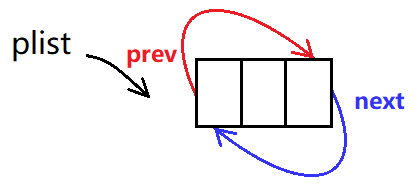

# 线性表

> 线性表是n个具有相同特性的元素的序列。常见的线性表有顺序表、链表、栈、队列、字符串。

## 1. 顺序表

### 1.1 顺序表的定义

顺序表是用一段**连续的存储单元依次存储数据的线性结构**，底层结构一般采用数组。

顺序表必须从头向后依次存储，在数组上进行数据的增删查改。一般分为动态顺序表和静态顺序表。

#### 顺序表结构体

~~~c
typedef int T;
typedef struct _seqlist
{
	T* _a;
	size_t _size;
	size_t _cap;
}seqlist;
~~~

- 静态顺序表定义简单，容量固定，`size`用于记录有效元素个数。
- 动态顺序表使用动态开辟数组，`capacity`用于记录数组容量。

### 1.2 顺序表的接口

| 名称         | 接口                                            |
| ------------ | ----------------------------------------------- |
| 初始化       | `void seqlist_init(seqlist* l)`                 |
| 销毁         | `void seqlist_destroy(seqlist* l)`              |
| 尾插         | `void seqlist_push_back(seqlist* l, int n)`     |
| 尾删         | `void seqlist_pop_back(seqlist* l)`             |
| 任意位置插入 | `void seqlist_insert(seqlist* l, int i, int n)` |
| 任意位置删除 | `void seqlist_erase(seqlist* l, int i) `        |

#### 尾插尾删

尾插有三种情况：顺序表没有空间、空间已满需扩容、空间未满直接插入。

尾删要考虑到有效元素个数为0的情况。

~~~c
void seqlist_push_back(seqlist* l, int n)
{
	assert(l);
	if (l->_size == l->_cap || l->_cap == 0)
	{
		int nc = l->_cap ? l->_cap * 2 : 4;
		int* p = realloc(l->_a, nc * sizeof(int));

		if (p != NULL)
		{
			l->_a = p;
			l->_cap = nc;
		}
	}
	l->_a[l->_size++] = n;
}

void seqlist_pop_back(seqlist* l)
{
	assert(l && l->_size > 0);
	l->_size--;
}
~~~

动态开辟内存是有内存消耗的，异地拷贝也会增加时间消耗，所以尽量每次开辟大一点以减少开辟次数。

> realloc存在“原地扩”和“异地扩”，如果后面有足够大的空间就原地扩，反之则重新开辟空间将拷贝原空间内容并释放原空间，称为异地扩。

#### 任意位置插入删除

~~~c
void seqlist_insert(seqlist* l, int i, int n)
{
	assert(l && l->_size >= i && i >= 0);

	if (l->_size == l->_cap || l->_cap == 0)
	{
		int nc = l->_cap ? l->_cap * 2 : 4;
		int* p = malloc(nc * sizeof(int));
		if (p != NULL)
		{
			memcpy(p, l->_a, l->_size * sizeof(int));
			free(l->_a);
			l->_a = p;
		}
		l->_cap = nc;
	}

	for (size_t j = l->_size; j > i; j--)
	{
		l->_a[j] = l->_a[j - 1];
	}

	l->_a[i] = n;
	l->_size++;
}

void seqlist_erase(seqlist* l, int i)
{
	assert(l && l->_a && 0 <= i && i < l->_size);

	for (size_t j = i; j < l->_size - 1; j++)
	{
		l->_a[j] = l->_a[j + 1];
	}

	l->_size--;
}
~~~

<center>

</center>

头插首先将整体也就是下标从`0`到`size-1`的元素后移一个位置。为防止内容覆盖，则必须从后向前移，方法是定义“尾指针”，每次减一从后向前遍历，最后增加一个元素即可。

<center>

</center>

头删则是将下标为`1`到`size-1`的元素前移一个位置，定义“头指针”指向第二个元素从前向后遍历，正好将第一个元素覆盖。

#### 其他接口

~~~c
void seqlist_init(seqlist* l)
{
	assert(l);
	l->_a = NULL;
	l->_size = l->_cap = 0;
}
void seqlist_destroy(seqlist* l)
{
	assert(l);
	free(l->_a);
	l->_a = NULL;
	l->_size = l->_cap = 0;
}
~~~

结构体成员数组使用的是动态开辟的空间所以记得初始化和销毁内存。

### 1.3 数组面试题

#### Example 1 [移除元素](https://leetcode-cn.com/problems/remove-element/)

移除数组 `nums`中所有数值等于 `val` 的元素，并返回移除后数组的新长度。

##### 思路 1

> 时间复杂度为 $O(N^2)$，空间复杂度为 $O(1)$

~~~c
int removeElement(int* nums, int numsSize, int val) {
    int number = numsSize;
    int* pnums = nums;
    while (pnums < nums + number) {
        if (*pnums == val) {
            int begin = pnums - nums;
            //begin是该元素的下标，numsSize-begin是该元素之后的元素个数
            while (begin < numsSize - 1) {
                nums[begin] = nums[begin + 1];
                begin++;
            }
            number--;
        }
        else {
            pnums++;
        }
    }
    return number;
}
~~~

##### 思路 2

> 时间复杂度为 $O(N)$，空间复杂度为 $O(N)$

~~~c
int removeElement(int* nums, int numsSize, int val) {
    int tmp[200] = { 0 };
    int j = 0;
    //转移不是val的元素
    for (int i = 0; i < numsSize; i++) {
        if(nums[i] != val) {
            tmp[j] = nums[i];
            j++;
        }
    }
    //赋值给nums
    for(int i = 0; i < j; i++) {
        nums[i] = tmp[i];
    }
    return j;
}
~~~

##### 思路 3

快慢指针，通过指针分别指向。可以用指针也可以用下标的方式。

> 时间复杂度为 $O(N)$，空间复杂度为 $O(1)$

~~~c
int removeElement(int* nums, int numsSize, int val) {
    int* src = nums;
    int* dst = nums;
    //1. 指针版
    while (src - nums < numsSize) {
        if (*src != val) {
            *dst = *src;
            dst++;
        }
        src++;
        //是与不是，src都要++；只有赋值后dst才++
    }
    return dst - nums;
    //2. 下标版
    int src = 0, dst = 0;
    while(src < numsSize) {
        if(nums[src] != val) {
            nums[dst] = nums[src];
            dst++;
        }
        src++;
    }
    return dst;
}
~~~

#### Example 2 [数组去重](https://leetcode-cn.com/problems/remove-duplicates-from-sorted-array/)

删除有序数组 `nums` 中重复出现的元素，使每个元素只出现一次，返回删除后数组的新长度。

找到一段相同数字的区间，只留一个。

~~~c
int removeDuplicates(int* nums, int numsSize) {
    int begin = 0, end = 1;
    int dst = 1;
    if(numsSize == 0) {
        return 0;
    }
    while (end < numsSize) {
        if(nums[begin] == nums[end]) {
            end++;
        }
        else {
            begin = end;
            nums[dst] = nums[begin];
            end++;
            dst++;
        }
    }
    return dst;
}
~~~

#### Example 3 [合并数组](https://leetcode-cn.com/problems/merge-sorted-array/)

两个按非递减顺序排列的整数数组`nums1`和`nums2`，合并`nums2`到`nums1`中，使合并后的数组同样按非递减顺序排列。

##### 思路 1

开辟新数组，将两数组的元素相比取其小值放入新数组中。

> 时间复杂度为 $O(M+N)$，空间复杂度为 $O(M+N)$

~~~c
void merge(int* nums1, int nums1Size, int m, int* nums2, int nums2Size, int n) {
    int i = 0, j = 0, dst = 0;
    int nums3[200] = { 0 };
    while (i < m && j < n) {
        if (nums1[i] <= nums2[j]) {
            nums3[dst] = nums1[i];
            dst++, i++;
        }
        else {
            nums3[dst] = nums2[j];
            dst++, j++;
        }
    }
    //剩余元素
    while (i < m) {
        nums3[dst] = nums1[i];
        dst++, i++;
    }
    while (j < n) {
        nums3[dst] = nums2[j];
        dst++, j++;
    }
    for(int i = 0; i < m + n; i++) {
        nums1[i] = nums3[i];
    }
}
~~~

##### 思路 2

无需开辟新数组，从大到小比较和移动元素。

> 时间复杂度为 $O(min\lbrace m,n \rbrace)$，空间复杂度为 $O(1)$

~~~c
void merge(int* nums1, int nums1Size, int m, int* nums2, int nums2Size, int n) {
    int i = m - 1, j = n - 1;
    int dst = m + n - 1;
    while (i >= 0 && j >= 0) {
        if (nums2[j] >= nums1[i]) {
            nums1[dst] = nums2[j];
            dst--, j--;
        }
        else {
            nums1[dst] = nums1[i];
            dst--, i--;
        }
    }
    while (j >= 0) {
        nums1[dst] = nums2[j];
        dst--, j--;
    }
}
~~~

比较`i`和`j`下标的元素，将其大者放入`dst`下标的位置。若`i`先走到0，则将`j`剩余的元素拷贝到`dst`。`j`走到0，标志程序运行结束。

<center>

</center>

### 1.4 顺序表的缺陷

- 缺点：
  - 动态扩容时，易产生内存碎片，存在一定程度上的空间浪费。
  - 头部和任意位置的插入删除，需要挪动数据。

- 优点：支持随机访问。

> 增删需要挪动数据，这是线性表最大的缺陷。
>
> 频繁扩容时间消耗大，倍数扩容有空间浪费。
>
> 支持随机访问是线性表的重要的特点，很多算法中要求结构支持随机访问，如二分查找和快排。

&nbsp;

## 2. 单链表

> 顺序表的增删要挪动数据，为解决该问题，就出现了一种新的存储形式：链表。
>

### 2.1 单链表的定义

单链表是一种物理上的非连续、非顺序的存储结构。数据元素的逻辑顺序通过链表中的指针链接次序实现。

- 逻辑结构：表现数据之间的关系而想象出的逻辑图，便于理解。

<center>

</center>

- 存储结构：体现了数据在内存中的存储形式，描述的是内存中物理结构。

<center>

</center>

> 单链表是最简单的链表结构，其他包括双头链表、带头不带头链表、循环链表等。

#### 单链表结构体

~~~c
typedef struct _singlenode
{
	int _data;
	struct _singlenode* _next;
} slnode;
~~~

链表结点包含数据域和指针域，数据域用于存储数据，指针域指向下一个结点。通过`next`指针就可以将所有的结点从头串到尾。

```c
SLTNode* BuySLTNode(SLTDataType x)
{
    SLTNode* new_node = (SLTNode*)malloc(sizeof(SLTNode));
    if (new_node == nullptr)
        exit(1);
    new_node->data = x;
    new_node->next = nullptr;

    return new_node;
}

SLTNode* n1 = BuySLTNode(1);
SLTNode* n2 = BuySLTNode(2);
SLTNode* n3 = BuySLTNode(3);
SLTNode* n4 = BuySLTNode(4);
```

> `n1`、`n2`、`n3`、`n4`和动态开辟出来的资源有何关系？

动态开辟出来的资源都放在内存上，`malloc`会返回对应的内存地址也就是指针，我们用一个指针变量接收该返回值。

也就是说，`n1`等变量内部存储的值是资源的存储地址。

### 2.2 单链表的接口

| 名称         | 接口                                              |
| ------------ | ------------------------------------------------- |
| 尾插         | `void slist_push_back(slnode** l, int n)`         |
| 尾删         | `void slist_pop_back(slnode** l)`                 |
| 头插         | `void slist_push_front(slnode** l, int n)`        |
| 头删         | `void slist_pop_front(slnode** l)`                |
| 任意位置前插 | `void slist_insert(slnode** l, slnode* p, int n)` |
| 任意位置后插 | `void slist_insert_after(slnode* l, int n)`       |
| 任意位置删除 | `void slist_erase(slnode** l, slnode* p)`         |
| 任意位置后删 | `void slist_erase_after(slnode** l)`              |

#### 尾插头插

操作单链表只能从头结点开始遍历。插入结点后须将前后链接起来。

<center>

</center>

> 考虑到结点个数为0的情况，插入会修改实参头节点`plist`，故需要传二级指针`&plist`。

尾插要将新结点的地址存入尾结点的指针域。

~~~c
void slist_push_back(slnode** l, int n)
{
	assert(l && *l);
	if (!(*l)->_next)
	{
		*l = newnode(n);
	}
	else
	{
		slnode* tail = *l;
		while (tail->_next != NULL)
		{
			tail = tail->_next;
		}

		tail->_next = newnode(n);
	}
}
~~~

<center>

</center>

头插则将新结点的地址存入头指针，再将第二个结点`phead->next`存入新结点的指针域。

~~~c
void slist_push_front(slnode** l, int n)
{
	assert(l);
	slnode* nnode = newnode(n);
	nnode->_next = *l;
	*l = nnode;
}
~~~

<center>

</center>

> 头插必然要修改指针`plist`的值，故必然要传头指针的地址。

#### 尾删头删

尾删，先释放尾结点，然后置空上一个结点的指针域。

~~~c
void slist_pop_back(slnode** l)
{
	assert(l && *l);

	if (!(*l)->_next)
	{
		free(*l);
		*l = NULL;
	}
	else
	{
		slnode* prev = NULL;
		slnode* tail = *l;

		while (tail->_next)
		{
			prev = tail;
			tail = tail->_next;
		}

		prev->_next = NULL;
		free(tail);
	}
}
~~~

<center>

</center>

头删，先释放头结点，再将头指针指向第二个结点。

~~~c
void slist_pop_front(slnode** l)
{
	assert(l && *l);
	slnode* next = (*l)->_next;
	free(*l);
	*l = next;
}
~~~

> 由于链表必须从头访问，若先销毁头结点则无法向后遍历，故需要临时变量暂存第二个结点的地址。

<center>

</center>

#### 随机插入

~~~c
void slist_insert(slnode** l, slnode* p, int n)
{
	assert(l && *l, && p);

	slnode* cur = *l;
	while (cur->_next != p)
	{
		cur = cur->_next;
	}

	slnode* nnode = newnode(n);

	if (*l == p)
	{
		*l = nnode;
		nnode->_next = p;
	}
	else
	{
		cur->_next = nnode;
		nnode->_next = p;
	}
}
~~~

~~~c
void slist_insert_after(slnode* l, int n)
{
	assert(l);
	slnode* next = l->_next;
	slnode* nnode = newnode(n);
	l->_next = nnode;
	nnode->_next = next;
}
~~~

可以看出后插复杂度为$O(1)$，前插复杂度为$O(N)$ 。单链表的结构致使其被当作复杂结构的子结构更方便。

#### 随机删除

~~~c
void slist_erase(slnode** l, slnode* p)
{
	assert(l && *l && p);

	slnode* cur = *l;
	while (cur->_next != p)
	{
		cur = cur->_next;
	}

	if (*l == p)
	{
		*l = p->_next;
	}
	else
	{
		cur->_next = p->_next;
	}
}
void slist_erase_after(slnode** l)
{
	assert(l && *l);
	slnode* next = (*l)->_next;
	free(*l);
	*l = next;
}
~~~

### 2.3 链表面试题

| 题目链接                                                     | 题解链接                                                     |
| ------------------------------------------------------------ | ------------------------------------------------------------ |
| [移除结点](https://leetcode-cn.com/problems/remove-linked-list-elements/) | [【简单易懂 注意点明确 注释丰富】C++ 203. 移除链表元素](https://leetcode.cn/problems/remove-linked-list-elements/solutions/2707719/jian-dan-yi-dong-zhu-yi-dian-ming-que-zh-48p5/) |
| [反转链表](https://leetcode-cn.com/problems/reverse-linked-list/) | [【简单易懂 注意点明确 注释动图】206. 反转链表](https://leetcode.cn/problems/reverse-linked-list/solutions/2707751/jian-dan-yi-dong-zhu-yi-dian-ming-que-zh-xo7y/) |
| [中间结点](https://leetcode-cn.com/problems/middle-of-the-linked-list/) | [【简单易懂 快慢指针 图解】C++ 876. 链表的中间结点](https://leetcode.cn/problems/middle-of-the-linked-list/solutions/2707783/jian-dan-yi-dong-kuai-man-zhi-zhen-tu-ji-7jn6/) |
| [输出结点](https://leetcode.cn/problems/kth-node-from-end-of-list-lcci/description/) | [【简单易懂 前后指针 图解】C++ 面试题 02.02. 返回倒数第 k 个节点](https://leetcode.cn/problems/kth-node-from-end-of-list-lcci/solutions/2707816/jian-dan-yi-dong-qian-hou-zhi-zhen-tu-ji-qotg/) |
| [合并链表](https://leetcode.cn/problems/merge-two-sorted-lists/description/) | [【简单易懂 前后指针 图解】C++ 21. 合并两个有序链表](https://leetcode.cn/problems/merge-two-sorted-lists/solutions/2707885/jian-dan-yi-dong-qian-hou-zhi-zhen-tu-ji-2z1y/) |
| [链表分割](https://www.nowcoder.com/practice/0e27e0b064de4eacac178676ef9c9d70) | [题解 #链表分割#](https://www.nowcoder.com/discuss/601934634988937216) |
| [回文结构](https://www.nowcoder.com/practice/d281619e4b3e4a60a2cc66ea32855bfa) | [题解 #链表的回文结构#](https://nowcoder.com/discuss/601952384503296000) |
| [相交链表](https://leetcode-cn.com/problems/intersection-of-two-linked-lists/) | [【简单易懂 前后指针 图解】C++](https://leetcode.cn/problems/intersection-of-two-linked-lists/solutions/2708062/jian-dan-yi-dong-qian-hou-zhi-zhen-tu-ji-bi47/) |
| [环形链表 I](https://leetcode-cn.com/problems/linked-list-cycle/) | [【简单逻辑 原理解释 通俗易懂】141. 环形链表 I](https://leetcode.cn/problems/linked-list-cycle/solutions/2708064/jian-dan-luo-ji-yuan-li-jie-shi-tong-su-mgosu/) |
| [环形链表 II](https://leetcode-cn.com/problems/linked-list-cycle-ii/) | [【简单逻辑 原理解释 通俗易懂】C++ 142. 环形链表 II](https://leetcode.cn/problems/linked-list-cycle-ii/solutions/2708067/jian-dan-luo-ji-yuan-li-jie-shi-tong-su-p7mgp/) |
| [复杂链表的复制](https://leetcode-cn.com/problems/copy-list-with-random-pointer/) | [【简单逻辑 原理解释 通俗易懂】C++ 138. 随机链表的复制](https://leetcode.cn/problems/copy-list-with-random-pointer/solutions/2708068/jian-dan-luo-ji-yuan-li-jie-shi-tong-su-lq69s/) |

### 2.4 链表的分类

#### 单向和双向链表

<center>

</center>

单链表存在不少缺陷，单纯使用单链表意义不大。因其存在缺陷，很多OJ题都将单链表作为考察对象。

#### 带头和不带头链表

<center>

</center>

哨兵位的头结点不存储有效数据，因为不会修改头结点，不需要以二级指针的形式传参。但使用结束后需要释放。

#### 循环和非循环链表

<center>

</center>

非循环链表即尾结点指向空。循环链表是一种特殊的带环链表，其尾结点指向头结点。

#### 两种重要形式链表

> 链表中最重要的形式有两种：无头单向非循环链表和带头双向循环链表。

- 普通链表结构最为简单。实际中单链表更多是作为复杂数据结构的子结构，如哈希桶、邻接表等。

- 带头双向循环链表，结构最为复杂。实际中的链表一般都是带头双向循环链表，结构虽复杂，但使用却较为简单。

<center>

</center>

&nbsp;

## 3. 双向链表

### 3.1 双向链表的定义

双向链表即**带头双向循环**链表，

1. 带头：带哨兵位的头结点，方便尾插和传参。
2. 双向：每个结点有两个指针域，存储前驱和后继两个结点的地址。
3. 循环：链表的尾结点不指向空，而是尾结点指向头结点，头结点指向为尾结点。

<center>

</center>

#### 双向链表结构体的定义

~~~c
typedef struct _dlink_list_node
{
	int _data;
	struct _dlink_list_node* _prev;
	struct _dlink_list_node* _next;
}dlnode;
~~~

双向链表的结构看似复杂，但由于结构优势，各种操作的实现却更为简单。

双向链表的“无死角”结构使得任意操作都具有普适性，不需要考虑特殊情况，任意结点都有前驱后继。

### 3.2 双向链表的接口实现

| 名称   | 接口                                       |
| ------ | ------------------------------------------ |
| 初始化 | `void dllist_init(dlnode** l)`             |
| 销毁   | `void dllist_destroy(dlnode** l)`          |
| 尾插   | `void dllist_push_back(dlnode* l, int n)`  |
| 尾删   | `void dllist_pop_back(dlnode* l)`          |
| 头插   | `void dllist_push_front(dlnode* l, int n)` |
| 头删   | `void dllist_pop_front(dlnode* l)`         |

#### 双向链表尾插尾删

~~~c
void dllist_push_back(dlnode* l, int n)
{
	dlnode* newn = newnode(n);
	dlnode* prev = l->_prev;
	dlnode* next = l;

	newn->_next = next;
	next->_prev = newn;
	newn->_prev = prev;
	prev->_next = newn;
}
~~~

> 1. 带头链表不需要传二级指针，因为不会修改头指针。
>
> 2. 尾插找尾也不需要循环遍历，头结点的前驱即是尾结点。
> 3. 因为带头，代码对于链表为空即仅有头指针的情况同样适用。

<center>

</center>

所以实现双向链表的增删查改时，只需要两步：

1. **找到操作结点，**
2. **修改操作结点。**

这便是双向链表的结构优势。

~~~c
void dllist_pop_back(dlnode* l)
{
	dlnode* deln = l->_prev;
	dlnode* prev = deln->_prev;
	dlnode* next = deln->_next;

	prev->_next = next;
	next->_prev = prev;
	free(deln);
}
~~~

先找到待操作的结点`deln`和其前后节点，再修改链接关系。

<center>

</center>

#### 双向链表头插头删

~~~c
void dllist_push_front(dlnode* l, int n)
{
	assert(l);

	dlnode* newn = newnode(n);
	dlnode* prev = l;
	dlnode* next = l->_next;

	newn->_next = next;
	next->_prev = newn;
	newn->_prev = prev;
	prev->_next = newn;
}
~~~

操作结点为`prev`，`next`，`newn`。分别修改前驱和后继即可。

<center>

</center>

~~~c
void dllist_pop_front(dlnode* l)
{
	dlnode* deln = l->_next;
	dlnode* prev = deln->_prev;
	dlnode* next = deln->_next;

	prev->_next = next;
	next->_prev = prev;
	free(deln);
}
~~~

<center>

</center>

> 操作多个结点时，尽量多定义变量以避免混淆逻辑，简洁明了。避免写出`node->next->next...`。

#### 任意位置插入删除

~~~c
void ListInsert(LTNode* pos, LTDataType x) {
	assert(pos);
	//posPrev newNode pos
	LTNode* posPrev = pos->prev;
	LTNode* newNode = CreateNewNode(x);
	//1. posPrev & newNode
	posPrev->next = newNode;
	newNode->prev = posPrev;
	//2. newNode & pos
	newNode->next = pos;
	pos->prev = newNode;
}
void ListErase(LTNode* pos) {
	assert(pos);
	assert(pos->next != pos);
	LTNode* prev = pos->prev;
	LTNode* next = pos->next;
	//prev & next
	prev->next = next;
	next->prev = prev;
    free(pos);
}
~~~

#### 其他接口

~~~c
LTNode* ListInit() {
	LTNode* head = (LTNode*)malloc(sizeof(LTNode));
	if (head == NULL) {
		perror("Init::malloc");
		exit(-1);
	}
	head->next = head;
	head->prev = head;

	return head;
}
void ListDestroy(LTNode* phead) {
	assert(phead);
	LTNode* cur = phead->next;
	while (cur->next != phead) {
		LTNode* next = cur->next;
		free(cur);
		cur = next;
	}
	free(phead);
}
plist = NULL;
~~~

初始化时同样注意双向循环的结构。此时也可以不传递二级指针，可以利用返回值的方式传递给外部的实参`plist`。

<center>

</center>

遍历双向链表需要注意循环的条件，从第一个有效结点`phead->next`开始，当其等于头结点时`cur==phead`结束。查找和打印都是同样的遍历的方法。

<center>

</center>

&nbsp;

## 4. 二者的区别和联系

> 链表和顺序表的对比。

顺序表即动态增长的数组，动态数组的优缺点是很明显的。

- 缺点：
  1. 动态扩容时，有时间消耗且产生内存碎片，存在一定程度上的空间浪费。
  2. 头部中部的插入删除，需要挪动数据，效率低。
- 优点：
  1. 支持随机访问。
  2. CPU高速缓冲命中率更高

> 增删操作必须要挪动数据，时间消耗不可忽略，这是线性表最大的缺陷。
>
> 倍数扩容也会带来不可避免的空间浪费。支持随机访问是线性表的重要的特点。

而链表利用指针将数据链接起来，结点之间不像数组元素一样强关联。

- 缺点：
  1. 结点之间需要通过指针链接。不支持随机访问。
  2. 链表存储数据同时还需存储前后指针，一定的消耗。
  3. CPU高速缓存命中率更低
- 优点：
  1. 按需合理申请空间，不存在空间浪费。
  2. 增删结点时无需挪动数据，效率高。

> 单链表不可以通过下标随机访问，必须从头结点开始遍历。
