# 二叉树

> 链表和数组都是线性结构，而树是非线性结构。树是依靠分支关系定义出的一种层次结构。社会亲缘和组织结构都可以用树来表示。
>

## 1. 树

### 1.1 树的定义

**树是递归定义的，任意一个树都是由一个根结点和多个子树构成**，而其中每个子树也是由一个根结点和多个子树构成。

> - 根结点：每个树有且仅有的一个根结点，根结点无前驱结点。
> - 子树：分成多个互不相交的集合，而每个集合都是一个类似的子树。

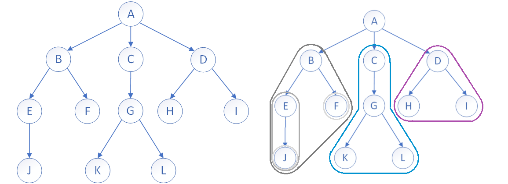

如右图所示，

1. 根结点 $A$ 下面有三个子树，这三个子树又分别以结点 $B$，$C$，$D$ 为根结点。
2. $B$ 结点之下又有两个子树，分别以 $E$，$F$ 为根结点。
3. 结点 $F$ 可以看成只有根结点的树，其子树为空。

> 任何树都可以被分成根和子树。

- 子树是不相交的。
- 每个节点有且仅有一个父节点。
- 一个N个节点的树有N-1条边。

### 1.2 树的相关概念

| 名称           | 定义                                                         |
| :------------- | :----------------------------------------------------------- |
| **叶结点**     | 没有子结点的结点，即整个树中最下方的结点，也称终端结点       |
| **分支结点**   | 含有子结点的结点，除根结点以外的内部结点，或称非终端结点     |
| **子结点**     | 一个结点的子树的根结点，即一个结点的下一个结点               |
| **父结点**     | 若该结点含有子结点，则该结点即为该子结点的父节点             |
| **兄弟结点**   | 所属于相同父节点的子结点，互为兄弟结点                       |
| **结点的层次** | 从根开始，根结点为第1层，根的子结点为第2层，以此类推         |
| **树的高度**   | 树中各个结点的层次的最大值称为树的高度，可以看成树的深度     |
| 结点的度       | 拥有的子树的个数，即子结点的个数，即为结点的度               |
| 树的度         | 树中各个节点的度的最大值称为树的度，可以看成是树的宽度       |
| 堂兄弟结点     | 父节点在同一层次的结点，即其父节点是一个同结点的子节点       |
| **祖先结点**   | 从根结点到该结点，所在分支上的所有结点，都是该结点的祖先结点 |
| 子孙结点       | 与祖先相反，以祖先结点为根的子树中的所有结点都为祖结点的子孙 |
| 森林           | 所有互不相交的树的集合称为森林，一个结点的所有子树即是一个森林 |

### 1.3 树的结构

> 定义树的结构的方式有很多种，关键在于如何表示相邻结点之间的关系。

#### 孩子表示法

孩子表示法，若已知树的度 $N$，我们这样定义。

~~~c
struct TreeNode
{
    TNDataType data;
    struct Node* subs[N]; // 存储其所有子结点的指针
};
~~~

已知树的度，故`subs[N]`足够存储，但不可避免的是一定会浪费空间。

~~~c
struct TreeNode
{
    TNDataType data;
    SeqList sl;//顺序表存储
};
typedef struct TreeNode* SLDataTypde;
~~~

针对浪费空间和树的度未知的问题，可以使用线性表替代静态数组存储子结点的指针。但缺点是结构过于复杂。

双亲表示法，结点存自身数据和父结点的下标。用结构体数组存储结点的信息，遍历数组即遍历二叉树。

~~~c
struct TreeNode
{
  	TNDataTypde data;
    int parenti;
};
~~~

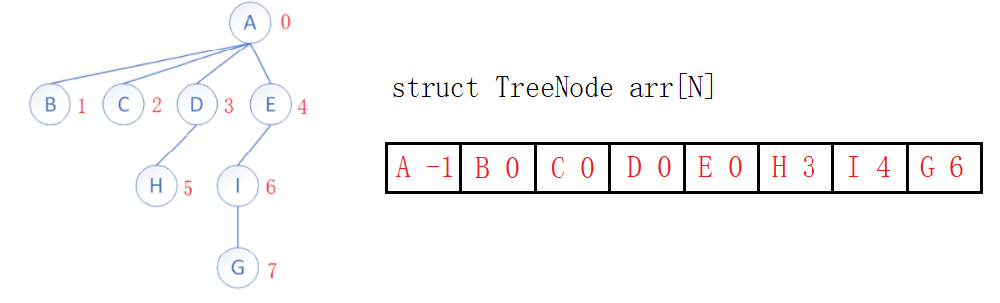

#### 孩子兄弟表示法

> 上面的方式各有优劣，表示树结构的最优方法是**左孩子右兄弟表示法**。

~~~c
struct TreeNode
{
    TNDataType data;

    struct TreeNode* firstChild;
    struct TreeNode* nextBrother;
};
~~~

结点的指针域只存两个指针：

- `firstChild`指向该结点的第一个子结点，
- `nextBrother`指向子结点右边的第一个兄弟结点。以此像单链表的形式链接兄弟节点。

> 第一层，根结点 $A$ ，无兄弟结点。
>
> 第二层，结点 $A$ 的第一个子结点为 $B$，其兄弟结点为 $C$。
>
> 第三层，结点 $B$ 的第一个子结点为 $D$，其兄弟结点为 $E$，$F$。结点 $C$ 的子结点为 $G$。
>
> 第四层，结点 $D$ 无子结点，结点 $E$ 有子结点为 $H$。结点 $F$，$G$ 无子结点 … ….

只要确定根结点，其余所有的结点都可以从其父结点或兄弟结点的指针处找到，如果没有指针就为空。

这种方法不需要确定树的度 $N$，也不需要使用线性表存储，结构不复杂也不浪费空间，不失为树结构的最优表示法。

> 当打开文件树时，弹出的一系列子文件夹，更类似于先找到子结点再找到其兄弟结点。

&nbsp;

## 2. 二叉树

> 用于存储和管理数据，最常见的是二叉树。

### 2.1 二叉树的定义

二叉树的每个结点可无子树或者有一个或两个子树，分别称为左子树和右子树。如图：

- 二叉树不存在度大于2的结点，二叉树的度最大为2。

> 度为0时树为空。度为1时是线性结构，度为2时存在可能有两个子树的结点。

- 二叉树中结点的子树有左右之分，且次序不可颠倒。
- 任意二叉树由以下几种情况复合而成：

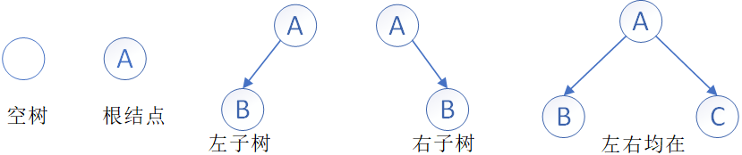

#### 特殊二叉树

二叉树中有两种特殊的二叉树，分别是满二叉树和完全二叉树。

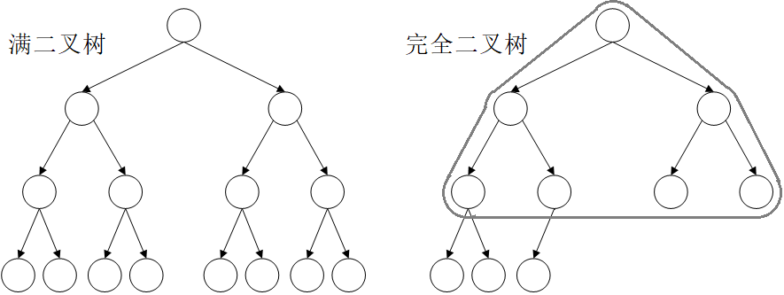

**满二叉树**：所有的叶结点都在最后一层，也就是所有分支结点都有两个子树，也就是每层结点数都到达最大值，这样的数就是满二叉树。

> 假设满二叉树的层数 $h$，则第 $h$ 层的结点数为 $2^{h-1}$，结点总数是$2^h-1$ 。
>
> 若已知结点总数为 $N$， 则树的高度为 $log_2(N+1)$。

**完全二叉树**：完全二叉树的前 $n-1$ 层为满二叉树，最后一层可不满但一定是从左至右连续。

> 满二叉树是一种特殊的完全二叉树。

#### 二叉树的性质

1. 二叉树的第 $i$ 层上最多有 $2^{i-1}$ 个结点。
2. 对于深度为 $h$ 的二叉树，最大结点数为 $2^h-1$，最少节点数为 $2^{h-1}$。
3. 任意二叉树，假设其叶结点个数 $n0$ 总比度为2的分支结点 $n2$ 个数大 $1$，即 $n_0=n_2+1$。

> 二叉树的特点就是：每增加一个分支结点，必然会增加一个叶节点。

4. 完全二叉树度为 $1$ 的结点个数，要么为 $0$，要么为 $1$。
5. 若满二叉树结点总数为 $N$， 则树的高度为 $h=log_2(N+1)$。

### 2.2 二叉树的结构

> 普通二叉树的增删查改无甚意义，更多是学习对二叉树结构的控制。为后期学习搜索二叉树、AVL树和红黑树夯实基础。

#### 顺序存储

顺序存储即**用数组按层序一层一层的存储**。

但“缺枝少叶”的树不好用数组存储，若不浪费空间便不好规律地表示结构。故一般**数组只适用于表示完全二叉树**。

更重要的是，可以利用数组下标计算结点的父子结点位置。如图：

$$
leftChild=parent*2+1\\
rightChild=parent*2+2
$$

$$
parent=(child-1)\;/\;2
$$

如果子节点下标越界，则说明子节点不存在。

#### 链式存储

使用链表表示二叉树，更加的直观。通常方案有两种一个是二叉链表，一个是三叉链表。二叉链表即存数据域和左右指针域，三叉则多存一个父结点指针。

> 当前数据结构一般都是二叉链，红黑树等高阶数据结构会用到三叉链。当前仅作了解。

&nbsp;

## 3. 堆

### 3.1 堆的定义

**堆是完全二叉树的一种应用**，故堆采用数组作底层结构。

> 需注意，这个堆是一种数据结构，和内存中的堆没有关系。

定义一个值的集合 $\lbrace k_0,k_1,k_2,...,k_{n-1} \rbrace$，将其以二叉树的形式顺序存储于数组中，且满足一定规律：
$$
K_i ≤ K_{2*i+1}\; \&\& \;  K_i ≤ K_{2*i+2}
$$

- 要求**每个结点都比其子结点小或相等，这样的堆被称为小堆或小根堆**。

$$
K_i ≥ K_{2*i+1}\; \&\& \;  K_i ≥ K_{2*i+2}
$$

- 要求**每个结点都比其子结点大或相等，这样的堆被称为大堆或大根堆**。

可以看出，堆是一个完全二叉树，且堆中某个结点的值总是不大于或不小于其子结点的值。**但堆并不是有序的，只有存储堆的数组有序，才称堆有序。**

### 3.2 堆的实现

**堆的逻辑结构是一个完全二叉树，物理结构是一个数组**。也可认为完全二叉树实际上是个数组，或着把数组想象成完全二叉树。

#### 堆的结构

~~~c
typedef int HPDataType;

typedef struct heap {
    HPDataType* a;
	int size;
    int capacity;
}heap;
~~~

#### 堆的插入

~~~c
void HeapPush(heap* php, HPDataType x)
{
	assert(php);
	if (php->size == php->capacity)
    {
		int newCapacity = php->capacity == 0 ? 4 : php->capacity * 2;
		HPDataType* tmp = (HPDataType*)realloc(php->a, sizeof(HPDataType) * newCapacity);
		if (tmp != NULL)
        {
            php->a = tmp;
            php->capacity = newCapacity;
		}
    }
	php->a[php->size] = x;
	php->size++;

    //调整
	AdjustUp(php->a, php->size, php->size - 1);
}
~~~

堆插入就是尾插进数组，本质是在二叉树上加叶结点。

由于插入值不一定，堆的性质可能被破坏。但**插入新结点只会影响其到根结点的这条路径上的结点**，故需要顺势向上调整，一直交换结点直到满足堆的性质。

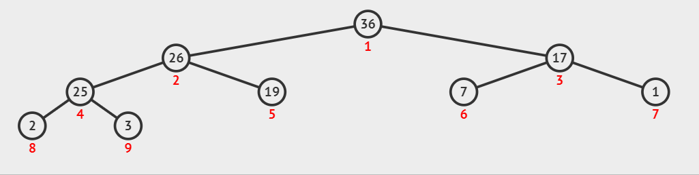

#### 向上调整

~~~c
void AdjustUp(HPDataType* a, int size, int child)
{
	assert(a);
    int parent = (child - 1) / 2;

	while (child > 0)
    {
		//大堆
		if (a[child] > a[parent])
			Swap(&a[child], &a[parent]);
		else
			break;

		//迭代
        child = parent;
        parent = (child - 1) / 2;
	}
}
~~~

向上调整算法，从`child`处一直向上找父结点，满足子结点比父节点大或小的条件就交换，直到调整到根结点或不满足条件为止。

> 堆的向上调整较为容易，因为结点的父结点只有一个，只需要和父节点比较即可。

#### 堆的删除

~~~c
void HeapPop(heap* php)
{
	assert(php);
	assert(!HeapEmpty(php));

    //删除
	php->a[0] = &php->a[php->size - 1];
	php->size--;

    //调整
	AdjustDown(php->a, php->size, 0);
}
~~~

堆的删除就是删除堆顶元素，但不能简单的将数组整体向前挪一位，这样会使破坏堆的结构。

应该先修改堆顶元素的值为数组末尾元素的值，再删除数组末尾元素。此时再从堆顶位置向下调整，就能恢复堆结构。

#### 向下调整

~~~c
//大根堆
void AdjustDown(HPDataType* a, int size, int parent)
{
	int child = parent * 2 + 1;

	while (child < size) // 等遍历到叶节点时，child迭代到叶节点的子节点必越界
    {
		if (child + 1 < size && a[child + 1] > a[child]) // 选出大子结点
			child++;

		//交换
		if (a[child] > a[parent])
			Swap(&a[child], &a[parent]);
		else
			break;

        //迭代
        parent = child;
        child = parent * 2 + 1;
	}
}
~~~

把尾元素换到堆顶，必然会改变堆的性质。但根结点的左右子树还是保持原有的性质。所以只需要将堆顶元素逐步向下调整。

以大根堆为例，从根开始，将当前结点与其较大的子结点进行交换，直到走到叶结点或不满足条件为止。

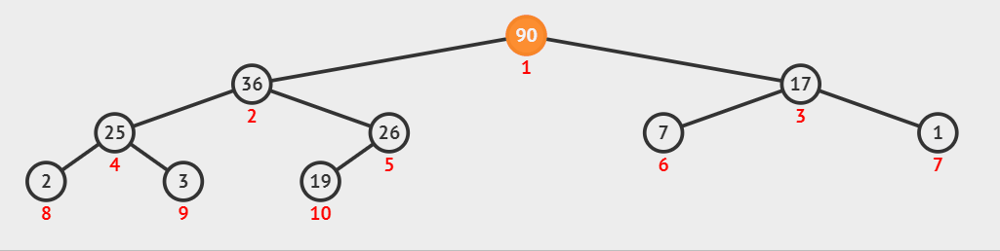

> 将较大的子结点换上来就是在恢复大堆性质，将较小的子结点交换上来是在恢复小堆性质。

堆的插入删除的时间复杂度，也就是向上向下调整算法的时间复杂度都是 $logN$。

#### 建堆

给出数组`a`，数组逻辑上可以看成完全二叉树，但并不一定是堆。**建堆就是将数组调整成堆。**

##### 方法1：向上调整

从根结点开始，依次将数组元素“插入”堆，与其说是“插入”不如说是“加入”。利用下标遍历数组，每插入一个就调整一次。

> 假设需要将`a`排成升序，不妨先试试将`a`数组构建成小堆：

~~~c
//建堆
void HeapBuild(int* a, int sz) {
    //向上调整
	for (int i = 1; i < sz; i++) {//从第二个结点开始遍历到尾结点
		AdjustUp(a, sz, i);
	}
}
~~~

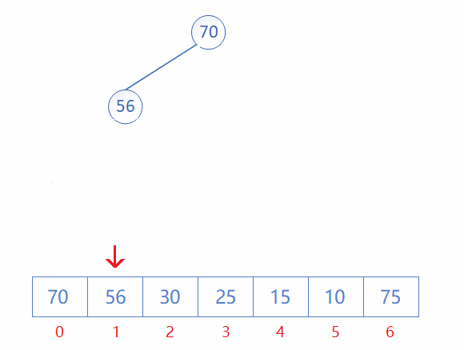

每加入一个元素，就向上调整。思想上其实和接口`Push`是一样的，都是插入再调整。也可以理解为“边建边调”。

##### 方法2：向下调整

此时数组当然还不是堆，向下调整算法要求左右子树必须满足堆的性质，才能将当前节点向下调整。应先从最后一个子树开始向下调整，从后向前倒着遍历。

> 准确来说，因为叶结点必然满足堆的性质，所以不用关心。应**从尾结点的父结点所在子树开始**，遍历到根结点进行调整。

~~~c
//建堆
void HeapBuild(int* a, int sz) {
    //向下调整
	for (int i = (sz - 1 - 1) / 2; i >= 0; i--) {//从最后一个叶结点的父结点开始到根结点
		AdjustDown(a, sz, i);
	}
}
~~~

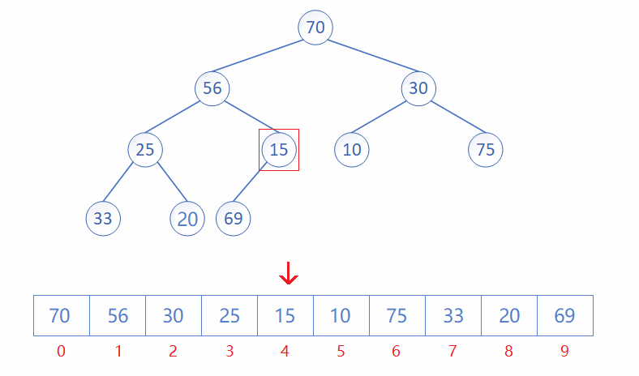

从一个完全二叉树的尾结点的父结点开始，从后往前调，也可以看成“建完在调”。

> 建堆的两种方式，向上调整和向下调整都是可行的。建大堆还是建小堆，只要改比较符号即可。

##### 建堆复杂度

> 遍历数组n个节点，每个节点调整logn次，故向上调整建堆的时间复杂度为$O(n*logn)$ 。
> 
> 向上调整算法复杂度过高，建堆一般配合堆排序使用的是**向下调整算法**。

向下调整的最复杂情况是从根结点一直调整到叶结点，并以满二叉树为例，看最复杂情况。

假设当前树有 $n$ 个结点，树的高度为 $h$ ，可得：

1. 第 1 层有 $2^0$ 个结点，每个结点最多调整 $h-1$ 次，
2. 第 2 层有 $2^1$ 个结点，每个结点最多调整 $h-2$ 次，
3. 以此类推，第 $h-1$ 层有 $2^{h-2}$ 个结点，每个结点最多调整 $1$ 次。

精确计算下，第 $x$ 层的所有节点的总调整次数，应为 $2^{x-1}*(h-x)$。

> $T(n)$ 为差比数列，利用错位相减法得 $T(n)$ 关于 $h$ 的表达式，再由 $n=2^h-1$,$h=log_2{(n+1)}$ 将$T(n)$转换成关于的$n$的表达式。

由此可得，**向下调整建堆的时间复杂度为 $O(n)$。**

### 3.4 堆的应用

#### 堆排序

> 将数组排成升序，建成大堆还是小堆呢？
>
> 如果建成小堆，每次只能确定一个最小值，若想选出次小的数，就要从下一个位置开始重新建堆，整体复杂度为 $O(N^2)$，显然是不可取的。

升序需建大堆，逻辑如下：

1. 建大堆，选出最大的数；
2. 首尾元素互换，致使最大的数被移至末尾；
3. 将尾元素排除出堆，继续开始向下调整，选出次大的数被移到首位。

再首尾互换，如此循环往复，直到调整到根结点，时间复杂度为$O(N*logN)$ 。

由此可得，**排升序建大堆，排降序建小堆**。

~~~c
void HeapSort(int* a, int n)
{
	//1. 建堆
	for (int i = (n - 2) / 2; i >= 0; --i)
        AdjustDown(a, n, i);

    //2. 排序
	for (int i = sz - 1; i > 0; i--) // i==0就结束，i=0时无意义且逻辑错误
    {
		Swap(&a[0], &a[i]); // 首尾互换
		AdjustDown(a, i, 0);// 向下调整
	}
}
~~~

#### Top-K问题

Top-K问题，在N个元素中找出前K个最值。**依旧是升序建大堆，降序建小堆。**

> 最容易想到的方案：建立一个 N 个数的大堆。去堆顶 K 次。缺点：浪费空间，复杂度高。那什么样的好呢？

1. 用前 $K$ 个数建立一个 $K$ 个元素的小堆；
2. 剩下 $N-K$ 个元素跟堆顶比较，比堆顶大则替换堆顶并向下调整；

3. 遍历结束，最后小堆中的 $K$ 个元素就是最大值。

>此方法本质可以理解成：遍历N个数，取其最大值放到K个数的集合中。

~~~c
void TopK(int* a, int n, int k)
{
    int minHeap[5];

	// 建堆
	for (int i = 0; i < k; i++)
		minHeap[i] = a[i];
	for (int i = (k - 2) / 2; i >= 0; --i)
		AdjustDown(minHeap, k, i);

	// 比较
	for (int i = k; i < n; i++)
	{
		if (val > minHeap[0])
        {
            minHeap[0] = a[i];
        	AdjustDown(minHeap, k, 0);
        }
	}
}
~~~

最坏情况可以是数组剩余N-K个数全部被K个数大，全部要进堆调整。时间复杂度为 $O(N*logK)$，空间复杂度为 $O(K)$。

&nbsp;

## 4. 二叉树的链式结构

### 4.1 二叉树的遍历

#### 链式结构

> 二叉树结构不利于存储数据，其增删查改没有意义。二叉树的价值体现在一些特定的二叉树上，如AVL树、红黑树、B树等。
>

二叉树的特点在于**树可以被分成三个部分：根结点，左子树，右子树**。空树是不可再分的最小单位。

#### 前中后序遍历

| 遍历方式          | 解释                                       |
| ----------------- | ------------------------------------------ |
| 前序遍历/先序遍历 | 先访问根结点，再访问左子树，最后访问右子树 |
| 中序遍历          | 先访问左子树，再访问根结点，最后访问右子树 |
| 后序遍历          | 先访问左子树，再访问右子树，最后访问根结点 |

上述二叉树以前序、中序、后序遍历所得结果分别为：
$$
A\quad B\quad D\quad \0\quad \0\quad \0\quad C\quad E\quad \0\quad \0\quad F\quad \0\quad \0
$$

$$
\0\quad D\quad \0\quad B\quad \0\quad A\quad \0\quad E\quad \0\quad C\quad \0\quad F\quad \0
$$

$$
\0\quad \0\quad D\quad \0\quad B\quad \0\quad \0\quad E\quad \0\quad \0\quad F\quad C\quad A
$$

> 前中后序遍历都是递归分治思想的体现。写出空树才能反映出遍历的全部过程，省略掉空树就是结果。

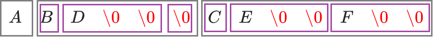

~~~c
//前序遍历
void PreOrder(BTNode* root)
{
	if (root == NULL) {
		printf("\\0 ");
		return;
	}
	printf("%c ", root->data);

	PreOrder(root->left);
	PreOrder(root->right);
}

//中序遍历
void InOrder(BTNode* root)
{
	if (root == NULL) {
		printf("\\0 ");
		return;
	}
	InOrder(root->left);
	printf("%c ", root->data);
    InOrder(root->right);
}

//后序遍历
void PostOrder(BTNode* root)
{
	if (root == NULL) {
		printf("\\0 ");
		return;
	}
	PostOrder(root->left);
	PostOrder(root->right);

    printf("%c ", root->data);
}
~~~

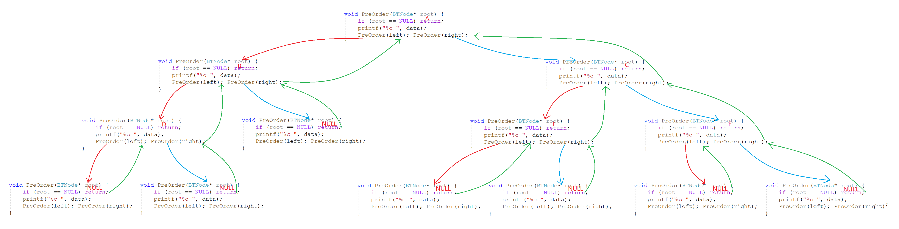

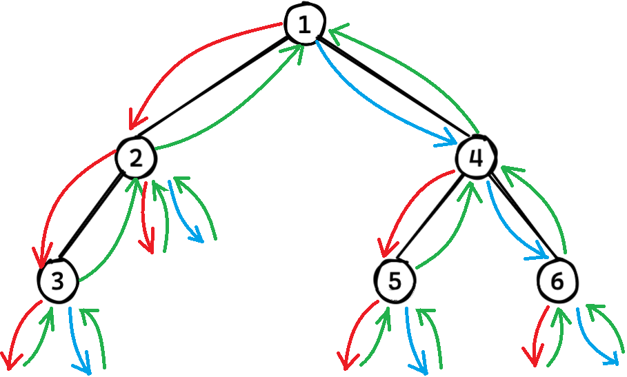

**三种遍历方式的递归调用逻辑完全相同，访问结点的顺序是相同的。只是打印数据的时机不同，故结果不同**。

#### 层序遍历

层序遍历即从上往下一层一层遍历，层序遍历用队列实现。

~~~c
void levelOrder(BTNode* root) {
    if (root == NULL) {
        return;
    }
	Queue q;
	QueueInit(&q);
    //1. 头结点入队
	QueuePush(&q, root);
	while (!QueueEmpty(&q)) {
		BTNode* front = QueueFront(&q);
		printf("%d ", front->data);
		//2. 队头出队
        QueuePop(&q);
        //3. 子结点入队
		if (front->left) {
			QueuePush(&q, front->left);
		}
		if (front->right) {
			QueuePush(&q, front->right);
		}
	}
	QueueDestroy(&q);
}
~~~

1. 创建一个队列，先入根结点，
2. 出队头结点，再入队头的子结点。这样一层结束会把下一层全带进队。

3. 队列为空时，遍历结束。

> 保持队列不为空的情况下循环往复，最后一层遍历完子结点全为空才会导致队列元素越来越少最终队列为空。

### 4.2 二叉树的练习

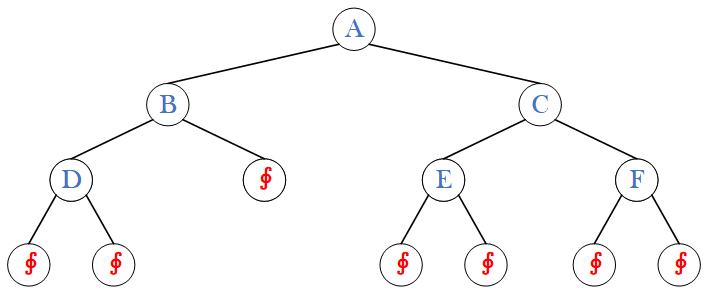

递归也就是分治思想，分而治之——大事化小，小事化了。接下来的几个二叉树基础练习全部采用递归的策略实现。

#### 二叉树结点个数

~~~c
//1.
void BinaryTreeSize(BTNode* root, int* pcount) {
	if (root == NULL) {
		return;
	}
	(*pcount)++;
	BinaryTreeSize(root->left, pcount);
	BinaryTreeSize(root->right, pcount);
}
//2.
int BinaryTreeSize(BTNode* root)
{
    if (root == NULL)
		return 0;

    return BinaryTreeSize(root->left) + BinaryTreeSize(root->right) + 1;
}
~~~

使用计数器的话，要像OJ一样传入主函数中变量的地址。不推荐。

用递归分治的思想的话，求任意树的结点个数都可以看成**一类相同的问题**，即左子树结点个数+右子树结点个数+1，然后再去大事化小：

#### 二叉树叶结点个数

~~~c
int BinaryTreeLeafSize(BTNode* root) {
    //为空
	if (root == NULL)
		return 0;
    //为叶
	if (root->left == NULL && root->right == NULL)
		return 1;
    //非空
    return BinaryTreeLeafSize(root->left) + BinaryTreeLeafSize(root->right);
}
~~~

空树的叶节点个数为0。其他普通树的叶结点个数是其左右子树的叶结点个数之和。
叶结点特征是左右子结点都为空。

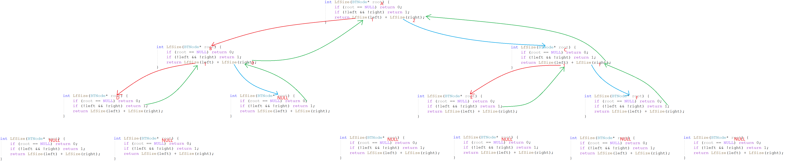

#### 二叉树任意层结点个数

~~~c
int BinaryTreeLevelkSize(BTNode* root, int k) {
	if (root == NULL)
		return 0;
	if (k == 1)
		return 1;

    return BinaryTreeLevelkSize(root->left, k-1) + BinaryTreeLevelkSize(root->right, k-1);
}
~~~

1. 求A树的第$k$层结点个数，可以转化成就其左右子树，即B树的第$k-1$层结点个数+C树的第$k-1$层结点个数。
2. 求B树的第$k-1$层结点个数，即D树的第$k-2$层结点个数+`null`树的第$k-2$层结点个数。
3. 以此类推，空树结点个数为0，当k=1即遍历到第k层的结点。非空k也不等于0则转换成求左右子树的结点个数。

#### 二叉树高度

~~~c
int BinaryTreeDepth(BTNode* root) {
	if (root == NULL)
		return 0;

    return max(BinaryTreeDepth(root->left), BinaryTreeDepth(root->right)) + 1;
}
~~~

空树的高度为0，其他树的高度是左右子树的高度最大值+1即可。

求树的结点总数和求树的高度都是经典的后序遍历问题，都是先遍历左右树再访问根结点。

#### 二叉树查找

~~~c
BTNode* BinaryTreeFind(BTNode* root, BTDataType x)
{
	if (root == NULL)
		return NULL;
	if (root->data == x)
		return root;

	BTNode* ret = BinaryTreeFind(root->left, x);
	if (ret)
		return ret;

    ret = BinaryTreeFind(root->right, x);
	if (ret)
		return ret;

    return NULL;
}
~~~

二叉树查找结点是典型的前序遍历。A不是就到A的左右子树中去找。第三种情况下，必须加以判断，不为空时才返回不然无法遍历右子树。

#### 二叉树销毁

~~~c
void BinaryTreeDestroy(BTNode* root) {
	if (!root) {
		return;
	}
	BinaryTreeDestroy(root->left);
	BinaryTreeDestroy(root->right);
	free(root);
}
~~~

释放了结点就找不到它的子结点了，所以采用后序遍历的方式。

## 5. 二叉树的OJ题

| OJ链接                                                       | 题解链接                                                     |
| ------------------------------------------------------------ | ------------------------------------------------------------ |
| [5.1 单值二叉树](https://leetcode-cn.com/problems/univalued-binary-tree/) | [题解链接](https://leetcode.cn/problems/univalued-binary-tree/solutions/1993014/by-8hasefu1-kb3n/) |
| [5.2 相同二叉树](https://leetcode-cn.com/problems/same-tree/) | [题解链接](https://leetcode.cn/problems/same-tree/solutions/1993011/by-8hasefu1-2mpj/?orderBy=newest_to_oldest) |
| [5.3 对称二叉树](https://leetcode-cn.com/problems/symmetric-tree/) | [题解链接](https://leetcode.cn/problems/symmetric-tree/solutions/1993013/by-8hasefu1-l1ti/) |
| [5.4 前](https://leetcode-cn.com/problems/binary-tree-preorder-traversal/)[中](https://leetcode-cn.com/problems/binary-tree-inorder-traversal/)[后序遍历](https://leetcode-cn.com/problems/binary-tree-postorder-traversal/) | [题解链接](https://leetcode.cn/problems/binary-tree-postorder-traversal/solutions/1994908/by-8hasefu1-eapg/) |
| [5.5 另一棵树的子树](https://leetcode-cn.com/problems/subtree-of-another-tree/) | [题解链接](https://leetcode.cn/problems/subtree-of-another-tree/solutions/1993010/by-8hasefu1-ek0y/?orderBy=newest_to_oldest) |
| [5.6 判断完全二叉树](https://leetcode.cn/problems/check-completeness-of-a-binary-tree/description/) | [题解链接](https://leetcode.cn/problems/check-completeness-of-a-binary-tree/solutions/1953087/by-8hasefu1-of6e/) |
| [5.7 遍历创建树](https://www.nowcoder.com/practice/4b91205483694f449f94c179883c1fef) | [题解链接](https://www.nowcoder.com/discuss/post/426279733878415360) |
