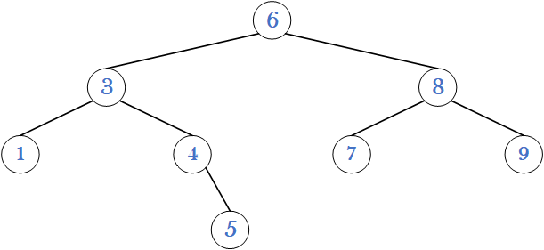
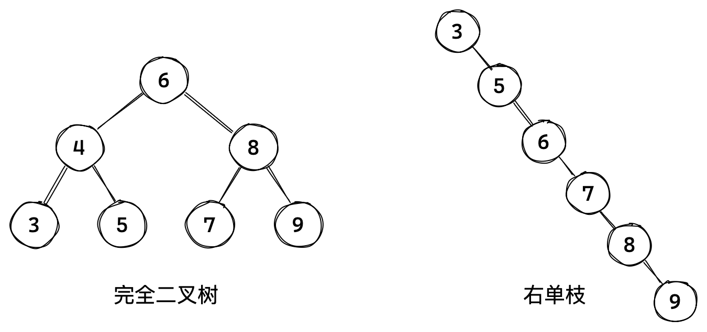
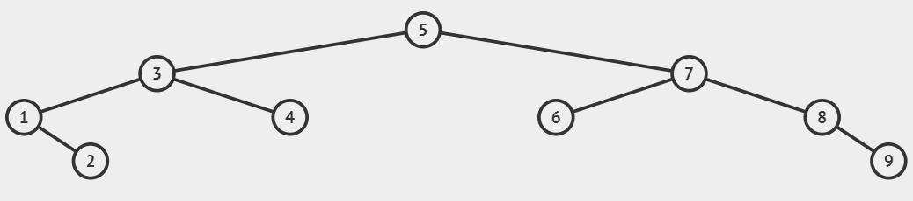
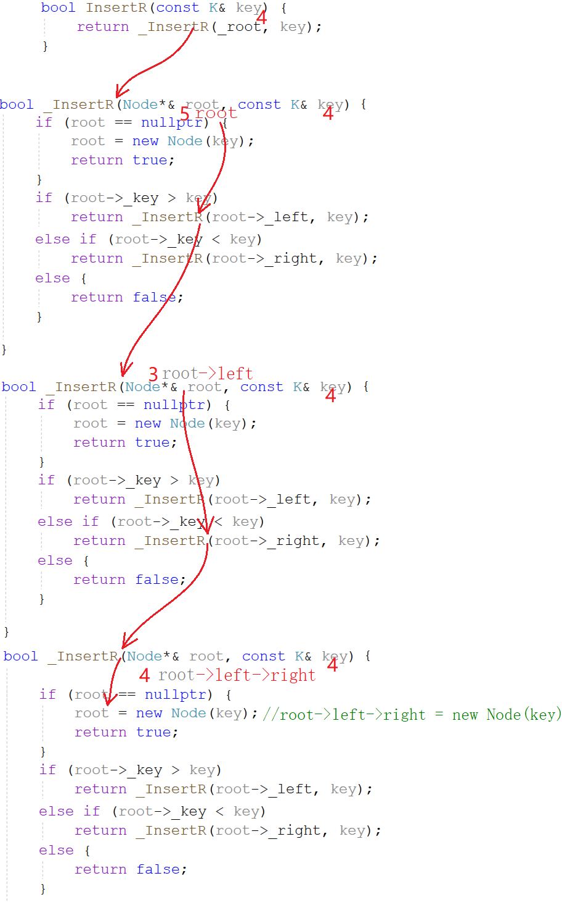
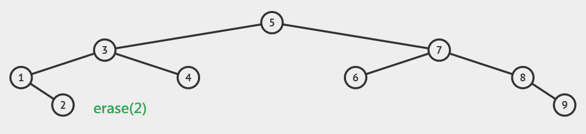
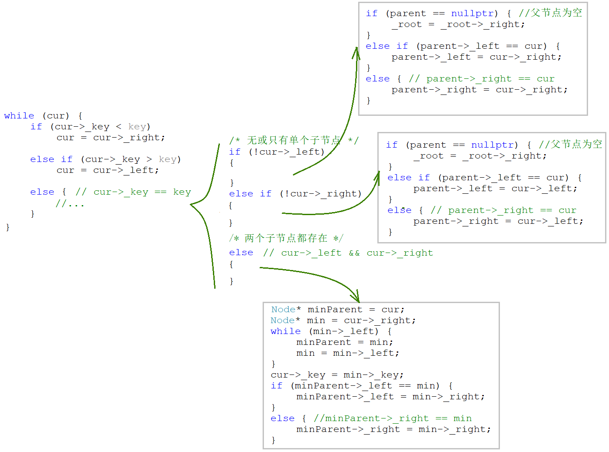

# 二叉搜索树

> 普通二叉树的意义不大，只有加上一些性质才能发挥其作用。比如堆和二叉搜索树。

## 1. 二叉搜索树的概念

二叉搜索树又称二叉排序树，它可以是一颗空树，或者是一个满足如下性质的二叉树：

- 如果左子树不为空，**左子树上所有节点的值都小于根节点**；
- 如果右子树不为空，**右子树上所有节点的值都大于根节点**；

且它的左右子树，也满足上述性质。

<center>

</center>

~~~cpp
template<class K>
struct bstree_node
{
    bstree_node<K>(K key)
        : _left(nullptr), _right(nullptr), _key(key)
    {}

    bstree_node<K>* _left;
    bstree_node<K>* _right;
    K _key;
};

template<class K>
class bstree
{
public:
  typedef bstree_node<K> node;
private:
    node* _root = nullptr;
};
~~~

二叉搜索树最大的问题是会退化，比如顺序插入时就会退化成一个链表。

<center>

</center>

搜索二叉树的效率体现在搜索上，最坏情况搜索高度次。所以树的高度越低，性能越好。所以一般不会使用单纯的搜索二叉树，而是使用升级版的AVL树和红黑树。

&nbsp;

## 2. 二叉搜索树的接口

### 2.1 查找

若根节点不为空：

- 如果节点值等于 $key$，返回 $true$，
- 如果节点值小于 $key$，到其右子树中查找，
- 如果节点值大于 $key$，到其左子树中查找，

走到空树还没找到，则返回 $false$。

<center>

</center>

#### 非递归查找

~~~cpp
bool find(const K& key)
{
    node* cur = _root;
    while (cur)
    {
        if (key < cur->_key)
            cur = cur->_left;
        else if (key > cur->_key)
            cur = cur->_right;
        else
            return true;
    }
    return false;
}
~~~

二叉搜索树的查找非常的迅速，在二叉树相对平衡的情况下，时间复杂度高度次 $O(logN)$。最差是线性状态，为 $O(N)$。

#### 递归查找

~~~cpp
bool find_r(const K& key)
{
    return _find_r(_root, key);
}

bool _find_r(node* root, const K& key)
{
    if (root == nullptr)
        return false;

    if (key < root->_key)
        return _find_r(root->_left, key);
    else if (key > root->_key)
        return _find_r(root->_right, key);
    else
        return true;
}
~~~

### 2.2 中序遍历

二叉搜索树的中序遍历结果，就是树中元素排成升序的结果。

~~~cpp
void inorder()
{
    _inorder(_root);
    std::cout << std::endl;
}

void _inorder(node* root)
{
    if (root == nullptr)
        return;

    _inorder(root->_left);
    std::cout << root->_key << " ";
    _inorder(root->_right);
}
~~~

一般成员函数在类外调用时，无法直接传入成员变量作参数。故可以将主体逻辑包装成子函数，再由成员函数去调用即可。

~~~cpp
void TestBSTree()
{
    BSTree<int> t;
    int a[] = { 7,1,3,6,4,8,7,9,3,2,5 }; //排序数组
    for (auto e : a) {
        t.Insert(e); //插入二叉搜索树
    }
    t.Inorder(); //中序遍历
}
~~~

如上代码，相当于利用二叉搜索树排序数组，而二叉搜索树结构天然具有排序加去重的功能。

### 2.3 插入

二叉搜索树的插入也很简单，共分两种情况：

1. 树为空，则直接插入，
2. 树不为空，则按性质查找到插入位置，再插入新节点。

<center>

</center>

`cur`指针进行比较并向下移动的同时，父指针`parent`始终指向`cur`的父节点。当`cur`走到空的时候，就创建新节点并链接到父节点的指针上。

1. 插入的值比当前节点的值小，则插入到左子树中，
2. 反之，比当前节点的值大，则插入到右子树中。

#### 非递归插入

~~~cpp
bool insert(const K& key)
{
    if (_root == nullptr)
    {
        _root = new node(key);
        return true;
    }

    node* cur = _root;
    node* parent = nullptr;

    while (cur)
    {
        if (key < cur->_key)
        {
            parent = cur;
            cur = cur->_left;
        }
        else if (key > cur->_key)
        {
            parent = cur;
            cur = cur->_right;
        }
        else
            return false;
    }

    if (key < parent->_key)
        parent->_left = new node(key);
    else
        parent->_right = new node(key);

    return true;
}
~~~

可见，二叉搜索树的每次插入都是把节点放在叶节点的位置上。

#### 递归插入

~~~cpp
bool insert_r(const K& key)
{
    return _insert_r(_root, key);
}

bool _insert_r(node*& root, const K& key)
{
    if (root == nullptr)
    {
        root = new node(key);
        return true;
    }

    if (key < root->_key)
        return _insert_r(root->_left, key);
    else if (key > root->_key)
        return _insert_r(root->_right, key);
    else
        return false;
}
~~~

参数类型是**节点指针的引用**，使得root不仅是节点指针，还是其父节点的左或右孩子指针，修改root也就修改了父节点的左右孩子。

<center>

</center>

### 2.4 删除

二叉搜索树的难点在于删除，因为节删除节点需要维护剩余节点的链接关系。

删除叶节点很容易，释放节点并置空父节点的指针即可。删除非叶结点，可以将子树中满足条件的节点替换上来。

如果节点不存在先返回 $false$，如果存在，则分以下几种情况：

| 直接删除               | 解释                                                   |
| ---------------------- | ------------------------------------------------------ |
| 删除的节点有单个子节点 | 左为空就让父节点指向右子树，右为空就让父节点指向左子树 |
| 删除的节点无子节点     | 归类到上一类处理                                       |

<center>

</center>

| 替换删除                 | 解释                                               |
| ------------------------ | -------------------------------------------------- |
| 删除的节点左右子节点都有 | 用左树的最大节点，或右树的最小节点，替换被删节点。 |

<center>

</center>

1. 先将左树最大节点的左孩子托，或是右树最小节点的右孩子托付给父节点。
2. 再将左树最大节点覆盖待删除的节点。

#### 非递归删除

~~~cpp
bool erase(const K& key)
{
    node* parent = nullptr;
    node* cur = _root;

    while (cur)
    {
        if (key < cur->_key)
        {
            parent = cur;
            cur = cur->_left;
        }
        else if (key > cur->_key)
        {
            parent = cur;
            cur = cur->_right;
        }
        else
        {
            if (!cur->_left)
            {
                if (parent == nullptr)
                    _root = _root->_right;
                else if (cur == parent->_left)
                    parent->_left = cur->_right;
                else
                    parent->_right = cur->_right;
                delete cur;
            }
            else if (!cur->_right)
            {
                if (parent == nullptr)
                    _root = _root->_left;
                else if (cur == parent->_left)
                    parent->_left = cur->_left;
                else
                    parent->_right = cur->_left;
                delete cur;
            }
            else
            {
#ifdef 方式1
                node* min = cur->_right;
                while (min->_left)
                    min = min->_left;

                K minkey = min->_key;
                erase(min->_key);
                cur->_key = minkey;
#endif

#ifdef 方式2
                node* min_parent = cur;
                node* min = cur->_right;

                while (min->_left)
                {
                    min_parent = min;
                    min = min->_left;
                }

                cur->_key = min->_key;

                if (min == min_parent->_left)
                    min_parent->_left = min->_right;
                else
                    min_parent->_right = min->_right;
                delete min;
#endif
            }
            return true;
        }
    }
    return false;
}
~~~

<center>

</center>

#### 递归删除

~~~cpp
bool erase_r(const K& key)
{
    return _erase_r(_root, key);
}

bool _erase_r(node*& root, const K& key)
{
    if (root == nullptr)
        return false;

    if (key < root->_key)
        return _erase_r(root->_left, key);
    else if (key > root->_key)
        return _erase_r(root->_right, key);
    else
    {
        node* del = root;

        if (!root->_left)
            root = root->_right;
        else if (!root->_right)
            root = root->_left;
        else
        {
            node* min = root->_right;
            while(min->_left)
                min = min->_left;

            // min = min->_right; // ERR
            root->_key = min->_key;
            // return _erase_r(min, min->_key); // ERR
            return _erase_r(root->_right, min->_key);
        }

        delete del;
        return true;
    }
}
~~~

&nbsp;

## 3. 二叉搜索树的应用

搜索树有两种应用，`key`搜索模型和`key/value`搜索模型。此外，二叉搜索树插入重复值会失败，所以自带去重功能。

### key搜索模型

key搜索模型查找返回真假，只能用来判断数据是否存在。应用场景如存储车牌号判断是否放行等。

### kv搜索模型

通过`key`查找对应`value`，两个值是强相关的映射关系。 应用场景如中英互译，身份绑定等。

```cpp
template<class K, class V>
struct bstree_node
{
    bstree_node<K, V>* _left;
    bstree_node<K, V>* _right;
    K _key;
    V _val;

    bstree_node<K, V>(const K& key, const V& val)
        : _key(key), _val(val), _left(nullptr), _right(nullptr)
    {}
};

template<class K, class V>
class bstree
{
    typedef bstree_node<K, V> node;
public:
    bool insert(const K& key, const V& val)
    {
        if (_root == nullptr)
        {
            _root = new node(key, val);
            return true;
        }

        node* parent = nullptr;
        node* cur = _root;

        while (cur)
        {
            if (key < cur->_key)
            {
                parent = cur;
                cur = cur->_left;
            }
            else if (key > cur->_key)
            {
                parent = cur;
                cur = cur->_right;
            }
            else
                return false;
        }

        if (key < parent->_key)
            parent->_left = new node(key, val);
        else if (key > parent->_key)
            parent->_right = new node(key, val);

        return true;
    }

    node* find(const K& key)
    {
        node* cur = _root;

        while (cur)
        {
            if (key < cur->_key)
                cur = cur->_left;
            else if (key > cur->_key)
                cur = cur->_right;
            else
                return cur;
        }
        return nullptr;
    }

    bool erase(const K& key)
    {
        node* parent = nullptr;
        node* cur = _root;

        while (cur)
        {
            if (key < cur->_key)
            {
                parent = cur;
                cur = cur->_left;
            }
            else if (key > cur->_key)
            {
                parent = cur;
                cur = cur->_right;
            }
            else
            {
                if (!cur->_left)
                {
                    if (!parent)
                        _root = _root->_right;
                    else if (cur == parent->_left)
                        parent->_left = cur->_right;
                    else
                        parent->_right = cur->_right;
                    delete cur;
                }
                else if (!cur->_right)
                {
                    if (!parent)
                        _root = _root->_left;
                    else if (cur == parent->_left)
                        parent->_left = cur->_left;
                    else
                        parent->_right = cur->_left;
                    delete cur;
                }
                else
                {
                    node* min_parent = cur;
                    node* min = cur->_right;

                    while (min->_left)
                    {
                        min_parent = min;
                        min = min->_left;
                    }

                    cur->_key = min->_key;
                    cur->_val = min->_val;

                    if (min == min_parent->_left)
                        min_parent->_left = min->_right;
                    else
                        min_parent->_right = min->_right;
                    delete min;
                }

                return true;
            }
        }
        return false;
    }

    void inorder()
    {
        _inorder(_root);
        cout << endl;
    }

    void _inorder(node* root)
    {
        if (!root)
            return;

        _inorder(root->_left);
        cout << root->_key << "-" << root->_val << endl;
        _inorder(root->_right);
    }

private:
    node* _root = nullptr;
}
```

&nbsp;

## 5. oj题

| OJ链接                                                       | 题解链接                                                     |
| ------------------------------------------------------------ | ------------------------------------------------------------ |
| [606. 根据二叉树创建字符串](https://leetcode.cn/problems/construct-string-from-binary-tree/) | [题解](https://leetcode.cn/problems/construct-string-from-binary-tree/solutions/2291966/jian-ji-ming-liao-zhu-shi-jiang-jie-di-g-iudh/) |
| [102. 二叉树的分层遍历](https://leetcode.cn/problems/binary-tree-level-order-traversal/) | [题解](https://leetcode.cn/problems/binary-tree-level-order-traversal/solutions/2291972/jian-ji-ming-liao-c-er-cha-shu-de-ceng-x-ndwk/) |
| [107. 二叉树的层序遍历 II](https://leetcode.cn/problems/binary-tree-level-order-traversal-ii/) | [题解](https://leetcode.cn/problems/binary-tree-level-order-traversal-ii/solutions/2293279/jian-ji-ming-liao-cpp-er-cha-shu-de-ceng-tn7m/) |
| [236. 二叉树的最近公共祖先](https://leetcode.cn/problems/lowest-common-ancestor-of-a-binary-tree/) | [题解](https://leetcode.cn/problems/lowest-common-ancestor-of-a-binary-tree/solutions/2293330/jian-ji-ming-liao-cpp-er-cha-shu-de-zui-ggk53/) |
| [剑指 Offer 36. 二叉搜索树与双向链表](https://leetcode.cn/problems/er-cha-sou-suo-shu-yu-shuang-xiang-lian-biao-lcof/) | [题解](https://leetcode.cn/problems/er-cha-sou-suo-shu-yu-shuang-xiang-lian-biao-lcof/solutions/2294534/tong-su-xiang-xi-jie-shi-cpp-er-cha-sou-6b4nk/) |
| [105. 从前序与中序遍历序列构造二叉树](https://leetcode.cn/problems/construct-binary-tree-from-preorder-and-inorder-traversal/) | [题解](https://leetcode.cn/problems/construct-binary-tree-from-preorder-and-inorder-traversal/solutions/2294541/cong-qian-xu-yu-zhong-xu-bian-li-xu-lie-mrrur/) |
| [106. 从中序与后序遍历序列构造二叉树](https://leetcode.cn/problems/construct-binary-tree-from-inorder-and-postorder-traversal/) | [题解](https://leetcode.cn/problems/construct-binary-tree-from-inorder-and-postorder-traversal/solutions/2294542/cong-zhong-xu-yu-hou-xu-bian-li-xu-lie-g-byuq/) |
| [144. 二叉树的前序遍历](https://leetcode.cn/problems/binary-tree-preorder-traversal/) | [题解](https://leetcode.cn/problems/binary-tree-preorder-traversal/solutions/2294543/er-cha-shu-de-qian-xu-bian-li-by-8hasefu-3l7s/) |
| [94. 二叉树的中序遍历](https://leetcode.cn/problems/binary-tree-inorder-traversal/) | [题解](https://leetcode.cn/problems/binary-tree-inorder-traversal/solutions/2294544/er-cha-shu-de-zhong-xu-bian-li-by-8hasef-vpz7/) |
| [145. 二叉树的后序遍历](https://leetcode.cn/problems/binary-tree-postorder-traversal/) | [题解](https://leetcode.cn/problems/binary-tree-postorder-traversal/solutions/2339883/dong-tu-jian-ji-ming-liao-cpp-fei-di-gui-i7jx/) |
