# 排序

> 常见并实用的排序有如下八种。

<center>
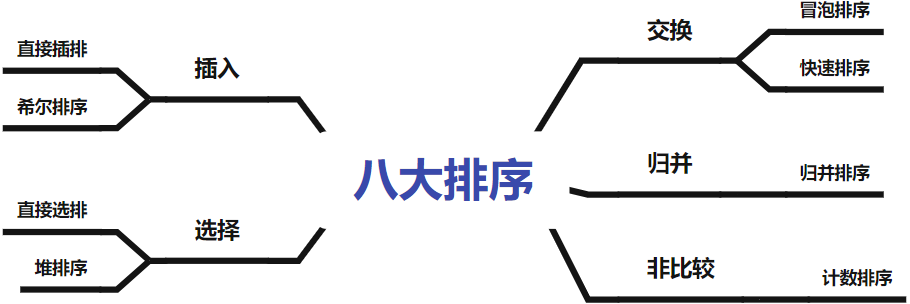
</center>

&nbsp;

## 1 插入排序

### 1.1 直接插入排序

#### 基本思想

直接插入排序是最简单的插入排序，摸扑克牌时，需要将摸到的牌按顺序插入到已有的牌中，这里便运用了直接插排的思想。

插入排序的定义：把待排的元素按规则逐个插入到一个有序序列中，直到所有元素插完为止，得到一个新的有序序列。

<center>

</center>

#### 代码实现

<center>
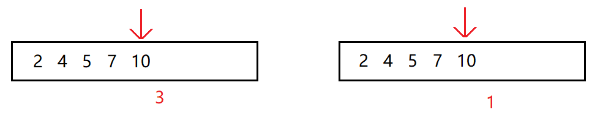
</center>

首先有一个有序数组，此外有一个元素待插入到该数组中。

1. 只要当前元素大于待插元素，就将当前元素向后移动一位，
2. 直到当前元素比待插元素小或相等或者下标越界，然后退出循环，
3. 将待插元素插入当前下标位置的下一个位置。

<center>
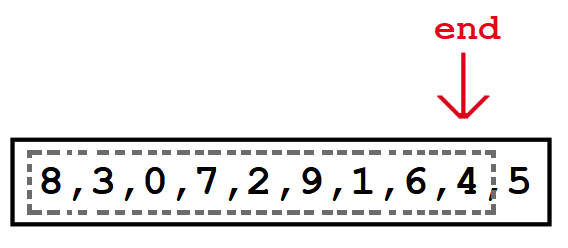
</center>

> 如图所示，我们把数组end位置的后一个元素作为待插元素x。

~~~c
//1. 单趟排序 -- 针对一个元素的排序
void InsertSort(int* a, int n)
{
	int end = n - 2;
	int x = a[end + 1];

	while (end >= 0)
    {
		if (a[end] > x)
			a[end + 1] = a[end];
		else
			break;

        end--;
	}
	a[end + 1] = x;
}
~~~

排序一般分为内外两层循环，内循环调整当前待插元素位置，而外循环决定调整待插元素。

最开始 $end=0$，也就是不存在已排好的数据，

1. 将数组的尾部元素 $end$ 的下一个元素看成待插元素 $x$ ，再将待插元素运用单趟排序插入数组中。
2. 将数组尾部下标 $end$ 向后挪一位，重复上述过程。
3. 以此类推，直到 $end$ 指向整个数组的尾部，整个数组就都有序。

故只要加一个外循环，**控制标识尾部指针 $end$ 遍历为 $[0,n-1)$**，这样便能完成对整个数组的排序。

<center>
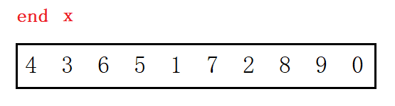
</center>

~~~c
void insert_sort(int* a, int n)
{
	for (int i = 0; i < n - 1; i++)
	{
		int end = i;
		int x = a[i + 1];

		while (end >= 0)
		{
			if (a[end] > x)
				a[end + 1] = a[end];
			else
				break;
			end--;
		}

		a[end + 1] = x;
	}
}
~~~

<center>

</center>

#### 复杂度分析

- 最好情况为数组有序或接近有序，但仍需遍历一遍，时间复杂度为$O(n)$，
- 最坏情况为数组逆序，所有元素都要调整，时间复杂度为$O(n^2)$ 。

> 外循环循环 $n$ 次，内循环次数从1开始逐次增加。故总循环次数为等差数列之和 $1+2+…+n-1$。

无额外空间消耗，空间复杂度为 $O(1)$ 。

> 直接插排对于数组接近有序的情况非常的快，而在数组完全逆序的情况下表现非常慢。

&nbsp;

### 1.2 希尔排序

直接插排在数据不接近有序的情况下表现的不尽人意。故Shell想出在直接插排的前面进行预排序，使得数据接近有序，这样直接插排的性能就得到优化，这就是希尔排序。

#### 分组预排

先预排序数组，使数组变得接近有序（大的尽量在后面，小的尽量在前面），此时再去直接插排。

**按`gap`分组，对分组产生的“小数组”，使用直接插入排序。**

- 假设 gap 为3，则每三个元素分成一组，将一组的元素看成一个数组，忽略数组中其他元素。

<center>

</center>

> 4,5,2,0 为一组，3,1,8 为一组，6,7,9 为一组。gap 同时也是组的个数。

- 将每个分组产生的“数据小组”看成一个数组，对每一个这样的数组进行直接插排，过程如图所示：

<center>

</center>

> 预排序所得结果虽不是完全有序，但相对于原数组确实是更加有序的。

<center>

</center>

#### 代码实现

##### 单组预排

~~~c
void ShellSort(int* a, int n)
{
	int gap = 3;
    for (int j = 0; j < gap; j++) // 分3组
    {
        for (int i = j; i < n - gap; i += gap)
        {
            int end = i;
            int x = a[end + gap];

            while (end >= j)
            {
                if (a[end] > x)
                    a[end + gap] = a[end];
                else
                    break;

                end -= gap;
            }

            a[end + gap] = x;
        }
	}
}
~~~

`gap`即是间隔长度，也是组的个数。

1. 第一层循环：控制“分组小数组”的起始位置。
2. 第二层循环：执行间距为 gap 的预排，也就是小组的直接插排。

##### 多组预排

```cpp
void shell_sort(int* a , int n)
{
    int gap = n;
    while (gap > 0) // gap不断减小分组预排多次
    {
        gap = gap / 3 + 1; // 保证最后一定gap=1执行最后一次直接插排

        for (int j = 0; j < gap; j++)
        {
            for (int i = j; i < n - gap; i += gap)
            {
                int end = i;
                int x = a[end + gap];

                while (end >= j)
                {
                    if (a[end] > x)
                        a[end + gap] = a[end];
                    else
                        break;

                    end -= gap;
                }

                a[end + gap] = x;
            }
        }
    }
}
```

> 对于预排序来说，`gap`越大，效果越差，但时间消耗越小；而`gap`越小，效果越好，但时间消耗就越大。

由于直接插排的复杂度特点，可能逐步减小的希排复杂度比一次直接插排的复杂度更低。故**执行多次预排来优化预排结果。控制 gap 不断减小到1，最后 gap==1 时执行最后的直接插排。**

##### 简化版本

~~~c
void ShellSort(int* a, int n)
{
	int gap = n;
	while (gap > 0)
    {
		gap = gap / 3 + 1;

		for (int i = 0; i < n - gap; i++)
        {
			int end = i;
			int x = a[end + gap];
			while (end >= 0)
            {
				if (a[end] > x)
					a[end + gap] = a[end];
				else
					break;

                end -= gap;
			}

			a[end + gap] = x;
		}
	}
}
~~~

<center>

</center>

简化了控制多组的循环，原来是一组一组排，变成了多组一起排。

#### 复杂度分析

> 希排的时间复杂度分析较为复杂，下面简单推理一下。

##### 单组预排的复杂度

最坏情况下，假设数组有 $n$ 个元素分成 $gap$ 组，则每组有 $n/gap$ 个元素。

- 单组预排的复杂度大概为 $T(n,gap)=1+2+3+...+n/gap$ ，
- 总共 gap 组复杂度大概为 $F(n,gap)=(1+2+3+...+n/gap)*gap$ 。

也得：
$$
Min:\lim_{gap→n}F(n,gap)=O(n)\\Max:\lim_{gap→1}F(n,gap)=O(n^2)
$$
即：gap越大，效果越差，但时间消耗越小；而gap越小，效果越好，但时间消耗就越大。所以执行多次预排更合理。

##### 多组预排的复杂度

多组预排，最好情况下仅遍历一遍数组，时间复杂度为$O(n)$。

在控制多组预排的循环中，若`gap/=2`，大概预排 $log_2n$ 次；若`gap=gap/3+1`，大概预排 $log_3n$ 次。

每次预排的gap不停的变化，导致复杂度较难计算，**研究表明希排的复杂度为 $O(nlogn)$，大概为 $O(n^{1.3})$。**

> 虽然希尔排序用的都是直接插入排序，但希尔排序的精髓在于其思想非常的难得，这使得排序的复杂度得到质的优化。

&nbsp;

## 2 选择排序

选择排序是每次选出一个最值，将其放到固定的位置上。而“如何选”就是直接选排和堆排的区别了。

### 2.1 直接选择排序

#### 基本思想

1. 遍历一遍，选出规定范围内的最大值和最小值，
2. 将最大值和范围末尾元素交换，将最小值和范围起始元素交换，
3. 将起始和末尾的位置“排除”出数组，进一步缩小范围。

再重复上述步骤直到选完为止。

<center>

</center>

#### 代码实现

简单版：一次找一个极值。

~~~c
void select_sort(int* a, int n)
{
	for (int i = n - 1; i > 0; i--)
	{
		int mi = 0;
		for (int j = 0; j <= i; j++)
		{
			if (a[j] > a[mi])
				mi = j;
		}
		swap(a[i], a[mi]);
	}
}
~~~

提升版：一次找两个极值。

~~~c
void select_sort(int* a, int n)
{
	for (int b = 0, e = n - 1; b < e; b++, e--)
	{
		int maxi = b, mini = b;
		for (int j = b; j <= e; j++)
		{
			if (a[j] > a[maxi])
				maxi = j;
			if (a[j] < a[mini])
				mini = j;
		}
		swap(a[b], a[mini]);
		if (b == maxi)
			maxi = mini;
		swap(a[e], a[maxi]);
	}
}
~~~

<center>

</center>

一次遍历找两个最值的方法在交换时存在隐患，可能存在如下情况：

<u>最大值与尾元素交换时，尾元素可能刚好又是最小值，就导致意外将最小值放到了原本最大值的位置</u>。`min_i`就失效了，因此要修正`min_i`为`max_i`。

#### 复杂度分析

一次找一个最值和找两个最值，二者的复杂度具体算式分别为：
$$
T_1(n)=n+n-1+...+0\quad\quad T_2(n)=n+n-2+n-4+...+0
$$
时间复杂度都是 $O(n^2)$，找一个和找两个的优化仅仅在量上优化。

直接选排在最好情况和最坏情况一样，都需要一次不差地将范围内所有元素遍历一遍，故最好情况的时间复杂度仍是 $O(n^2)$。

也就是说，**直接选排在任何情况下的复杂度都是 $O(n^2)$**，所以直接选排的效果比直接插排差。

### 2.2 堆排序

#### 基本思想

堆排序要**先对数组建堆再不断向下调整**，建堆时间复杂度为 $O(n)$。排升序建大堆，排降序建小堆。

1. 向下调整算法要求结点的左右子树都是堆，故从后往前遍历，从第一个非叶子结点开始向下调整建堆。
2. 建堆完成后，把堆顶元素和尾元素交换，再向下调整将次大的数调至堆顶，直至调整完数组。

> 数组首尾元素互换，堆顶的最值就被放在了数组末尾，尾指针减1，再向下调整把次大的数调整到堆顶，再首尾互换，次大的数就放在了倒数第二位置。
>
> 依此类推，直到尾指针指向数组首元素，就排完了整个数组。

<center>

</center>

#### 代码实现

<center>
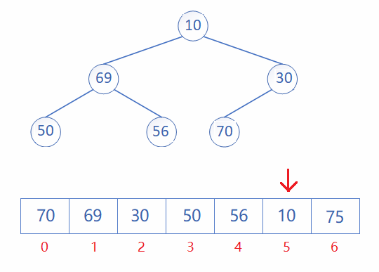
</center>

~~~c
void AdjustDown(int* a, int n, int parent)
{
	int child = parent * 2 + 1;
	while (child < n)
    {
        if (child + 1 < n && a[child + 1] > a[child])
			child++;

		if (a[child] > a[parent])
			Swap(&a[child], &a[parent]);
		else
			break;

        parent = child;
        child = parent * 2 + 1;
	}
}
void HeapSort(int* a, int n)
{
	//建堆
	for (int i = (n - 1 - 1) / 2; i >= 0; i--)
		AdjustDown(a, n, i);

	//堆排序
	for (int i = n - 1; i > 0; i--)
    {
		Swap(&a[0], &a[i]);
		AdjustDown(a, i, 0);
	}
}
~~~

#### 复杂度分析

虽然堆排序也是选择排序，但堆排序利用了堆的性质大幅缩减了比较的次数，达到了 $O(nlogn)$。可见堆排和希排属于同一级别的排序。

[具体推算见堆章节](/docs/DS/4-二叉树.md#_3-堆)

&nbsp;

## 3 交换排序

交换排序就是通过交换两个元素来修正序列的顺序。快速排序和冒泡排序都是交换排序，区别在于如何交换这两个元素。

### 3.1 冒泡排序

#### 基本思想

**相邻两数进行比较，满足交换条件就交换**。每趟排序将一个最值放到末尾。

> - 第一趟排序比较前 $n-1$ 数，共比较 $n-1$ 次，将最大数放到第 $n$ 个位置；
> - 第二趟排序比较前 $n-2$ 数，共比较 $n-2$ 次，将次最大数放到第 $n-1$ 个位置；
> - 第 $i$ 趟排序比较前 $n-i$ 数，共比较 $n-i$ 次，将次最大数放到第 $n-i+1$ 个位置；

<center>
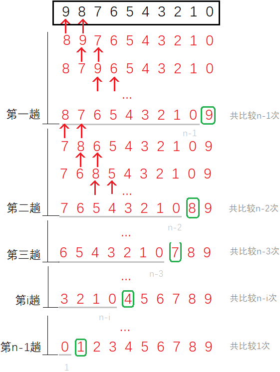
</center>

共排序 $n-1$ 趟，每趟排序比上一趟少比较 $1$ 个数，共将 $n-1$ 个数放到末尾，最后一个自然放到了开头。

#### 代码实现

<center>

</center>

~~~c
void BubbleSort(int* a, int n)
{
    //多趟排序 - 控制次数
	for (int i = 0; i < n; i++)
    {
		bool no_swap = true;
        //单趟排序 - 控制边界
		for (int j = 1; j < n - i; j++)
        {
			if (a[j - 1] > a[j])
            {
				Swap(&a[j - 1], &a[j]);
                no_swap = false;
			}
		}

		if (no_swap)
			break;
	}
}
~~~

通过加上`no_swap`的判断条件优化，单趟排序结束后如果一次交换都没发生，就说明数组已经有序，就可以停止排序了。

#### 复杂度分析

冒泡排序的时间复杂度为 $O(n^2)$ ，其最好情况即数组顺序有序的情况下，时间复杂度为 $O(n)$。

##### 插排 选排 冒泡比较

首先，直接选排的时间复杂度一直是都是 $O(n^2)$，所以选择排序的效率是最差的。其次，直接插排和冒泡排序在最坏情况下也都是 $O(n^2)$，所以应对比一下二者的一般情况下的表现：

当数组顺序有序时，直接插排和冒泡都是 $O(n)$。当数组接近有序时，此时二者的原理不同就体现出优劣了：

以 $ 1 \quad2\quad3\quad4\quad6\quad5$ 为例：

1. 冒泡排序需要两趟排序，第一趟比较 $n-1$ 次将6放到末尾，第二趟比较 $n-2$ 次确认完全有序，共比较了 $n-1+n-2$ 次。
2. 直接插排共排序5趟，前4趟每趟比较1次共4次，第5趟时，5和6、4和5 发生比较，一共比较了$n-2+2=n$ 次。

**冒泡排序每趟都要从头开始比较到最终位置，而插入排序只会从无序的部分开始向前比较**。冒泡排序是”从后向前排“，插入排序是”从前向后排“。

<center>

</center>

> 从箭头的长度可以看出，冒泡排序每趟排序都是从头遍历到后才完成一趟排序，**就算前半部分呈有序状之后每趟同样会再遍历一遍**。
>
> 插入排序时从前向后排序，当数组接近有序时每趟排序只会比较2次，**之后的排序不会重复遍历之前已排好的有序部分**。

让二者排序一个很长的前半部分有序后半部分无序的数组时二者的区别就体现出来了。

&nbsp;

### 3.2 快速排序

快速排序是对冒泡排序的一种改进，在思想上具有巨大进步，是 Hoare 提出的一种整体思路类似于二叉树结构的一种排序方法，距今大约有60年之久。

#### 基本思想

快速排序的递归思想类似于二叉树结构的遍历。

1. 任取待排数组中的某个元素作为关键字`key`，
2. 通过一趟排序将该数组分割成两部分，**左数组的所有元素均小于该关键值，右数组的所有元素均大于该关键值**。

这就是一趟排序的流程，再对所得两个子数组分别重复上述过程，直至整个数组有序。

每次单趟排序都让数组整体更有序一些。快速排序的实现必须先理解清楚单趟排序，之后每趟排序都是最初的单趟排序的缩小版。

#### 1. Horae 版本

<center>

</center>

一般选最左边或最右边的元素作为关键字`key`。

<center>

</center>

单趟排序完成后，<u>使数组中比`key`小的元素在数组的左边，比`key`大的在数组的右边</u>，最后关键字`key`也到了最终位置。

<center>

</center>

**单趟排序的作用是将关键字`key`放到正确位置，顺便整理了一下数组使之更加有序**。类似于冒泡排序的将最大值放到尾处的最终位置，都是一趟排序排好一个数。

<center>
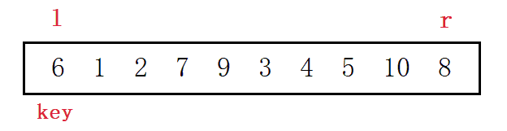
</center>

~~~c
// 递归版本1. Horae 版本
void quick_sort(int* a, int n)
{
    std::function<void(int*,int,int)> _sort = [&_sort](int* a, int le, int ri) {
        if (le >= ri)
            return;

        int i = le, l = le, r = ri;
        while (l < r) {
            while (l < r && a[r] >= a[i]) r--;
            while (l < r && a[l] <= a[i]) l++;
            swap(a[l], a[r]);
        }

        swap(a[l], a[i]);
        _sort(a, le, l - 1); // [le, l(r)-1] [l(r)+1,  i]
        _sort(a, l + 1, ri);
    };
    _sort(a, 0, n - 1);
}
~~~

在找左找右的代码中，有两个必须注意的问题，

1. 移动下标的循环条件必须加上`left<right`的条件，防止下标越界，
2. `a[left]<=a[keyi]`要加上等于的情况，以免指针遇到与key相等的元素无法移动，造成死循环。
3. `keyi`记录key元素的下标而不是值，因为最后交换需要下标。

> 看到这里，可以先把下面的排序主函数用上，实现完整的快排。[跳转到快排主函数](#judge)

##### 左右先走问题分析

> 当左右下标相遇后的该位置的值要与`key`交换，但有没有可能左右下标相遇位置的元素比key大，导致这个比key大的数被换到了左边呢？
>

不会出现这样的问题，因为在左右指针移动时，有这样的规定：

- **选最左边的值作`key`时，右边的下标`r`先走**，保证左右相遇时的值比key要小。
- **选最右边的值作`key`时，左边的下标`l`先走**，保证左右相遇时的值比key要大。

我们以选最左边作key，右边先走为例解释一下，在左右下标移动的过程中，无非有两种情况：

1. 特殊情况：数组中无比key小的数，右下标一次性就到了最左边与左下标相遇。这样key与key进行交换。
2. 一般情况：数组中间有比key小的数，右下标经历几番波折才与左下标相遇。
    - 要么最后右到了左的位置，该左下标的值一定已在上一轮交换中被换成比key小的数。
    - 要么最后左到了右的位置，此位置的值自然比key小。

只要按照**左作key右先走、右作key左先走**的规定，就不会出错。

<center>

</center>

#### 2. 挖坑法

> 挖坑法是针对单趟排序 Hoare 版本的简化变形。

<center>

</center>

> 左边挖坑右边填，右边挖坑左边填。

一样是<u>左边作key右边先走，右边作key左边先走</u>，同样以选最左边作`key`为例。

1. 将最左边的值用临时变量 key 保存起来，形成一个坑位。
2. 右下标先走，找比 key 小的值，找到放到左边的坑位中，自身又形成了一个坑位。
3. 左下标再走，找比 key 大的值，找到放到右边的坑位中，自身又形成了一个坑位。

以此类推，左右下标相遇后停止循环，再将`key`中的值放到当前下标所在位置的坑位中，就完成了单趟排序。

~~~c
//2. 挖坑法
int Partition2(int* a, int left, int right)
{
	int key = a[left];
	int pivot = left   // 定义坑位

	while (left < right)
    {
		while (left < right && a[right] >= key)
			--right;
		a[pivot] = a[right]; // 右下标的值放到左边的坑位中
		pivot = right;

		while (left < right && a[left] <= key)
			++left;
		a[pivot] = a[left]; // 左下标的值放到右边的坑位中
		pivot = left;
	}

	a[pivot] = key;
	return pivot;
}
~~~

> 挖坑法更简单流行，所以一般选择题所遇到的排序问题，默认都考察挖坑法。

#### 3. 前后指针法

> 前后指针版比较难以理解，但是代码比较简单。涉及到双指针的问题，一般拆开看，思考每个指针的作用，再放到一起看就明了了。

- 左边作key，`cur`起始位置在第2个元素，`prev`指向`cur`前1个位置，**排序有效区间是第2个元素到尾元素**。
- 右边作key，`cur`起始位置在第1个元素，`prev`指向`cur`前1个位置，**排序有效区间是首元素到倒数第2个元素**。

<center>
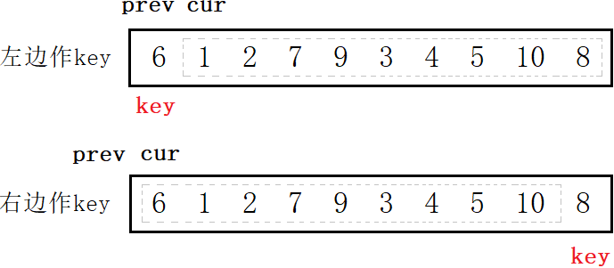
</center>

2. `cur`向后遍历数组，找比 key 小的元素（升序）。找到后`++prev`，再交换 cur 和 prev 的元素。
3. `cur`遍历完数组后，将 key 与 prev 元素交换。

> 左边作key时可直接交换，右边作key时先++prev，将大的值交换到右边。

<center>

</center>


由上图可以看出：

1. `cur`的任务就是遍历数组找比key小的值；
2. `prev`的任务是紧跟比key大的值，以便进行交换。保证 $[keyi+1,prev]$ 的值比 $a[keyi]$ 小， $[prev,cur]$ 的值比 $a[keyi]$ 大。

整个过程看起来就是，cur 把比 key 小的数往左放，prev 把比 key 大的数向右推。

~~~c
//左边作key
int Partition(int* a, int left, int right)
{
    int keyi = left;
	int cur = left + 1, prev = cur - 1;

	while (cur <= right) // 有效区间
    {
		if (a[cur] < a[keyi] && ++prev != cur) // cur找小
			Swap(&a[cur], &a[prev]);
		++cur;
	}

    Swap(&a[keyi], &a[prev]);
    return prev;
}

//右边作key
int Partition(int* a, int left, int right)
{
    int keyi = right;
	int cur = left, prev = cur - 1;

    while (cur < right) // 有效区间
    {
        if (a[cur] < a[keyi] && ++prev != cur) // cur找小
            Swap(&a[cur], &a[prev]);
        ++cur;
    }

    Swap(&a[keyi], &a[++prev]); // 把大的换到右边
    return prev;
}
~~~

> 前后指针版本可能较难理解，但实现却是最简单的，一般面试的时候都可以写这种。

#### <a id="judge">递归版本</a>

单趟排序之后，分出了左右子区间，倘若左右子区间都是有序的，那么整个排序就完成了。

至于左右子区间怎么使其有序，则是再将**左右子区间分别视为一个数组，继续对其执行单趟排序**。不断分割直至所得“数组”仅有一个元素时默认排序完成。

这便是整体排序的递归结构，类似于二叉树的前序遍历。

<center>
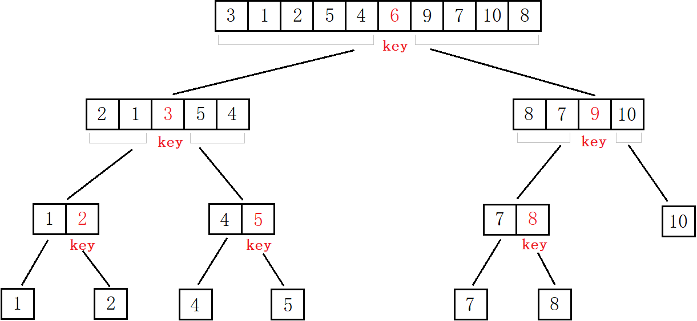
</center>

~~~c
void QuickSort(int* a, int left, int right)
{
    if (left >= right) // 区间只有一个值或区间不存在
		return;

	int keyi = Partition1(a, left, right); // 单趟排序
	QuickSort(a, left, keyi - 1);          // 递归左区间
    QuickSort(a, keyi + 1, right);         // 递归右区间
}
~~~

从上述代码看出，每次排序都将数组分成这样的三部分 $[left, key-1]$ 和 $key$ 和 $[key+1, right]$。key 所在位置已经排好序，再对前后两个子区间进行分治，递归调用即可。

<center>
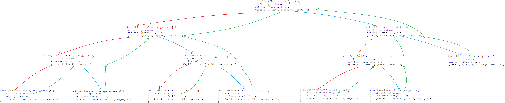
</center>

#### 复杂度分析

快速排序的时间复杂度和`key`的选择有很大的关系。如果每次我们都选到整个数组的中位数，也就是最佳情况，此时递归结构如图所示：

<center>

</center>

1. **时间复杂度就是数组长度乘二叉树高度，即 $n*logn = O(nlogn)$**。
2. 因为要建立栈桢，空间复杂度为 $O(logn)$ 。

> 当然上述的复杂度建立在每次都选到数组中位数的情况，是最佳情况。

#### 快排的缺陷和优化

1. 如果每次 key 都是整个数组的最值，那么每趟排序就不能使数组整体相对有序，这样复杂度就变成$O(n^2)$。可用三数取中优化。
2. 递归结构越到底层递归次数越多，而越到底层排序区间越小，这样递归的性价比太低，可用小区间优化解决。
3. 当数组元素完全相同时，基本快排无法优化要使用三路划分，复杂度为$O(n^2)$，应提前避免这种情况。

##### 三数取中

快排复杂度非常依赖`key`的值，最优情况是每次都选到或接近中位数的元素递归后呈现二叉树的结构。

最差情况则是数组顺序有序或接近有序时仍每次选择最左或最右边的最值作为`key`，如图所示：

<center>

</center>

这种情况下快排类似于冒泡排序，时间复杂度为 $O(n^2)$。此时若数据量大递归太多还容易栈溢出。

> 那如何解决快排面对数组有序的选key问题呢？解决方案叫三数取中。

选出整个数组的最左、最右、中间三者的中间数作`key`。

~~~c
void GetMidIndex(int* a, int left, int right)
{
    int midi = left + ((right - left) >> 1);
    //取中逻辑
    if (a[left] < a[right])   /** left < right **/
    {
        if (a[midi] < a[left])       //mid < left < right
            return left;
        else if (a[midi] < a[right]) //left < mid < right
            return midi;
        else                         //left < right < mid
            return right;
    }
    else                      /** left >= right **/
    {
		if (a[midi] > a[left])       //mid > left >= right
			return left;
		else if (a[midi] > a[right]) //left >= mid >= right
			return midi;
		else                         //left > right > mid
			return right;
    }
}
void QuickSort(int* a, int left, int right)
{
    //...

    //三数取中
	int midi = GetMidIndex(a, left, right);
    Swap(&a[left], &a[midi]);

    //...
}
~~~

三数取中尽量保证了选到的`key`不大不小尽量是中间值，以尽量保证递归结构是一棵完美的二叉树，避免了数组有序时的最坏情况。

##### 小区间优化

<center>

</center>

如图所示，当递归深到一定层次的时候，递归的区间就愈发的小，但递归的次数却多了起来。

> 假设有1000个数，最后一行接近 $2^9$ 次调用，倒数第二行接近 $2^8$ 次调用。占了总次数的绝大部分，而最后两层却只为排好几个数。代价太大。

为了避免这样的情况，减少递归次数，可以使用小区间优化。

小区间优化是指，当递归区间小到一定程度时（例如仅有10个元素），利用其他排序进行排序，以减少递归次数。

~~~c
//递归版本
void QuickSort(int* a, int left, int right)
{
	if (left >= right)
		return;

	//小区间优化
	if (right - left < 10) {
        InsertSort(a + left, right - left + 1);
        return;
    }

	int keyi = Partition3(a, left, right);
	QuickSort(a, left, keyi - 1);
	QuickSort(a, keyi + 1, right);
}
~~~

小区间意味着数组接近有序，而直接插排对接近有序的数组排序效果最好，所以小区间优化选择使用直接插排。

####  非递归版本

复杂递归一般难以用循环实现，快排的二叉树形递归称为双路递归。双路递归可以用栈的结构模拟。

将排序区间的左右下标保存到栈中，按照先入后出的特点，先入右区间再入左区间，让单趟排序函数读取栈里的左右下标来排序数组。

<center>

</center>

``` cpp
void QuickSortNonR(int* a, int left, int right)
{
	Stack st;
	StackInit(&st);

	StackPush(&st, left);
	StackPush(&st, right);

	while (!StackEmpty(&st))
    {
		// 读取左右下标
        int end = StackTop(&st);
		StackPop(&st);
		int begin = StackTop(&st);
		StackPop(&st);

		int keyi = Partition1(a, begin, end);
		// [begin,keyi-1] keyi [keyi+1,end]

		if (keyi + 1 < end) // 保证区间长度>1
        {
			StackPush(&st, keyi + 1);
			StackPush(&st, end);
		}
		if (begin < keyi - 1) // 保证区间长度>1
        {
			StackPush(&st, begin);
			StackPush(&st, keyi - 1);
		}
	}

	StackDestroy(&st);
}
```
```cpp
void QuickSortNonR(int* a, int left, int right)
{
    stack<int> s;
    s.push(left);
    s.push(right);

    while (!s.empty())
    {
        int end = s.top();
        s.pop();
        int bgn = s.top();
        s.pop();

        int keyi = partition(a, bgn, end);

        if (keyi + 1 < end)
        {
            s.push(keyi + 1);
            s.push(end);
        }
        if (bgn < keyi - 1)
        {
            s.push(bgn);
            s.push(keyi - 1);
        }
    }
}
```

>  非递归就是把原本存入递归栈帧中的区间左右下标存入栈结构中，每次循环即相当于一次递归。

&nbsp;

## 4 归并排序

归并操作在此并不是第一次出现，合并两个有序数组的操作就叫做归并。[合并有序数组](https://leetcode-cn.com/problems/merge-sorted-array/)

<center>

</center>

归并两个数组，就是每次选出最小值放到新数组中，单趟排序复杂度为 $O(n)$。

### 基本思想

> 如何归并数组的左右子序列是有序的呢？

这便要使用递归分治的思想：

1. 一个数组看作两个分开的区间，如果这两个区间有序就可以进行归并；
2. 这两个区间再分开看成四个区间，若这四个区间有序就可以进行归并；……
3. 如此循环往复，当区间只有一个元素或没有时就认为是有序的。

<center>

</center>

由上图可以看出：

1. 先递归分解数组，不停对半拆分成多个区间，直至区间内仅有一个元素或没有元素。
2. 再归并合并区间，先将最小的序列归并成有序序列，两个有序的序列不断合并，直至整个数组完成合并。

### 递归版本

~~~cpp
//递归子函数
void _MergeSort(int* a, int left, int right, int* tmp)
{
    if (left >= right)
        return;

    // 递归
    int mid = (left + right) >> 1;

    _merge_sort(a, left, mid, tmp);      // [left , mid  ]
    _merge_sort(a, mid + 1, right, tmp); // [mid+1, right]

	// 归并
    int i = left;
    int i1 = left, i2 = mid + 1;
    while (i1 <= mid && i2 <= right)
        tmp[i++] = a[i1] < a[i2] ? a[i1++] : a[i2++];

    while (i1 <= mid)
        tmp[i++] = a[i1++];
    while (i2 <= right)
        tmp[i++] = a[i2++];

    memcpy(a + left, tmp + left, sizeof(int) * (right - left + 1));
}

//归并排序主函数
void MergeSort(int* a, int n)
{
	int* tmp = (int*)malloc(sizeof(int) * n);
    assert(tmp);

	_MergeSort(a, 0, n - 1, tmp);

	free(tmp);
	tmp = NULL;
}
~~~

递归分解到只有一个元素时，开始两两归并成一个数组。具体是归并到新数组`tmp`中，再逐个拷贝回`a`数组。

<center>
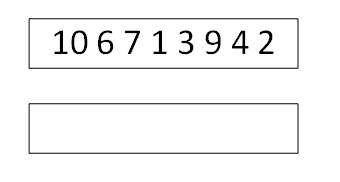
</center>

<center>
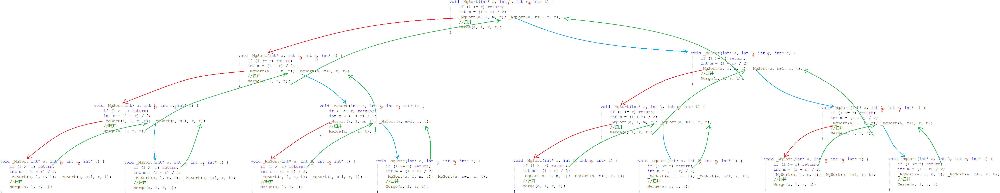
</center>

### 非递归版本

> 快排非递归使用栈是因为每次排序区间的下标是不确定的，只能入栈来解决。归并的非递归不用借助其他数据结构，因为归并排序是严格的二分，排序区间的下标是确定的。

不用递归我们就可以跳过递归分解的步骤，直接将数组划分区间。第一次循环11归并，第二次循环22归并，第三次循环44归并，知道整个数组归并完成。

<center>

</center>

```cpp
void MergeSortNonR(int* a, int n)
{
    int* tmp = new int[n];

    int ranger = 1;
    while (ranger < n)
    {
        for (int begin = 0; begin < n; begin += ranger * 2)
        {
            // [bgn, bgn+rgr-1] [bgn+rgr, bgn+rgr*2-1]
            int i1 = begin, i2 = begin + ranger;
            int i = begin;
            while (i1 < begin + ranger && i2 < begin + ranger * 2)
                tmp[i++] = a[i1] < a[i2] ? a[i1++] : a[i2++];

            while (i1 < begin + ranger)
                tmp[i++] = a[i1++];
            while (i2 < begin + ranger * 2)
                tmp[i++] = a[i2++];

            memcpy(a + begin, tmp + begin, sizeof(int) * (ranger * 2));
        }
        ranger *= 2;
    }

    delete[] tmp;
}
```

这样固然简单，但是如果数组的长度不是2的次方，就存在越界访问的问题。

> 如果数组有10个元素，在22归的时候就会出现越界访问。同理，如果数组有奇数个元素，11归的时候就越界。

<center>
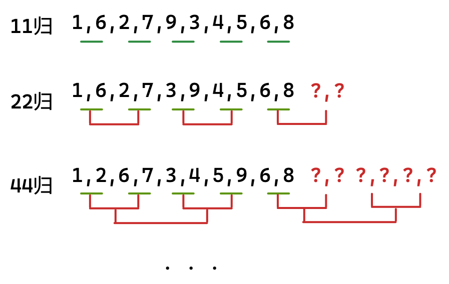
</center>

可见问题是，没有处理好**数组末尾处归并区间越界**的问题。

实际上，归并左右区间 $[begin1,end1][begin2,end2]$ 中只有 $begin1$ 不会越界。其他都有越界的可能。故总共有三种情况：

| 情况          | 解决方案                                     |
| ------------- | -------------------------------------------- |
| $end1$ 越界   | 修正$end1$为数组末尾，屏蔽 $[begin2,end2]$。 |
| $begin2$ 越界 | 屏蔽 $[begin2,end2]$。                       |
| $end2$ 越界   | 修正$end2$为数组末尾。                       |

```cpp
void MergeSortNonR(int* a, int n)
{
    int* tmp = new int[n];

    int ranger = 1;
    while (ranger < n)
    {
        for (int i = 0; i < n; i += ranger * 2)
        {
            // [i, i+rgr-1] [i+rgr, i+rgr*2-1]
            int b1 = i, b2 = i + ranger;
            int e1 = i + ranger - 1, e2 = i + 2 * ranger - 1;

            if (e1 >= n) {       // end1 越界
                e1 = n-1;
                b2 = n, e2 = n - 1;
            }
            else if (b2 >= n) {  // begin2 越界
                b2 = n, e2 = n - 1;
            }
            else if (e2 >= n) {  // end2 越界
                e2 = n - 1;
            }

            int j = i;
            while (b1 <= e1 && b2 <= e2)
                tmp[j++] = a[b1] < a[b2] ? a[b1++] : a[b2++];

            while (b1 <= e1)
                tmp[j++] = a[b1++];
            while (b2 <= e2)
                tmp[j++] = a[b2++];

            memcpy(a + i, tmp + i, sizeof(int) * (e2 - i + 1)); // 灵活区间长度
        }

        //memcpy(a, tmp, sizeof(int) * n);
        ranger *= 2;
    }

    delete[] tmp;
}
```

- 拷贝区间长度`e2-i+1`而不是`e2-b1+1`，因为`b1`在归并过程中已被改变。
- 当然，`end1`和`begin2`越界的情况，也可以直接`break`。因为末尾区间不会被归并只会拷过来拷回去，但要记得此时不能归并完整个数组再拷贝，会把随机值拷贝回去。

```cpp
void MergeSortNonR(int* a, int n)
{
    int* tmp = new int[n];

    int ranger = 1;
    while (ranger < n)
    {
        for (int i = 0; i < n; i += ranger * 2)
        {
            int b1 = i, b2 = i + ranger;
            int e1 = i + ranger - 1, e2 = i + 2 * ranger - 1;

            if (e1 >= n)        // end1 越界
            	break;
            else if (b2 >= n)   // begin2 越界
            	break;
            else if (e2 >= n)   // end2 越界
				e2 = n - 1;

            int j = i;
            while (b1 <= e1 && b2 <= e2)
                tmp[j++] = a[b1] < a[b2] ? a[b1++] : a[b2++];

            while (b1 <= e1)
                tmp[j++] = a[b1++];
            while (b2 <= e2)
                tmp[j++] = a[b2++];

            memcpy(a + i, tmp + i, sizeof(int) * (e2 - i + 1)); // 灵活区间长度
        }

        ranger *= 2;
    }

    delete[] tmp;
}
```

### 复杂度分析

从归并排序的解析图看，归并排序和快排类似，都是二叉树形的双路递归。区别是快排是“先序”，归并是“后序”。

<center>

</center>

所以**归并排序的时间复杂度是严格的 $O(nlogn)$**，空间复杂度是 $O(n)$。

> 快排的时间复杂度依赖选key所以不是严格的$O(nlogn)$。
>
> 归并排序的空间复杂度，精确来说要加上栈桢的消耗，是$O(n+logn)$，但$O(logn)$太小可以忽略。

因为归并排序有额外的空间消耗，故实际中用的并不多。

&nbsp;

## 5 计数排序

### 基本思想

计数排序不比较元素，而是统计每个元素的出现次数。

1. 根据数组中元素的范围，开辟足够的空间。
2. 将数组中的元素按数值无重复地映射到新空间的下标上。统计并存储元素出现的次数。
3. 根据元素出现的次数，将元素写回到原数组中。

<center>

</center>

相对映射：

1. 根据数组元素中的最大值和最小值，二者之间的区间范围就是映射空间的大小。
2. 映射位置是元素值 $x$ 减去最小值 $min$。

### 代码实现

```cpp
void count_sort(int* a, int n)
{
    // 求范围
    int mx = a[0], mi = a[0];
    for (int i = 0; i < n; i++) {
        mx = max(a[i], mx);
        mi = min(a[i], mi);
    }

    int len = mx - mi + 1;
    int* count = new int[len]{0};
	// 统计个数
    for (int i = 0; i < n; i++)
        count[a[i] - mi]++;

	// 写回数组
    for (int i = 0, j = 0; i < len; i++) {
        while (count[i]--)
			a[j++] = i;
    }
}
```

### 复杂度分析

两次遍历数组足以完成计数排序，时间复杂度为 $O(max(n,\;range))$。

也意味着**计数排序适合数据范围比较集中的整数数组**。如果数组元素如果有正有负也不适合计数排序。

&nbsp;

## 复杂度稳定性分析

稳定性的定义：

如果能保证相同的元素的相对位置不变就是稳定的，反之就是不稳定的。如果该排序能做到稳定，那它就是稳定的，反之则是不稳定的。

稳定性的意义：

稳定性只在特殊的情况下有价值，一般没什么用。

对于一个整数，数字的值属性就是其全部意义。但对于复杂的类型，位置的改变可能会违背我们的需求规则。

> 比如考试成绩分数相同的情况下就要看交卷的早晚，如果如果更改位置就无法保证交卷早的在前面交卷迟的在后面了。

| 排序     | 时间复杂度   | 空间复杂度 | 稳定性 | 解释                                 |
| -------- | ------------ | ---------- | ------ | ------------------------------------ |
| 直接插排 | $O(n^2)$     | $O(1)$     | 稳定   | 如果想等，直接在后面停住             |
| 希尔排序 | $O(n^{1.3})$ | $O(1)$     | 不稳定 | 分组预排，可能调换位置               |
| 直接选排 | $O(n^2)$     | $O(1)$     | 不稳定 | 交换的时候，可能会把后面的换到前面来 |
| 堆排     | $O(nlogn)$   | $O(1)$     | 不稳定 | 向下调整时，可能会改变相对位置       |
| 冒泡排序 | $O(n^2)$     | $O(1)$     | 稳定   | 如果相等，不会发生交换               |
| 快排     | $O(nlogn)$   | $O(logn)$  | 不稳定 | 单趟排序相互交换无法保证稳定性       |
| 归并排序 | $O(nlogn)$   | $O(n)$     | 稳定   | 归并操作就是稳定的                   |

直接选排不稳定如下图：

<center>
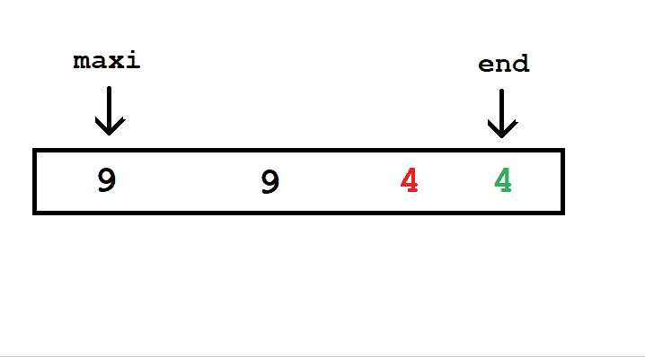
</center>

堆排序不稳定如下图：

<center>

</center>
