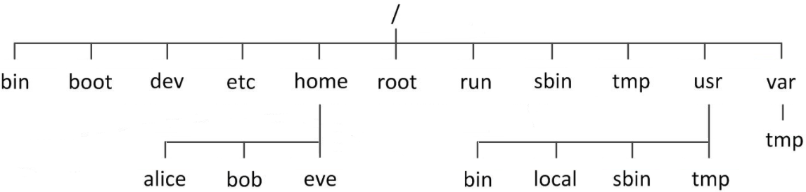
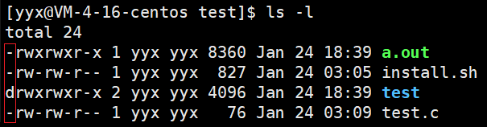
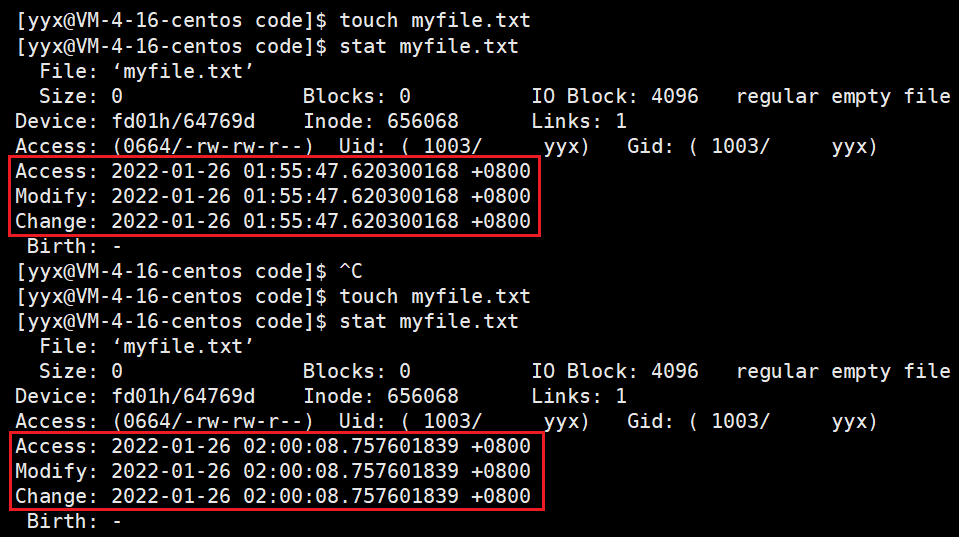
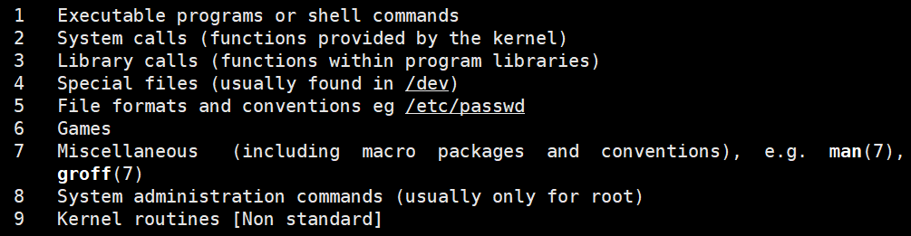
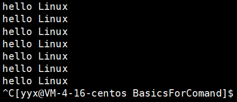
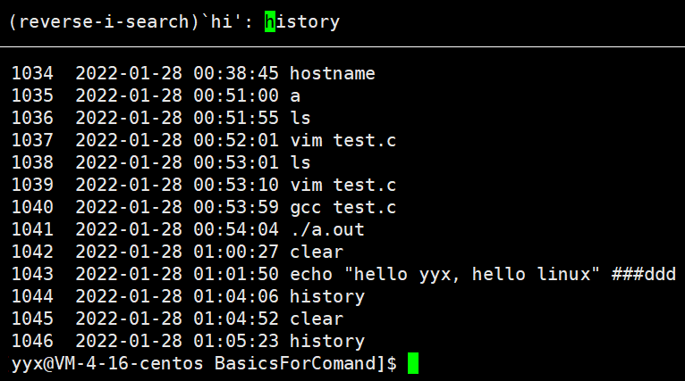

# 基础指令

使用Linux系统的第一步就是先熟悉Linux的各种指令，之后才能谈Linux的系统编程和网络编程。

### 1. pwd 指令

~~~shell
$ pwd # 显示用户当前所在目录
/home/yyx/test
~~~

Linux 下的路径以`/`作为路径分隔符，Windows 下以`\`作为路径分隔符。而路径就是由目录和路径组成的。

### 2. cd 指令

~~~shell
$ cd 目录名 # 进入指定目录
$ cd .     # 返回当前目录
$ cd ..    # 返回上级目录
$ cd ~     # 进入用户家目录
$ cd -     # 返回上一次访问的目录
~~~

大部分操作系统中，组织文件的基本结构就是一颗多叉树，每一个节点都是目录或文件，Linux系统也不例外。

<center>

</center>

从上图可以看出，采用路径的方式可以确定一个文件的位置。

| 路径类型 | 解释                                                         |示例|
| -------- | ------------------------------------------------------------ | -------- |
| 绝对路径 | 从根目录到文件所在目录再加上文件名，具有唯一性 |`/home/yyx/test.c`|
| 相对路径 | 相对当前地址的路径，不以根目录开头不具有唯一性 |`yyx/test.c`、`./a.out`|

> `./a.out`是可以执行可执行程序，本质也是相对路径。

### 3. ls 指令

~~~shell
$ ls [选项] [目录或文件]
~~~

- 对于目录，列出当前目录下所有子目录和文件
- 对于文件，列出该文件的文件名和其他信息

> 文件是内容和属性的总和，属性是文件的名称，创建日期这些信息等等。

~~~shell
$ ls              # 查看当前目录下的文件
lighthouse  www  yyx
$ ls /home        # 查看指定目录下的文件
lighthouse  www  yyx
$ ls -a           # 列出当前目录下全部文件，包括隐藏文件
.  ..  lighthouse  www  yyx
$ ls -l           # -l 列出文件的详细属性
total 8
-rw-rw-r-- 1 yyx yyx   10 Dec 14 06:36 myfile.c
drwxrwxr-x 2 yyx yyx 4096 Dec 14 06:32 test
$ ls -al -d code  # 对于目录默认显示目录下的文件，-d 查看目录本身的属性
drwxrwxr-x 3 yyx yyx 4096 Jan 25 05:23 code
~~~

`.`代表当前路径、`..`代表上级路径，任何目录下都有这两个文件，他们都是隐藏文件。

<center>

</center>

> 文件属性开头的一串字符串的起始字符分别为`d`和`-`，分别代表文件类型是目录和普通目录。

- `-i`输出文件的 i 节点的索引信息。
- `-k`以 k 字节的形式表示文件的大小。
- `-n`用数字的 UID，GID 代替名称。
- `-F`在每个文件名后附上说明文件类型的字符。`*`表示可执行普通文件，`/`表示目录，`@`表示符号链接，`|`表示FIFOs，`=`表示套接字。
- `-r`对目录反向排列。
- `-t`按时间顺序排列。
- `-s`在文件名前输出该文件的大小。
- `-R`类似于树层序遍历的形式，递归列出所有子目录下的文件。
- `-1`一行输出一个文件。

### 4. touch 指令

~~~shell
$ touch [选项] 文件 # 新建一个不存在的文件，或更新文件的修改时间
~~~

<center>

</center>

可以看到，对已有文件使用 touch 命令更新文件的时间，图中的三种时间的概念分别是：

| 时间        | 解释                                               |
| ----------- | -------------------------------------------------- |
| Access time | 最近一次访问文件的时间                             |
| Modify time | 最近一次修改文件的时间                             |
| Change time | 最近一次更改文件属性的时间，包括权限，大小，属性等 |

1. 当仅读取或访问文件时，仅改变 access time；
2. 当修改文件内容时，modify time、change time 会改变；
3. 当修改文件权限属性时，change time 改变。

- `-a`，或`--time=atime`或`--time=accses`或`--time=use`只更改存取时间。
- `-c`，或`--no-create`不建立任何文件。
- `-m`，或`-time=mtime`或`--time=modify`只更改变动时间。
- `-d`，使用指定的日期时间，而非现在的时间。
- `-f`，此参数将忽略不予处理，仅负责解决 BSD 版本 touch 指令的兼容问题。
- `-r`，把指定文件或目录的时间日期，设成和参考文档或目录的日期时间。
- `-t`，使用指定的日期时间，而非现在的时间。

### 5. mkdir 指令

~~~shell
$ mkdir [选项] 目录名 # 指定位置创建一个目录
$ mkdir -p  p1/p2/p3 # -p，建立多个目录，按目录层级自动创建目录
$ tree .
.
|-- p1
|   `-- p2
|       `-- p3
`-- test.c
~~~

### 6. rmdir 和 rm 指令

~~~shell
$ rmdir [选项] 目录名
$ rmdir -p p1/p2/p3  # 删除多个空目录，若子目录被删除后父目录变为空目录，就连带父目录一起删除
~~~

rmdir 和 mkdir 相对应，一个是创建目录一个是删除目录，但 rmdir 只能删除空目录。

rm 命令可以同时删除文件和目录。

```shell
$ rm -f test # 强制删除属性为只读或称写保护的文件
$ rm -r test # 递归删除目录及其下所有文件
$ rm -i test # 删除前逐一询问确认是否删除
```

> 当使用`rm -rf`删除文件时，必须要明确删除那些内容以及是否能承担删除的后果，不能有误操作，Linux没有回收站机制。

### 7. man 指令

~~~shell
$ man [选项] 命令
~~~

Linux中命令有很多，不可能全部记住，man 指令就是查看联机手册获取帮助。

- `-k`，根据关键字搜索联机帮助。
- `num`，只查看第 num 章节的内容。
- `-a`，显示所有章节的内容。

该手册共有9章，第一章是默认的命令，第二章是系统调用函数，第三章是库调用的函数，最常用的就是这三章。

<center>

</center>

### 8. cp 指令

~~~shell
$ cp [选项] src文件或目录 dst文件或目录 # 复制文件或目录，到另一个文件或目录中
$ cp p1.c p2.c    # 1. p1.c 拷贝到文件 p2.c
$ cp p1.c code    # 2. p1.c 拷贝到目录 code
$ cp -r dir1 dir2 # 3. dir1 拷贝到目录 dir2
~~~

- `-f`，强行复制文件或目录，不论目标文件或目录的权限以及是否存在。
- `-i`，若覆盖文件前会先询问用户。
- `-r`，递归拷贝该目录下的文件和子目录到另一个目录中。

### 9. mv 指令

~~~shell
$ mv [选项] src文件或目录 dst文件或目录 # 移动文件或目录，一般用于备份文件和目录
$ mv file.txt dir2 # 剪切文件至目录
$ mv dir2 dir      # 重命名文件
~~~

### 10. cat 指令

~~~shell
$ cat [选项] [文件]      # 将文件内容输出到标准输出
~~~

```shell
$ cat test.c -n         # 对输出的所有行加行号显示
     1  #include <stdio.h>
     2  int main()
     3  {
     4    printf("hello\n");
     5    return 0;
     6  }
$ cat test.c -b         # 仅对非空的输出行加行号显示
     1  #include <stdio.h>
     2  int main()
     3  {
     4    printf("hello\n");
     5    return 0;
     6  }
$ cat test.c -b
     1  #include <stdio.h>
     2  int main()
     3  {

     4    printf("hello\n");


     5    return 0;
     6  }
$ cat test.c -s         # 不输出多行空行，仅用一行代替
#include <stdio.h>
int main()
{

  printf("hello\n");

  return 0;
}
```

> tac 指令可以逆序输出内容，cat 是正序输出。

### 11. more 和 less 指令

~~~shell
$ more [选项] 文件
~~~

more可以输出满屏但不跳过前面的部分。`-n`对所有行加行号，输出时按 q 退出。

- 按回车一行行输出，按空格多行输出。
- 输出的时候输入`/`+行数，可以跳转到相应的行数附近，但是这样的搜索仅能向下搜。

~~~shell
$ less [选项] 文件
~~~

less 也是对文件进行分页显示的工具，是Linux中最为常用的查看文件内容的工具，功能很强大。

less 比起 more 更加有弹性，使用 less 可以随意浏览文件，使用 less 可以用上下键和 PgUp PgDn 进行上下翻阅。less 具有更多的搜索功能，不仅能向上搜还可以向下搜。而且 less 在查看时不会将整个文件都加载到内存中。

- `-i`，忽略搜索时的大小写
- `-N`，显示行号
- `/`向下搜索字符串，`?`向上搜索字符串。

> 所以当查看大文件时，less 更具优势。

### 12. head 和 tail 指令

head 和 tail 是文本的局部查看工具，可以显示开头或结尾某个数量的局部内容。

~~~shell
$ head [选项] 文件
$ tail [选项] 文件
~~~

- `-n`，head 默认显示文件的前十行内容至标准输出，加上 -n 选项可以查看指定行数的内容。tail 则相反。

- `-f`，tail 命令带上`-f`选项，可以不断刷新地显示尾部内容，可以看到最新的文件内容，一般用于查看日志文件。

> 有了头部尾部的查看，如何进行中间局部的显示呢？

使用 echo 命令可以输出字符串，默认输出到标准输出中，但可以重定向至文件中。也可以将文件中的内容输入至程序，即输入重定向。

~~~shell
$ echo "hello yyx, hello linux"
hello yyx, hello linux
$ echo "hello yyx, hello linux" > log.txt  # 输出重定向
$ cat log.txt
hello yyx, hello linux
$ echo "hello yyx, hello linux" >> log.txt # 追加重定向
$ cat log.txt
hello yyx, hello linux
hello yyx, hello linux
$ cat < log.txt # 输入重定向
hello yyx, hello linux
~~~

利用输入输出重定向，可以将文件的部分内容输出到另一个文件再输出该文件的部分，就完成了局部查看的功能。如：

~~~shell
# 1.
$ head -120 file.txt > log.txt # 将file.txt前120行输出到log.txt
$ tail -20 log.txt # 输出log.txt的后20行
hello 100
hello 101
hello 102
...
hello 118
hello 119
# 2.
$ head -120 file.txt | tail -20 #利用管道也可以
~~~

> 将 file.txt 前120行输出到 log.txt，再输出 log.txt 的后20行，这样就完成了 file.txt 的局部输出的功能。管道可以将前命令的处理结果输出给后一个命令。

&nbsp;

### 13. date 指令

~~~shell
$ date [选项] [格式]
~~~

date 命令可以显示当前时间，如：

~~~shell
$ date
Thu Jan 27 00:10:02 CST 2022
~~~

使用者可以预设显示的格式，格式符号前需加上一个`+`再接数个标记，常用的标记如下：

- `%Y`是年份，`%m`是月份，`%d`是日期；
- `%H`是小时，`%M`是分钟，`%S`是秒钟，中间的间隔符号可随意设置。
- `%F`相当于`%Y-%m-%d`，`%X`相当于`%H:%M:%S`。

~~~shell
$ date +%Y-%m-%d\ %H:%M:%S
2022-01-27 00:17:08
$ date +%s
1643215957           # 获取时间戳
$ date -d@1643215957 # 换算时间戳
Thu Jan 27 00:52:37 CST 2022
~~~

上面这样的一串数字就是时间戳，代表着从1970年1月1号0时0分0秒开始到现在所过的秒数。计算机利用时间戳来记录时间，日志中涵盖时间信息。

### 14. cal 指令

~~~sh
$ cal [参数] [月份] [年份]
~~~

cal 命令可以显示阳历。具体由如下选项。

- `-3`，显示系统时间的前一个月、当前月、后一个月的日历。
- `-j`，显示当前时间是今年的第多少天。
- `年份`，直接输入年份，显示当前一整年的日历。

~~~sh
$ cal -3
    December 2021         January 2022          February 2022
Su Mo Tu We Th Fr Sa  Su Mo Tu We Th Fr Sa  Su Mo Tu We Th Fr Sa
          1  2  3  4                     1         1  2  3  4  5
 5  6  7  8  9 10 11   2  3  4  5  6  7  8   6  7  8  9 10 11 12
12 13 14 15 16 17 18   9 10 11 12 13 14 15  13 14 15 16 17 18 19
19 20 21 22 23 24 25  16 17 18 19 20 21 22  20 21 22 23 24 25 26
26 27 28 29 30 31     23 24 25 26 27 28 29  27 28
~~~

### 15. find 指令

find 命令可以在目录树中搜索文件，并执行指定的操作。find 指令提供了相当多的查找选项，功能十分强大，所以学习成本也比较高。当然遍历一个非常大的文件系统时，也会消耗一定的时间。

现阶段只讲解一种方式，即在指定目录下查找特定文件：

~~~sh
$ find pathname -name
~~~

~~~sh
$ find . -name test.c # 在当前目录下查找名为test.c的文件
./code/test.c
~~~

### 16. grep 指令

与 find 类似，find 指令是在目录树中查找文件，grep 指令是在文件中查找字符串。grep 指令叫查找字符串指令，也可以叫行过滤指令。功能是在指定文件中查找指定的字符串，并将满足条件的行全部打印出来。

~~~sh
$  cat file.txt | grep 99 # 在file.txt中查找字符串99所在行
$ grep 99 file.txt
~~~

- `-i`，忽略指定字符串的大小写。
- `-n`，将打印结果加上行号显示
- `-v`，反向搜索，即只输出不满足条件的行

~~~sh
$ grep -in 'Linux' file.txt
5:Hello Linux
6:hello linux
~~~

> grep 也支持正则表达式。

### 18. zip 和 unzip 指令

~~~sh
$ zip 压缩文件.zip 文件
$ unzip 压缩文件.zip
~~~

Linux中压缩工具比较多，这里只介绍两个，一个是 zip/unzip，一个是 tar。

一般情况下，zip 只针对指定的文件进行压缩，所以想要压缩目录及其下的文件时，就要带上`-r`选项。

- `-r`，递归压缩，压缩当前目录及其下的所有文件。
- `-d`，解压时指定解压到的目录。

~~~sh
$ zip -r code.zip code #压缩目录code为code.zip
  adding: code/ (stored 0%)
  adding: code/test.c (deflated 10%)
  adding: code/dir/ (stored 0%)
$ unzip code.zip -d .. #解压文件code.zip至上级目录
Archive:  code.zip
   creating: code/
  inflating: code/test.c
   creating: code/dir/
~~~

### 19. tar 指令

~~~sh
$ tar [-czf] 打包文件.tgz 文件 #压缩
$ tar [-xzf] 打包文件.tgz 文件 #解压
~~~

tar 是Linux 下进行打包压缩或解包解压的工具。tar所创建的压缩文件后缀为`tar.gz`，一般简写成`tgz`。

- `-c` (create)，表示创建一个新文件；`-x` ，表示解压一个文件。

- `-z`(zip)，表示采用 gzip 的算法压缩文件，若不带该选项的话就是只打包不压缩。
- `-f`(filename)，表示指明压缩文档的名称，-f 后必须紧跟档名不能再加其他选项。
- `-v`(visual)，表示压缩过程中显示压缩文件。
- `-C`，表示指定压缩到指定目录。

~~~sh
$ tar -czvf code.tgz code # 压缩code为code.tgz
code/
code/test.c
code/dir/
$ ls
code  code.tgz
$ tar xzvf code.tgz -C .. # 解压code.tgz至上级目录
code/
code/test.c
code/dir/
$ ls
code  code.zip
~~~

> 打包和压缩的区别在于：打包是指将一大堆文件或目录变成一个总的文件，压缩则是将一个大的文件通过一些压缩算法变成一个小文件。
>
> 为什么要区分这两个概念呢？Linux中的很多压缩程序只能针对一个文件进行压缩，这样当你想要压缩一大堆文件时，你就得先借助另外的工具将这一大堆文件先打成一个包，然后再就原来的压缩程序进行压缩。

### 20. bc 指令

Linux下的计算器，输入计算式就会自动将答案打印到屏幕。

~~~sh
$ echo "1+2+3+4" | bc
10
~~~

### 21. uname 指令

uname 用于查看系统的信息。

~~~sh
$ uname
Linux
$ uname -a
Linux VM-4-16-centos 3.10.0-1160.11.1.el7.x86_64 #1 SMP Fri Dec 18 16:34:56 UTC 2020 x86_64 x86_64 x86_64 GNU/Linux
# 主机名 -- VM-4-16-centos
# 内核版本 -- 3.10.0-1160.11.1.
# 发行版本 -- el7
# CPU结构 -- x86_64
~~~

### 22. shutdown 指令

~~~sh
shutdown [选项]
~~~

- `-h`，将系统的服务停掉后，立即关机。
- `-r`，在将系统的服务停掉之后就重新启动。
- `-t sec` ，-t 后面加秒数，亦即过几秒后关机。

### 23. Tab ^C ^R ^D 热键

Tab 键可以帮助我们将命令自动补全，如果由多个会在下方排列出来提供查看。

~~~sh
$ wh
whatis    whereis   which     while     whiptail  who       whoami
~~~

Ctrl+C 可以终止一切正在运行的程序，比如死循环打印时就可以使用 ^C：

<center>

</center>

Ctrl+R 可以快速搜索历史输入的命令，再按回车就可以直接运行。或者直接输入`history`查看历史命令。

<center>

</center>

Ctrl+D 可以直接退出登录，再按一次就可以关掉xshell。