# 开发工具

> 如 Visual Studio、IDEA 这样的集编写编译调试运行以及各种复杂功能于一身的开发工具，叫做集成开发环境 IDE。Linux 下一般使用代码编辑工具 vi/vim，编译工具 gcc/g++，调试工具 gdb。

## 1. 编辑工具 vim

vim，它是一款十分强大的多模式的文本编辑器，所有的类 unix 系统都会内置 vi 编辑器，目前使用较多的是 vim 编辑器，是 vi 的升级版。

虽说 vim 是个文本编辑器，但它更专注于代码的编写，具有语法高亮等功能。

~~~shell
$ vim fileName # 使用vim打开文件，文件不存在则会创建文件。
~~~

### 1.1 vim 的基本模式

vim 基本的模式有三：命令模式（normal mode）插入模式（insert mode）底行模式（command mode），vim 启动默认进入命令模式。

- 命令模式下输入`i`可以进入输入模式，再按`Esc`键就可以回退到命令模式。
- 命令模式下输入`:`即可进入底行模式，再按`Esc`键就可以回退到命令模式。

- 底行模式下输入`wq`可以保存退出。

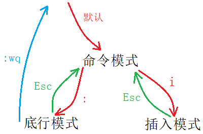

> 知悉上述基本的模式切换方法后，再逐个介绍模式。

#### 命令模式（normal）

vim 启动默认进入命令模式。此状态下敲击键盘动作会被 Vim 识别为命令，而非输入字符。

可进行的操作有：控制光标移动，字符、单词或行的删改，移动或复制粘贴文本内容，切换到插入或底行模式。

#### 底行模式（command）

命令模式只有一些最基本的命令，因此仍要依靠底线命令模式输入更多命令。

命令模式下输入`:`即可进入底行模式，底线命令模式可以输入多个字符的命令，可用的命令非常多。

#### 插入模式（insert）

文本编辑模式。一般要先退回到命令模式才能进到底行模式。

> vim 总共有13种模式，但这三个基本模式已经能满足我们大部分需求，其他模式会在之后的使用中学习。

### 1.2 vim 一般模式命令集

#### 切换模式

- 切换到插入模式：`i`,`a`,`o`，进入底行模式：`Esc`。
- `i`是从光标的位置开始输入，`a`选项会将光标向后移动一位，`o`选项在所在行下方另起一行。
- `Esc`退回到命令模式后并光标向前移动一位。

#### 光标移动

- ⬅`H`、⬇`J`、⬆`K`、➡`L`，相当于方向键。
- 光标锚点跳至行首`^`、行尾`$`；跳至文章起始`gg`、末尾`G`；跳至指定行`n+gg`/`n+G`。
- 移动到下一个单词的起始`w`，移动到单词的末尾`e`，反向单词距移动`b`。（字符、字母、字母数字组合都被视为单词）
- `Ctrl+B`光标向下翻页，`Ctrl+F`向上翻页；`Ctrl+U`向下移动半页，`Ctrl+D`向上移动半页。

#### 删改内容

- 删除当前字符`x`，删除多个字符`n+x`；反向删除字符`X`，反向删多个字符`n+X`。
- 删除单词`dw`，删除当前行`dd`。
- 替换当前字符`r`，替换多个字符`n+r`，进入替换模式`R`。
- 修改当前单词`cw`，修改多个单词`cnw`。
- 字母大小写转换`~`。

#### 移动或复制内容

- 复制当前单词`yw`，复制多个单词`n+yw`。
- 复制当前行`yy`，复制多行`n+yy`。
- 剪切/删除当前行`dd`，剪切/删除多行`n+dd`。
- 粘贴到当前行下方`p`，粘贴多次`n+p`。

#### 撤销或恢复内容

- 撤销操作`u`。

- 恢复操作`Ctrl+r`。

#### 批量化注释或放开内容

- 批量化注释
  1. 先将光标移动到待注释的内容的起始行，
  2. 再`shift+i`将光标移动到行首并进入插入模式，
  3. 再`Ctrl+v`进入行可视化模式，
  4. 然后`jk`控制光标移动到待注释的内容的结束行，
  5. 最后输入行注释`//`，再按`Esc`回到命令模式。
- 批量化放开
  1. 先将光标移动到待注释的内容的起始行，
  2. 其次`shift+6`将光标移动到行首，
  3. 再`Ctrl+v`进入行可视化模式，
  4. 然后`jk`控制光标移动到待注释的内容的结束行，再`hl`横向移动光标扩选行首的`//`。
  5. 最后输入`d`就能将所选行的行首注释标识删除。

### 1.3 vim 底行模式命令集

> 底行模式命令有很多，目前掌握这几个就行。

#### 保存退出

- 底行模式下输入`w`可以保存文件，输入`q`可以退出程序。带上`!`表示强制执行。

#### 显式行号

- 显示行号`set nu`，取消行号`set nonu`。
- 跳转至某行，输入行号`n`即可。

#### 多文件操作

- 分屏操作多个文件`vs fileName`，切换操作文件/光标`Ctrl+w+w`。

#### 查找字符

1. `/Keyword`，输入`/`再输入查找的字符，在按`n`可以跳转至下一个关键字所在位置。
2. `?keyword`，输入`/`再输入查找的字符，在按`n`可以跳转至上一个关键字所在位置。
3. 可直接使用`shift+*`，查找当前光标所在的单词。

[Vim 从入门到精通 (github.com)](https://github.com/wsdjeg/vim-galore-zh_cn)

[最全 Vim 键位图 (runoob.com)](https://www.runoob.com/w3cnote/all-vim-cheatsheat.html)

&nbsp;

## 2. 编译工具 gcc/g++

gcc/g++ 分别是 C/C++ 的编译器。

~~~shell
$ gcc [选项] 编译文件 [选项] 目标文件
$ g++ [选项] 编译文件 [选项] 目标文件
~~~

> 接下来将通过使用 gcc 分段编译程序，来熟悉 gcc/g++ 的使用。

### 2.1 C/C++编译基本步骤

前面已经学过 C/C++ 程序基本的编译过程，也使用过 gcc 进行查看程序的翻译步骤：

1. 预处理（进行宏替换）
2. 编译（生成汇编代码）
3. 汇编（生成二进制目标文件）
4. 链接（生成可执行文件或库文件）

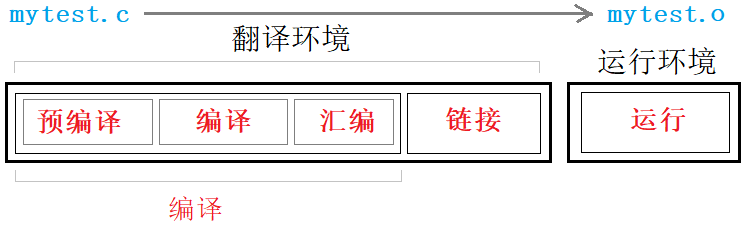

#### 预处理

预处理的功能主要包括**替换宏，文件包含，条件编译，删除注释**等。

~~~shell
$ gcc -E test.c -o test.i # 完成预处理
~~~

选项`-E`让翻译在预处理结束后停下来，预处理完的文件一般后缀为`.i`。

#### 编译

编译时，gcc 会**检查代码规范、语法错误**，确定代码所做的工作，检查无误后 gcc 会生成汇编代码。

~~~shell
$ gcc -S test.i -o test.s # 完成编译
~~~

编译阶段会生成汇编代码，以供接下来的汇编阶段使用。一般编译结束生成的代码文件的后缀为`.s`。

#### 汇编

汇编阶段将编译所形成的汇编代码**生成目标文件**，也就是二进制文件。

~~~shell
$ gcc -c test.s -o test.o # 完成汇编
~~~

虽然生成的是二进制目标文件，但仍然不可直接运行，准确的来说该文件是可重定向目标文件。

#### 链接

上述编译过程结束，最后要进行链接。链接完成之后，就生成了可执行文件。

~~~shell
$ gcc -o test test.o # 完成链接
~~~

链接是**将本文件和项目中其他源文件或者库文件链接在一起**。如图所示：

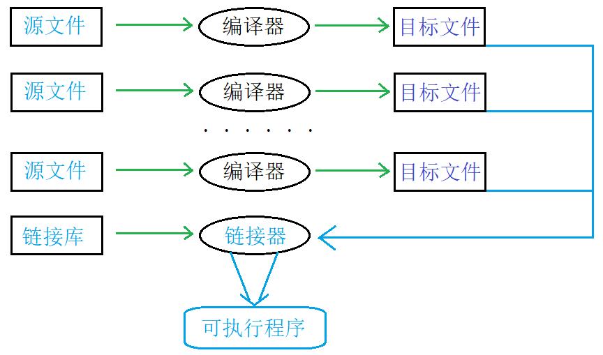

> 通常写程序时，就`include`了语言本身所提供的链接库文件，至于链接库文件到底是什么，接下来会讲解。

当然编译 C/C++ 程序，不需要上述这么复杂，直接执行即可：

~~~shell
$ gcc test.c -o test
$ gcc -o test test.c
~~~

### 2.2 链接库

#### 函数库的概念

语言本身会提供语言级别的库，库可以看成一套头文件和一套库文件。可以通过引用对应的头文件，来使用这些库。

使用`lld`命令可以查看可执行程序所依赖的第三方库：

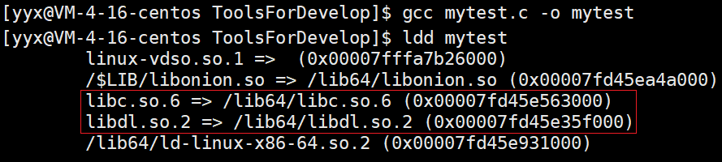

Linux 下的 C 静态库叫作`libcxxx.a`，动态库叫做`libcxxx.so`。一般去掉前后缀，`xxx`就是库名。

将用户所写的程序文件和第三方库提供的方法关联起来，这就叫链接。链接又分为静态链接和动态链接。

由上图可以看出，gcc 默认采用动态链接的方式生成的可执行程序。

~~~~shell
$ gcc test.c -o test                  # 默认动态方式
$ gcc test.c -o test_static -static   # 采用静态方式
~~~~

**静动态链接两者最大的区别就在于链接的时机不一样，静态链接是在形成可执行程序前，而动态链接是在程序执行时。**

#### 静态链接

链接要确定多文件相互调用函数的地址，静态链接会将库的内容拷贝到可执行程序中。然后才能生成可执行程序文件，所以说**静态链接发生在形成可执行程序之前**。

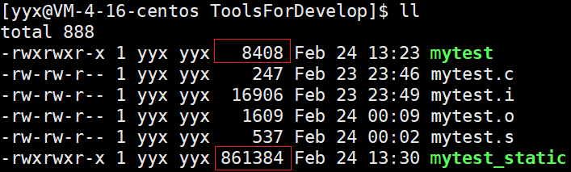

> 由上图可以看出，静态链接生成的文件比动态链接的体积大得多。

静态链接的缺点：

1. **浪费空间**，链接会将库内容放入目标文件，文件体积较大。每个程序文件都会加入库的内容，造成空间浪费。
2. **更新较为麻烦**，每次修改库的源码，都要重新链接库生成新可执行程序。

静态链接的优点：

可执行程序中已经具备了所有需要的东西，不需要到其他文件中查找，在执行的时候**运行速度快**。

#### 动态链接

动态链接把程序按模块拆分成独立的部分，并把链接这个过程推迟到了运行时再进行，运行时由操作系统的装载程序加载库。

> 运行程序1时会将程序1加载到内存中，然后再加载所需库文件，再运行程序2时，内存中已有库文件就不会再次加载，直接链接到程序2中即可。

动态链接的优点：

1. **避免空间浪费**，即使多个程序依赖于同一个库，库内容不会在内存中存在多份，而是多个程序执行时共享。
2. **维护比较方便**，只要替换原库文件，运行程序时，系统会自动使用新库进行链接。库和程序相互独立，更新库不会对程序造成影响，提高了可维护性和可扩展性。

动态链接的缺点：

链接推迟到程序运行时，每次执行程序都需要进行链接，性能有一定损失，**运行速度相对慢一点**。

[深入浅出静态链接和动态链接 (csdn.net)](https://blog.csdn.net/kang___xi/article/details/80210717)

### 2.3 gcc 选项

- `-static` 采用静态链接。
- `-g` 生成调试模式生成程序。
- `-shared` 此选项将尽量使用动态库，所以生成文件比较小，但是需要系统由动态库。
- `-O0`,`-O1`,`-O2`,`-O3` 编译器的4个优化级别，–O0没有优化,–O1为缺省值，–O3优化级别最高。
- `-w` 不生成任何警告信息，`-Wall` 生成所有警告信息。

&nbsp;

## 3. 调试工具 gdb

> gdb 是 Linux 下用于调试代码的工具，这个工具成本高难度也不低且不是很方便直观但仍需掌握。

### 3.1 背景知识

生成程序有两种模式：Debug 和 Release 模式。

Linux 下 gcc/g++ 编译出的可执行程序，默认是 Release 模式。要使用 gdb 调试，必须在代码编译的时候加上调试信息。

~~~shell
$ gcc test.c -o test_debug -g # 加上调试信息

$ gdb test_debug              # 进入gdb调试
(gdb) quit                    # 退出gdb
~~~

### 3.2 gdb 选项

#### 调试命令（debug）

| 名称     | 命令   | 解释                                          |
| -------- | ------ | --------------------------------------------- |
| 开始运行 | `run`  | 相当于开始调试`F5`，会运行至程序结束          |
| 逐语句   | `step` | 相当于`F11`，有函数会进入函数内部             |
| 逐过程   | `next` | 相当于`F10`，不会进入函数内部，执行整条语句； |

> 像逐过程、逐语句这样的命令一次输入之后，可直接回车仍会再次执行。

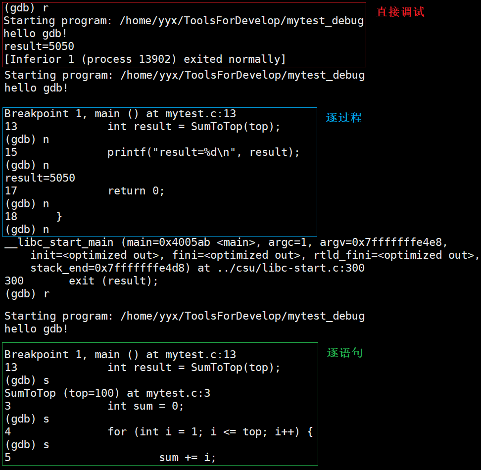

#### 显示代码（list）

| 名称         | 命令          | 解释                                                  |
| ------------ | ------------- | ----------------------------------------------------- |
| 可指定行号   | `list + [N]`  | 从第 N 行开始显示 10 行代码，可接着上次的位置继续打印 |
| 可指定函数名 | `list + Name` | 从函数起始位置左右开始显示代码。                      |

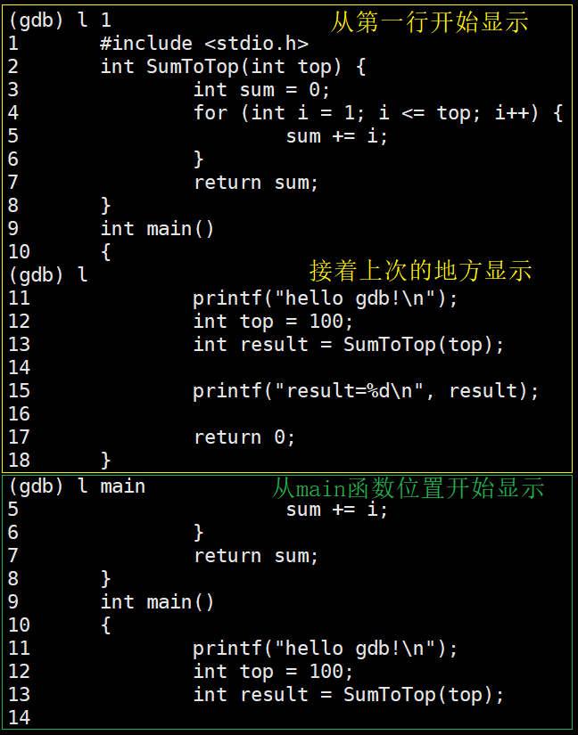

#### 断点命令（breakpoint）

| 名称       | 命令              | 解释                                          |
| ---------- | ----------------- | --------------------------------------------- |
| 某行打断点 | `b + N`           | 在某行打上断点                                |
| 函数打断点 | `b + FuncName`    | 在函数内起始位置打断点                        |
| 查看断点   | `info + b`        | 显示断点信息列表                              |
| 删除断点   | `d + b + N`       | 删除序号为 N 的断点，省略序号就是删除所有断点 |
| 启用断点   | `enable + b + N`  | 启用序号为 N 的断点，省略序号就是启用所有断点 |
| 禁用断点   | `disable + b + N` | 禁用序号为 N 的断点，省略序号就是禁用所有断点 |

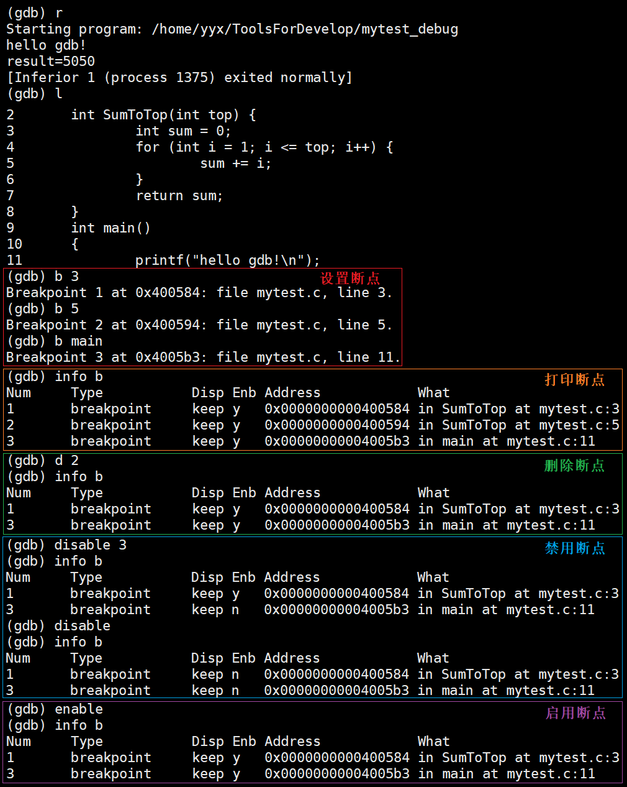

#### 变量命令（variable）

| 名称 | 命令 | 解释 |
| ---- | ---- | ---- |
| 监视变量     |  `display + ValName`  |以列表的形式常显示在屏幕下方，类似于vs中的监视      |
| 取消监视     | `undisplay + N`   |去掉监视列表中的序号为 N 的变量的常显示      |
| 查看变量     | `p + Name`   | 打印变量的值，不会常显示     |
|修改变量      |  `set + Name`  | 设置指定变量的值 |

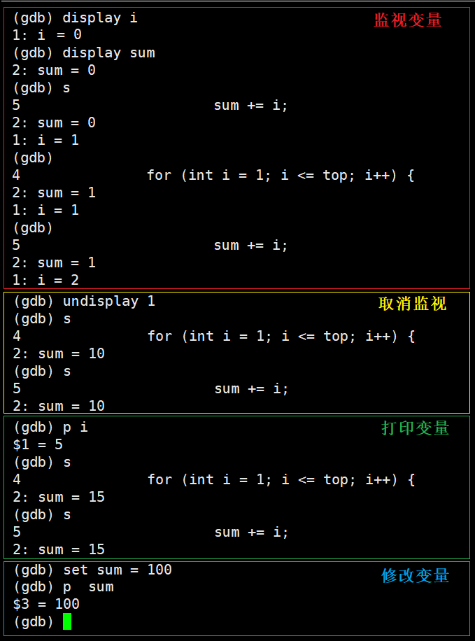

#### 特殊调试命令

| 名称         | 命令        | 解释                                                  |
| ------------ | ----------- | ----------------------------------------------------- |
| 结束当前函数 | `finish`    | finish 会直接结束当前函数的调用，并停止在函数返回位置 |
| 继续运行     | `continue`  | continue 继续运行至下一个断点，相当于`F5`             |
| 运行至指定行 | `until + N` | 运行至当前函数内部的第 N 行                           |

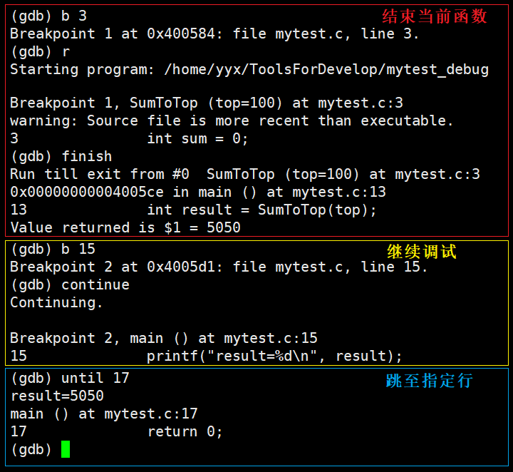

#### 其他命令

| 名称     | 命令              | 解释                       |
| -------- | ----------------- | -------------------------- |
| 调用堆栈 | `breaktrace`/`bt` | 查看程序各级栈帧的调用情况 |

&nbsp;

## 4.构建工具 Makefile

> 之前在 IDE 中写代码时，没有关心过文件的编译顺序以及代码的依赖关系，因为 IDE 可以自动构建项目。

### 4.1 自动化构建工具

工程中的源文件不计其数，按类型、功能和模块放在若干目录中。

Makefile 可以指定编译顺序，甚至更复杂的操作。使用 make 指令就可以自动编译项目，前提是所在目录下有Makefile 文件。

### 4.2 Makefile 的编写

~~~makefile
target : requires
	command
~~~

| 名称         | 介绍                     |
| ------------ | ------------------------ |
| **target**   | 需要生成的目标文件       |
| **requires** | 生成目标文件所依赖的文件 |
| **command**  | make 需要执行的命令      |

Makefile 指明了编译代码的两个要素：**依赖关系和依赖方法**。

- 可执行文件依赖于源文件，这就是依赖关系。
- 通过 gcc 编译源文件形成可执行文件，这是依赖方法。

~~~makefile
mytest:mytest.c # 依赖关系
    gcc -o mytest_make mytest.c -std=c99 # 依赖方法

.PHONY:clean
clean:
    rm -f mytest_make
~~~

- Makefile 默认第一个目标的是真目标，其他都是伪目标，输入 make 命令默认执行真目标。
- `.PHONY`是一个关键字，表示目标总是可执行的，就是在依赖文件没发生更改的情况下，也可以执行该目标。

- Makefile中可使用特殊符号：`$@`代表目标文件，`$^`代表其后指定的所有依赖文件。
- Makefile 只会编译被修改的或者未编译的源文件，以节省时间。

#### 4.4 Makefile 的原理

##### 依赖关系和依赖方法

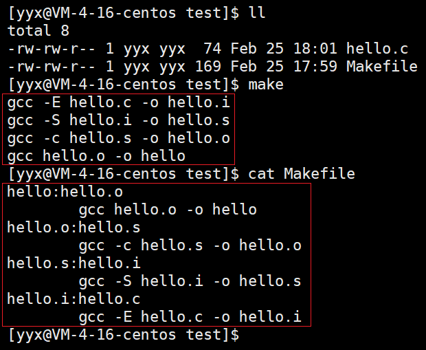

由上图可以看出，

1. 依赖关系：`.out`文件依赖`.o`文件，`.o`文件依赖`.s`文件，`.s`文件依赖`.i`文件，`.i`文件依赖`.c`文件。
2. 依赖方法：`gcc -option hello.* -o hello.*`。

~~~makefile
mycode : mycode.o
	gcc -o mycode.o -c mycode.s
mycode.s : mycode.i
	gcc -o mycode.s -S mycode.i
mycode.i : mycode.c
	gcc -o mycode.i -E mycode.c

.PHONY:clean
clean:
	rm -rf mycode mycode.o mycode.s mycode.i
~~~

执行 .out 依赖 .o，执行 .o 依赖 .s，执行 .s 依赖 .i，执行 .i 依赖 .c 文件，找到 .c 后再一步一步反向编译到可执行文件。

> Makefile 文件可以像上述这样将所有步骤写出来，但一般不这样写，写的越简单越好。

[跟我一起写 Makefile (csdn.net)](https://blog.csdn.net/weixin_38391755/article/details/80380786)

### 5. 上传工具 git

| 创建命令           | 解释                                 |
| ------------------ | ------------------------------------ |
| git init           | 新建版本库                           |
| git clone          | 克隆版本库                           |
| **提交命令**       | **解释**                             |
| git add            | 添加文件到暂存区                     |
| git commit -m 'xx' | 将暂存区文件提交至本地仓库           |
| git push           | 同步代码至远程仓库                   |
| git pull           | 下载代码至本地仓库                   |
| git rm             | 删除工作区文件。                     |
| **查看命令**       | **解释**                             |
| git status         | 查看仓库当前的状态，显示有变更的文件 |
| git log            | 查看仓库提交历史                     |
| git blame          | 以列表形式显示文件修改记录           |
| git diff           | 比较暂存区和工作区文件的差异         |
| **分支命令**       | **解释**                             |
| git branch         | 查看本地所有分支                     |
| git branch -r      | 查看远程所有分支                     |
| git checkout       | 切换所有分支                         |
| git merge          | 合并分支                             |
| git branch -d      | 删除分支                             |

[github-git-cheat-sheet (runoob.com)](https://www.runoob.com/manual/github-git-cheat-sheet.pdf)

[Git - Reference (git-scm.com)](http://git-scm.com/docs)

[git 简明指南 (runoob.com)](https://www.runoob.com/manual/git-guide/)
