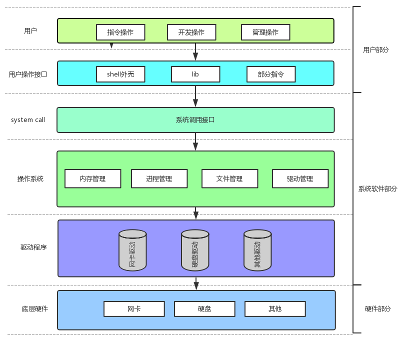
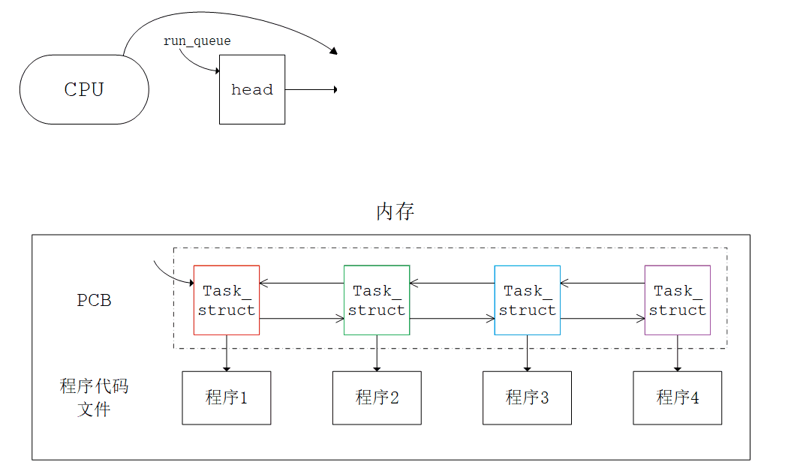
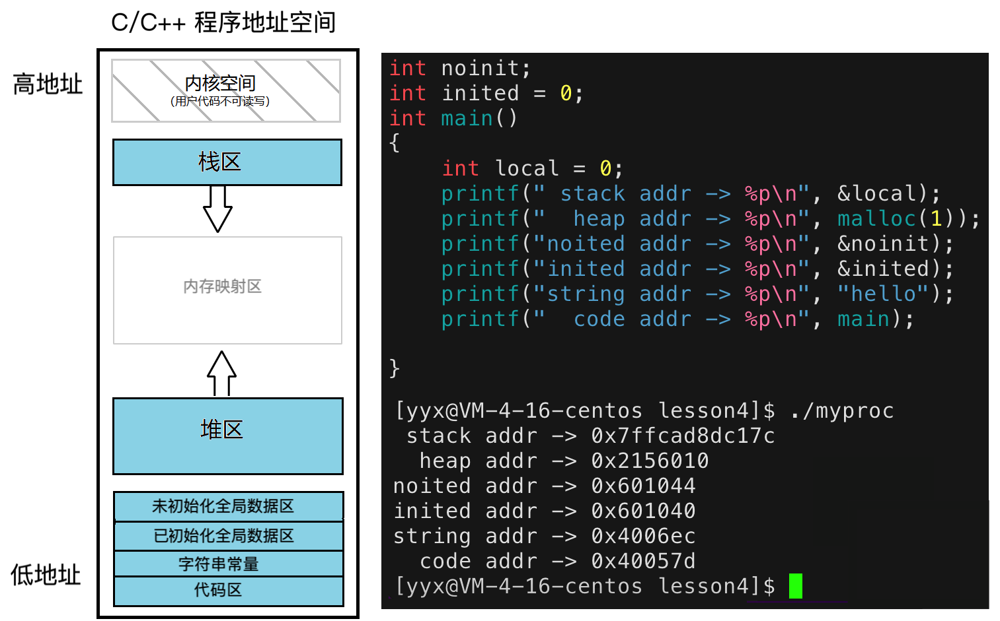

# 进程理解

## 0. 计算机体系

### 0.1 冯诺依曼体系

一般主流的计算机，都遵循冯诺依曼体系。


计算机硬件的体系结构如下：

| 设备归类       | 具体                   | 解释                                                 |
| -------------- | ---------------------- | ---------------------------------------------------- |
| 输入单元       | 键盘、鼠标、网卡等     | 以内存为视角，输入信号的被称为输入设备               |
| 输出单元       | 显示器，打印机、网卡等 | 以内存为视角，输出信号的被称为输出设备               |
| 存储器         | 内存                   | 存储器指的是内存，并不是磁盘等外部设备               |
| 运算器和控制器 | 中央处理器（CPU）      | 运算器执行数学运算和逻辑运算，控制器执行指令控制逻辑 |

- 输入输出设备都被称为外设。输入设备和输出设备并不是非此即彼的，根据使用情况可归为不同的类。
- 内存是体系结构的核心。**外设只能读写内存，同样CPU只能读写内存，CPU和外设之间不可直接交互**。

内存分为不同级别的存储单元，如下图所示：


### 0.2 操作系统的定义

> 系统启动之前是作为文件存储在磁盘中的。只有启动的操作系统才有意义。

#### 操作系统的目的

- **对下：与硬件交互，管理所有的软硬件资源**；
- **对上：为用户程序提供一个稳定、高效、安全的执行环境**。

操作系统的定义：<u>操作系统就是一款针对软硬件资源进行管理工作的软件</u>。

操作系统的核心思想就是管理，是对各种资源进行决策和执行。决策需要各种硬软件资源的信息，执行就需要下属的硬软件执行对应的指令。

#### 计算机整体结构

计算机体系结构在宏观上指的是冯诺依曼体系结构。还可以划分的更具体一些：

- 操作系统之下是一些硬件，如网卡、磁盘等，和硬件对应的驱动程序。
- 操作系统内置最基本的系统软件：进程管理、内存管理、文件系统、驱动管理。通过这些系统级软件，管理软硬件资源。
- 操作系统之上就是各种软件和用户级程序。



#### 管理的本质

对于系统中繁多的硬软件资源，管理起来十分复杂。<u>从操作系统的角度看，管理就是先描述、再组织</u>。

| 步骤   | 解释                                                         |
| ------ | ------------------------------------------------------------ |
| 先描述 | **先描述管理对象，再用特定的数据结构将管理对象组织起来**。   |
| 再组织 | **对个体资源的管理工作，就变成了某个数据结构的增删查改**。所有资源都是以这样的管理方式管理起来的。 |

> 以进程管理为例，首先定义出一个描述进程的结构体，即进程控制块 PCB，再将该结构体对象组织起来。

### 0.3 系统调用和库函数

操作系统对下管理软硬件资源，对上提供良好的运行环境。操作系统提供各种系统级的接口给用户级软件，以实现基本功能。

#### 系统调用

操作系统对外表现为一个整体，但是会提供一些接口，供上层开发使用。这部分由操作系统提供的接口，叫做系统调用。

#### 语言库函数

系统调用使用较为复杂，功能较为基础，对用户的要求也比较高。

所以语言创造者对部分系统调用进行一定程度的封装，集成成了库。有了库函数，就更利于上层开发者进行二次开发。

#### 二者的关系

语言库函数在系统调用之上，是上下层的关系。

当然，不是所有库函数都调用系统接口，一般只有和系统硬件交互的函数才会调用系统接口。

> 比如C语言库函数 `printf`，由C语言的开发人员封装了系统提供的硬件接口。

&nbsp;

## 1. 进程的概念

### 1.1 进程的定义

> 肤浅的来说，加载到内存中的程序就叫做进程。但这并不完善。
>

运行中的系统存在大量的进程，操作系统该如何管理这些进程呢？仍然是先描述再组织。

**进程在形成之初，操作系统就会为其创建进程控制块 PCB**。进程控制块PCB用于描述进程，其中存储着进程的所有属性。

Linux 系统中，PCB 就是一个名为`task_struct`的结构体。

> Linux 查看进程的命令：

~~~shell
$ ps axj | head -1 && ps axj | grep 'myproc'
 PPID   PID  PGID   SID TTY      TPGID STAT   UID   TIME COMMAND
25486 29733 29733 25486 pts/0    29733 S+    1003   0:00 ./myproc # 正在运行的myproc进程
~~~

**启动程序的本质，就是在内存上创建进程。**

#### 进程和程序的区别

- 程序本质就是文件，是编译生成的二进制可执行文件。
- 程序被加载到内存中，系统自动为其创建PCB，以管理该进程。故**进程是程序的代码数据与进程相关内核数据结构的总和**。


操作系统在处理进程时， 不是直接操作程序而是读写PCB，因为PCB中含有程序的所有属性。也就是说，**进程管理与进程对应的程序毫无关系，只与进程的PCB强相关**。

#### PCB的内部构成

[task_struct结构](https://www.cnblogs.com/tongyan2/p/5544887.html)

- 进程编号 —— 每个进程都有编号或称标识符，也就是 PID，具有唯一性用来区别于其他进程。

~~~cpp
#include <sys/types.h>
#include <unistd.h>
pid_t getpid(void);
pid_t getppid(void);
~~~


一般在命令行运行的进程，其父进程都是`-bash`。


- 进程状态 —— 包括进程退出时的退出码、退出信号、任务状态等。

进程结束时的返回值就是返回给系统的退出码，最后被父进程获取。比如 main 函数结束时的`return 0;`。任务状态描述进程的运行状态，比如有等待状态，死亡状态，阻塞状态，挂起状态等。

~~~shell
$ echo $? # 获取最近一次执行命令的退出码
~~~


- 优先级 —— 进程很多而 CPU 只有几个，不可能同时运行多个进程，优先级决定了进程的运行先后顺序。

- 程序计数器 —— 或称 pc 指针，保存程序中即将被执行的指令的地址。

- 内存指针 —— 指向程序代码和进程相关数据的指针，还有和其他进程共享内存块的指针。

- I/O状态 —— 包含显式的IO请求，分配给进程的IO设备，被进程使用的文件列表。

- 审计信息 —— CPU 中有调度模块，负责均衡地调度在运行的进程，使之能较为公平的获得CPU资源得以被执行。而调度模块需要的参考信息就是存在 PCB 中的审计信息。

  上下文数据 —— 包含进程对应程序的执行状况等信息的数据。

##### 上下文数据



> 如图所示，CPU需要在不同的进程之间来回调度，以保证每个进程相对公平地获取资源。

保存上下文：进程之间的来回切换，必须确保在进程被切换后，其的临时数据被更新并存储在它对应的 PCB 中，以便之后再接着上次继续执行。

恢复上下文：这些临时数据就叫做上下文数据，都被存储在寄存器中，当进程被执行时，其 PCB 中的上下文数据就交给了 CPU，以便 CPU 接着上次的地方继续执行。


### 1.2 进程的查看

查看进程信息可查看系统目录`/proc`：


Linux 系统提供以查看文件的方式查看进程。每个进程创建之初都会在`/proc`目录下创建一个目录，并以进程编号命名。进程结束时自动消失。

> 该目录是虚拟目录，并不是真实存储在磁盘上的。


### 1.3 进程的创建

当我们在系统上运行程序时，也就是创建了一个进程。系统调用 fork 就是在程序中创建子进程。

~~~cpp
#include <sys/types.h>
#include <unistd.h>
pid_t fork(void);
~~~

fork 之后会出现两个执行流，一个是原有进程的，一个是 fork 创建出来的进程。

#### fork的返回值

fork 的返回值分两种情况：

1. 进程创建失败时：给父进程都返回负值，不存在子进程；
2. 进程创建成功时：给父进程返回子进程的`pid`，给子进程返回`0`。

> 如何理解两个返回值？
>

fork函数返回之际，创建进程的核心任务已经完成，此时子进程已被创建完成，开始被 CPU 调度。

**所以 `return` 语句理应被父子进程都执行一遍**。因此父子进程都会得到一个返回值。返回值不同，也是发生了写时拷贝。

> 为什么要有两个返回值？
>

父进程只有一个，而子进程有多个。

父进程只能通过返回值的形式获取子进程的 pid 去管理子进程，而子进程可通过 getppid 函数可获得父进程的id。

~~~cpp
pid_t id = fork();
if (id == 0)     // child
{}
else if (id > 0) // parent
{}
else             // fail
{}
~~~

fork之后，父子运行的先后问题不受用户控制，和CPU调度状态有关。

#### fork的原理

fork 成功后，系统中多出一个进程。**父子进程共用一份程序的代码数据，创建出来的是子进程的内核数据结构**。

- 子进程的内核数据结构 PCB 也会以父进程的为模板，来初始化自己的内核数据结构；
- 子进程和父进程访问同一份代码和数据，也就是**执行和访问父进程fork之后的代码和数据**。

> 代码和数据在运行过程中被修改怎么办？

由于程序代码在运行时是不可被修改的，父子进程共享一份代码即可。

一般情况下，数据也是共享的，但如果**某个执行流修改数据，此时该数据就会发生“写时拷贝”。**

操作系统将该数据在内存中拷贝一份，修改方访问新数据，原数据留给其他执行流访问，以保证数据的独立性。

&nbsp;

## 2. 进程的状态


| 抽象状态 | 解释                                     |
| -------- | ---------------------------------------- |
| 运行态   | 进程获得处理器                           |
| 就绪态   | 进程被剥夺处理器，时间片结束             |
| 阻塞态   | 进程因等待某种资源就绪，导致进程无法推进 |
| 挂起态   | 进程的代码和数据被交换到磁盘中           |

> 以上是描述进程的抽象状态模型。以下是Linux系统中进程状态的具体设计。

### 2.1 查看进程状态

进程状态信息保存在进程 task_struct 中。进程状态用于**描述该进程所处的状态**，意义是便于操作系统快速判断进程的状态，进而更高效地管理进程。

| 进程状态 | 状态       | 解释                                                         |
| -------- | ---------- | ------------------------------------------------------------ |
| **R**    | running    | 可能是就绪态或运行态。可能正在被CPU调用，可能在运行队列中等待时间片。 |
| **S**    | sleeping   | 可中断休眠，进程等待资源就绪，进程被放入资源就绪等待队列中。 |
| D        | disk sleep | 不可中断休眠，进程等待磁盘IO时间过长，操作系统将其状态设为D，防止误杀。 |
| T        | stopped    | 暂停状态，恢复后成后台进程。`19`号信号可暂停进程，`18`号信号可继续进程。 |
| t        | tracked    | 追踪暂停状态，进程被追踪，遇到断点而暂停。                   |
| X        | dead       | 终止死亡状态，内核数据结构和代码数据都被释放。               |
| **Z**    | zombie     | 僵尸状态，进程结束不会立即退出，维持在僵尸状态等待系统检测回收。 |

进程不仅可以等待CPU调度，也可以等待资源就绪。

- 等待CPU调度的进程和正在被CPU调度的进程都处于`R`状态，在运行队列中随时被调用。
- 等待资源就绪的进程处于`S/D`状态，被放入所等待资源的等待队列中，以待条件就绪并完成任务。


### 2.2 两种特殊状态

~~~shell
# 命令行监控进程状态脚本
while :;
	do ps axj | head -1 && ps axj | grep myproc | grep -v grep;
	sleep 1;
	echo "/################################################################/";
done
~~~

#### 僵尸进程

一般进程结束时需要回收资源，**进程检测和回收的工作由该进程的父进程承担**。如果进程没有被回收，就会一直处于Z状态。

> 父进程休眠中，将子进程杀死，父进程就无法回收子进程，因此可以看到子进程的僵尸状态。


只要父进程没有调用wait或waitpid，子进程就一直没被回收，一直保持僵尸状态。

倘若进程一直不被回收，就造成了内存泄漏，所以要避免僵尸进程。

> 如何避免的问题放到进程控制	中在详谈。

#### 孤儿进程

父进程在子进程结束之前退出，**子进程的父进程就变为1号进程**。称子进程被操作系统“领养”，该子进程就被叫做“孤儿进程”。

进程必须有个父进程，否则最终会变成僵尸进程，造成内存泄漏。


#### 区别

- 僵尸进程是父进程休眠中子进程终止，子进程无法被收尸。
- 孤儿进程是子进程运行中父进程终止，子进程被系统领养。

&nbsp;

## 3. 进程优先级

### 3.1 优先级的概念

> 一般计算机中 CPU 只有一两个而进程可能有小一千个。资源太少而进程太多，进程必须要排队等待调度。

故赋予进程“优先级”（priority）的属性，提高或降低进程原本的优先权，促使其优先或延迟被 CPU 处理，可以提升系统运行的效率。

#### 进程的性质

- 竞争性：系统进程数目众多，而只有少量资源，所以进程之间是具有竞争属性的。
- 独立性：多进程运行，需要独享各种资源，多进程运行期间互不干扰。
- 并行：多个进程在多个 CPU 下分别同时进行运行，这称之为并行，真正意义上的多进程同时运行。
- 并发：多个进程在一个 CPU 下采用进程切换的方式，一段时间内，让多个进程都得以推进，称之为并发。

### 3.2 查看进程优先级

~~~shell
$ ps -l -a # 查看进程相关信息
F S   UID   PID  PPID  C PRI  NI ADDR SZ WCHAN  TTY          TIME CMD
0 S  1003 24805 24154  0  80   0 -  1833 hrtime pts/1    00:00:00 myproc
0 R  1003 24970 24704  0  80   0 - 38595 -      pts/2    00:00:00 ps
~~~

| 标识符 | 解释     | 含义                                                         |
| ------ | -------- | ------------------------------------------------------------ |
| UID    | UserID   | 创建进程的用户的编号                                         |
| PRI    | priority | 表示进程的基础优先级，值越低优先级越高                       |
| NI     | nice     | 优先级的修正值，取值范围$[-20,19]$共40个级别，调整 NI 值就是调整优先级。<br/>$80+NI=PIR_{new}$，初始值加修正值才是进程的真正优先级。 |

一般进程的 PRI 都是80，PRI 不同说明进程大类不同。在此基础上使用修正值动态调整，二者区分开，便于查看调整幅度。

### 3.3 调整进程优先级

> 进程优先级由系统管理，人为修改可能导致效率降低。

~~~shell
$ man sched_get_priority_max
$ nice
$ renice
~~~

更推荐使用简单的`top`指令，输入`r`，输入对应进程编号，以及 NI 值。


- $PIR$ 显示的都是调整之后的新优先级值。是 $80+NI$，这个$NI$是本次输入的修正值。

> 不管之前进程的优先级是多少，每次修改都是从初始值80起算。修改之后的 PIR 显示的都是初始值 80 加上输入的修正值 NI。

- 不管输入的 $NI$ 值是多少，修正的范围只有$[-20,19]$。换言之，输入的值超出这个范围就使用最值。

优先级不是绝对的、是一种相对的概念，如果调整的跨度很大，很可能导致其他进程被搁置，产生“饥饿问题”。

调度器就是要让所有进程都较为均衡地享受到 CPU 资源。

&nbsp;

## 4. 环境变量

### 4.1 环境变量的概念

环境变量指操作系统中用来**指定系统运行环境的一些参数，环境变量是系统级的变量，属于全局变量**。

操作系统执行程序首先需要确定程序的位置。系统指令不需要指明路径，是因为指令的所在目录都被放入环境变量`PATH`中，每个目录以`:`分隔。

~~~shell
$ echo $PATH
/usr/local/bin:/usr/bin:/usr/local/sbin:/usr/sbin:/home/yyx/.local/bin:/home/yyx/bin
~~~

> 查找指令就是按顺序查找PATH中的路径，找不到则报错。

~~~shell
$ export PATH=$PATH:/home/yyx/test # 添加PATH
$ echo $PATH
/usr/local/bin:/usr/bin:/usr/local/sbin:/usr/sbin:/home/yyx/.local/bin:/home/yyx/test
~~~

 `export`是内存级的修改，仅本次登录有效。永久保存需要将`export`语句放入`.bash_profile`文件内。

### 4.2 环境变量的查看

- `PATH`：系统级指令的搜索路径；
- `HOME`：当前用户的工作目录（家目录）；
- `SHELL`：系统命令行解释器的具体名称，通常是 bin/bash 等；

> 使用 env 命令可直接查看所有环境变量。


### 4.3 环境变量的设置获取

#### 指针数组envp

~~~cpp
int main(int argc, char* argv[], char* envp[]);
~~~

`main`函数的第三个参数`envp`，传入的是系统环境变量表。最后放入`NULL`标识结束位置。


~~~cpp
int main(int argc, char* argv[], char* envp[])
{
    for (int i = 0; envp[i]; i++)
        printf("env[%d]->%s\n", i, env[i]);
}
~~~

#### 环境变量指针environ

~~~cpp
int main()
{
    extern char** environ; // 声明环境变量指针

    for (int i = 0; environ[i]; i++)
        printf("environ[%d]->%s\n", i, environ[i]);
}
~~~

环境变量指针`environ`是系统的一个全局变量。和主函数的参数`envp[]`一样用法。

#### put/get/setenv

一般都是用系统调用 _put/setenv_ 和 _getenv_，来使用环境变量。

~~~cpp
#include <stdlib.h>
// putenv
int putenv(char *string);
// setenv
int setenv  (const char *name, const char *value, int overwrite);
int unsetenv(const char *name);
// getenv
char *getenv(const char *name);
~~~

环境变量主要是用来给父子进程传递数据。

导入环境变量的是`putenv`和`setenv`，获取环境变量的是`getenv`。

- putenv 是直接字符串地址放到环境变量表中。如果字符串数组出了作用域，环境变量就没了。

- setenv 会将环境变量字符串拷贝一份放到环境变量表中。相比之下更保险。

### 4.4 环境变量的全局属性

每一个主动创建的进程都是由 bash 启动的，他们都是 bash 的子进程。新起 bash 时会从文件导入环境变量，手动启动的进程的环境变量都是由 bash 导入的。

也就是说，环境变量是可以被继承的。命令行运行的进程从命令行解释器处继承环境变量，而子进程也会从父进程处继承环境变量。

这样，环境变量就影响了整个用户系统。

### 4.5 命令行参数

~~~cpp
int main (int argc, char* argv[]);
~~~

`argc`,`argv`分别指 **参数个数** _argument counter_ 和**参数值** _argument value_。

~~~shell
$ ls -a -b -c -d  # argc = 6, argv = {"ls", "-a", "-b", "-c", "-d"}
~~~

- `argc`是命令行参数的个数。
- `argv`是各个参数字符串组成的字符串数组。最后放入`NULL`标识结束位置。

```cpp
// for (int i = 0; argv[i]; i++)
   for (int i = 0; i < argc; i++)
	   printf("argv[%d]->%s\n", i, argv[i]);
```


```shell
$ ./myproc -a -b -c
argv[0]->./myproc
argv[1]->-a
argv[2]->-b
argv[3]->-c
```

&nbsp;

## 5. 进程地址空间

### 5.1 虚拟地址空间的定义

在C/C++动态内存管理章节处，有个程序地址空间的概念。但从语言的角度，无法深入理解这个概念，因为它是操作系统中的概念。



> 多打印几个变量可以看到堆栈相向而生的现象，栈区由高到低，堆区由低到高。


```cpp
// 如下代码，子进程修改了父进程的数据，应当发生写时拷贝，
// 也就是会拷贝一份`g_val`单独给子进程使用，
// 此时父子进程同时打印`g_val`的地址，理论上地址应该不同？
int g_val = 0;

int main()
{
    if (fork() == 0) // child
    {
        printf("child proc change, g_val=%3d, &g_val=%p\n", g_val, &g_val);
        g_val = 200;
        printf("child proc done  , g_val=%3d, &g_val=%p\n", g_val, &g_val);
    }
	else // parent
    {
        sleep(1);
        printf("parent proc check, g_val=%3d, &g_val=%p\n",g_val, &g_val);
    }
}
```


> 发生写时拷贝，那父子进程的`g_val`应该是两个不同的变量，那为什么打印出来的地址确实一样的呢？

这就意味着，**打印出的地址并不真实的物理地址，而是虚拟的逻辑地址**。语言层的地址都是虚拟地址，由操作系统链接到真实地址。

系统角度来看，程序使用的是**进程虚拟地址空间**。

每个进程都拥有一个进程地址空间，每一个进程都认为自己独占物理内存，不考虑其他进程的内存使用，从而更好地管理内存。

进程地址空间具体就是结构体`mm_struct`，用来描述内存区域。和`task_struct`一样是内核数据结构。


虚拟地址又称线性地址，就像一把刻度尺，只需要起始和结束下标就可以确定一段区域。物理内存中是没有什么栈区堆区这样的区域概念的，就是单纯的存放数据，由操作系统间接映射两者。

```cpp
// 内核中的`mm_struct`里面就是这样的一堆整型变量，虚拟出的栈堆等内存区域的下标
struct mm_struct
{
    size_t stack_begin;
    size_t stack_end;
    size_t heap_begin;
    size_t heap_end;
    //...
    size_t malloc_begin = 0x778010, malloc_end = 0x778014;
	// 在内存上开辟了4字节的空间，就是创建了这样的下标变量
};
```

进程并不需要关心真实地址，它就认为自己的`mm_struct`代表整个内存，都属于当前进程的。由操作系统充当中间人，将真实地址和虚拟地址关联映射起来。

操作系统通过页表和 MMU，将虚拟地址和物理地址关联映射起来。

1. MMU 也叫做内存管理单元，集成在 CPU 中，它的作用是查页表。
2. 页表是用操作系统提供的一张映射表，如图所示，其左侧一列存放虚拟地址，右侧一列存放虚拟地址所映射的真实地址。


进程控制块`task_struct`，进程地址空间`mm_struct`以及页表都是进程相关的数据结构，都是在进程创建之初形成的。

#### 回到开头的问题

> 创建子进程以父进程为模版，继承父进程的代码数据还有进程数据结构。但当子进程修改时，操作系统重新开辟一段空间给子进程，这就是写时拷贝。

写时拷贝是**在物理内存上重开空间，页表将虚拟地址映射到新位置**。<u>写时拷贝完全是系统底层实现的，并没涉及语言层</u>，虚拟地址不会被修改，打印结果自然一样。


> 通过写时拷贝这样的机制，也维护了进程独立性。

```cpp
pid_t id = fork(); // 父子进程fork返回值不同，id变量也发生了写时拷贝
if (id == 0)
{}
else if (id > 0)
{}
```

### 5.2 进程地址空间的意义

1. 地址空间作为中间层，**实现对进程的内存操作进行风险管控，保护内存和进程安全**。

   - 通过页表对访问的地址进行管控，<u>防止进程访问非法空间</u>，导致程序出错或威胁进程安全。

   - 页表也会针对虚拟地址所在区域，<u>给进程在访问内存的时候设置读写权限</u>。

2. **将进程管理和内存管理解耦**，实现软件层面上的分离。

   - 内存申请和开辟在时间上区分开来，<u>高效使用内存，避免浪费</u>。

   > 申请内存只是在 mm_struct 划出一段区域，等到使用时再将虚拟地址和物理内存作映射。基于缺页中断的内存管理，便于操作系统更高效的分配内存资源。

3. **CPU能够以统一的方式看待进程的代码和数据**，且虚拟地址的划分是相对确定的，调用的方式也相对统一。

   > 每个进程都有独立的地址空间，其程序的入口函数的地址是一致的，这样 CPU 在调度进程时就可以更加快捷。差异化会造成更多特殊情况，更加容易出错。

   - 通过页表的映射，各种<u>数据可以随意存储在物理内存中，大大节省了空间</u>，且不会影响 CPU 读取效率。
   > CPU访问的也是虚拟地址，再通过页表映射到真实地址。


