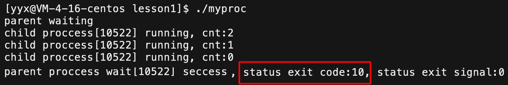

# 进程控制

## 1. 进程创建

fork 是代码创建进程的一种方式，它从已存在的进程中创建一个新进程。原进程为父进程，新进程叫做子进程。

```cpp
#include <unistd.h>
pid_t fork(void);
```

1. 分配新内存块和内核数据结构给子进程，
2. 将父进程部分数据结构拷贝给子进程，
3. 添加子进程到系统进程列表中，
4. fork返回，调度器开始调度。

> 简而言之，fork之后，就有两个代码相同的进程，且它们都运行到相同的地方。从此便开始分道扬镳，各自独立。

1. 进程创建成功，给父进程返回子进程的 PID，给子进程返回 0。
2. 进程创建失败，给父进程返回 -1，并设置错误码。没有子进程产生，父进程依旧运行。

###  写时拷贝

一般数据和代码是共享的，只有一份。代码一般不改，修改的都是数据。

**当数据被修改时，系统便为修改者单独创建一份空间，以供其使用，其他进程仍旧使用原变量**。

子进程的页表由父进程的拷贝而来，父子进程的页表中的地址映射是相同的。当写入数据时，操作系统底层会自动将数据，拷贝一份到新空间，再重新建立修改方的页表映射，将虚拟地址映射到新空间处。

&nbsp;

## 2. 进程终止

### 2.1 进程退出的概念

> 进程创建完毕，就到了进程的终止。

进程运行终止无非有三种结果：

1. 程序运行完毕，结果正确；
2. 程序运行完毕，结果不正确；
3. 程序异常终止。

```shell
$ echo $? # 输出最近一次进程的退出码
```

一般进程运行正确返回值为 $0$ 代表 $success$ ；进程运行错误，返回非零值作为错误码，一个错误码对应着一个错误信息。


**退出码只能确定程序运行完毕结果是否正确。**当程序异常退出时，此时返回值就没有意义了。

### 2.2 进程退出的方式

#### 进程正常退出

main函数return返回，则进程退出；其他函数返回，只是函数运行结束。

##### exit

```cpp
#include <stdlib.h>
void exit(int status);
```

- exit 放在任意位置都可以结束进程，程序只会执行到 exit 就结束。
- 参数是退出码，可以是任意整数，也可以用宏标识符`EXIT_SUCCESS`和`EXIT_FIALURE`。
- **exit 在结束进程的同时，还会刷新缓冲区。**


##### _exit

~~~cpp
#include <unistd.h>
void _exit(int status);
~~~


> `_exit`只强制终止进程，不进行进程的后续收尾工作。

- `_exit`是`exit`的子函数，只负责退出程序。**_exit 没有清理函数和冲刷缓冲区关闭IO流的任务。**

创建进程本质上是系统中多出一个进程，就要多出进程相关的数据结构。

故进程退出也就意味着释放为其开辟的内核数据结构，如进程控制块、地址空间、页表及相关映射关系和为程序开辟的空间等等。

####  进程异常退出

主函数`return`、`exit`、`_exit`的方式都是正常退出，除此之外还有异常退出的情况。这个我们放到进程信号处讨论。

&nbsp;

## 3. 进程等待

> 子进程是为了帮助父进程完成某种任务的，而父进程通常需要获得子进程运行的结果。

### 3.1 进程等待的定义

父进程使用`wait`,`waitpid`函数来等待子进程完成任务并退出，这个过程就叫做进程等待。

如果父进程不进行等待，子进程就会一直保持僵尸状态，造成内存泄漏。换句话说**，父进程调用`waitpid`接口等待子进程，就可以避免僵尸进程的产生，避免内存泄漏**。

- 要使父进程获取子进程的退出信息，必须保证父进程在子进程之后退出。
- 程序正常结束，需要其退出码，异常结束，需要其获取信号。退出码和退出信号就是所谓的退出信息。

### 3.2 进程等待的方式

当一个进程进入僵尸状态时，就变得“刀枪不入”，发送`kill -9`信号也无济于事，因为进程已经死去。所以最好由父进程等待的方式解决问题。

```cpp
#include <sys/types.h>
#include <sys/wait.h>
pid_t wait(int *status);
pid_t waitpid(pid_t pid, int *status, int options);
```

等待成功返回所终止的子进程 PID，等待失败则返回 $-1$。

#### wait

```cpp
pid_t id = fork();
if (id == 0) { // child
    int cnt = 5;
    while (cnt--) {
        printf("child proccess[%d] running, cnt:%d\n",getpid(), cnt);
        sleep(1);
    }
}
else { // parent
    sleep(10); // 此处父进程不进行等待会直接退出，子进程就是僵尸进程
    pid_t ret = wait(NULL);
    if (ret > 0)
        printf("parent proccess wait[%d] seccess\n", ret);
    else
        printf("parent proccess wait failed\n");
}
```


#### waitpid

```cpp
pid_t waitpid(pid_t pid, int *status, int options);
```

| 组成        | 说明                                                         |
| ----------- | ------------------------------------------------------------ |
| 返回值      | 正常返回时，返回收集信息的子进程 PID，返回–1表示等待错误。   |
| 参数 pid    | `pid`为指定进程ID，等待的是指定的某个进程，若设为–1，则等待的是任意一个进程。 |
| 参数 status | `status`是输出型参数，父进程传入该变量，借此获取进程的退出结果。 |
| 参数 option | `option`为等待方式。设0代表默认行为，即阻塞等待，设为`WNOHANG`，代表非阻塞等待。 |

##### 参数status

> 进程正常结束依靠返回值传递信息，而进程异常终止需要`status`向父进程返回。

进程异常终止往往是因为其收到了某种信号。故可以通过进程是否收到信号或收到何种信号，判定进程是否异常终止或异常原因。

此时需要进程返回两种信息，一是退出码，二是信号。

1. 如果没收到信号，则退出码就是我们所需要的退出信息。
2. 如果收到了信号，此时不需要关心退出码，只看退出信号。

`status`一个整数是退出码和信号的结合。其中$32$个比特位目前只使用**最低的$16$比特位**，高位暂时不管。


- **下标 $[0,7)$ 的 7 个比特位代表终止信号**；
- **下标 $[8,16)$ 这 8 个比特位代表退出码**；
- 下标为 $7$ 的比特位代表`code dump`标志暂时不管。

> 当下标 $[8,15]$ 的次低8位为0时，说明没有收到信号，当次低8位不为0时，再去考虑 $[0,6]$ 的低7位。

~~~cpp
pid_t id = fork();
if (id == 0) { //child
    int cnt = 3;
    while (cnt--) {
        printf("child proccess[%d] running, cnt:%d\n", getpid(), cnt);
        sleep(1);
    }
    exit(0);
}
else { // parent
    int status = 0;
    pid_t ret = waitpid(id, &status, 0);
    if (ret > 0) {
        printf("waited[%d], code:%d, signal:%d\n", ret, status >> 8, status & 0x7f);
    }
    else {
        printf("parent proccess wait failed\n");
    }
}
//                              FEDC BA98   7654 3210
//                                        |
// status - 0000 0000 0000 0000 xxxx xxxx | xxxx xxxx
// 0xff                         1111 1111 |
// ox7f                                     0111 1111
~~~



实际开发中不要写易错的位操作，直接使用宏即可。

- `WIFEXITED`判断进程是否正常退出，正常退出返回1，否则返回0。
- `WEXITSTATUS`返回进程退出码。
- `WTERMSIG`返回进程退出信号。

```cpp
if (ret > 0)
{
    if (WIFEXITED(status)) // 判断进程是否正常终止
        printf("exit code:%d\n", WEXITSTATUS(status)); // 返回进程退出码
    else
        printf("exit signal:%d\n", WTERMSIG(status));  // 返回进程退出信号
}
```

##### 参数option

参数`option`意为等待方式。设为0代表默认行为，即阻塞等待，也可设置为`WNOHANG`，代表非阻塞等待。

等待方式指父进程等待子进程的方式。而阻塞和非阻塞，指父进程等待时所处的状态。

- 阻塞等待：在子进程执行任务期间，父进程一直保持阻塞状态，直至子进程运行结束。
- 非阻塞等待：不断地的轮询检测子进程的运行状态，保持自身进程为非阻塞的等待状态。

非阻塞等待时，不会等待子进程结束再返回，此时返回值有三种情况：

1. 返回值等于`0`，代表没有子进程退出，则需要再次等待；
2. 返回值大于`0`，表示退出的子进程PID，父进程等待成功。
3. 返回值小于`0`，等待失败。

```cpp
pid_t id = fork();
if (id == 0) { //child
    int cnt = 3;
    while (cnt--) {
        printf("child proccess[%d] running, cnt:%d\n", getpid(), cnt);
        sleep(1);
    }
    exit(0);
}
else {
    int status = 0;
    /* 轮询检测方案 */
    while (1)
    {
        pid_t ret = waitpid(id, &status, WNOHANG);
        if (ret == 0) { // 1.子进程并未结束
            printf("parent do other things\n");
        }
        else if (ret > 0) { // 2.子进程退出成功
            printf("wait[%d] seccess, code:%d, signal:%d\n",
                   ret, (status >> 8) & 0xff, status & 0x7f);
            break;
        }
        else { // 3. 等待失败
            printf("parent wait failed\n");
            break;
        }
        sleep(1);
    }
}
```


##### core dump

进程退出时，会设置其退出码和退出信号，表明进程退出的结果和原因。

必要的话，**系统会进行核心转储，就是将异常退出的进程在内存中的代码和数据以文件的形式转储在磁盘上，以便后期调试。**

> centos默认关闭Core Dump 功能，设置方式如图所示：


core dump可以帮助我们更加方便地调试，可以直接显示错误的行数。进入gdb后输入`core-file core.pid`加载core文件。


`waitpid`可以获取子进程的退出信息，退出码、退出信号以及core dump标志位。如果进程异常退出，且形成core dump文件的话，core dump标志位就会被设置为1。

```c
if (fork() == 0)
{
    while (1) {
        printf("hello proc:%d\n", getpid());
        sleep(1);
    }
    exit(1);
}
int status = 0;
waitpid(-1, &status, 0);
printf("core dump: %d\n" , (status >> 7) & 1);
```

> 查看7号手册signal章节，只有收到处理动作为Core的信号，才会进行核心转储。

### 3.3 进程等待的底层


用户层，用户传入参数`status`给`waitpid`为获取进程退出结果。

进程退出时，系统会将退出码和退出信号分别写入进程PCB中的两个变量`exit_code`和`exit_signal`中。

内核层，父进程在子进程僵尸状态时将 PCB 中的退出码和信号和父进程传入的`status_p`进行运算：

```cpp
*status_p |= exit_code << 8;
*status_p |= exit_signal;
```

父进程的`status_p`就获得了子进程退出结果，再通过`waitpid`接口返回给用户层。

&nbsp;

## 4. 进程程序替换

> 如果想让子进程执行一个“全新的程序”，可以使用进程程序替换。

### 4.1 替换原理

只将内存中子进程的代码数据替换成新程序的代码数据，并修改部分页表映射，就可以让子进程执行新的程序。


这种进程不变，仅仅替换当前进程的代码和数据的技术就叫做进程的程序替换。

> 进程替换的原理比较简单，但程序替换这个概念是非常重要的。

程序的本质就是一个文件，程序文件包含程序代码和数据。将程序的代码和数据加载到当前进程的对应内存空间上。可能会因代码变化而稍调页表数据，但这不是重点。

**重点是用旧进程的壳子套入新程序的代码数据，“旧瓶装新酒”，并没有创建任何的进程**。

### 4.2 替换函数

系统调用是以`exec`开头的函数，称为`exec*`系列函数。

```cpp
#include <unistd.h>
extern char **environ;
int    (const char* path, const char* arg, ...);
int execv  (const char* path, char* const argv[]);

int execlp (const char* file, const char* arg, ...);
int execvp (const char* file, char* const argv[]);

int execle (const char* path, const char* arg, ..., char* const envp[]);
int execve (const char* path, char* const argv[],   char* const envp[]);

int execvpe(const char* file, char* const argv[],   char* const envp[]);
```

```cpp
int main()
{
    printf("proc[%d] is running\n", getpid());
    execl("/usr/bin/ls", "ls", "-al", NULL); // 进程程序替换

    printf("do other things..\n");
    printf("do other things..\n");
    printf("do other things..\n");
}

$ ./myproc
proccess [4205] is running
total 28
drwxrwxr-x 2 yyx yyx 4096 May 13 01:18 .
drwxrwxr-x 4 yyx yyx 4096 May 13 00:49 ..
-rw-rw-r-- 1 yyx yyx   67 May 13 00:51 Makefile
-rwxrwxr-x 1 yyx yyx 8512 May 13 01:18 myproc
-rw-rw-r-- 1 yyx yyx  296 May 13 01:18 myproc.c
```

进程程序替换后，**进程的代码数据全部会被替换，原程序中替换函数调用之后的代码不会被执行。**

程序替换的本质就是把程序代码和数据加载到当前进程的上下文中。系统中程序的运行加载，也都是使用`execl`程序替换函数的。

> 进程替换会将程序的所有代码都替换掉，若想之后的代码不被替换，可以创建子进程进行程序替换。

```cpp
int main()
{
    if (fork() == 0) { //child -- 进行程序替换
        //exec*
        exit(1);
    }
    //parent -- 等待子进程
    waitpid(-1, NULL, 0);
    printf("parent proc waited success\n");
}
```

父子进程的代码是共享的，**子进程程序替换时，修改了代码也会发生写时拷贝**。

#### 返回值

程序替换一旦成功，原程序的后续代码就不会被执行。也就是说，`exec*`函数**执行成功就不需要返回值，只有调用失败了才会有返回值**。

```cpp
int main()
{
    execl("/usr/bin/top","top" NULL);
	int ret = execl("/" "ls"， "-al", NULL); // error
    printf("%d\n"， ret);
    printf("there is something\n");
}

$. /myproc
-1
there is something
there is something
```

### 4.3 接口对比

进程程序替换虽然有多种接口，根据参数的不同，名称也跟着变化。但本质都是一类的。

| 名称组成          | 解释                                       |
| ----------------- | ------------------------------------------ |
| `l`列表`list`     | 使用可变参数列表传递命令行参数             |
| `v`数组`vector`   | 使用数组传递命令行参数                     |
| `p`环境变量`PATH` | 在环境变量`PATH`中自动查找可执行程序的路径 |
| `e`环境变量`env`  | 传递给新程序自行维护的环境变量`env`        |

#### 参数arg&argv

```cpp
int execl (const char* path, const char* arg, ...);
int execv (const char* path, char* const argv[]);
```

- `arg,...`是可变参数列表，就是执行目标程序所需的**命令行参数，以字符串的形式传递**。最后要带上空`NULL`，标识字符串数组的结尾。
- `argv`是命令行参数数组，也就是把命令行参数和`NULL`放到一个数组中，以数组的形式作参数。本质和`arg,...`一样的。

```cpp
execl("/usr/bin/ls", "ls", "-l", "-a", NULL);

const char* const argv[] = {
    "ls",
	"-a",
    "-l",
    NULL
};
execv("/usr/bin/ls", (char** const)argv);
```

#### 参数path&file

```cpp
int execl  (const char* path, const char *arg, ...);
int execlp (const char* file, const char *arg, ...);
```

- 参数为`path`时，指的是目标程序文件所在的全路径。
- 参数为`file`时，函数名带`p`表示会在环境变量`PATH`中寻找命令，故参数`file`只要传文件名即可。

```cpp
execl("/usr/bin/ls", "ls", "-l", "-a", NULL);
execlp("ls",         "ls", "-l", "-a", NULL);
```

#### 参数envp

```cpp
int execle(const char* path, const char* arg, ..., char* const envp[]);
int execve(const char* path, char* const argv[],   char* const envp[]);
```


`execle`是为程序替换的新程序传递环境变量。

新程序使用系统定义变量`extern char** environ`可以获得这些环境变量。当然，自定义环境变量会将系统环境变量覆盖。

#### 总结

所有接口的本质都相同，做出多种版本只是为使用方便。**以上所有进程程序替换函数都是库函数，都是系统调用函数`execve`的代码复用**。


