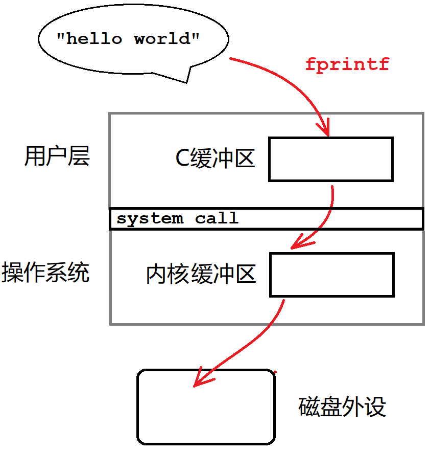
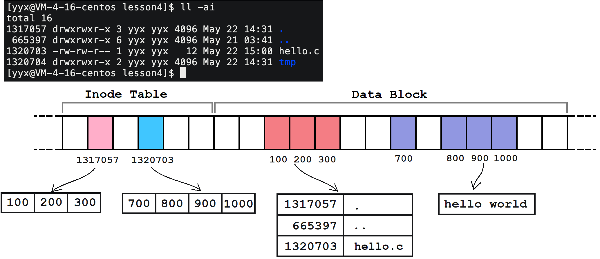

# 基础IO

## 1. 内存文件

### 1.1 理解内存文件

**文件是内容和属性的集合**，任何文件操作都可以分为对文件内容的操作和对文件属性的操作。文件没被打开时是放在磁盘上的，想要打开文件就必须经过操作系统访问磁盘。


打开文件的本质就是将文件相关的属性信息加载到内存中。内存中不仅存在大量的进程，也存在大量的文件，**操作系统必然要像管理进程一样将内存中的文件管理起来**。

文件有文件结构体叫`struct file`，用来描述文件相关的属性和内容。系统会将所有打开的文件用文件结构体描述，再用数据结构把所有文件结构体组织起来。

> file结构体可以将内存中的文件管理起来。可如何将进程和进程打开的文件关联起来呢？

#### 文件描述符

进程有个内核数据结构叫做`files_struct`，用来描述进程的文件信息。进程PCB中保存着`files_struct`结构体的地址。

该结构体最后一个成员是文件结构体的指针数组`struct file* fd_array[]`，用于记录进程所打开的文件结构体的地址。

> 数组作结构体最后一个成员，也就是柔性数组。

将数组`fd_array`下标作为文件描述符，依此作为进程的每个文件编号，用户层只通过文件描述符访问文件，不必涉及底层细节。

**文件描述符的本质就是内核文件数组的下标**。

```cpp
int fd = open ("./log.txt", O_WRONLY | O_CREAT, 0664);
```


##### 文件描述符的性质

文件描述符可以唯一的映射到对应的文件，那么调用系统接口也可以直接对`0`, `1`,`2`号文件进行读写。

```c
write(1, "hello world\n", 12);    // 向1号文件写入
write(2, "hello world\n", 12);    // 向2号文件写入

char buff[64] = {0};
read(0, buff, sizeof(buff) - 1);  // 向0号文件读取
```

文件描述符的分配规则：**分配文件描述符数组中最小且没有使用的位置，作为新文件的fd**。


##### 文件描述符和文件指针

文件描述符是系统对上提供的，用来唯一标识一个文件的。`FILE*`文件指针是C语言语言层提供给C语言程序，用来唯一标识一个文件的。

`FILE`文件结构体，内部是C语言关于文件属性的集合，必定要封装系统提供的文件描述符。


```cpp
printf("%d\n",  stdin->_fileno); // stdin/stdout/stderr中封装的有fd
printf("%d\n", stdout->_fileno);
printf("%d\n", stderr->_fileno);
```

#### 重定向

```cpp
#include <unistd.h>
int dup2(int oldfd, int newfd);
```

**把 newfd 指向的文件地址拷贝给 oldfd 位置**，自此就可以通过 oldfd 访问新文件了。

> oldfd 和 newfd 看作两个变量，dup2 作用就是将 newfd 赋值给 oldfd。

在系统内部，修改进程对应文件描述符表的特定下标位置的内容，致使该 fd 指向其他文件。这个过程上层是无法感知的。


```c
// 输入重定向
int fd = open("log.txt", O_RDONLY);
dup2(fd, 0);
// 输出重定向
int fd = open("log.txt", O_WRONLY);
dup2(fd, 1);
```

##### 重定向和父子进程

- 进程程序替换后dup2的作用并不会消失。修改代码数据和修改进程文件描述符表，二者并不冲突。
- 进程的`files_struct`也是内核数据结构，也会被子进程继承下来。


#### 虚拟文件系统

> 进程默认打开标准输入输出错误文件，分别对应着键盘和显示器设备。如何做到“一切皆文件”的呢？

不同的硬件设备，如键盘显示器等，它们的驱动程序提供给操作系统的读写接口肯定是不一样的。操作系统为避免差异统一管理，在驱动层上添加了一层虚拟文件系统`vfs`，也就是一堆文件结构体的集合。

**文件结构体中只声明读写函数的形式，由底层设备驱动提供具体的读写函数实现。**

当有数据来时，系统先通过系统的读写接口将数据拷贝到对应文件的缓冲区中，再通过设备驱动提供的读写接口将数据真正送到硬件上。

系统不需要关心底层设备细节，只需调用对应文件结构体读写方法即可。这样就能以文件视角统一的看待所有设备。这就是系统层面的多态。


> 文件结构体像是只声明读写函数的父类对象，设备驱动像是拥有读写函数具体实现的子类对象。

这就是Linux系统一切皆文件的实现方法。

### 1.2 文件操作接口

#### open/close

```cpp
#include <sys/types.h>
#include <sys/stat.h>
#include <fcntl.h>
int open (const char* pathname, int flags);
int open (const char* pathname, int flags, mode_t mode);
int creat(const char* pathname,            mode_t mode);

#include <unistd.h>
int close(int fd);
```

| pathname   | flags    | mode     | 返回值                         |
| ---------- | -------- | -------- | ------------------------------ |
| 文件的路径 | 打开模式 | 文件权限 | 成功返回文件描述符，失败返回–1 |

- `flags`是打开模式标志位，**本质是32位整型位图，可以将多个宏参数按位或传入**。

如：`O_CREAT`代表创建，`O_WRONLY`代表只写，`O_RDONLY`代表只读，`O_TRUNC`表示清空原有内容。不可同时传入只读和只写，需要读写可以用`O_RDWR`。

这些宏都是互不相同且只有一个比特位为1的整数。可以将多个宏或起来传入，简单且高效。

- `mode`是八进制整数，用来设置该文件的权限信息。**需要提前设置程序文件权限掩码`umask`**。

如：`0664`，从前向后每一位分别代表用户组员其他人的读写执行权限。

- 和C文件接口`fopen`不同，**`open`以写方式打开，默认不会清空文件内容**。写入会覆盖原有内容。


> 创建文件时必须要指定文件权限。已知文件存在可以不管权限。

```cpp
umask(00);
int fd = open("log.txt", O_CREAT | O_WRONLY, 0666);
int fd = open("log.txt", O_CREAT | O_WRONLY | O_TRUNC, 0666);
int fd = open("log.txt", O_CREAT | O_WRONLY | O_APPEND, 0666);

printf("fd: %d, errno: %d, errdisc: %s\n", fd, errno, strerror(errno));
close(fd);
```

#### write/read

```cpp
#include <unistd.h>
ssize_t write(int fd, const void* buf, size_t count);
ssize_t read (int fd,       void* buf, size_t count);
```

|           | fd         | buf        | count          | 返回值             |
| --------- | ---------- | ---------- | -------------- | ------------------ |
| **write** | 文件描述符 | 写入字符串 | 写入的字符个数 | 真正写入的字符个数 |
| **read**  | 文件描述符 | 读取数组   | 读取的字符个数 | 真正读取的字符个数 |

```cpp
//write
ssize_t s = write(fd, "hello log.txt\n", strlen(msg));
assert(s);

//read
char buff[1024] = {0};
ssize_t s = read(fd, buff, sizeof(buff) - 1);
assert(s);
```

#### lseek

```cpp
#include <unistd.h>
#include <sys/types.h>
off_t lseek(int fd, off_t offset, int whence);
```

`lseek()`用于在文件中定位到指定的位置，并返回该位置相对于文件开头的偏移量。

`offset` 是要定位的偏移量，`whence` 指定了偏移量的基准位置，有以下三种取值：

- `SEEK_SET`：基准位置为文件的开始位置；
- `SEEK_CUR`：基准位置为文件的当前位置；
-  `SEEK_END`：基准位置为文件的结尾位置。

### 1.3 缓冲区

> 先用示例代码，引出缓冲区的存在。

```cpp
close(1);
int fd = open("./log. txt", O_WRONLY, O_CREAT, 0664);
printf("hello printf\n");

//close(fd);
// 如果不close，log.txt会存在内容。 如果close，log.txt不会存在内容
```

#### 用户缓冲区和内核缓冲区

**语言会提供语言层面的缓冲区，属于用户缓冲区**。内核层也存在缓冲区，叫做内核缓冲区。数据会先后经过语言和内核缓冲区，最后到达硬件设备。



>  C语言缓冲区实际上就是`FILE`结构体中指向的一段用户空间。

调用语言级的文件读写函数如，本质是：

1. 先将数据写入到用户缓冲区；
2. 再通过系统调用，刷新用户缓冲区的内容到内核缓冲区；
3. 最后，内核刷新数据到磁盘或其他外设中。

也就是说，通过<u>语言库函数读写文件，都必将数据输出到用户缓冲区，再交给系统输出到内核，并不会直接到外设上</u>。

用户缓冲区的刷新策略有三种：

1. 不缓冲，立即刷新；
2. 行缓冲，一行结束就刷新缓冲区；一般显示器是行刷新。
3. 全缓冲，缓冲区满了才刷新。一般向磁盘文件写入是全缓冲，最后**进程退出时还会统一刷新一次**。

> 此时再回看本节开头的例子代码。

```cpp
close(1);
int fd = open("./log. txt", O_WRONLY, O_CREAT, 0664);
printf("hello printf\n");

//close(fd);
// 如果不close，log.txt会存在内容。 如果close，log.txt不会存在内容
```

重定向1号文件为普通文件，输出一行后数据仍在用户缓冲区中。此时**直接关闭系统文件流**，会导致用户缓冲区的内容最终无法刷新到文件中。

避免这种情况可以手动 fflush 刷新用户缓冲区，或者关闭C文件流而不是系统文件流。

~~~cpp
write(3, "hello write\n", 12);
fprintf(file_ptr, "hello printf\n");
close(1); // 关闭文件
~~~

- `write`直接输出到内核缓冲区，不会被 close 关闭文件而“拦截”；
- `printf`是语言库函数，要经用户缓冲区再到内核缓冲区，会被 close 关闭文件“拦截”住。

#### 缓冲区和子进程

~~~cpp
write(fd, "hello write\n", 12);
fprintf(fp, "hello printf\n");

fork(); // 创建子进程
~~~

> 执行结果如图所示：

~~~shell
hello write
hello printf  # 父进程
hello printf  # 子进程
~~~

子进程创建时，printf 等库函数输出的数据仍在C缓冲区中。C缓冲区是存在于C语言文件结构体`FILE`中的内存空间。

故C缓冲区属于程序代码和数据，父子进程是共享的。**任意一方刷走C缓冲区的数据就会触发写时拷贝，剩下一方必定也会刷新走属于自己的那一份数据**。

> 也就是说，只要子进程创建之后，数据仍然存在于用户缓冲区中，那么父子进程必然会都刷新一遍。
>
> 当然，可以在提前刷新缓冲区，fork 之时就不会存在数据写实拷贝了。

&nbsp;

## 2. 文件系统

> 文件没被打开时是存储在磁盘上的，接下来就是探究磁盘如何合理的存储文件。

### 2.1 硬盘的物理结构

文件就是文件内容和文件属性的集合。文件如果没有被打开，则是存储在磁盘上的。

磁盘是计算机中的唯一的机械设备。虽然机械硬盘几乎退出桌面市场，但它具有容量大，价格便宜，寿命长的优点，所以企业中一般都使用机械硬盘存储数据。

磁盘整体由盘片、主轴、磁头、机械臂以及其他部分组成，其中主轴带动多个盘片高速转动，由机械臂带动磁头在盘片上寻找指定位置进行读写。

- 主轴上套有一摞盘片，每一个盘片有两个面，每个面都有一个磁头。
- 盘片表面多个同心圆划分出“磁道”，半径所在直线划出“扇面”，扇面和磁道划分出“扇区”。每个扇区大小一般为512字节。
- 磁头首先要移动到指定的磁道，盘片不停旋转，等待指定的扇区到来，即可进行读写。

> 这就是CHS定位法。


#### 抽象逻辑结构

> CHS是磁盘硬件的定位方式，如果直接将该方法写入内核。就会使内核代码冗余度高、耦合度高、难以维护。
>
> 操作系统会对磁盘这样的块设备，抽象出统一的逻辑结构。

由于磁头很小，可以看成一个点，磁盘虽然是圆形，对于磁头来说，磁道是线性的一条直线。故可以将磁盘抽象成线性结构，如下图所示：


磁盘可以抽象成元素为磁道的数组，磁道抽象成元素为扇区的数组，通过下标可以定位任意一个扇区。系统IO的基本单位为4KB，我们将8个扇区看作一个块，通过地址也能定位任意一个块，这就是逻辑块地址LBA。

> LBA和CHS地址通过简单数学运算就可以转化，这样系统和磁盘的交互方式就打通了。

### 2.2 磁盘区域的管理

> 系统是如何按LBA逻辑结构去管理磁盘的呢？以ext2文件系统为例。

1. 将一整块硬盘，划分成多个磁盘分区。
2. 每个磁盘分区都有一个存储磁盘系统加载信息的启动块`Boot Block`和多个分组`Block Group`。


#### 磁盘文件的存储

每一个块组`Block Group`内部，又被划分出了不同区域，这里才是存储文件的开始：

| 内容                     | 解释                                                         |
| ------------------------ | ------------------------------------------------------------ |
| `Super Block`            | 存储整个分区文件系统的属性信息。 备份于多个分组中，防止故障  |
| `Group Descriptor Table` | 存储本组的使用详细统计信息，如组内 inode 和 data block 的使用情况 |
| `Inode Table`            | 实际存储文件属性的区域                                       |
| `Data Blocks`            | 实际存储文件内容的区域                                       |
| `Block Bitmap`           | 便于在`Data Block`查找空`block`的辅助位图                    |
| `Inode BitMap`           | 便于在`Inode Table`查找空`inode`的辅助位图                   |

> Linux 存储文件是将文件的内容和属性分离存储的。

- `Inode Table`：是实际存储文件属性的区域。
  - 这块区域也被划分成很多`inode`节点，用来存储单个文件的属性，大小一般为128Bytes。
  - 一个文件一个`inode`，所以`inode`编号可以唯一标识文件。

- `Data Blocks`：是实际存储文件内容的区域。
  - 这块区域又划分成很多`block`块，用来存储单个文件的内容，大小一般为4KB。
  - `inode`结构体中有`block`的索引数组。


- `Block BitMap`，`Inode BitMap`：遍历`Inode Table `找空余`inode`效率太低。因此使用两个位图来帮助我们查找空余位置。
- 位图的下标对应每个`inode/block`的位置下标。

- 位图的元素值为1表示该`inode/block`被占用、为0表示`inode/block`未使用。


#### 理解inode

~~~c
//inode结构体，存储文件的属性信息
struct inode {
  	// 文件的所有属性
  	int inode_number;
    int blocks[NUM]; // 存储该文件所占有的所有block的下标
};
~~~

> NUM个block大小终究是有上限的，如何做到一个文件的大小无上限呢？

blocks数组存储的是文件所占用的block的索引下标。其中分为直接索引和二级索引甚至多级索引。

- 直接索引：直接就是存储文件内容的block的下标。
- 二级索引：对应的block中不存储文件内容，存储文件后续使用的block的下标，依此找到后续block。

文件系统会根据文件的大小，来规定一级索引和多级索引的数量。


#### 理解文件增删查改

```shell
$ ll -i     # 查看文件的inode编号
total 16
1320703 -rw-rw-r-- 1 yyx yyx   12 May 22 15:00 hello.c
1320704 drwxrwxr-x 2 yyx yyx 4096 May 22 14:31 tmp
```

Linux系统只根据文件的 inode 编号来标识文件。

文件的 inode 中并不存储文件名，但文件都存放在某个目录下**。在目录文件的 block 中保存的是该目录下所有文件的 inode 编号和文件名的映射**。



~~~shell
$ touch hello.c           # 1. 在inode bitmap中找到空余的inode位置，并创建文件inode
					      # 2. 再将文件名hello.c和inode的映射，填充到所在目录的block中

$ echo "hello" > hello.c  # 1. 读取所在目录的block，获取hello.c文件映射的inode
					      # 2. 根据inode找到文件的block，将字符串hello填入block中

$ cat hello.c          	  # 1. 读取所在目录的block，获取hello.c文件映射的inode
						  # 2. 遍历inode table找到并打印inode对应的block[]中的内容

$ rm hello.c              # 1. 读取所在目录的block，获取hello.c文件映射的inode
						  # 2. 在inode bitmap中找到对应inode的位置将其置0
						  # 之后再创建文件会自动覆盖
~~~

### 2.3 软硬连接

软链接像是 windows 里的快捷方式，硬链接像是直接复制一份。

#### 软硬链接的创建和取消

```shell
$ ln -s mytest mytest_link # 创建软链接
$ ln    mytest mytest_hard # 创建硬链接

$ unlink mytest_hard       # 取消硬链接
$ unlink mytest_link       # 取消软链接
```

#### 软硬链接的区别

```shell
$ ln tmp/test mytest_soft -s
$ ln tmp/test mytest_hard
$ ll -i
total 8
1055017 -rw-rw-r-- 2 yyx yyx 48 Apr 18 02:24 myfile
1055017 -rw-rw-r-- 2 yyx yyx 48 Apr 18 02:24 myfile_hard           # 硬连接inode和源文件相同
1055027 lrwxrwxrwx 1 yyx yyx 10 Apr 18 02:24 myfile_soft -> myfile # 软连接inode和源文件不同
```

硬链接文件的 inode 和被链接文件的 inode 是一样的，但软链接文件有自己独立的 inode。

- **软连接是个独立文件，有自己的 inode 和 block**。block 中存储原文件的路径。
- 硬链接不是独立文件，硬链接的**本质是在指定目录下把原文件 inode 和新文件名的建立映射关系**。

#### 硬链接数

~~~shell
$ ll -ai
total 16
			   # 硬链接数
			   #   ↓
1055009 drwxrwxr-x 2 yyx yyx 4096 Apr 18 02:29 .
1048191 drwxrwxr-x 6 yyx yyx 4096 Apr 18 02:23 ..
1055017 -rw-rw-r-- 2 yyx yyx   48 Apr 18 02:24 myfile
1055017 -rw-rw-r-- 2 yyx yyx   48 Apr 18 02:24 myfile_hard
1055027 lrwxrwxrwx 1 yyx yyx   10 Apr 18 02:24 myfile_soft -> myfile
~~~

硬链接数是inode里的一个属性字段，本质是一种引用计数，表示分区内该 inode 存在多少对映射关系。等到硬链接数为0时，才会将文件从系统中删除。

#### 软硬链接的应用场景

##### 软链接

软链接一般用于将一个其他目录下的文件提到当前目录下，一般用来链接库文件。

##### 硬链接

每个目录下都有 . 和 .. ，是当前目录和上级目录的硬链接，方便我们进行目录调整。

目录的硬链接数可以暗示其下有多少子目录。

系统不允许用户给目录的硬链接，容易造成路径环路问题。

### 2.4 三个文件时间

```shell
$ stat test.c   # 获取文件的状态信息
  File: ‘test.c’
  Size: 0               Blocks: 0          IO Block: 4096   regular empty file
Device: fd01h/64769d    Inode: 1320701     Links: 1
Access: (0664/-rw-rw-r--)  Uid: ( 1003/     yyx)   Gid: ( 1003/     yyx)
Access: 2022-05-24 02:38:07.988811151 +0800  # Access Time
Modify: 2022-05-24 02:38:07.988811151 +0800  # Modify Time
Change: 2022-05-24 02:38:07.988811151 +0800  # Change Time
 Birth: -
```

| 时间            | 解释                         |
| --------------- | ---------------------------- |
| **Access Time** | 文件被**访问**的最近时间     |
| **Modify Time** | 文件**内容**被修改的最近时间 |
| **Change Time** | 文件**属性**被修改的最近时间 |


`Access Time`本应是最常改动的时间，所以系统为防止刷盘，该时间由系统定时刷新。

此外，Makefile 选择性编译源文件，就是根据源文件 Modify Time 是否新于可执行文件的 Modify Time。

&nbsp;

## 3. 动静态库

### 3.1 动静态库的定义

一般语言都会提供库，库可以看成一套头文件和一套库文件的集合。库用来给开发者提供一些基础的功能，可以提高开发效率。也可以保证代码安全。

一般库分两种：静态库和动态库。Linux下静态库文件的后缀为`.a`，动态库文件的后缀为`.so`。

```shell
$ ldd a.out # 查看可执行程序所依赖的动态库
	linux-vdso.so.1 (0x00007ffeaadef000)
	libc.so.6 => /lib/x86_64-linux-gnu/libc.so.6 (0x00007fa174091000)
	/lib64/ld-linux-x86-64.so.2 (0x00007fa174298000)
$ ll /usr/lib32/libc.so.6
lrwxrwxrwx 1 root root 12 Apr  7  2022 /usr/lib32/libc.so.6 -> libc-2.31.so
$ ll /usr/lib32/libc-2.31.so
-rwxr-xr-x 1 root root 2004160 Apr  7  2022 /usr/lib32/libc-2.31.so
```

- 库的文件命名：`libXXXX.so.xx`或`libXXXX.a.xx`。
- 库的真实命名：去掉前缀`lib`，去掉后缀和版本号`.so.xx`或`.a.xx`，剩下的就是真实命名。

> 云服务器默认不安装c标准静态库。
>
> ```
> $ sudo yum install -y glibc-static libstdc++-static
> ```

### 3.2 动静态库的生成

#### 静态库的生成

1. 先将所有`.c`源文件编译成`.o`目标文件，
2. 将所有的`.o`文件打包形成一个库文件。这就是静态库的本质。

```shell
$ ar -rc libXXX.a XXX1.o XXX2.o # ar 打包静态库命令 -rc replace & create
```

```shell
$ ar -tv libXXX.a # 查看静态库打包的.o目标文件
rw-rw-r-- 1003/1003   1240 May 24 18:02 2022 add.o
rw-rw-r-- 1003/1003   1240 May 24 18:02 2022 sub.o
```

#### 动态库的生成

1. `gcc -fPIC -c *.c`：首先形成与位置无关码
2. `gcc -shared -o libXX.so *.o`：将目标文件打包成动态库

```makefile
libmath.so : add.o sub.o
    gcc -shared -o $@ $^ # -shared 共享库也就是动态库
%.o : src/%.c
    gcc -fPIC -c $< # position ignore code 与位置无关码
```

#### 库的使用

链接指定的库文件，需要指定头文件位置、库文件位置、库文件名称。

```shell
$ gcc test.c -Iinc  -Llib  -lmath [-static]
```

1. `-I`：指明头文件所在路径
2. `-L`：指明库文件所在路径
3. `-l`：指明库文件的真实名称，注意是去掉前后缀的真实名称
4. 如果库目录中动静态库都有，优先使用动态库，想使用静态库可以加选项`-static`。
   - 加上`-static`选项会生成纯静态链接程序。
   - 不加但路径下只有静态库，会生成半动半静链接程序。该库采用静态链接，但其他库默认动态链接。

> 系统库文件在系统的默认路径下，头文件是在`usr/include`，库文件在`/lib64`中。编译器能够自动识别。

```makefile
mytest : mytest.c
    gcc -o $@ $^ -Iinc -Llib -lmath
```

由于动态库是运行时链接，运行程序时，系统加载器默认只会加载系统默认库的路径。所以我们需要告诉加载器依赖库的路径，将库路径放入环境变量`LD_LIBRARY_PATH`。


可以将该环境变量的导入放到`bashrc`中，或者放到系统级动态链接库地址配置目录`/etc/ld.so.conf.d`下并执行`ldconfig`。

```makefile
bin=bin
src=src
libsrc=libsrc
lib=lib
obj=obj
sbin=$(bin)/smain
dbin=$(bin)/dmain
target_bin=$(sbin) $(dbin)
target_lib=$(lib)/libmath.a
target_shared_lib=$(lib)/libmath.so
target_obj=$(obj)/add.o $(obj)/sub.o
target_pic_obj=$(obj)/pic_add.o $(obj)/pic_sub.o

all: $(target_obj) $(target_pic_obj) $(target_lib) $(target_shared_lib) $(target_bin)

$(obj)/%.o:$(libsrc)/%.c
	gcc -o $@ -c $<
$(target_lib):$(target_obj)
	ar  -o $@ $^ -rc
$(obj)/pic_%.o:$(libsrc)/%.c
	gcc -o $@ -c $< -fPIC
$(target_shared_lib):$(target_pic_obj)
	gcc -o $@ $^ -shared
$(sbin):$(src)/main.c
	gcc -o $(sbin) $(src)/main.c -lmath -Iinc -L$(lib) -static
$(dbin):$(src)/main.c
	gcc -o $(dbin) $(src)/main.c -lmath -Iinc -L$(lib)

.PHONY:clean
clean:
	rm -rf obj/* lib/* bin/*
```


### 3.3 静态链接和动态链接

静动态链接的区别在于链接的时机不一样：

- 静态链接是在链接时就将库文件和源文件链接，放到一块形成可执行程序。
- 采用动态链接的程序，链接时不链接库文件只链接源文件。在程序执行时，由加载器将库的代码和数据映射进进程的地址空间中，执行库代码的动作和本地代码的动作一致。


|              | 缺点                       | 优点                       |
| ------------ | -------------------------- | -------------------------- |
| **静态链接** | 空间浪费严重，更新较为麻烦 | 运行速度相对快一点         |
| **动态链接** | 运行速度相对慢一点         | 避免空间浪费，维护比较方便 |


- 静态链接将整个库文件拷贝至目标文件中，程序文件体积较大。但其具备执行所需的程序，不需要查找其他文件，所以运行速度相对快。

- 链接形成可执行程序之后，若库文件被修改，就需要重新链接。


- 由系统的装载程序加载库，库内容不会像静态链接那样存在多份，而是多个程序共享。更新库后新库会自动加载，库与可执行文件独立，提高了可维护性。
- 因为链接推迟到了程序运行时，所以每次执行程序都需要进行链接。

#### 理解与位置无关码

由于静态链接是直接将库文件“融合”到可执行程序中，相当于将源代码和库源代码放到一起编译链接，生成的可执行程序采用的编址方式是绝对编址。

但动态库是所有可执行程序共享的，地址空间中空闲位置是不确定的，不可能采用绝对编址。所以动态库中的所有地址就采用偏移量的形式，和可执行程序链接后加上库代码在地址空间中的起始地址就是正确地址了。这就是与位置无关码。


