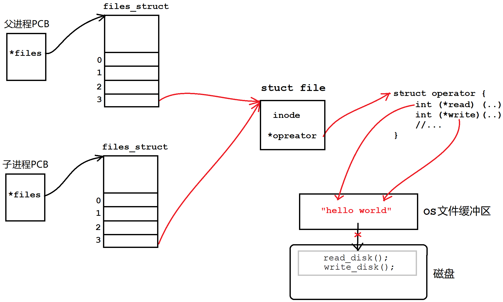
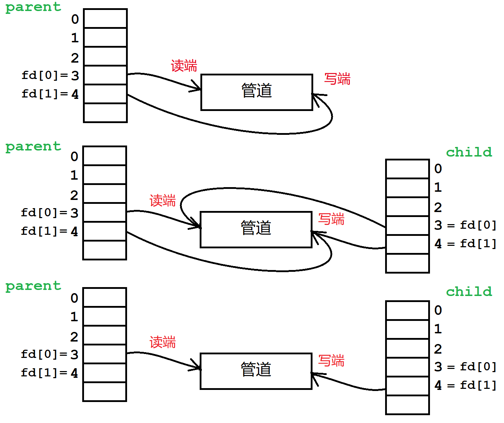
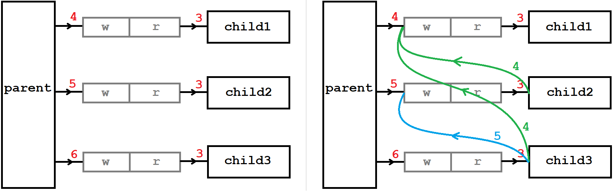
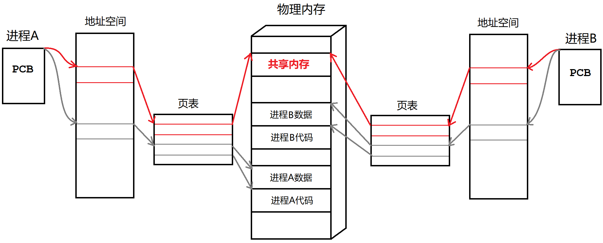

# 进程间通信

进程是独立的，但有时又需要进程之间相互协同工作，此时就需要进程间通信。进程间通信可以用来：

- 数据传输：一个进程需要将它的处理结果交付给另一个进程。
- 资源共享：多个进程共享一份资源。
- 通知事件：一个进程需要向另一个或一组进程发送消息，以通知某种事件的发生。
- 进程控制：一个进程控制另一个进程的执行或终止。

进程具有独立性，不能互相访问资源，所以通信的成本很高。**进程间通信需要操作系统作中间人，提供通信的媒介**。

**进程间通信的前提是两个进程能访问到一份公共的资源**。该资源具有暂存资源的能力，能够让双方读写。

- 资源的具体组织形式不重要，可以简单的看作一段内存。
- 该公共资源一定属于操作系统，不能属于单个进程。

公共资源的呈现形式由设计者决定，可能以文件的方式如管道。**资源组织形式不同导致存在很多种通信方式**。早期标准设计者定制了多种通信标准，有管道，SystemV共享内存，POSIX信号量。

&nbsp;

## 1. 管道

### 1.1 匿名管道

匿名管道是通过父子进程打开相同文件而设计的。子进程会**继承父进程的文件数组，这样子进程也会打开父进程打开的文件**。

<center>

</center>

父子进程指向同一份文件，该文件是内存级文件，不允许刷新缓冲区，使得数据只停留在缓冲区内。系统使用其内核缓冲区作为进程间通信的公共资源，进程就可以读写缓冲区的内容了。

**这种基于文件读写实现的进程间通信的方式，就叫做管道**。

#### 匿名管道的原理

1. 进程以读和写方式打开同一个文件；
2. 创建子进程，子进程同样会以读和写方式打开该文件；
3. **关闭父进程的读端或写端，再关闭子进程的写端或读端，以保证管道单向通信的性质。**

> 管道是个只能单向通信的通信信道，父子进程只能保留一个读端或者写端，且要么父读子写要么父写子读。

<center>

</center>

#### 匿名管道的接口

```cpp
#include <unistd.h>
int pipe(int pipefd[2]);
```

`pipefd[2]`是一个输出型参数，通过 pipefd 数组获取管道文件的读写端描述符。**默认`pipefd[0]`是读端，`pipefd[1]`是写端。**

```cpp
int main()
{
    int pipefd[2];
    if ( pipe(pipefd) != 0 )
        perror("pipe");

    printf("pipefd[0]:%d\n", pipefd[0]);
    printf("pipefd[1]:%d\n", pipefd[1]);
}
$ ./pipe
pipefd[0]:3
pipefd[1]:4
```

管道创建成功返回 $0$，不成功则返回 $-1$。

```cpp
int main()
{
    int pipefd[2];
    if (pipe(pipefd) != 0)
        perror("pipe fail:");

    //目的：子进程写，父进程读
    if (fork() == 0) // child
    {
        close(pipefd[0]); //关读
        const char* msg = "hello world";
        while (1)
        {
            write(pipefd[1], msg, strlen(msg));
            sleep(1);
        }
        exit(0);
    }

    // parent
    close(pipefd[1]); //关写
    while (1)
    {
        char buff[64] = {0};
        ssize_t ret = read(pipefd[0], buff, sizeof(buff) - 1);
        if (ret >= 0)
        {
             printf("child write:%s\n", buff);
        }
        else if (ret == 0)
        {
            printf("read finished\n");
            break;
        }
        else
        {
            printf("read failed\n");
            break;
        }
        sleep(1);
    }
    return 0;
}
```

#### 父子一对多管道通信分析

循环创建多个管道和子进程，最后实际上并不是左图而是右图。

```cpp
for (int i = 0; i < CHILD_PROC_NUM; i++)
{
    int pipefd[2];
    pipe(pipefd);

    pid_t id = fork();
    if (id == 0) {
        close(pipefd[1]);
    } else {
        close(pipefd[0]);
    }
}
```

每次创建子进程都会继承上一次创建的管道，这样后续的子进程都会打开之前的子进程管道的写端。

<center>

</center>

除第一个子进程不需要以外，**之后的每一个子进程都要关闭，创建它之前就存在的写端文件描述符**。

> 例如，子进程2需要关4，子进程3需要关4和5，以此类推。

```cpp
std::vector<int> wfds; // 用来保存历次创建的管道写端fd
for (int i = 0; i < CHILD_PROC_NUM; i++)
{
    int pipefd[2];
    pipe(pipefd);

    pid_t id = fork();

    if (id == 0)
    {
        for (auto fd : wfds) // 关闭其中存在的写端fd
            close(fd);

        close(pipefd[1]);
        //...
    }
	else
    {
        close(pipefd[0]);
        //...
        wfds.push_back(pipefd[1]); // 每次创建新增管道写端fd文件，以待后续关闭
    }
}
```

如果不做这样的工作，后续我们无法通过关闭父进程的写端来让子进程结束读取任务，因为子进程还存在其他写端。

### 1.2 管道的性质

#### 管道的特点

1. 管道是一个只能单向通信的通信信道。
2. 管道的生命周期是随进程的。进程退出后管道也会被系统释放。
3. 匿名管道适用于具有“血缘关系”的进程进行通信，常用于父子通信。
4. 管道自带同步互斥机制，原子性写入。

#### 管道的读写规则

1. 管道是面向字节流的。管道的大小是65536字节即64KB。
2. 管道读写次数不是严格匹配的，读写次数没有强相关。
3. 管道没数据的话，读端要等待；管道满的话，写端要等待。
4. 写端关闭，读端会读到文件结尾。读端关闭，系统会向写端发送`SIGPIPE`信号终止进程。
5. 写入的数据量小于`PIPE_BUF(4KB)` ，管道保证写入原子性。管道满了的话，读取量小于4KB时，写端也会阻塞。

### 1.3 命名管道

> 匿名管道只能提供父子进程的通信，命名管道支持任意进程的通信。

#### 命名管道的原理

- 匿名管道是通过子进程继承父进程的所打开的文件，将该文件的内核缓冲区作为通信资源。
- **命名管道是让两个进程通过路径打开同一个文件，将该文件的内核缓冲区作为通信资源**。

> 命名管道的实现方式比匿名更加简单，通过文件路径进程就能打开同一个文件，同时也是以文件作载体，所以它也是管道。

#### 命名管道的接口

```shell
$ mkfifo myfifo                  # 创建管道文件
$ echo "hello world" > myfifo    # 写入管道文件
$ cat myfifo                     # 读取管道文件
```


```c
#include <sys/types.h>
#include <sys/stat.h>
int mkfifo(const char *pathname, mode_t mode);
```

- 如果管道文件存在就会报错，这样保证管道文件最新。
- 权限 mode 会受到 umask 的影响。

**命名管道同样是以文件为载体的，管道创建成功后，将其当作文件打开并读写即可**。当然数据只存在于文件的内核缓冲区中，不会刷新到磁盘。

```cpp
//server.cc
int main()
{
    umask(00);
    int ret = mkfifo(FIFO_NAME.c_str(), MODE);
    if (ret < 0)
        perror("mkfifo");

    int rfd = open(FIFO_NAME.c_str(), O_RDONLY);
    if (rfd < 0)
        perror("open");

    while (true)
    {
        char buff[BF_SIZE];
        ssize_t s = read(rfd, buff, sizeof(buff) - 1);

        if (s > 0)
        {
            buff[s] = 0;
            std::cout << "client# " << buff << std::endl;
        }
        else if (s == 0)
        {
            std::cout << "client quit, i am out" << std::endl;
            break;
        }
        else
        {
            std::cout << "client error" << strerror(errno) << std::endl;
            break;
        }
    }

    close(rfd);
    unlink(FIFO_NAME.c_str()); // remove fifo file
}
//client.cc
int main()
{
    int wfd = open(FIFO_NAME.c_str(), O_WRONLY);
    if (wfd < 0)
        perror("open");

    std::string input;
    while (true)
    {
        std::cout << "input:> ";
        getline(std::cin, input); // getline不会保留回车

        // char buff[BF_SIZE] = {0};
        // fgets(buff, sizeof(buff), stdin); // fgets会保留回车
        // buff[strlen(buff) - 1] = 0;

        if (input == "quit")
            break;
        ssize_t s = write(wfd, input.c_str(), input.size());
        assert(s >= 0);
    }
    close(wfd);
}
```

> 命名管道也是基于字节流的，所以进程通信的时候需要双方定制通信协议，但目前不考虑这个问题，留到网络部分学习。

多个进程谁先调用`open`打开管道文件，就让谁`mkfifo`创建管道，没有管道文件`open`就会出错返回。

打开管道文件时，只有读写双方都打开才会解除阻塞。

[进程间通讯-管道，以及open函数打开管道阻塞的原则](https://www.cnblogs.com/lsxkugou/p/14171705.html)

[mkfifo创建管道，调用open打开失败](https://blog.csdn.net/markton1990/article/details/127328950)

&nbsp;

## 2. SystemV共享内存

进程间通信技术不断发展，最终演变出一个SystemV标准。该标准提供了三个进程间通信方案：共享内存，消息队列，信号量。我们只讨论共享内存方案。

### 2.1 共享内存的原理

<center>

</center>

**共享内存的本质是让参与通信的进程关联上同一块内存空间，读写该空间从而实现通信**。

1. 开辟一块内存空间，并将地址返回给用户。
2. 让参与通信的进程“挂接”上这块空间，并进行内存读写。
3. 让进程“去挂接”上共享内存。并释放共享内存。

> 这就是共享内存的核心原理。

类似进程和文件的管理，操作系统也会对系统中使用的共享内存进行管理。**描述共享内存的数据结构中存储其属性信息，操作系统对共享内存的管理就变成了对该数据结构的增删查改**。


### 2.2 共享内存的使用

#### 创建shmget

```c
int shmget (key_t key, size_t size, int shmflg);
```

| 参数       | 解释                                                         |
| ---------- | ------------------------------------------------------------ |
| **key**    | 共享内存的数据结构中，用以唯一标识共享内存的数。可用ftok生成<br>内核用 key 唯一确定共享内存，用户层用 id 进行管理共享内存 |
| **size**   | 建议是4KB的整数倍，内存申请的最小单位为4KB                   |
| **shmflg** | `IPC_CREAT`：共享内存不存在就创建，存在就获取返回<br>`IPC_EXCL`：搭配`IPC_CREAT`，表示不存在就创建，存在就报错返回（得到最新内存）<br>必须设置访问权限以及`umask`防止后续无法挂接。 |
| **返回值** | 返回该共享内存在用户层面上的唯一标识`shmid`，出错返回 –1     |

```cpp
//server
key_t key = ftok(PATH_NAME, PROJECT_ID);
int shmid = shmget(key, 4096, IPC_CREAT | IPC_EXCL | 0664); // 创建共享内存
//client
key_t key = ftok(PATH_NAME, PROJECT_ID);
int shmid = shmget(key, 4096, IPC_CREAT); // 查找共享内存
```

从`IPC_CREAT`和`IPC_EXCL`的含义来看，一定是一个进程创建共享内存，一个进程查找共享内存。

进程运行结束，共享内存仍然存在，说明共享内存独立于进程，是由系统单独管理的。

#### 控制shmctl

```c
int shmctl (int shmid, int cmd, struct shmid_ds* buf);
```

| 参数      | 解释                                                         |
| --------- | ------------------------------------------------------------ |
| **shmid** | 待操作的共享内存编号                                         |
| **cmd**   | 对共享内存的操作，选项有`IPC_STAT`获取属性、`IPC_SET`设置属性、`IPC_RMID`删除共享内存 |
| **buf**   | 用来设置进内核或获取内核的共享内存结构体                     |

> 控制共享内存仅作了解。

```c
shmctl(shmid, IPC_RMID, NULL);
printf("key:%u, shmid:%d\n, shm has been deleted\n", key, shmid);
```

#### 关联/去关联shmat shmdt

```c
void* shmat (int shmid, const void* shmaddr, int shmflg) ; /*attach*/
int   shmdt (const void* shmaddr);                         /*detach*/
```

> shmaddr、shmflg 设置为 0 即可，无需关心。

- shmat 挂接成功返回共享内存的所在地址，失败返回 –1。
- shmdt 通过共享内存的地址去挂接，成功返回 0，失败返回 –1。

&nbsp;

管道是以文件为载体的，业务逻辑就转化为对文件的操作。而共享内存是以一段内存空间为载体的，`shmat`函数返回起始地址，所以业务逻辑是一系列的指针操作。

```c
char* addr = (char*)shmat(shmid, NULL, 0);

printf("%s\n", addr); // 将空间看作字符串，按字符串的方式读取

shmdt(addr);
shmctl(shmid, IPC_RMID, NULL);
```

#### 共享内存的指令

```shell
$ ipcs            # 显示systemV所有通信方案的使用情况
$ ipcs -m         # 显示共享内存的使用情况
$ ipcrm -m shmid  # 释放指定的共享内存
```

```shell
$ ipcs

------ Message Queues --------
key        msqid      owner      perms      used-bytes   messages

------ Shared Memory Segments --------
key        shmid      owner      perms      bytes      nattch     status
0x00000000 0          root       644        80         2
0x00000000 1          root       644        16384      2
0x00000000 2          root       644        280        2
0x0002fd94 4          yyx        0          4096       0

------ Semaphore Arrays --------
key        semid      owner      perms      nsems
0x000000a7 0          root       600        1

$ ipcs -m

------ Shared Memory Segments --------
key        shmid      owner      perms      bytes      nattch     status
0x00000000 0          root       644        80         2
0x00000000 1          root       644        16384      2
0x00000000 2          root       644        280        2
0x0002fd94 4          yyx        0          4096       0

$ ipcrm -m 4
```

### 2.3 共享内存的特点

- **共享内存生命周期随内核，与进程无关。**
- **共享内存是所有进程间通信方案中最快的**，因为其以一块裸露内存作载体，不存在数据拷贝。
- **共享内存不提供任何同步或互斥机制**，需要程序员自己保证数据安全。
