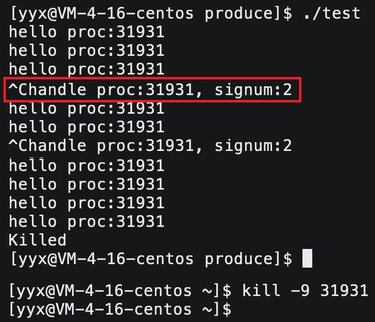

# 进程信号


## 1. 信号的产生


### 1.1 信号的概念

> 生活中也存在信号，如红绿灯，除了信号本身还有信号触发时人们的动作，如：闻鸡起舞，红灯停绿灯行。

系统中也存在信号，**信号是系统发送给进程的**，进程需要在合适的时候处理信号，因此进程必须明确各种信号对应的动作。

Linux共有62种信号，前31个是普通信号，后31个是实时信号。实时信号不作考虑。

```shell
$ kill -l
 1) SIGHUP        2) SIGINT      3) SIGQUIT      4) SIGILL      5) SIGTRAP
 6) SIGABRT       7) SIGBUS      8) SIGFPE       9) SIGKILL	   10) SIGUSR1
11) SIGSEGV      12) SIGUSR2    13) SIGPIPE	    14) SIGALRM    15) SIGTERM
16) SIGSTKFLT	 17) SIGCHLD	18) SIGCONT	    19) SIGSTOP	   20) SIGTSTP
21) SIGTTIN      22) SIGTTOU	23) SIGURG	    24) SIGXCPU    25) SIGXFSZ
26) SIGVTALRM    27) SIGPROF    28) SIGWINCH    29) SIGIO	   30) SIGPWR
31) SIGSYS
```

Linux中信号用宏来表示，数字是宏值，单词是宏名。

#### 信号的产生

当然，进程必须能够分辨信号和明确指定信号的处理方式，以便在信号到来时能够及时处理。也就是说，**进程在信号产生前就应该具有识别和处理信号的能力**。

信号可能随时产生，也就是说，**信号的产生对进程来说是异步的**。

#### 信号的保存

> 实际生活人们收到某种信号时，可能并不会立即处理因为此时还在处理其他事情。比如闹钟响起时赖床。

进程在收到信号时也可能无法立即处理，因为进程可能正在处理优先级更高的任务，只能将信号暂存起来，等到合适的时候再进行处理。也就是说**，进程具有暂时保存信号的能力**。

信号本身也是数据，可被暂存在PCB中。系统提供多种发送信号的方式，但**本质都是让系统向进程控制块中写入数据**。

我们已经知道，产生信号实际是操作系统在向进程发送信号。**信号本身也是数据，发送信号的本质就是向PCB中写入信号数据**。

进程只关心是否收到信号及是几号信号，因此**进程中采用整型位图来标识进程是否收到某种信号**，比特位位置代表信号编号，比特位内容代表是否收到信号。


> 系统向进程发送信号就是向进程 task_struct 的信号位图的对应位置写入1。

[Linux信号说明](https://blog.csdn.net/u011607971/article/details/116067734)

### 1.2 注册信号处理动作

前面已经说过，进程在信号产生前就必须明确对信号的处理方式。

- 分辨信号：进程能够分辨系统设计好的共62种信号。
- 处理方式：一般信号有默认动作、忽略动作、自定义动作。
  - 默认动作：信号的默认行为，如`SIGKILL`的杀死自身进程。
  - 忽略动作：忽略掉该信号，不做出任何反应，也是一种信号处理的方式。
  - 自定义动作：要求内核返回用户态执行用户注册的行为，我们称之为捕捉一个信号。


```cpp
// signal 注册进程对信号 signum 的处理动作为函数 handler，并返回旧的处理方法
#include <signal.h>
typedef void (*sighandler_t)(int); // handler 函数指针
sighandler_t signal(int signum, sighandler_t handler);
```

```c
void handler(int sig)
{
    printf("process:%d, signal number:%d\n", getpid(), sig);
}
int main()
{
    signal(2, handler); // 通过signal注册对2号信号的处理动作，并没有实际信号产生
    while (1)
    {
        printf("hello proc:%d\n", getpid());
        sleep(1);
    }
    return 0;
}
```



**通过`signal`接口注册对某个信号的处理动作，相当于是一种预定的注册机制，并没有任何信号产生。**

> 9号`SIGKILL`信号和19号`SIGSTOP`信号无法被注册。

### 1.3 信号产生的方式

产生信号共有4种大方式，信号产生的方式繁多，但底层都是系统向进程发送信号。

| 方式     | 具体解释                                                     |
| -------- | ------------------------------------------------------------ |
| 系统指令 | 指令`kill`或者键盘发送快捷键`^C`,`^Z`等。                    |
| 系统调用 | 系统提供多种发送信号的接口，方便我们在代码中设置信号。       |
| 软件条件 | 某些软件条件不具备，触发信号发送的条件，操作系统向进程发送信号。 |
| 硬件异常 | 进程运行中出现错误导致软硬件出现异常，被操作系统甄别并处理。 |

#### 系统指令

| 输入   | 含义                                                        |
| ------ | ----------------------------------------------------------- |
| `kill` | 向进程发送任意号信号                                        |
| `^C`   | 向进程发送2号信号`SIGINT`，默认是终止进程。                 |
| `^\`   | 向进程发送3号信号`SIGQUIT`，默认是终止进程并进行core dump。 |
| `^Z`   | 向进程发送20号信号`SIGTSTP`，默认是停止进程。               |

```shell
$ ./a.out &   # 将进程放到后台执行
$ fg          # 将后台进程调至前台
```

> 键盘产生的信号，只能作用于前台进程，后台进程无标准输入所以无法使用键盘发送信号。


#### 系统调用

##### kill

```c
#include <sys/types.h>
#include <signal.h>
int kill(pid_t pid, int sig); // kill函数向指定进程发送指定信号
```

```c
int main(int argc, char** argv)
{
    if (argc != 3) {
        std::cout << "Usage:\n\t./mykill -signo pid" << std::endl;
        exit(1);
    }

    int sig = stoi(argv[1] + 1);
    int pid = stoi(argv[2]);

    if (kill(pid, sig) < 0)
        perror("mykill");
    else
        std::cout << "kill -" << sig << " " << pid << std::endl;

    return 0;
}
```

##### raise

```c
#include <signal.h>
int raise(int signum); // raise函数给自身进程发送指定信号
```

```c
void handler(int signo)
{
    std::cout << "get a signal: " << signo << endl;
}

int main()
{
    signal(SIGINT, handler);

    while (true)
    {
        sleep(1);
        raise(SIGINT);
    }
    return 0;
}
```

##### abort

```c
#include <stdlib.h>
void abort(void); // abort函数给自身进程发送6号信号SIGABRT
```

```c
int main()
{
    if (fork() == 0)
    {
        std::cout << "i am child process" << std::endl;
        abort();
    }

    int status = 0;
    waitpid(-1, &status, 0);
    std::cout << "exit code: " << (status >> 8) << ", signal: " << (status & 0x7F) << endl;

    return 0;
}
```

> abort是C库函数，不仅会发送信号还会调用exit终止程序。

#### 软件条件

由于软件条件的不就绪而触发信号。例如管道所有读端关闭，写端的条件不就绪，系统就会向其发送SIGPIPE信号。

##### alarm

`alarm`设置一个计时器，计时结束后向自身进程发送14号`SIGALRM`信号终止进程。

```c
#include <unistd.h>
unsigned int alarm(unsigned int seconds);
```

- 参数是设置闹钟的时间。参数为0表示取消闹钟。
- 返回值是上一次alarm闹钟的剩余时间，如果之前没有设定过则返回0。每次调用alarm都会覆盖之前的闹钟并重新设定。

```cpp
int main()
{
    int cnt = 5;
    alarm(cnt);

    while (true)
    {
        std::cout << "remaining time: " << cnt-- << std::endl;
        sleep(1);
    }

    return 0;
}
```

#### 进程异常

```cpp
int main()
{
    *(int*)11223344 = 100; // 野指针
}

$ ./test
Segmentation fault //带有野指针等错误的程序运行起来，进程会崩溃。
```

运行存在异常问题的程序时，会导致CPU、MMU等硬件会出现异常，致使操作系统就会向进程发出对应的信号。

- 如地址越界、权限不足等段错误，MMU在查找页表后会直接报错，进程会收到11号`SIGSEGV`信号。
- 除零等浮点数溢出错误会导致CPU中状态寄存器出现异常，进程就会收到8号`SIGFPE`信号。

```cpp
void handler(int signum) {
	printf("get a sigal num:%d\n", signum);
    exit(1);
}

int maln()
{
    signal(SIGSEGV, handler);
    *(int*)11223344 = 100; // 野指针
}
$ ./test
get a sigal num:11

int main()
{
	signal(SIGFPE,  handler);
    int a = 1 / 0;
}
$ ./test
get a sigal num:8
```

&nbsp;

## 2. 信号的保存

进程可能正在处理优先级更高的事情故不能及时处理信号，所以进程使用信号位图来暂存已收到的信号。

### 2.1 信号状态的概念

| 概念     | 解释                                                         |
| -------- | ------------------------------------------------------------ |
| 信号递达 | 执行信号处理动作就叫做信号递达。                             |
| 信号未决 | 信号产生但并未递达的状态称为信号未决，就是信号被暂存在pcb信号位图中。 |
| 信号阻塞 | 系统允许进程屏蔽/阻塞某些信号。此时信号是未决的，因阻塞故无法递达，解除阻塞方可递达。 |

执行信号的忽略动作就说明信号已被处理，只是处理动作就是什么都不做，但已递达。

阻塞表示信号被屏蔽，信号被阻塞就代表信号不可能被递达，但可以是未决的，直至解除阻塞方可递达。

### 2.2 信号保存的方式

> 这些概念在 pcb 中是如何表示的呢？

进程PCB中有三张表，分别是`block`表，`pending`表，`handler`表，如图所示：


| 表名    | 内容                                     | 本质                                      |
| ------- | ---------------------------------------- | ----------------------------------------- |
| pending | 为1表示收到信号，为0反之                 | `pending`位图表示是否收到信号             |
| block   | 为0表示信号被阻塞，为1反之               | `block`位图表示是否阻塞信号。信号屏蔽字。 |
| handler | `SIGDFL(0)`，`SIGIGN(1)`，自定义函数地址 | `handler`函数指针数组存储信号处理动作。   |

> 三张表横着看，一行对应一个信号，首先是否收到，然后是否屏蔽，其次是其处理方法。

 ```c
 //伪代码
 if (block & (1 << (signo - 1))) { //被阻塞
     //...
 }
 else { //未阻塞
     if (pending & (1 << (signo - 1))) { //未阻塞且已收到
     	handler[signo - 1](signo);
         return 0;
     }
 }
 ```


- 一个信号如果被 block，即使其被 pending，也不能被 handler。
- 一个信号没有被 block，如果其被 pending，进程将会在合适的时候进行 handler。
- 一个信号如果被 handler，那么其一定被 pending，且一定不能被 block。

> 这三张表涵盖了信号是否被屏蔽，是否收到，处理方法是什么，此时进程就具有识别信号的能力。

### 2.3 信号集的操作

> 系统为用户提供了修改信号的数据类型和接口。

#### 信号位图类型 sigset_t

为防止用户误操作，信号的各种操作必须使用系统提供的数据类型：

```c
sigset_t set; // 信号位图结构类型

// source code
typedef struct {
    unsigned long int __val[_SIGSET_NWORDS];
} __sigset_t;

typedef __sigset_t sigset_t;
```

可以使用`sigset_t`变量，操作内核中的未决和阻塞位图。虽然`sigset_t`本质是位图，但不允许自行位运算，只能用系统提供的接口。

#### 信号调用接口

一般操作信号的步骤是：

1. 先设置好自定义信号位图，也就是使用`sigset_t`类型定义的用户变量。
2. 再将该变量写入内核数据结构中。

用来修改用户信号变量的一系列接口：

```c
#include <signal.h>
int sigemptyset( sigset_t *set );  // 全部置0
int sigfillset ( sigset_t *set );  // 全部置1

int sigaddset( sigset_t *set, int signo );  // 加入信号
int sigdelset( sigset_t *set, int signo );  // 删除信号

int sigismember( const sigset_t *set, int signo );  // 判断是否存在
```

用来将位图变量设置进进程PCB的信号位图的接口：

##### 读取/修改信号阻塞集 sigprocmask

`sigprocmask`用来读取或者修改进程PCB中的信号阻塞位图。

```c
#include <signal.h>
int sigprocmask(int how, const sigset_t *set, sigset_t *oldset);
```

| 变量     | 解释                                                         |
| -------- | ------------------------------------------------------------ |
| `set`    | 设置进内核的信号阻塞集，不需要可以设为`NULL`                 |
| `oldset` | 获取内核中的信号阻塞集，不需要可以设为`NULL`                 |
| `how`    | 设置信号的方式，选项有三种：`SIG_BLOCK`，`SIG_UNBLOCK`，`SIG_SETMASK`： |

| how参数的选项 | 解释                                                       |
| ------------- | ---------------------------------------------------------- |
| `SIG_BLOCK`   | 将set中值为1的信号设置进内核阻塞表中，相当于`mask|=set`。  |
| `SIG_UNBLOCK` | 将set中值为1的信号在内核中解除阻塞，相当于`mask&=(~set)`。 |
| `SIG_SETMASK` | 直接将内核中的阻塞位图替换为set，相当于`mask=set`。        |

```c
void showBlockset(sigset_t* set)
{
    for (int signo = 1; signo < 32; signo++)
        if (sigismember(set, signo)) std::cout << "1";
        else                         std::cout << "0";
    std::cout << std::endl;
}

int main()
{
    sigset_t set, oset;
    sigemptyset(&set);
    sigemptyset(&oset);

    sigaddset(&set, SIGINT);
    sigprocmask(SIG_SETMASK, &set, &oset);

    while (true)
    {
        showBlockset(&set);
        sleep(1);
    }
    return 0;
}
```

##### 读取信号未决集 sigpending

pending表由系统自行管理无需设置，`sigpending`只能获取进程的pending位图。

```c
#include <signal.h>
int sigpending(sigset_t *set);
```

```c
int main()
{
    sigset_t set, pset;
    sigemptyset(&set);

    sigaddset(&set, SIGINT);
    sigprocmask(SIG_BLOCK, &set, nullptr);

    int cnt = 0;
    while (true)
    {
        sigpending(&pset);
        showBlockset(&pset);

        if (cnt++ == 10)
            sigprocmask(SIG_UNBLOCK, &set, nullptr);
        sleep(1);
    }
}
```

##### 读取/修改信号处理集 sigaction

`signal`和`sigaction`接口没有区别，都是注册对单个信号的处理方法。

```c
#include <signal.h>
int sigaction(int signum, const struct sigaction *act, struct sigaction *oldact);

struct sigaction {
    void   (*sa_handler)(int);
    sigset_t sa_mask;
    int      sa_flags;
   	// ...
};
```

| 参数     | 解释                                         |
| -------- | -------------------------------------------- |
| `signum` | 需要设置的信号                               |
| `act`    | 设置进内核的信号处理集，不需要可以设为`NULL` |
| `oldact` | 获取内核中的信号处理集，不需要可以设为`NULL` |

当某个信号的处理方法正在被调用时，系统会暂时将该信号屏蔽，等处理完该信号时，再对该信号解除阻塞。

如果想在处理某个信号的同时，将其他信号也作屏蔽，则可以使用`sa_mask`字段。

```c
void handler(int signo)
{
    std::cout << "get a signal: " << signo << std::endl;
    sigset_t set;
    sigprocmask(SIG_BLOCK, nullptr, &set);

    for (int sig = 1; sig < 32; sig++)
    {
        if (sigismember(&set, sig)) cout << '1';
        else cout << '0';
    }
    cout << endl;
}

int main()
{
    struct sigaction act;
    act.sa_handler = handler;
    act.sa_flags = 0;
    sigaddset(&act.sa_mask, 1);
    sigaction(SIGINT, &act, nullptr);

    raise(SIGINT);
    return 0;
}
```

&nbsp;

## 3. 信号的处理

### 3.1 信号处理的时机

信号的产生是异步的，信号产生时当前进程可能正在进行更重要的工作，信号必须要被延时处理，具体要取决于操作系统和进程的状态。

> 进程会在合适的时候处理未决的信号，那什么是合适的时候呢？

**当进程从内核态切换到用户态的时候，进程会在系统的指导下，会进行信号的检测和处理**。

每次状态切换只会处理一个信号，并且是先将pending位图中信号位置置零，再去调用信号处理方法。

#### 内核态和用户态的概念

进程在执行代码时会不断的切换用户态和内核态，<u>执行用户代码时处于用户态，执行内核代码时处于内核态</u>。

- 执行用户态的代码时，进程必须为用户态，必须受到操作系统的监管。
- 执行内核级的代码时，进程必须为内核态，提升身份权限以执行内核代码。再次执行用户代码时必须转为用户态，否则可能影响系统安全。


> 调用系统调用，会发生进程状态转变，并不是只有这一种情况才会发生状态转变。

程序运行起来，用户和内核的代码数据都是要被加载到内存中的。

进程地址空间分为用户空间和内核空间，分别通过用户级页表和内核级页表映射到用户代码数据和内核代码数据。


**用户页表每个进程都有有一份，而内核页表只有一份，被所有进程空间共享**。这样既保证了进程独立性，也保证了每个进程都能访问到内核代码。

> CPU中的CR3寄存器中的数值表示代码执行级别。如果执行级别不够，CPU中状态寄存器出错，进而系统发送信号终止进程。

### 3.2 信号处理的过程

**当进程从内核态返回到用户态的时候，会进行信号的检测和处理工作**。以调用系统接口为例：

1. 用户代码中调用系统接口，进程由用户态进入内核态；
2. 系统接口调用完毕后，检测并处理信号；
3. 如果信号处理动作是默认或忽略，直接处理并返回。如果是自定义捕捉，需返回用户态，调用handler方法。
4. **自定义捕捉方法执行后，不能直接返回用户代码，需返回内核态，调用`sys_sigreturn`返回用户代码**。


- 执行信号处理自定义方法时，必须返回用户态。如果使用内核态执行用户代码，会对系统安全造成威胁。
- 信号处理完后，无法直接返回用户代码，因为处理信号时用户代码执行到什么位置是不清楚的，需要通过`sys_sigreturn()`返回对应位置。

进程进行信号检测处理的具体流程如上图所示，类似无穷大符号：


> 每次经过分界线都是一次状态的切换，而交叉点可以看作信号检测并处理的点。

从处理逻辑来看，信号的产生是异步的，信号的处理是同步的。进入内核态后处理信号，处理后返回用户代码，始终是一个执行流。

&nbsp;

## 4. SIGCHLD
