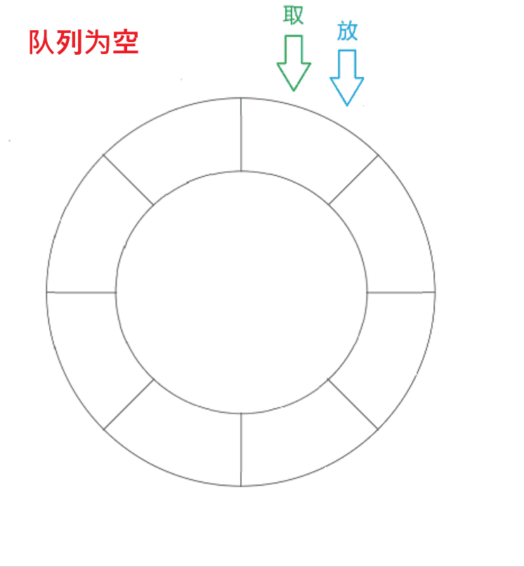
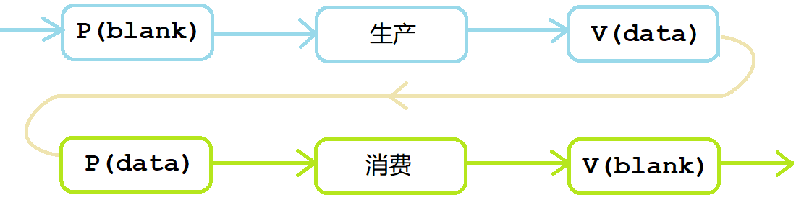

# 多线程

## 1. 线程概念

### 1.0 可重入函数

> 以链表头插为场景，了解一下可重入与不可重入函数的相关概念。

```c
void sig_handler(int signum)
{
    insert(&node2); //3. 信号处理方法也是头插节点
}
void insert(node* p)
{
    p->next = head;//2. 语句结束后，突然收到信号，并执行信号处理方法
    head = p;
}
int main()
{
   insert(&node1); //1. 头插节点
}
```

在头插中，突然收到信号并处理，处理方法是进行头插，就导致一个节点被忽略造成内存泄漏。


> 这并不代表代码存在问题，只是这样的代码在多执行流下可能会出现问题。

**在执行时再次进入可能会造成问题，就表示该函数不能被重入，是不可重入函数**。反之如果不会出现问题，则该函数就是可重入函数。

一般函数都是不可重入函数，可重入函数才是少数。一般内存或IO函数的函数都是不可重入函数。

线程安全和可重入的区别：线程安全是用来形容代码的，可重入是形容函数的。

多线程下易发生重入函数的情况，所以线程安全的函数不一定可重入，但可重入函数一定是线程安全的。

&nbsp;

### 1.1 线程的定义

线程是在进程内部运行的执行分支，是进程的一部分，粒度更细更轻量化，调度成本更低。

> 这是比较笼统抽象的描述。如何理解进程内部、执行流、更轻量化？

**将进程代码划分成多个函数模块，每个线程负责一个函数。每个线程拥有一个PCB，多个线程共享一个地址空间，共享进程的资源。**


> CPU不必关心PCB对应着进程还是线程，只需按部就班的执行即可。

| 概念                 | 解释                                              |
| -------------------- | ------------------------------------------------- |
| 线程在进程的内部     | 线程在进程的地址空间内运行                        |
| 线程是进程的执行分支 | 线程负责进程的部分代码                            |
| 线程是进程的一部分   | 多个线程组成了进程，线程占用进程的部分资源        |
| 线程更轻量化         | 线程相当于轻量版的进程，拥有单个PCB和部分地址空间 |
| 线程调度成本低       | 线程切换不需重新加载代码进缓存                    |

Linux没有真正意义上的线程，Linux中线程被称为轻量级进程。

### 1.2 线程进程的区别

| 进程                                 | 线程                                            |
| ------------------------------------ | ----------------------------------------------- |
| 进程是代码数据和进程数据结构的总和   | 线程只占有进程的部分资源                        |
| 进程是承担分配系统资源的基本实体     | 线程是CPU调度的基本单位，承担进程资源的基本单位 |
| 进程具有独立性，其资源大多都是独立的 | 线程在进程内部运行，其资源大多都是共享的        |

**信号是发送给进程的，向进程发送号信号会影响所有线程。**

线程的资源大多都是共享的，但也存在私有资源如pcb、独立栈结构、上下文数据。

### 1.3 线程的优缺点

| 优点               | 解释                                                         |
| ------------------ | ------------------------------------------------------------ |
| **创建成本低**     | 不需要创建大部分进程数据结构，如地址空间、页表等             |
| **切换成本低**     | 线程调度只要切换上下文数据。进程调度要加载进程数据结构       |
| **占用资源少**     | 线程只占用部分进程数据                                       |
| IO等待时间重叠     | IO多数时间都在等待，故让线程等待IO的时间重叠可以适当提升效率 |
| **缺点**           | **解释**                                                     |
| **健壮性降低**     | 线程缺乏保护机制，线程出错可能导致进程崩溃                   |
| **缺乏访问控制**   | 访问某些进程共享资源可能造成冲突                             |
| **编写调试难度高** | 线程可能相互影响，多线程难以定位错误                         |

&nbsp;

## 2. 线程控制

Linux只提供在地址空间内创建PCB并分配资源的接口。

一般使用第三方pthread库，是系统工程师在系统接口之上设计出的用户级线程库。

### 2.1 线程创建

```c
#include <pthread.h>
int pthread_create(pthread_t* thread, const pthread_attr_t* attr,
                   void* (*start_routine) (void*), void* arg);
```

| 参数              | 解释                             |
| ----------------- | -------------------------------- |
| **thread**        | 用户级线程ID（无符号整数）       |
| **attr**          | 线程属性结构体地址，一般默认为空 |
| **start_routine** | 线程执行函数的地址               |
| **arg**           | 线程函数参数                     |
| **返回值**        | 成功返回$0$，失败返回错误码      |

#### 线程ID和LWP

```shell
$ ps -aL
  pid   LWP TTY          TIME CMD
15298 15298 pts/0    00:00:00 mythread
15298 15299 pts/0    00:00:00 mythread
```


> 为什么通过`pthread_self`获得编号和`LWP`编号不一样呢？

线程运行存在一些临时数据，每个线程都要有自己的私有栈结构。mmap区域用来存储线程的相关数据，包括线程结构体，线程局部数据，线程栈等。

**LWP是内核中线程的编号，pthread_self的返回值是pthread库对该线程的编号，即线程结构体的地址。**


### 2.2 线程等待

线程是进程的一个执行分支，也需要等待，否则也会出现“僵尸线程”的问题。

```c
#include <pthread.h>
int pthread_join(pthread_t thread, void** retval);
```

`retval`是输出型参数，用来获取线程退出的返回值。

线程退出只有两种结果：结果正确和结果错误。线程等待无法处理异常，处理异常是进程的任务，线程崩溃就是进程崩溃。

```c
void* thread_run(void* arg)
{
    printf("thread[%d]_id->%p\n", *(int*)arg, pthread_self());
    return arg;
}
int main()
{
    pthread_t tid[NUM];
    for (int i = 0; i < NUM; i++)
        pthread_create(tid + i, NULL, thread_run, (void*)&i);

    for (int i = 0; i < NUM; i++)
    {
	    void* retval = NULL;
        pthread_join(tid[i], &retval);
    }
    return 0;
}
```

### 2.3 线程终止

线程函数return或调用pthread_exit表示线程退出，主函数return或调用exit表示进程退出。

pthread_cancal请求终止目标线程。

```c
#include <pthread.h>
void pthread_exit(void *retval);      // 退出自身线程
int pthread_cancel(pthread_t thread); // 终止目标线程
```

```c
void* thread_run(void* arg)
{
    printf("thread[%d]->id:%lu\n", *(int*)arg, pthread_self());
    pthread_exit((void*)123);
}
int main()
{
    pthread_t tid[NUM];
    for (int i = 0; i < NUM; i++)
        pthread_create(&tid[i], NULL, thread_run, (void*)&i);

    for (int i = 0; i < NUM; i++)
    {
        void* retval = NULL;
        pthread_join(tid[i], &retval); // pthread_cancel(tid[i]);
    }
    return 0;
}
```

`pthread_cancel`终止线程时会主动设置线程函数的返回值为`-1`。如果在新线程中将主线程取消掉，那么进程将变成僵尸进程。

### 2.4 线程分离

线程默认需要等待否则会造成错误。如不需要等待其退出，可将该线程分离，运行结束后自动退出。线程分离本质是设置线程的状态，如果线程被分离就无法被等待。

```c
#include <pthread.h>
int pthread_detach(pthread_t thread);
```

```cpp
void* thread_run(void* arg)
{
    printf("thread[%d]->id:%lu\n", *(int*)arg, pthread_self());
    pthread_detach(pthread_self());
}
```

&nbsp;

 ## 3. 线程安全

线程之间共享地址空间，资源大多是共享的，并发访问可能导致线程安全问题。

### 3.1 线程安全的概念

| 概念     | 解释                                                         |
| -------- | ------------------------------------------------------------ |
| 临界资源 | 多线程共享访问的资源就是临界资源                             |
| 临界区   | 访问临界资源的代码区域就是临界区，保护临界区就是保护临界资源 |
| 互斥     | 任意时刻只允许一个执行流访问临界区                           |
| 原子性   | 某件事具有原子性，意味着执行该事件的过程不会被打断，要么没执行要么执行完毕 |
| 同步     | 让能做到互斥的多执行流按顺序访问临界资源                     |

### 3.2 线程互斥

```cpp
int ticket = 10000;

void* thread_run(void* name)
{
    while (ticket > 0)
    {
        usleep(2000); // 模拟抢票花费的时间
        cout << (const char*)name << " get a ticket, " << ticket-- << endl;
    }
    return nullptr;
}
```

因为进入临界区会休眠，一个线程休眠就会有线程被调度进入临界区。

等到`ticket=1`时，多个线程都进入了临界区休眠，之后多个线程都会对票数作`--`，导致票数减到0以下。

> 解决这个问题，需要给临界区加锁。

#### 互斥锁的接口

```cpp
#include <pthread.h>
int pthread_mutex_init(pthread_mutex_t *restrict mutex, // 创建锁
      const pthread_mutexattr_t *restrict attr);
int pthread_mutex_destroy(pthread_mutex_t *mutex);      // 销毁锁

pthread_mutex_t mutex = PTHREAD_MUTEX_INITIALIZER;   // 宏初始化

int pthread_mutex_lock(pthread_mutex_t *mutex);   // 加锁
int pthread_mutex_unlock(pthread_mutex_t *mutex); // 解锁
```

宏初始化的锁不需要手动销毁。已经销毁的锁，要确保后面不会有线程再使用。

```cpp
struct th_data
{
    string _name;
    int _tickets = 1000;
    pthread_mutex_t* _mtx;

    th_data(const string& name, int tickets, pthread_mutex_t* mtx)
        : _name(name), _tickets(tickets), _mtx(mtx)
    {}
};

void* thread_run(void* args)
{
    th_data* td = static_cast<th_data*>(args);
    while (true)
    {
        pthread_mutex_lock(td->_mtx);
        if (td->_tickets > 0)
        {
            usleep(1000);
            cout << td->_name << " get a ticket " << td->_tickets-- << endl;
            pthread_mutex_unlock(td->_mtx);
        }
        else
        {
            pthread_mutex_unlock(td->_mtx);
            break;
        }
        usleep(500);
    }
    return nullptr;
}
```

#### 互斥锁的原理

```c
int lock = 1;
// 加锁
if (lock > 0) { lock--; }
// 解锁
lock++;
```

每个线程都能访问锁使用锁，**那么锁本身也是一种临界资源**。如何保证锁本身是安全的呢？

变量的自增自减，转化成汇编有三条指令：

```txt
mov    $1, -4(%rbp)  ;1 先将内存变量加载到寄存器中
sub    $1, -4(%rbp)  ;2 对寄存器中的值进行减减操作
mov    $0, %eax      ;3 再将该值写回到内存中
```

实际上锁使用寄存器实现，是通过汇编指令`swap`,`exchange`一次性将寄存器和内存的数据单元进行交换。

##### 加锁解锁

```c
lock:
        movb  $0, %al      // 清空线程独立数据的al寄存器
        xchgb %al, mutex   // 将锁数据交换到线程独立数据al寄存器中（获取锁数据 -- 竞争锁）

        if (al寄存器中的值 > 0) {
            	return 0;          // 申请锁成功
        } else {
            	挂起等待;           // 申请锁失败
        }
        goto lock;


unlock:
        movb $1, mutex     // 把1值放进内存变量mutex中
        唤醒等待锁的线程;
        return 0;          // 解锁成功
```

1. 如果没有线程进入锁，此时锁的值为1，交换后`al=1,mutex=0`，该线程得到`al=1`后就是竞争锁成功，可以访问临界区了。
2. 再有线程申请锁，此时锁的值已经为0，交换后`al=0,mutex=0`，该线程得到`al=0`后就是竞争锁失败，就只能挂起等待了。


在申请锁的过程中时间片到来，保存锁数据的寄存器`al`，作为线程上下文也会保存在线程PCB中，不会受到影响。

释放锁只要把变量mutex修改为1，再唤醒等待的线程即可。竞争锁时寄存器al的值就会被交换成1，这样就能竞争成功了。

#### 死锁

锁被其他线程永久占用导致己方线程永久等待，称线程此时处于死锁状态。

> 比如线程申请一把已经被自己申请成功的锁，从而导致其他程序无法得以推进。

##### 产生死锁的必要条件

| 条件           | 解释                                                         |
| -------------- | ------------------------------------------------------------ |
| 互斥条件       | 在一段时间内某资源只由一个进程占用，其他进程若想申请只能等待。 |
| 请求与保持条件 | 一个执行流因请求资源而阻塞时，对已获得的资源保持不放。       |
| 不剥夺条件     | 一个执行流已获得的资源，在未使用完之前，不可强行剥夺。       |
| 环路等待条件   | 若干执行流之间形成一种头尾相接的环路等待资源的关系。         |

> 以上四种是死锁产生的必要条件，就是必须全部满足事件才可能发生死锁。

##### 避免死锁的方法

- 破坏死锁的四个必要条件
- 加锁顺序一致
- 强制统一释放锁
- 资源一次性分配

&nbsp;

### 3.3 线程同步

#### 线程同步的概念

##### 线程同步

在线程安全的前提下，使多线程以某种特定的顺序访问临界资源，从而有效地避免饥饿问题，就称为线程同步。

##### 竞态条件

因为时序问题导致程序异常，我们称之为竞态条件。在多线程场景下，若不加以保护会经常出现这样的问题。

#### 条件变量的概念

条件变量使得线程可以阻塞式等待某种条件的就绪。

1. 条件变量能够通知对应的线程，临界资源是否处于就绪状态，并唤醒该线程。
2. 条件变量能够避免某个线程过分强大而导致其他线程出现饥饿问题，即让并发访问具有顺序性。

#### 条件变量的接口

~~~c
#include <pthread.h>
int pthread_cond_init(pthread_cond_t *restrict cond,    // 创建条件变量
      const pthread_condattr_t *restrict attr);
int pthread_cond_destroy(pthread_cond_t *cond);         // 销毁条件变量

pthread_cond_t cond = PTHREAD_COND_INITIALIZER;         // 宏初始化

int pthread_cond_wait(pthread_cond_t *restrict cond,   // 等待条件就绪
      pthread_mutex_t *restrict mutex);
int pthread_cond_broadcast(pthread_cond_t *cond);      // 条件就绪广播式唤醒
int pthread_cond_signal(pthread_cond_t *cond);         // 条件就绪唤醒
~~~

- 条件不就绪，进入`pthread_cond_wait`线程阻塞住，并自动释放锁。
- 条件就绪时，`pthread_cond_wait`内自动竞争锁，申请到锁的线程才会返回。

- 条件就绪时，如果只唤醒一个线程，那么其他线程仍在等待条件就绪。如果唤醒所有线程，那么所有线程都会竞争锁，其余线程都在锁处阻塞而非条件变量。

~~~c
#define NUM 5
pthread_mutex_t mtx;
pthread_cond_t cond;

void* work(void* args)
{
    int number = *(int*)args;
    while (true)
    {
        pthread_cond_wait(&cond, &mtx);  // 等待条件变量
        std::cout << "worker: " << number << " is working..." << std::endl;
    }
}
void* control(void* args)
{
    std::string name = (char*)args;
    while (true)
    {
        std::cout << name << " tell worker to work" << std::endl;
        pthread_cond_signal(&cond); // 唤醒在条件变量下等待的第一个线程
        sleep(2);
    }
}
int main()
{
    pthread_mutex_init(&mtx, nullptr); // 创建锁
    pthread_cond_init(&cond, nullptr); // 创建条件变量

    pthread_t worker[NUM];             // 员工线程
    pthread_t boss;                    // 老板线程
    // 创建线程
    for (int i = 0; i < NUM; i++)
    {
        int* number = new int(i);
        pthread_create(worker + i, nullptr, work, (void*)number);
    }
    pthread_create(&boss, nullptr, control, (void*)"boss");

    // 等待线程
    for (int i = 0; i < NUM; i++)
        pthread_join(worker[i], nullptr);

    pthread_join(boss, nullptr);

    pthread_mutex_destroy(&mtx); // 释放锁
    pthread_cond_destroy(&cond); // 释放条件变量
    return 0;
}
~~~


条件变量内部存在一个等待队列，让所有线程按顺序“排队”。条件就绪时，队头线程能够访问临界资源，且结束后会放入队列尾部。

#### 信号量的概念

> POSIX信号量和SystemV信号量都是用来维护同步机制，但POSIX可以用于线程间同步。

先将整个临界资源划分成的多个小资源块，信号量就是小资源块的计数器。访问临界资源得先申请信号量，申请成功就是资源可用，失败就是资源不可用。

**信号量本质是临界资源的预定机制，能做到无冲突的并行访问临界资源。**

> 互斥锁也可以认为是二元信号量。
>
> 阻塞队列每次只能访问队头数据，也就是说阻塞队列是不可拆分的临界资源，如果设计成数组就可拆分。


申请信号量`P`操作和释放信号量`V`操作。可以理解为如下伪代码，但单纯自增减不安全，所以要使用系统接口。

```c
// 创建信号量
int count = 5;

// 申请信号量 P();
start:
if (count <= 0) {
        挂起等待;
        goto start;
} else {
        count--;
}

// 释放信号量 V();
count++;
```

#### 信号量的接口

```c
#include <semaphore.h>
int sem_init(sem_t *sem, int pshared, unsigned int value); // 创建信号量
int sem_destroy(sem_t *sem); // 销毁信号量
int sem_wait(sem_t *sem);    // 申请/等待信号量
int sem_post(sem_t *sem);    // 释放/发布信号量
```

- 参数`pshared`表示信号量是否需要进程间共享，不需要设为`0`即可。
- 参数`value`代表该信号量的初始值。

&nbsp;

## 4. 生产消费模型

在生活中，超市就是一个典型的生产消费模型：

1. 消费者是普通人，生产者是供货商。
2. 超市是交易缓冲区，**将生产和消费环节”解耦“，互不影响，提高效率**。

**生产消费模型的效率提高关键在于解耦生产消费，能够并发构建任务和并发处理任务。而不在于数据在缓冲区的存取。**

### 4.1 生产消费的关系

> 生产者和生产者、消费者和消费者、生产者和消费者，各自之间是什么关系呢？

| 含义           | 关系       | 解释                                             |
| -------------- | ---------- | ------------------------------------------------ |
| 生产者和生产者 | 竞争，互斥 | 总量不变，这边收的多，那边就收的少               |
| 消费者和消费者 | 竞争，互斥 | 所有消费者都要争抢商品                           |
| 生产者和消费者 | 竞争，同步 | 生产者生产完消费者购买，消费者购买完生产者再生产 |

生产消费者模型无外乎如下规律：

1. 三种关系：生产者、消费者互相之间的关系；
2. 两种角色：n 个生产者和 n 个消费者；
3. 一个场所：交易场所“超市”，作为缓冲区，可能是一段内存空间或者是STL容器等。

### 4.2 阻塞队列实现

消费者和生产者就是两批线程，所有线程都访问“超市“这个缓冲区，就是临界资源。


```c
int deflaut_cap = 5;
template <class T>
class BlockQueue
{
private:
    std::queue<T> _bq;    // 阻塞队列
    int _cap;             // 队列元素上限
    pthread_mutex_t _mtx; // 维护所有生产者和所有消费者的互斥关系，只需要一把锁，因为所有人都访问一个队列

    // 生产满了就不要生产了，应该让消费者来消费；消费空了就不要消费了，应该让生产者来生产
    pthread_cond_t _isFull;  // 队列已满，消费者在该条件变量下等待
    pthread_cond_t _isEmpty; // 队列已空，生产者在该条件变量下等待

    bool IsFull()  { return _bq.size() == _cap; }
    bool IsEmpty() { return _bq.size() == 0;    }
    void LockQueue()   { pthread_mutex_lock(&_mtx);   }
    void UnlockQueue() { pthread_mutex_unlock(&_mtx); }

    // 生产者在是否为空的条件变量下等待，消费者在是否为满的条件变量下等待
    void ProducerWait() { pthread_cond_wait(&_isEmpty, &_mtx); }
    void ConsumerWait() { pthread_cond_wait(&_isFull, &_mtx);  }
 	// 为满唤醒消费者，为空唤醒生产者
    void WakeupConsumer() { pthread_cond_signal(&_isFull);  }
    void WakeupProducer() { pthread_cond_signal(&_isEmpty); }
public:
    BlockQueue();
    ~BlockQueue();
void Push(const T& in)
{
    LockQueue(); //加锁
    while (IsFull()) //如果采用广播式唤醒，解锁后可能其他生产者竞争得锁，必须用while让其他生产者继续等待
        ProducerWait(); //出函数必然获取到锁
    _bq.push(in); // 向队列中放数据
    WakeupConsumer(); // 如果先解锁在唤醒，可能导致锁被其他生产者得到，导致错误结果，尤其是在广播唤醒时
    UnlockQueue();
}
void Pop(T* out)
{
    LockQueue(); //加锁
    while (IsEmpty())
        ConsumerWait();
    *out = _bq.front();
    _bq.pop(); // 向队列中取数据
    WakeupProducer(); // 通知生产者来生产
    UnlockQueue();
}
};
```

> 为了进一步建立模型，将整数替换成任务对象。

 ```cpp
 class task {
 public:
     task() {}
     task(int x, int y, char op) : _x(x), _y(y), _op(op), _res(0), _st(NORMAL) {}
     int operator()();
     std::string format_expression();
     std::string format_result();
 private:
     enum status_t {
         NORMAL = 0,
         ERROR,
     };
 private:
     int _x, _y, _res, _st;
     char _op;
 };
 ```

### 4.3 环形队列实现

           

环形队列实现生产消费模型，要遵循如下逻辑：

- 为空让生产者生产，为满让消费者消费。二者没有相遇时，可并发执行生产消费。
- 生产者不可“越一圈“超过消费者，消费者不可超过生产者。
- 生产者关注空间，消费者关注数据。空间和数据就是需要控制的资源，需要两个信号量描述两种资源。
- 生产者或消费者各自之间的互斥关系用互斥锁来维护。



```cpp
int g_defualt_cap = 5;
template <class T>
class LoopQueue
{
private:
    std::vector<T> _q; // 循环队列
    int _cap;

    // 利用信号量描述资源的个数，实现同步和互斥机制，提高并发性
    sem_t _blankSem;  // 生产者关心的空位置资源
    sem_t _dataSem;   // 消费者关心的数据资源

    int _cStep; // 消费者当前位置
    int _pStep; // 生产者当前位置

    // 维护多生产者和多消费者各自之间的互斥关系
    pthread_mutex_t _cLock; // 消费者之间的锁
    pthread_mutex_t _pLock; // 生产者之间的锁
public:
    LoopQueue(int cap = g_defualt_cap)
        : _cap(cap)
        , _q(cap) {
        sem_init(&_blankSem, 0, _cap);
        sem_init(&_dataSem, 0, 0);
    }
    ~LoopQueue() {
        sem_destroy(&_blankSem);
        sem_destroy(&_dataSem);
    }

    // 生产接口
    void Push(const T& in) {
        sem_wait(&_blankSem); // 申请空位 P(blank)
        pthread_mutex_lock(&_pLock); // 先申请信号量后加锁，提前预定资源，提高效率
        // 多生产和多消费的优势在于并发地获取和处理任务

        _q[_pStep++] = in; // 插入下标位置
        _pStep %= _cap;

        pthread_mutex_unlock(&_pLock);
        sem_post(&_dataSem);  // 释放数据 V(data)
    }
    // 消费接口
    void Pop(T* out) {
        sem_wait(&_dataSem);  // 申请数据 P(data)
        pthread_mutex_lock(&_cLock);

        *out = _q[_cStep++]; // 插入下标位置
        _cStep %= _cap;

        pthread_mutex_unlock(&_cLock);
        sem_post(&_blankSem); // 释放空位 V(blank)
    }
};
```

```cpp
void* consumer(void* args) {
    LoopQueue<Task>* rq = (LoopQueue<Task>*)args;
    while (true) {
        Task t;
        rq->Pop(&t);
        std::cout << "Consumer: " << pthread_self() << ", Task: ";
        t.ConsumerPrintTask();
    }
}
void* producer(void* args) {
    LoopQueue<Task>* rq = (LoopQueue<Task>*)args;
    while (true) {
        Task t(rand() % 20 + 1, rand() % 10 + 1, "+-*/%"[rand() % 5]);
        t();
        rq->Push(t);
        std::cout << "Producer: " << pthread_self() << ", Task: ";
        t.ProducerPrintTask();
    }
}
int main()
{
    const int NUM = 5;
    srand((long long)time(nullptr));
    LoopQueue<Task>* rq = new LoopQueue<Task>();
    pthread_t c[NUM], p[NUM];
    for (int i = 0; i < NUM; i++) {
        pthread_create(c + i, nullptr, consumer, (void*)rq);
        pthread_create(p + i, nullptr, producer, (void*)rq);
    }
    for (int i = 0; i < NUM; i++) {
        pthread_join(c[i], nullptr);
        pthread_join(p[i], nullptr);
    }
    return 0;
}
```

信号量的好处在于：不用在临界区内部作判断，就能知道资源的使用情况。使用简单方便。

循环队列生产消费需要各一把锁，这样才能让生产和消费并发执行。

&nbsp;

## 5. 补充

### 5.2 单例模式

### 5.1 其他锁

#### 乐观锁

一般常见的锁类型有：悲观锁、乐观锁、自旋锁等。

- 悲观锁：认为资源总是在被其它线程访问，所以每次访问都会给资源加锁。
- 乐观锁：认为总是没有线程在访问资源，故每次访问都不会加锁，但修改数据时会判断数据是否已被修改。

#### 自旋锁

线程获取悲观锁失败时，会将自身挂起等待。唤醒阻塞线程是有成本的，**如果等待资源耗时不长，阻塞挂起不如轮询检测资源的使用情况，以待解锁后直接竞争锁。这样的锁就叫做自旋锁**。

> 资源的访问时间较长，就适合悲观锁，反之访问时间较短，就适合自旋锁。

```c
#include <pthread.h>
// 初始化和销毁
int pthread_spin_destroy(pthread_spinlock_t *lock);
int pthread_spin_init(pthread_spinlock_t *lock, int pshared);
// 加锁
int pthread_spin_lock(pthread_spinlock_t *lock);
int pthread_spin_trylock(pthread_spinlock_t *lock);
// 解锁
int pthread_spin_unlock(pthread_spinlock_t *lock);
```

### 6.2 读者写者模型

#### 基本理论

读者写者模型是生产消费的变种，适用场景是：

1. **临界资源的大部分操作是读取，少数操作是写入。**
2. **临界资源的读取操作必须只读不动**。

> 如发布新闻，写的少读的多。

- 一个场所：一段缓冲区。
- 两种角色：读者和写者。
- 三种关系：读者和读者、写者和写者、读者和写者。

| 含义       | 关系       | 解释                         |
| ---------- | ---------- | ---------------------------- |
| 写者和写者 | 互斥，竞争 | 写者不可同时写               |
| 读者和写者 | 互斥，同步 | 写者写时读者不可读，反之亦然 |
| 读者和读者 | 无关系     | 读者之间互不影响             |

```c
#include <pthread.h>
//销毁和初始化读写锁
int pthread_rwlock_init(pthread_rwlock_t *restrict rwlock,
      const pthread_rwlockattr_t *restrict attr);
int pthread_rwlock_destroy(pthread_rwlock_t *rwlock);
// 以读者身份加锁
int pthread_rwlock_rdlock(pthread_rwlock_t *rwlock);
int pthread_rwlock_tryrdlock(pthread_rwlock_t *rwlock);
// 以写者身份加锁
int pthread_rwlock_wrlock(pthread_rwlock_t *rwlock);
int pthread_rwlock_trywrlock(pthread_rwlock_t *rwlock);
// 任意身份释放锁
int pthread_rwlock_unlock(pthread_rwlock_t *rwlock);
```

#### 理解读写锁

```c
// 写者加锁伪代码
int pthread_writer_lock()
{
    mtx1.lock(); // 与其他写者互斥
    while (readers > 0) // 有读者在读
    {
        wait(cond, mtx1); // 写者挂起等待，并释放锁
    }
    // 没有读者读，出循环自动获得锁

    //进入临界区，访问临界资源
    mtx1.unlock();
}

// 读者加锁伪代码
int pthread_reader_lock()
{
    mtx2.lock();
    readers++;
    mtx2.unlock();

    // 访问临界资源

    mtx2.lock();
    readers--;
    mtx2.unlock();
    singal(cond); // 唤醒写者
 }
```

#### 优先问题

- 读者优先：读者和写者同时到来的时候，让读者优先访问。
- 写者优先：读者和写者同时到来的时候，让比该写者晚来的所有读者都挂起等待，等待比该写者先来的所有读者全部读完时，再让写者进行写入。写者写完之后，再让读者进入。

> 一般读写者模型，默认都是读者优先，再加上读者多写者少，就一定存在写饥饿问题。
