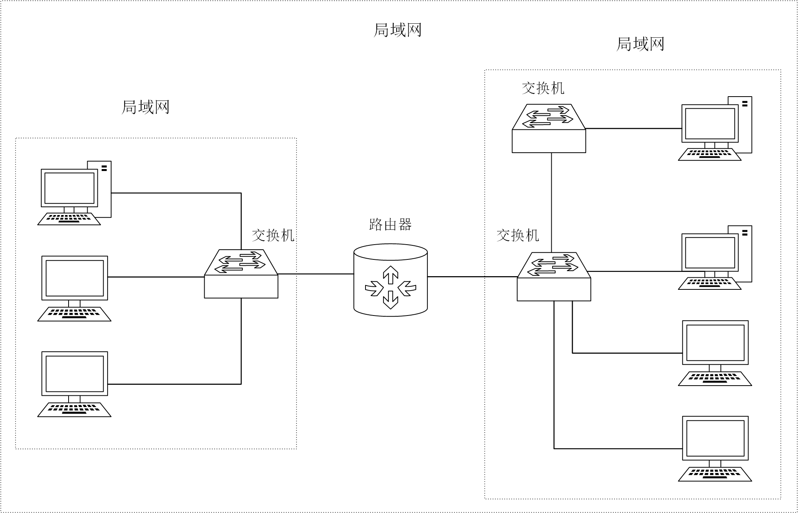
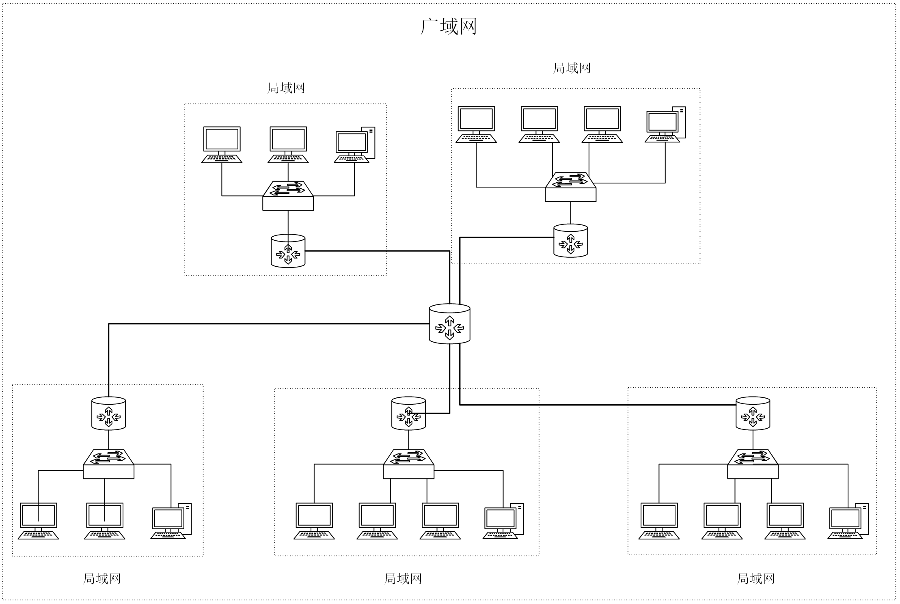

# 网络基础

## 1. 网络的发展历程

人们在利用计算机工作时，通常都需要多人协作，所以免不了要进行数据交互。没有网络的话数据就需要人来拷贝，这样效率大大降低，所以慢慢的网络就出来了。


> 上图就是计算机网络的雏形，一台机器用来共享数据，其他人通过网线连接到该机器。

### 1.1 局域网

局域网又叫LAN。几台计算机可以由交换机连接在一起形成局域网，多个局域网之间可以由路由器连接在一起实现跨局域网通信，形成一个更大的局域网。



### 1.2 广域网

广域网WLAN：将相隔千里的计算机都连接在一起，就可以称为广域网。广域网和局域网是相对的概念，一个比较大的局域网就可以称为广域网。

两台主机不在同一个网段，它们之间用路由器连接，就可以将整体称为广域网。



只要在同一个网段内就在一个局域网，广域网就没有这么明确的定义了，甚至会折中出“城域网”的概念。

&nbsp;

## 2. 网络协议的概念

计算机协议本质就是由程序员做出一种约定，是网络通信的双方必须遵守的规则，并根据协议发出各种信息，对方做出对应的响应。


计算机的生产商有很多，操作系统也很多，网络设备也很多，如何让不同的网络设备之间能相互通信呢？那么所有设备都必须遵循同一个标准，这个标准就是网络协议。

### 2.1 理解协议分层

先看一个打电话的例子， 使用同一种语言的互相通信，不管底层的通信设备如何变化，都能转化成同一种语言。


层状结构是一种很优秀的设计，它一定程度上实现了”解耦“，实现了解耦后，任何一层都可以进行替换，即便在某层中出现BUG，也可以将问题聚焦到指定的一层中，不会影响到其他层。

> 那具体协议与协议之间是怎么分层的呢？不同的软件实现的协议分层是有差别的。

从软件分层的角度看，软件就是代码和数据的集合，也就是各种函数和各种对象，在代码上从逻辑角度进行分层，层与层直接存在交互，数据在层之间进行流动，这就是软件分层的策略。

### 2.2 OSI七层模型

OSI组织设计了一个七层网络模型，是一个逻辑上定义的规范，实际上并不真实存在。


实际中将规范落地的时候，并没有完全遵照该模型，定义出来了真实的TCP/IP五层（或四层）协议。

### 2.3 TCP/IP四层模型

TCP/IP模型是在工程实践中真实存在的模型， TCP/IP是纯软件的协议：自底向上分别是**数据链路层、网络层、传输层、应用层**。

物理层我们不作考虑，因此称TCP/IP四层协议。

| 模型层     | 解释                                                         |
| ---------- | ------------------------------------------------------------ |
| 物理层     | 负责光电信号的传递，决定了物理层面的概念。                   |
| 数据链路层 | 负责设备之间的数据帧的传送和识别，如帧同步、冲突检测、数据校验。 |
| 网络层     | 负责地址管理和路由选择，通过路由规划出两台主机之间的数据传输路线。 |
| 传输层     | 负责两台主机之间的数据传输，确保数据的传输。                 |
| 应用层     | 负责应用程序间沟通，如SMTP、FTP、Telnet。                    |


> 网络在哪里呢？

网络协议栈也是分层的，它是贯穿于计算机体系结构的一个软件，尤其是TCP/IP协议栈，是属于操作系统的一部分。


- 应用层是操作系统之上的应用程序，属于用户进程，由用户使用。
- 传输层和网络层是操作系统内核的两层网络协议栈。
- 链路层是操作系统之下的网络设备的驱动程序。
- 物理层是硬件设备，不做考虑。

[网络模型的概念](http://blog.csdn.net/superjunjin/article/details/7841099)

&nbsp;

## 3. 网络传输的流程

我们以TCP/IP协议的通信过程为例认识一下网络传输的基本过程。

### 3.1 局域网通信

先看局域网中两台主机通信的示意图，左右两边各是一台主机：


数据从一台主机到另一台主机，不是直接从应用层“飞到”另一台主机的应用层。而是经过如下的步骤：

1. 数据从应用层产生，自顶向下经过传输层、网络层、链路层，最后到达以太网（物理层）
2. 在网线中传输到另一台联网主机上，自底向上经过链路层、网络层、传输层，最后到达应用层。

#### 封装解包分用

- **数据自顶向下到达一个协议栈时，需要添加当前栈的报头，这个过程叫封装**。
- **数据自底向上到达一个协议栈时，需要拿去当前栈的报头，这个过程叫解包**。


如图所示，**同等的协议栈层会拿到同样的协议报文，这意味着可以忽略底层实现，仿佛是对等的协议栈直接进行通信**。

实际上并不是，这就是封装的好处，不需要考虑底层的实现。

#### 报头的理解

报头类似于快递单上的快递信息。

**报头用来指导当前层进行某种协议**，传输层的报头指导如何传输，网络层的报头指导路径选择，链路层的报头指导如何转发。

**报文由两部分组成报头和有效载荷**，只有当前层的报头被认为是报头，之后的都是有效载荷。


报头也是数据，是一种结构化的数据，在语言角度就是位段：

```c
struct my_hdr {
	unsigned int src:16;
    unsigned int dst:16;
    unsigned int type:8;
    unsigned int len:24;
}
```

> 封装就是将报头变量拷贝到有效载荷的前面，解包就是用报头指针向后加一即可。


几乎每一层协议的报头字段中，都要包含两种字段：

1. 明确报头和有效载荷的边界，将有效载荷交给上层协议栈的过程叫做解包。
2. 报文的有效载荷选择交给上层哪一种协议叫做分用。


### 3.2 局域网通信原理

局域网通信类似于上课，在课堂上老师单独和某位同学交流，虽然只是叫该同学一个人，但教室内的所有同学都听到对话，只是默认不予回答。

**局域网内的网络资源被所有设备共享**，一台主机发出信息，局域网内所有的设备都会收到。

只不过报文的报头中包含目标设备的MAC地址，其他设备就会识别到不是发给自己的，就会将报文直接丢弃。


同时发送报文会导致数据碰撞，所以**任何时刻都只能有一台主机在局域网中发送消息**。每台主机都有碰撞检测和碰撞避免的算法，如果发生碰撞，后者会延迟发送。

所有主机任何时刻都可能向局域网内发送数据，**局域网网络就是临界资源，需要互斥访问**，所以只要不停向局域网内发送数据，就是攻击该局域网。

### 3.3 广域网通信

两台主机跨网络，进行广域网通信的过程示意图如下：


两台主机跨网络，进行广域网通信是需要路由器的，左边是以太网，右边是令牌环，甚至是无线LAN。

> 虽然两边主机不在同一个局域网，但两边主机和路由器算在一个局域网，本质还是局域网通信。

#### IP地址和MAC地址

在网络中存在两种地址，一个是IP地址，一个是MAC地址。

- IP地址用来标识广域网中的不同主机。
- MAC地址用来标识局域网内的不同主机。

> 长度为48位 6个字节。一般用16进制数字加冒号的形式来表示（例如：08:00:27:03:fb:19），具有唯一性。

网络传输类似于运输快递，对于快递点而言，需要知道两套地址信息：

| 地址        | 含义                       | 特点               |
| ----------- | -------------------------- | ------------------ |
| 一对IP地址  | 最初从哪来，最终到哪去     | 起点终点，几乎不变 |
| 一对MAC地址 | 上一站从哪来，下一站到哪去 | 持续变化           |

> IP地址对MAC地址的变化具有指导意义。


IP层报头会封装目的IP地址，就是目标主机的IP，链路层报头会封装目的MAC地址，该MAC地址只能是路由器的MAC地址。

如图所示，在数据链路层，经路由器一直在进行解包和封装。源主机发的和路由器及目的主机收的报文都是一样的，故IP层及向上部分，可以忽略底层的差异。
