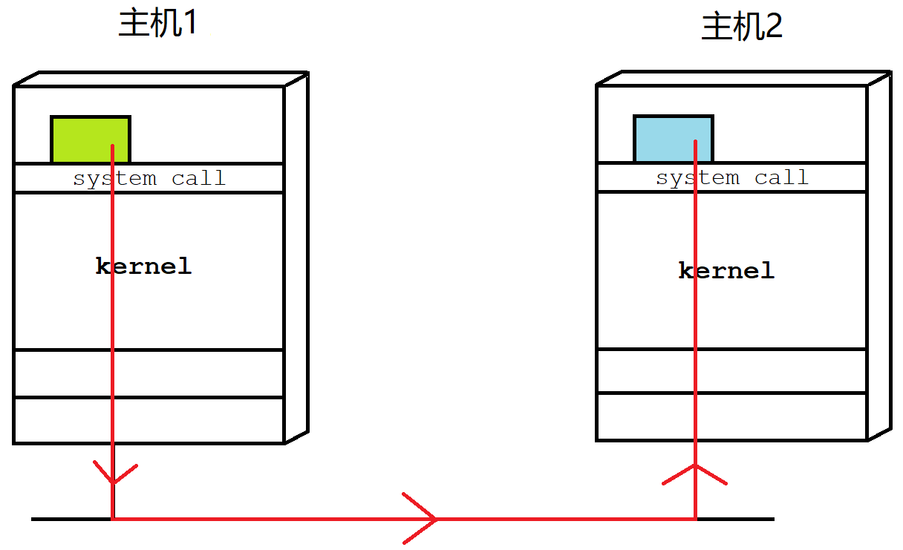
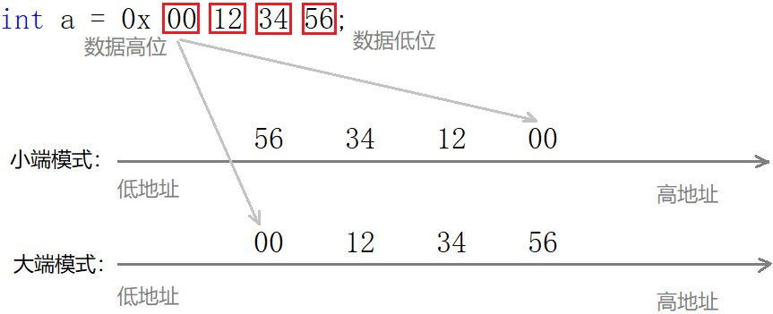
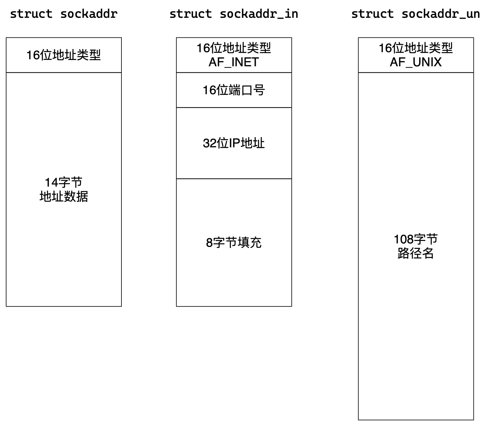

# 网络套接字

## 1. 网络编程概念

### 1.1 IP地址和端口号

数据实际是由进程产生和接收的，IP确定了主机，但还要进一步确定主机上的网络进程。**网络通信的本质就是跨网络的两台主机之间的进程间通信**。

| 概念 | 作用                                   |
| ---- | -------------------------------------- |
| IP   | IP地址唯一的标识了互联网中的一台主机。 |
| 端口 | 端口号唯一地标识主机上的一个网络进程。 |

> 源端口号确定源主机上的网络进程，目的端口号确定目的主机上的网络进程。

IP和端口就能标识互联网上的唯一一台机器上的唯一一个进程。



> 可以把整个网络看作是一个大操作系统，所有的网络行为就可看作是这个系统内的进程间通信。
>
> 进程具有独立性，进程间通信的前提是先让不同的进程看到同一份资源，而网络通信的临界资源就是网络。

### 1.2 理解网络字节序

当跨主机传输数据时，必须考虑且强制规定字节序。规定：**网络中的数据一律都采用大端的形式**。



> 一般从低到高地将数据发出，所以接收时也是先收到低地址数据，便于存储。
>

所以系统提供了库函数，可将数据进行主机和网络字节序的转化，如下：

```cpp
#include <arpa/inet.h>
uint32_t htonl(uint32_t hostlong);   // 主机 转 网络 长整型
uint16_t htons(uint16_t hostshort);  // 主机 转 网络 短整型
uint32_t ntohl(uint32_t netlong);    // 网络 转 主机 长整型
uint16_t ntohs(uint16_t netshort);   // 网络 转 主机 短整型
```

### 1.3 sockaddr结构体

通信方式有很多种，比如TCP/IP属于是`AF_INET`，域间套接字属于`AF_UNIX`。各家协议都有自己的套接字结构体。

接口设计者提供一个通用结构体叫`sockaddr`。各种结构体可以强转成`sockaddr`，接口内部可以通过前16位数据判断具体协议类型。



```cpp
#include <netinet/in.h>
#include <apra/inet.h>

#define	__SOCKADDR_COMMON(sa_prefix) \
  sa_family_t sa_prefix##family // sa_family_t(unsigned short) sin_family

typedef uint16_t in_port_t;   // 端口类型
typedef uint_32_t in_addr_t;  // IP 类型
struct in_addr
  {
    in_addr_t s_addr;
  };

/* Structure describing an Internet socket address.  */
struct sockaddr_in
  {
    __SOCKADDR_COMMON (sin_);   /* Protocol Family.  */
    in_port_t sin_port;			/* Port number.  */
    struct in_addr sin_addr;	/* Internet address.  */

    /* Pad to size of `struct sockaddr'.  */
    unsigned char sin_zero[sizeof (struct sockaddr) -
			   __SOCKADDR_COMMON_SIZE -
			   sizeof (in_port_t) -
			   sizeof (struct in_addr)];
  };
```

&nbsp;

## 2. 网络编程接口

### 2.1 通用接口

| 接口     | 解释                                     |
| -------- | ---------------------------------------- |
| socket() | 创建套接字本质就是打开文件，与网络无关。 |
| bind()   | 本质是将IP端口和套接字文件关联。         |

#### socket

```cpp
#include <sys/types.h>
#include <sys/socket.h>
//1. 创建套接字
int socket(int domain, int type, int protocol);
```

| 参数       | 解释                                                         |
| ---------- | ------------------------------------------------------------ |
| domain     | 指定通信方式的协议家族，TCP/UDP使用`AF_INET`即可             |
| type       | 指定通信协议，UDP传`SOCK_DGRAM`，TCP传`SOCK_STREAM`          |
| protocol   | TCP/UDP统一传0                                               |
| **返回值** | **调用成功返回网络套接字文件的文件描述符**，调用失败返回负值。 |

```cpp
int sock = socket(AF_INET, SOCK_DGRAM, 0);
if (sock < 0) {
    std::cerr << "socket error: " << errno << std::endl;
    exit(1);
}
```

#### bind(server)

```cpp
//2. 绑定IP端口
int bind(int socket, const struct sockaddr *address, socklen_t address_len);
```

建立网络连接需要确定IP和端口，但云服务器不允许绑定固有IP，使用`INADDR_ANY`让系统自动绑定。

**客户端不需要显式绑定，系统自行分配端口号冲突**。

> 首次发送数据的时候会自动绑定。

| 参数       | 解释                                                     |
| ---------- | -------------------------------------------------------- |
| socket     | socket接口的返回值                                       |
| address    | 套接字信息结构体地址和长度，用来指定机器相关的套接字信息 |
| **返回值** | 返回值成功返回0，失败返回–1                              |

```cpp
struct sockaddr_in local;

local.sin_family = AF_INET;          // 协议家族
local.sin_port = htons(port);        // 端口

local.sin_addr.s_addr = INADDR_ANY;  // IP地址由系统决定，用于云服务器
local.sin_addr.s_addr = inet_addr(_ip.c_str()); // 将点分十进制的IP串转化成32位整数并改为大端序列

if (bind(sock, (struct sockaddr*)&local, sizeof(local)) < 0) {
    std::cerr << "bind error: " << errno << std::endl;
    exit(1);
}
```

#### close

```cpp
int close(int fd);
```

关闭套接字文件，系统层面是释放文件资源，网络层面是TCP四次挥手。

### 2.2 UDP接口

#### recvfrom

```cpp
#include <sys/socket.h>
ssize_t recvfrom(int socket,
                 void *restrict buffer, size_t length,
                 int flags,
                 struct sockaddr *restrict address, socklen_t *restrict address_len);
```

| 参数              | 解释                                |
| ----------------- | ----------------------------------- |
| socket            | 网络套接字的文件描述符              |
| buffer / length   | 接收数据的接受缓冲区 / 缓冲区的长度 |
| flags             | 接收数据的方式默认为0               |
| address / addrlen | 发送者的套接字结构体的地址 / 长度   |
| **返回值**        | 实际接收的字符个数                  |

```cpp
struct sockaddr_in peer;
socklen_t len = sizeof(peer);
ssize_t s = recvfrom(sock, buf, sizeof(buf)-1, 0, (struct sockaddr*)&peer, &len);
if (s > 0) {
    buf[s] = 0;
    std::cout << "server # " << std::endl << buf << std::endl;
}
else
    std::cerr << "recvfrom error" << std::endl;
```

#### sendto

```cpp
#include <sys/socket.h>
ssize_t sendto((int socket,
                const void *message, size_t length,
                int flags,
                const struct sockaddr *dest_addr, socklen_t dest_len);
```

| 参数              | 解释                            |
| ----------------- | ------------------------------- |
| socket            | 网络套接字的文件描述符          |
| message / length  | 发送字符数组的地址 / 数组的长度 |
| flags             | 发送数据的方式默认为0           |
| address / addrlen | 接受者的套接字结构体地址 / 长度 |
| **返回值**        | 实际发送的字符个数              |

```cpp
//server
s = sendto(_sock, buf, strlen(buf), 0, (struct sockaddr*)&peer, len);
//client
struct sockaddr_in server;
server.sin_family = AF_INET;
server.sin_addr.s_addr = inet_addr(_sip.c_str());
server.sin_port = htons(_sport);
ssize_t s = sendto(_sock, msg.c_str(), msg.size(), 0, (sockaddr*)&server, sizeof(server));
```

### 2.3 TCP接口

#### listen

```cpp
//3. 开始监听 TCP server
int listen(int socket, int backlog);
```

TCP是面向连接的通信协议，所以在通信前需先建立连接。

**listen的本质是设置套接字为listen监听状态，允许用户进行连接。**

#### accept

```cpp
//4. 接收请求 TCP server
int accept(int sockfd, struct sockaddr *addr, socklen_t *addrlen);
```

**accept表示正式建立与客户端的连接。**本质阻塞式的等待三次握手完成，并将连接提取到应用层。

> socket返回的sock_fd用来监听连接。accept返回的sock_fd是用来通信的fd。

#### connect (client)

```cpp
//5. 建立连接 TCP client
int connect(int sockfd, const struct sockaddr *addr, socklen_t addrlen);
```

**connect的作用是主动向服务端发起连接。**本质是向服务器端发起TCP的三次握手，并等待握手完成。

#### recv/send

```cpp
ssize_t recv(int sockfd, void *buf, size_t len, int flags);
ssize_t send(int sockfd, const void *buf, size_t len, int flags);

ssize_t read(int fildes, void *buf, size_t nbyte);
ssize_t write(int fildes, const void *buf, size_t nbyte);
```

网络数据收发接口，本质是读写文件。

TCP协议是流式套接字，TCP收发接口和文件读写非常像，仅多了方式参数`flags`。

### 2.4 IP格式转换接口

```cpp
// 字符串IP 转 网络整数IP
in_addr_t inet_addr(const char *cp);
in_addr_t inet_network(const char *cp);
int inet_aton(const char *cp, struct in_addr *inp);
int inet_pton(int af, const char *src, void *dst);

// 网络整数IP 转 字符串IP
char* inet_ntoa(struct in_addr in); // 非线程安全
const char *inet_ntop(int af, const void *src, char *dst, socklen_t size);
```

### 2.5 套接字接口封装

```cpp
namespace inet {
struct api {
    enum {
        udp = SOCK_DGRAM,
        tcp = SOCK_STREAM,
    };
    static int Socket(int proto) {
        int fd = socket(AF_INET, proto, 0);
        if (fd < 0) throw std::runtime_error("socket failed");
        return fd;
    }
    static void Bind(int sock, const std::string& ip, uint16_t port) {
        struct sockaddr_in local;
        memset(&local, 0, sizeof(local));

        local.sin_family = AF_INET;
        local.sin_addr.s_addr = inet_addr(ip.c_str());
        local.sin_port = htons(port);

        if (bind(sock, (struct sockaddr*)&local, sizeof(local)) < 0)
            throw std::runtime_error("bind error");
    }
    static void Bind(int sock, uint16_t port) {
        struct sockaddr_in local;
        memset(&local, 0, sizeof(local));
        local.sin_family = AF_INET;
        local.sin_addr.s_addr = INADDR_ANY;
        local.sin_port = htons(port);
        if (bind(sock, (struct sockaddr*)&local, sizeof(local)) < 0)
            throw std::runtime_error("bind error");
    }
    static void Listen(int sock, int backlog) {
        if (listen(sock, backlog) < 0)
            throw std::runtime_error("listen error");
    }
    static void Connect(int sock, const std::string& ip, uint16_t port, int trytime = 1) {
        struct sockaddr_in peer;
        memset(&peer, 0, sizeof(peer));
        peer.sin_family = AF_INET;
        peer.sin_addr.s_addr = inet_addr(ip.c_str());
        peer.sin_port = htons(port);
        while (trytime-- > 0 && connect(sock, (struct sockaddr*)&peer, sizeof(peer)) < 0) {
            if (trytime == 0) throw std::runtime_error("connect failed");
            sleep(1);
        }
    }
    static int Accept(int sock, std::string* ip = nullptr, uint16_t* port = nullptr) {
        struct sockaddr_in peer;
        socklen_t len = sizeof(peer);
        memset(&peer, 0, len);
        int fd = accept(sock, (struct sockaddr*)&peer, &len);
        if (ip)   *ip = inet_ntoa(peer.sin_addr);
        if (port) *port = ntohs(peer.sin_port);
        return fd;
    }
    static int Recv(int sock, std::string* msg, size_t len) {
        msg->clear();
        std::unique_ptr<char[]> buf(new char[len]{0});
        ssize_t s = recv(sock, buf.get(), len, 0);
        if (s > 0) {
            buf[s] = 0;
            *msg = buf.get();
        }
        return s;
    }
    static int Send(int sock, const std::string& msg) {
        return send(sock, msg.c_str(), msg.size(), 0);
    }
    static int Recvfrom(int sock, std::string* msg, size_t len,
                        std::string* ip = nullptr, uint16_t* port = nullptr) {
        msg->clear();
        std::unique_ptr<char[]> buf(new char[len]{0});
        struct sockaddr_in peer;
        socklen_t sklen = sizeof(peer);
        memset(&peer, 0, sklen);
        ssize_t s = recvfrom(sock, buf.get(), len, 0, (struct sockaddr*)&peer, &sklen);
        if (s > 0) {
            buf[s] = 0;
            *msg = buf.get();
        }
        if (ip)   *ip = inet_ntoa(peer.sin_addr);
        if (port) *port = ntohs(peer.sin_port);
        return s;
    }
    static int Sendto(int sock, const std::string& msg,
                      const std::string& ip, uint16_t port) {
        struct sockaddr_in peer;
        memset(&peer, 0, sizeof(peer));
        peer.sin_family = AF_INET;
        peer.sin_addr.s_addr = inet_addr(ip.c_str());
        peer.sin_port = htons(port);
        ssize_t s =
            sendto(sock, msg.c_str(), msg.size(), 0, (struct sockaddr*)&peer, sizeof(peer));
        return s;
    }
};

namespace tcp {
class server {
public:
    server(uint16_t port, int backlog = 12) : _sock(0), _port(port), _backlog(backlog) {
        init();
    }
    server(const std::string& ip, uint16_t port, int backlog = 12)
        : _sock(0), _ip(ip), _port(port), _backlog(backlog) {
        init();
    }
    int accept(std::string* cip = nullptr, uint16_t* cport = nullptr) {
        Accept(_sock, cip, cport);
    }
    int recv(int sock, std::string* msg, size_t len) {
        return inet::api::Recv(sock, msg, len);
    }
    int send(int sock, const std::string& msg) {
        return inet::api::Send(sock, msg);
    }
    ~server() { close(_sock); }
private:
    void init() {
        _sock = inet::api::Socket(inet::api::tcp);
        if (_ip.empty()) inet::api::Bind(_sock, _port);
        else inet::api::Bind(_sock, _ip, _port);
        inet::api::Listen(_sock, _backlog);
    }
protected:
    int _sock;
    std::string _ip;
    uint16_t _port;
    int _backlog;
};
class client
{
public:
    client(const std::string& svr_ip, uint16_t svr_port, int trytime = 1)
        : _sock(0), _sip(svr_ip), _sport(svr_port), _trytime(trytime) {
        _sock = inet::api::Socket(inet::api::tcp);
        inet::api::Connect(_sock, _sip, _sport, _trytime);
    }
    int send(const std::string& msg) { return inet::api::Send(_sock, msg); }
    int send(int sock, const std::string& msg) { return inet::api::Send(sock, msg); }
    int recv(std::string* msg, size_t len) { return inet::api::Recv(_sock, msg, len); }
    int recv(int sock, std::string* msg, size_t len)
    { return inet::api::Recv(sock, msg, len); }
    ~client() { close(_sock); }
protected:
    int _sock;
    std::string _sip;
    uint16_t _sport;
    int _trytime;
};
}

namespace udp {
class server {
public:
    server(uint16_t port) : _sock(0), _port(port) {
        init();
    }
    server(const std::string& ip, uint16_t port) : _sock(0), _ip(ip), _port(port) {
        init();
    }
    int sendto(const std::string& msg, const std::string& cip, uint16_t cport) {
        return inet::api::Sendto(_sock, msg, cip, cport);
    }
    int recvfrom(std::string* msg, size_t len,
                 std::string* cip = nullptr, uint16_t* cport = nullptr) {
        return inet::api::Recvfrom(_sock, msg, len, cip, cport);
    }
    ~server() { close(_sock); }
private:
    void init() {
        _sock = inet::api::Socket(inet::api::udp);
        if (_ip.empty()) inet::api::Bind(_sock, _port);
        else inet::api::Bind(_sock, _ip, _port);
    }
protected:
    int _sock;
    std::string _ip;
    uint16_t _port;
};

class client {
public:
    client(const std::string& svr_ip, uint16_t svr_port)
        : _sock(0), _sip(svr_ip), _sport(svr_port) {
        _sock = inet::api::Socket(inet::api::udp);
    }
    int sendto(const std::string& msg)
    { return inet::api::Sendto(_sock, msg, _sip, _sport); }
    int recvfrom(std::string* msg, size_t len)
    { return inet::api::Recvfrom(_sock, msg, len); }
    ~client() { close(_sock); }
protected:
    int _sock;
    std::string _sip;
    uint16_t _sport;
};
}
}
```

&nbsp;

## 3. 网络通信设计

### 3.1 UDP通信

#### UDP客户端

```cpp
class udp_client
{
public:
    udp_client(std::string sip, uint16_t sport) : _sock(0), _sip(sip), _sport(sport)
    {}

    ~udp_client() {
        close(_sock);
        _sender.join();
        _recver.join();
    }

    void init() {
        _sock = socket(AF_INET, SOCK_DGRAM, 0);
        if (_sock < 0) exit(SOCKET_ERR);
        _sender = std::thread(&udp_client::send, this);
        _recver = std::thread(&udp_client::recv, this);
    }

void send()
{
    struct sockaddr_in peer;
    peer.sin_family = AF_INET;
    peer.sin_addr.s_addr = inet_addr(_sip.c_str());
    peer.sin_port = htons(_sport);

    while (true)
    {
        std::string msg;
        std::cout << "please input:> ";
        getline(std::cin, msg);
        sendto(_sock, msg.c_str(), msg.size(), 0, (struct sockaddr*)&peer, sizeof(peer));
    }
}

void recv()
{
    while (true)
    {
        char buf[1024] = {0};
        struct sockaddr_in tmp;
        socklen_t len = sizeof(tmp);
        ssize_t s = recvfrom(_sock, buf, sizeof(buf), 0, (struct sockaddr*)&tmp, &len);
        if (s > 0) buf[s] = 0;
        else continue;
        std::cout << "server return# " << buf << std::endl;
    }
}

private:
    int _sock;
    std::string _sip;
    uint16_t _sport;

    std::thread _sender;
    std::thread _recver;
};
```

#### UDP服务端

```cpp
class udp_server
{
public:
udp_server(uint16_t port) : _sock(0), _port(port)
{}

~udp_server()
{
    close(_sock);
}

void init()
{
    _sock = socket(AF_INET, SOCK_DGRAM, 0);
    if (_sock < 0) exit(SOCKET_ERR);

    struct sockaddr_in local;
    local.sin_family = AF_INET;
    local.sin_addr.s_addr = INADDR_ANY;
    local.sin_port = htons(_port);

    if (bind(_sock, (struct sockaddr*)&local, sizeof(local)) < 0)
        exit(BIND_ERR);
}

void start()
{
    char buf[1024] = {0};
    while (true)
    {
        struct sockaddr_in peer;
        socklen_t len = sizeof(peer);

        ssize_t s = recvfrom(_sock, buf, sizeof(buf), 0, (struct sockaddr*)&peer, &len);
        if (s > 0) buf[s] = 0;
        else continue;

        std::string cip = inet_ntoa(peer.sin_addr);
        uint16_t cport = ntohs(peer.sin_port);
        std::cout << '[' << cip << ':' << cport << "] " << buf << std::endl;;

        std::string rsp = buf;
        sendto(_sock, rsp.c_str(), rsp.size(), 0, (struct sockaddr*)&peer, sizeof(peer));
    }
}

private:
    int _sock;
    uint16_t _port;
};
```

### 3.2 TCP通信

#### TCP客户端

```cpp
class tcp_client
{
public:
    tcp_client(std::string sip, uint16_t sport) : _sock(0), _sip(sip), _sport(sport)
    {}

    ~tcp_client()
    {
        close(_sock);
    }

    void init()
    {
        // 1. socket
        _sock = socket(AF_INET, SOCK_STREAM, 0);
        if (_sock < 0)
        {
            std::cerr << "socket error" << std::endl;
            exit(SOCKET_ERR);
        }
        std::cout << "socket success " << _sock << std::endl;

        // 2. connect
        struct sockaddr_in peer;
        memset(&peer, 0, sizeof(peer));
        peer.sin_family = AF_INET;
        peer.sin_port = htons(_sport);
        inet_aton(_sip.c_str(), &peer.sin_addr);

        int cnt = 5;
        while (connect(_sock, (struct sockaddr*)&peer, sizeof(peer)) < 0)
        {
            std::cerr << "connect failed, remaining try " << cnt-- << std::endl;
            if (cnt == 0)
            {
                std::cerr << "connect error" << std::endl;
                exit(CONNECT_ERR);
            }
            sleep(1);
        }
        std::cout << "connect success" << std::endl;
    }

    void start()
    {
        while (true)
        {
            std::string msg;
            std::cout << "please input:> ";
            getline(std::cin, msg);

            send(_sock, msg.c_str(), msg.size(), 0);

            char buf[1024] = {0};
            ssize_t s = recv(_sock, buf, sizeof(buf), 0);
            if (s > 0)
            {
                buf[s] = 0;
                std::cout << "server return " << buf << std::endl;
            }
            else if (s == 0)
            {
                close(_sock);
                std::cout << "server quit" << std::endl;
                break;
            }
            else
            {
                close(_sock);
                std::cerr << "recv error " << strerror(errno) << std::endl;
                break;
            }

        }
    }

private:
    int _sock;
    std::string _sip;
    uint16_t _sport;
};
```

#### TCP服务端

```cpp
class tcp_server
{
public:
    using func_t = std::function<std::string(const std::string&)>;
public:
    tcp_server(func_t func, uint16_t port)
        : _listen_sock(0), _port(port), _quit(false), _func(func)
    {}

    ~tcp_server() {
        close(_listen_sock);
    }

    void init()
    {
        // 1. socket
        _listen_sock = socket(AF_INET, SOCK_STREAM, 0);
        if (_listen_sock < 0)
            exit(SOCKET_ERR);
        INFO("socket success %d", _listen_sock);

        // 2. bind
        struct sockaddr_in local;
        memset(&local, 0, sizeof(local));
        local.sin_family = AF_INET;
        local.sin_addr.s_addr = INADDR_ANY;
        local.sin_port = htons(_port);

        if (bind(_listen_sock, (struct sockaddr*)&local, sizeof(local)) < 0)
            exit(BIND_ERR);
        INFO("bind success");

        // 3. listen
        if (listen(_listen_sock, backlog) < 0)
            exit(LISTEN_ERR);
        INFO("listen success");
    }

    void start()
    {
        signal(SIGCHLD, SIG_IGN);

        while (!_quit)
        {
            struct sockaddr_in peer;
            socklen_t len = sizeof(peer);
            int sock = accept(_listen_sock, (struct sockaddr*)&peer, &len);
            if (sock < 0)
                continue;

            std::string cip = inet_ntoa(peer.sin_addr);
            uint16_t cport = ntohs(peer.sin_port);
            std::string cli = '['+cip+':'+std::to_string(cport)+']';

            INFO("accept success sock %d %s", sock, cli.c_str());

            //v1
            service(sock, cli);

            //v2
            pid_t id = fork();
            if (id < 0)
            {
                std::cerr << "fork failed" << std::endl;
                close(sock);
                continue;
            }
            else if (id == 0)
            {
                close(_listen_sock);
                if (fork() > 0) exit(0); // 孤儿孙子进程提供服务，孤孙进程由操作系统负责回收
                service(sock, cli);
                close(sock);
                exit(0);
            }
            else
            {
                close(sock); // hand it to childproc, must close it to save resources
                pid_t res = waitpid(id, nullptr, 0);
                if (res == id)
                    std::cout << "wait childproc success " << id << std::endl;
            }

            //v3
            pthread_t tid;
            thread_args* data = new thread_args(this, sock, cli);
            pthread_create(&tid, nullptr, routine, data);
            pthread_detach(tid);

            std::thread th(&tcp_server::service, this, sock, cli);
            th.detach();

            //v4
            task t(&tcp_server::service, this, sock, cli);
            thread_pool<task>::get_instance()->push(t);
        }
    }

    static void* routine(void* args)
    {
        thread_args* td = static_cast<thread_args*>(args);
        td->ts->service(td->sock, td->cli);
        delete td;
        return nullptr;
    }

    void service(int sock, const std::string& cli)
    {
        char buf[1024] = {0};
        ssize_t s = recv(sock, buf, sizeof(buf) - 1, 0);
        if (s > 0) {
            buf[s] = 0;
            send(sock, buf, strlen(buf), 0);
        }
        else if (s == 0) {
            INFO("%s quit, cancel service", cli.c_str());
            break;
        }
        else {
            ERROR("recv error %s", strerror(errno));
            break;
        }
        close(sock);
    }
private:
    int _listen_sock;
    uint16_t _port;
    bool _quit;
};
```

网络套接字编程的本质是利用系统调用从零编写应用层，不是使用应用层。
