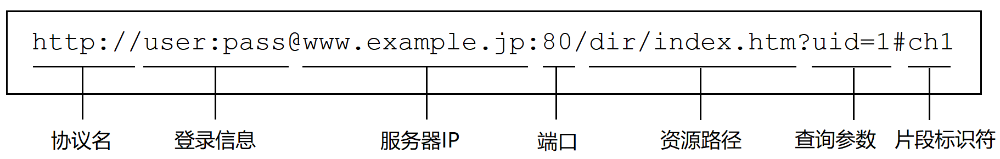
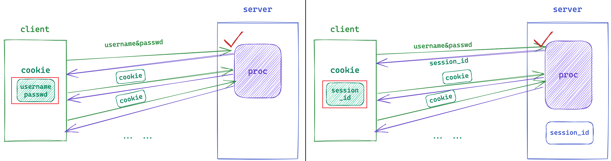
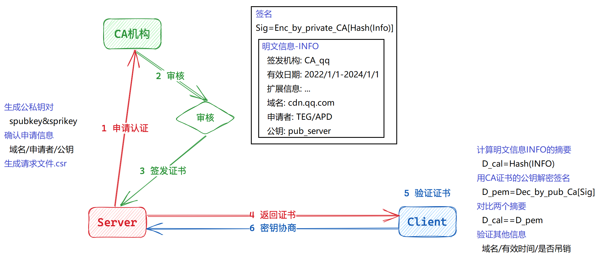
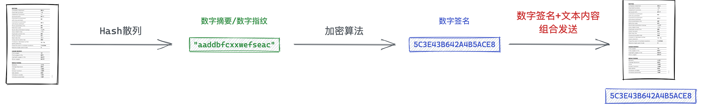

# 应用层

## 0. 协议

### 0.1 序列化的概念

> 结构化的数据不能直接进行传输，一般要转化成字符串再放到网络传输。

将结构内容转化成字符串，称为序列化。将字符串转化为结构数据，称为反序列化。


序列化本质就是将数据的使用和数据的传输进行解耦。**方便应用层进行通信和使用数据**。

### 0.2 jsoncpp

```shell
# 安装jsoncpp
$ yum  install jsoncpp-devel
$ apt  install libjsoncpp-dev
$ brew install jsoncpp
```

```cpp
std::string serialize()
{
    Json::Value root;
    root["res"] = _res;
    root["st"] = _st;
    return Json::FastWriter().write(root);
}

void deserialize(const std::string& rsp)
{
    Json::Value root;
    Json::Reader reader;
    reader.parse(rsp, root);
    _res = root["res"].asInt();
    _st = root["st"].asInt();
}
```

&nbsp;

## 1. HTTP

HTTP协议是一种应用层协议，HTTP内部自行实现了网络通信、序列化和反序列化、协议细节。

### 1.0 URL

URL就是”网址“，网络上可请求的图片、文字、视频、音频等内容都称为“资源”，网址就是一种定位网络资源的方式。

**通过IP+端口+路径的方式，就可以唯一地定位一个网络资源**。

> IP被域名代替，应用层协议所采用的端口号是确定的。由浏览器和DNS服务自动添加转换，用户感知不到。



#### URL编解码

```txt
/ : . ? & # @ + <space> ...
```

这些符号在URL中已具有特殊意义，所以它们作为普通字符时就必须转义。将字符的ASCII码值的16进制数字，再前面加上`%`，编码成`%XY`的格式。


[URL转码工具](https://tool.chinaz.com/Tools/urlencode.aspx)

### 1.1 HTTP的格式

#### HTTP请求格式


| 组成     | 内容                                                         |
| -------- | ------------------------------------------------------------ |
| 请求行   | `GET`,`POST`等是请求方法，`url`是请求资源的路径，`http_version`是协议版本，以空格隔开 |
| 请求报头 | 一般有多组请求属性，每组属性都是键值对，以`\n`分隔           |
| 空行     | 用来隔开请求报头和请求正文                                   |
| 请求正文 | 空行之后都是正文，允许为空。如果正文存在，报头中有`Content-Length`属性来表示正文长度 |


> 如何读取一个完整的报文呢？

1. 读到空行的时候，说明获取所有报头内容。
2. 解析报头`Content-Length`属性，确定正文大小，准确读取正文。

#### HTTP响应格式


| 组成     | 内容                                                         |
| -------- | ------------------------------------------------------------ |
| 状态行   | HTTP版本，状态码，状态码描述，以空格分隔                     |
| 响应报头 | 一般有多组响应属性，每组属性都是键值对，以`\n`分隔           |
| 空行     | 用来隔开响应报头和响应正文                                   |
| 响应正文 | 空行之后都是正文，允许为空。如果正文存在，报头中会有属性`Content-Length`来表示长度 |

### 1.2 HTTP的方法

| 方法    | 说明                   | 支持协议版本 |
| ------- | ---------------------- | ------------ |
| GET     | 获取资源               | 1.0  1.1     |
| POST    | 传输实体资源           | 1.0  1.1     |
| PUT     | 传输文件               | 1.0  1.1     |
| HEAD    | 获得报文首部           | 1.0  1.1     |
| DELETE  | 删除文件               | 1.0  1.1     |
| OPTIONS | 询问支持的方法         | 1.1          |
| TRACE   | 追踪路径               | 1.1          |
| CONNECT | 要求用隧道协议连接代理 | 1.1          |
| LINK    | 建立和资源之间的联系   | 1.0          |
| UNLINE  | 断开连接关系           | 1.0          |

> 一般为安全起见，都不开放除GET POST以外的其他方法。

#### GET/POST

| 名称 | 场景                   | 区别                       | 隐私性                          |
| ---- | ---------------------- | -------------------------- | ------------------------------- |
| GET  | 获取资源，也可提交参数 | 通过URL提交，存在大小限制  | 直接回显在URL栏中               |
| POST | 常用于提交参数         | 通过正文提交，长度不受限制 | 不回显在URL栏中，私密但不是安全 |


### 1.3 HTTP的状态码

> HTTP协议状态码标准混乱不一。

| 状态码 | 类别          | 翻译       | 解释                   | 常见状态码                        |
| ------ | ------------- | ---------- | ---------------------- | --------------------------------- |
| 1XX    | Informational | 信息性     | 接收的请求正在处理     | 不常见                            |
| 2XX    | Success       | 成功       | 请求正常处理完毕       | 200 (OK)                          |
| 3XX    | Redirection   | 重定向     | 需要附加操作以完成请求 | 302 (Redirect)                    |
| 4XX    | Client Error  | 客户端错误 | 服务器无法处理请求     | 403 (Forbidden) / 404 (Not Found) |
| 5XX    | Server Error  | 服务端错误 | 服务器处理请求出错     | 504 (Bad Gateway)                 |

- 404属于客户端错误，是客户端访问不存在的资源。浏览器不会处理404响应，需要服务器返回错误页面。
- 服务端程序出现错误崩溃等问题，就是服务器错误，状态码应设置为504。
- 3XX的状态码代表重定向，意思是自动跳转到其他页面。使用属性`Location`表示新地址。
  - 301是永久重定向，一般是网站域名更换，本质更改了浏览器本地标签。
  - 302/307是临时重定向，登录付款的自动返回，每次访问都会对新地址发起请求。

### 1.4 HTTP的报头

| 报头属性       | 解释                                                         |
| -------------- | ------------------------------------------------------------ |
| Content-Type   | 正文的数据类型 [content-type对照表](https://blog.csdn.net/weixin_39527281/article/details/115322144) |
| Content-Length | 正文的长度                                                   |
| Connection     | 请求的是否保持长连接                                         |
| Host           | 客户端告知服务器，所请求的服务程序的IP和端口                 |
| User-Agent     | 声明用户的操作系统和浏览器版本                               |
| referer        | 当前页面是从哪个页面跳转过来的                               |
| location       | 搭配3XX状态码使用，告诉客户端接下来要去哪里访问              |
| Cookie         | 用于在客户端存储少量信息，通常用于实现会话（session）的功能  |

### 1.5 cookie和session

HTTP只负责网络资源传输，**HTTP本身是一种无状态的协议**，不会记录历史请求的相关信息。类似记录登录信息这样方便的上网体验是由Cookie提供的，也就是说，Cookie提供“会话保持”的功能。

**cookie本质是一个保存用户的私密信息的文件**。

1. 用户登录认证成功后，
2. 浏览器根据响应属性中的`Set-Cookie`，将数据保存在本地cookie中，
3. 后续对该网站的请求都会添加属性`Cookie`，所以有效期内就可以自动登录了。


Cookie不仅有自定义字段，还有如下属性：

| 属性     | 解释                                                         |
| -------- | ------------------------------------------------------------ |
| domain   | 可以访问该Cookie的域名。                                     |
| path     | 设置某个目录下的程序或者单个程序可以使用该Cookie。           |
| httponly | js脚本将无法读取到cookie信息，这样能有效的防止XSS攻击，窃取cookie内容。 |
| secure   | 是否仅用安全协议传输该Cookie。                               |
| expires  | 指定cookie的生命周期。默认cookie只在会话期间存在。max-age用秒来设置cookie的生存期。 |

> 一旦Cookie盗取，就可以盗取用户信息。单纯使用Cookie是有安全隐患的，需要搭配session使用。

**session将用户私密信息保存在服务端**。

1. 客户端登录认证成功后，服务端会形成session文件，保存用户的私密信息。
2. 服务器构建响应时，添加属性`Set-Cookie: session_id=123 `，称为当前用户的会话ID。
3. 浏览器本地形成cookie文件，保存该session_id，每次请求都携带该session_id。

本地Cookie中只存储session_id，session_id具有唯一性，服务端根据session_id在服务端查找用户信息。



虽然无法解决第三方冒充用户身份，但**cookie和session可以避免用户信息在网络上传输**。

### 1.6 简单HTTP服务器

按照HTTP协议的请求与响应内容，实现最简单的HTTP服务器。

```c
struct http_request
{
    std::string _method;
    std::string _url;
    std::string _version;

    std::vector<std::string> _headers;
    std::string _content;

    std::string _path;

    http_request(const std::string& reqstr) { deserialize(reqstr); }

    void deserialize(const std::string reqstr)
    {
        std::stringstream reqss(reqstr);
        std::string line;
        getline(reqss, line);
        std::stringstream(line) >> _method >> _url >> _version;
        _path += WEB_ROOT;
        if (_url.back() == '/') _path += "index.html";
        else _path += _url;
        while (getline(reqss, line))
            _headers.push_back(line);
        getline(reqss, _content);
    }
};
struct http_response
{
    http_response(const http_request& req) : _version("HTTP/1.0"), _path(req._path)
    {
        struct stat st;
        if (stat(_path.c_str(), &st) < 0) {
            _stcode = 404;
            _stdesc = "Not Found";
            _path = WEB_ROOT + "404.html";
        }
        else {
            _stcode = 200;
            _stdesc = "OK";
        }
        std::ifstream ifs(_path, std::ios_base::binary);
        std::string line;
        while (getline(ifs, line))
            _content += line;
        _headers.push_back("Content-Type: " + get_type());
        _headers.push_back("Content-Length: " + std::to_string(_content.size()));
    }

    std::string _version;
    int _stcode;
    std::string _stdesc;
    std::vector<std::string> _headers;
    std::string _path;
    std::string _content;

    std::string serialize()
    {
        std::stringstream ss;
        ss << _version << ' ' << _stcode << ' ' << _stdesc << SEP;
        for (auto& e : _headers)
            ss << e << SEP;
        ss << SEP;
        ss << _content;
        return ss.str();
    }
};
std::string callback(const std::string& msg)
{
    return http_response(http_request(msg)).serialize();
}
int main(int argc, char* argv[])
{
    uint16_t port = std::stoi(argv[1]);
    std::unique_ptr<http_server> tsvr(new http_server(callback, port));
    tsvr->init();
    tsvr->start();
}
```

&nbsp;

## 2. HTTPS

### 2.1 加密方式

HTTPS相比HTTP多了一个数据的加密解密层，即TLS/SSL。

TLS/SSL属于应用层，数据只有在应用层应用层被加密解密，传输层网络层链路层没有加密概念。


> 加密解密有如下几种方式。

#### 对称加密

对称加密，也称单密钥加密，用同一个密钥进行加密和解密。

使用对称加密，就必须先让通信双方获得密钥，就必须将密钥明文传输给另一方，那密钥就可被窃取，所以对称加密是不可取的。

#### 非对称加密

非对称加密，就是使用两个密钥。所有人公开的公钥和只有一方具有的私钥。用公钥加密须用私钥解密，用私钥加密须用公钥解密。

- 公钥加密的数据只有私钥能解密，所以从公钥一方到私钥一方的通信是安全的。
- 私钥加密的数据所有人都能解密，所以从私钥一方到公钥一方的通信是不安全的。

**非对称加密只能保证单向安全的通信，反向通信无法保证安全。**


#### 全对称加密

1. 客户端和服务器分别创建自己的公私密钥，通信前先交换双方的公钥。
2. 双方都采用非对称加密，双方都使用对端的公钥加密数据发给对端，对端用自己的私钥解密。

> 虽然可以保证双向通信安全，但时间成本太高效率太低，同样不可取。

#### 混合加密

> 实际是将两种加密方式混合使用的。

密钥本质也是数据，用非对称加密将密钥发给对端，这样双方就获得一个对称加密的密钥。之后就可以进行对称加密通信了。

##### 密钥协商

客户端收到服务端发来到公钥，并用该公钥生成一个密钥，使用非对称加密加密该密钥并发给服务器。服务器用私钥解密获得该密钥。

##### 对称加密通信

自此通信双方都有一个对称加密的密钥，以上称为密钥协商。之后双方可以使用该密钥进行对称加密通信。


#### 中间人风险

> 这样做真的就万无一失了吗？其实不然，在上述密钥协商阶段是存在中间人私自更换密钥的风险的。

1. 在密钥协商阶段，**服务端发送的明文公钥`S`，被中间人截取替换成了中间人的公钥`M`，再发给客户端**。
2. 客户端生成对称密钥`X`并使用中间人公钥`M`加密，然后将加密结果`M+(X)`发送给服务器。
3. **中间人截取到加密结果，用私钥`M'`解密，得到密钥`X`，再用服务端的公钥`S`加密将其加密并发往服务器**。
4. 服务器用`S'`对其解密得到密钥`X`。

自此通信双方的对称加密密钥`X`被中间人获取，数据加密形同虚设且毫不知情。


**上述问题的关键在于：客户端无法判断服务器发来的明文公钥是否被篡改**。因此，我们必须赋予客户端辨别篡改的能力。

### 2.2 数据防篡改

> 如何防止如何识别数据的内容是否被篡改呢？

#### 预备知识

##### 数字摘要/数字指纹

对文本内容利用单向哈希算法，生成固定长度的、具有唯一性的、不可逆的字符序列，该字符序列就称为数字指纹/数字摘要。

数字摘要不是严格的加密，因为无法反推出文本内容，所以只能进行数据对比。

> 对传输来的文本重新生成哈希结果，对比两者哈希结果是否相同，就能看出文本是否被篡改。


##### 数字签名

对数字指纹/数字摘要进行加密，加密结果就称为数字签名。


#### CA证书机构

由此出现一种权威机构CA证书机构。

- 服务商将自身信息提交给CA机构，CA机构审核通过后形成证书颁发给服务端。

- 服务端将证书发给客户端，客户端验证证书后，使用证书内公钥进行密钥协商。

> 本质就是在加密通信前，服务端不再传输公钥，而是传输证书。可以保证公钥不被篡改。



##### 如何生成证书？

1. CA机构将服务商的信息生成数字指纹，并用CA机构私钥生成数字签名。
2. 再将服务商的信息和签名放到一起，称为证书。



##### 客户端如何验证证书？

1. 客户端收到证书之后，对其中服务商信息重新生成数字指纹，
2. 再将证书中的数字签名用CA公钥解密出数字指纹。
3. 对比两者数字指纹，如果相等说明证书没有被篡改。


##### 是否存在中间人风险？

此时中间人仍能获取并解密证书，但**中间人没有CA机构私钥`A'`因此无法生成数字签名，也就无法篡改证书**。

客户端收到证书后进行校验，证书中服务商信息和数字签名不管哪一个被修改都可以识别。


### 2.3 最终加密方案

> 最终方案就是混合加密+CA证书。

客户端请求服务器后，服务器不再明文返回公钥，而是返回CA机构颁发的证书。可以防止公钥被篡改，就不存在中间人风险了。

1. 客户端向服务器请求连接，
2. 服务器返回网站证书，客户端验证证书无误，并提取公钥加密对称密钥，发往服务端。
3. 服务端利用自身私钥解密，得到对称密钥，
4. 自此双方开始对称加密通信。
