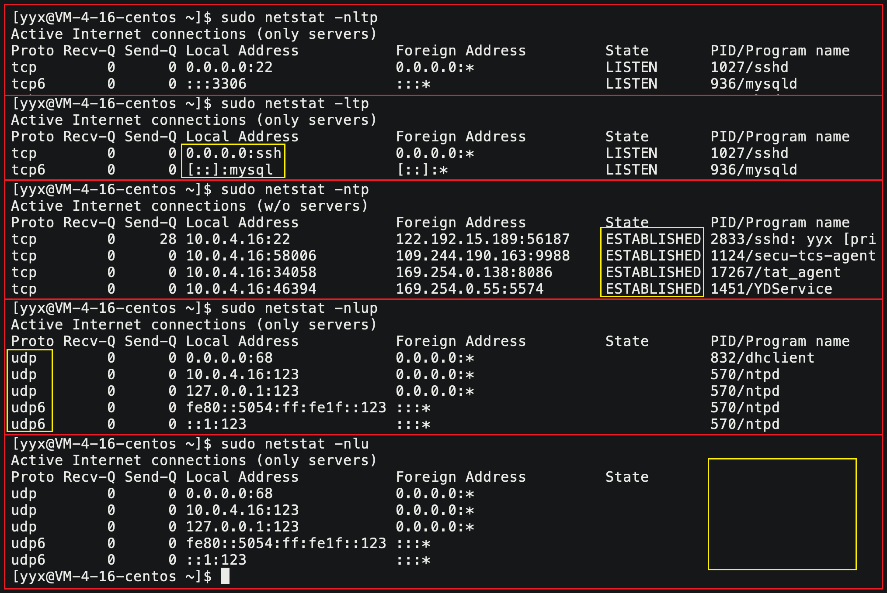
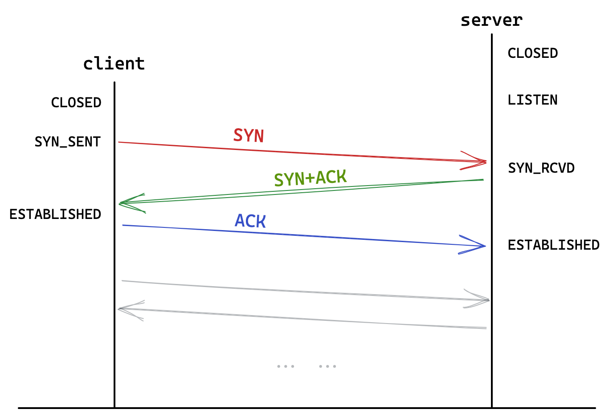
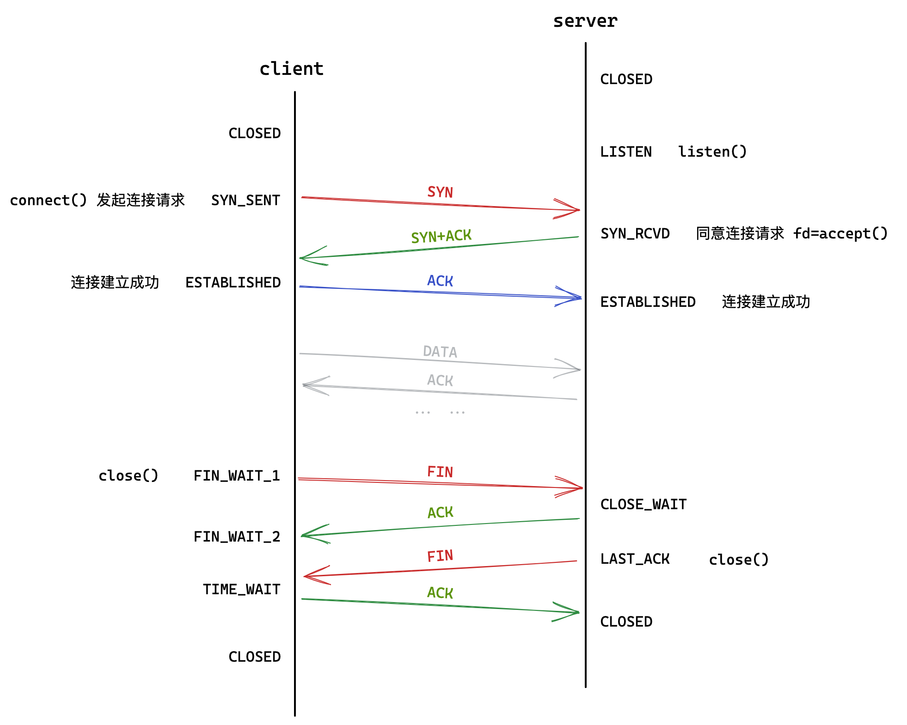

# 传输层TCP/UDP

## 0. 预备知识

### 端口号的理解

在TCP/IP协议中，用如下所示的五元组来标识一个通信程序：

| 组成             | 解释                     |
| ---------------- | ------------------------ |
| 源IP，源端口     | 标识数据来源的主机的进程 |
| 目的IP，目的端口 | 标识数据目标的主机的进程 |
| 协议号           | 使用的协议的编号         |

端口号标识主机上的网络进程。一些知名的服务绑定的端口一般是不变的，如下图所示：


虽然端口号和这些网络协议没有绑定关系，但这些端口号和服务的联系是早已被习惯和接受的，擅自更改可能导致服务无法访问。

> 一般0-1023给应用层协议使用。

### netstat

```shell 
netstat -nltp #  查看网络进程的状态
```

| 选项          | 解释                                     |
| ------------- | ---------------------------------------- |
| `n[number]`   | 将主机名:程序名显示成IP地址:端口号的形式 |
| `l[isten]`    | 只显示正在监听状态的套接字               |
| `t[cp]/u[dp]` | 显示TCP或UDP协议的进程                   |
| `p[rocess]`   | 显示程序的PID和进程名                    |



## 1. UDP

### 1.1 UDP协议格式


```c
struct udp_heander { // 示例
    uint32_t src_port: 16;
    uint32_t dst_port: 16;
    uint32_t total: 16;
    uint32_t check: 16;
}
```

封装解包只需从头添加或截取一个8字节报头即可，剩下的就是有效载荷。

分用是根据目的端口决定交付给哪个进程。

### 1.2 UDP的特点

| 特点       | 解释                                                         |
| ---------- | ------------------------------------------------------------ |
| 无连接     | 根据IP和端口直接进行传输，不需要建立连接。                   |
| 不可靠     | 没用确认、重传机制，UDP不会返给上层数据传输的情况。          |
| 面向数据报 | 不能控制报文的个数和数据量，接收只能按报文的大小一次性将报文全部收取上来。 |

> 发送一次性发送了100个字节，接收也必须一次性接受100个字节。

UDP用16个比特位表示报文长度，故整个UDP报文最大只有65536字节即64KB。

UDP协议几乎没有策略，有数据就发送，没有策略就是UDP的策略。

### 1.3 UDP缓冲区

- UDP不保证可靠性，所以**没有发送缓冲区**，sendto直接将数据交给内核。

- UDP**有接收缓冲区**，可作短暂停留，但该缓冲区不保证报文的顺序。如果满了就无法接收新数据。
- UDP发送接收不冲突，所以**支持全双工**。

数据到内核后，具体什么时候发，一次发多少，发送失败怎么办，完全由内核传输层控制。这就是传输层的任务，提供传输数据的策略。

### 1.4 基于UDP的应用层协议

| 协议  | 名称                         |
| ----- | ---------------------------- |
| NFS   | 网络文件系统                 |
| TFTP  | 简单文件传输协议             |
| DHCP  | 动态主机配置协议             |
| BOOTP | 启动协议（用于无盘设备启动） |
| DNS   | 域名解析协议                 |

&nbsp;

## 2. TCP

传输层是”做决策“的，比如超时重传，确认应答，流量控制，拥塞控制都是TCP协议的传输策略。

### 2.0 TCP协议格式


#### 4位首部长度

TCP报头包含选项，不带选项的标准报头长度是20个字节。

4位首部长度表示报头的长度，最大值为15，但单位是4字节。也就是说TCP报头最大长度为60字节。

> TCP协议是如何做到封装解包分用？
>
> 提取报头看4位首部长度就是报头的具体长度，数据放缓冲区里由应用层自行读取。

#### 32位序号和确认序号

报文有了编号就支持并发多个报文。32位序号和确认序号就是报文的编号，用来对报文排序和去重。

> 报文中既有序号又有确认序号，因为一个报文既可以携带数据又可以作为应答。

#### 16位窗口大小

16位窗口大小表示接收缓冲区的剩余容量。本质是告知对方自身的数据接受能力。

对方可以调整发送策略，防止数据丢弃，这是TCP的流量控制策略。

#### 6个标志位

标志位表示报文的类型，共有6个标志位，设置报文的类型只需将对应比特位置1。

| 标志位 | 含义              | 解释                               |
| ------ | ----------------- | ---------------------------------- |
| `ACK`  | `acknowledge`确认 | 表示确认报文，一定携带确认序号     |
| `SYN`  | `synchronize`同步 | 表示请求连接，底层会进行三次握手   |
| `RST`  | `reset`重置       | 表明重置连接，底层会重新建立连接   |
| `PSH`  | `push`提交        | 表示催促接收端尽快清空接收缓冲区   |
| `URG`  | `urgent`紧急      | 表示16位紧急指针有效，该功能不常见 |
| `FIN`  | `finish`结束      | 表示结束连接，底层会进行四次挥手   |

#### 16位紧急指针

紧急指针本质是紧急数据距有效载荷起始位置的偏移量，前提是紧急指针标志位有效。紧急数据只有一个字节。

紧急数据不会在缓冲区排队，可以通过特定接口直接读取。

### 2.1 确认应答

#### 保证收到

> TCP的可靠性的核心机制为序号的确认应答机制。

双方地位对等，一方发送数据，一方必须应答。

只有收到确认，才能确定上一条消息被对方接收了。这就是确认应答，确认应答的意义在于保证上一条消息一定被收到。

但总会有最新的报文不会被应答，所以TCP并不是100%可靠的。


#### 保证顺序

> 可靠性除了保证收到，也要保证按序到达。


32位确认序号表示对指定序号的报文作确认。

- **确认序号是被确认报文的序号值+1**，表示亟待收到的报文的编号。
- **确认序号是对历史所有报文的应答**，允许历史确认报文丢失。

> 报文中既有序号又有确认序号，因为一个报文既可以携带数据又可以作为应答。这是捎带应答机制。

##### 底层细节

缓冲区可看成字符数组，数据进来是按字节存放的。

报文的序号是字节流的末尾下标，应答的确认序号正好是下次数据的起始位置，下次可直接从该位置提取数据。


### 2.2 延迟应答

收到报文后，稍微等待上层取走数据，此时再应答接收窗口就会更大。

延迟应答的策略：

数量限制：每隔N个包应答一次，时间限制：超过最大延迟时间就应答一次。

### 2.3 捎带应答

一般不会单纯的应答，都是在向对方发送数据的同时对上一条报文作应答。

### 2.4 超时重传

报文发出后，在一定时间内如果没有收到应答报文，就认为对端没有收到数据，只能再次发送。


不管是数据丢了还是应答丢了，发送端都认为数据报文丢失，都会触发超时重传。

重传报文的序号不变，接收端发现序号重复可直接丢弃。

> 特定时间是多长呢？

超时重传时间是浮动的，一般是500ms的倍数。

第一次超过500ms就重传，第二次超过2\*500ms重传，第三次超过4\*500ms重传。超过一定次数，认定对端异常强制关闭连接。

### 2.5 快速重传

并发报文时，如果某个报文丢失，那么之后都只会对丢失的前一个报文作应答。

如果发送端收到三次以上重复确认的报文，就认为该序号报文已丢失会立即补发，这就是快重传。对重传报文的确认序号就是下一次发送的位置。

> 两次重复可能是乱序到达，三次最有可能是丢失。


> 快重传和超时重传有什么区别？

快重传和超时重传的触发条件不同，超时重传是超出特定时间后收到应答，快重传是收到三次以上重复确认序号的应答。

快重传可提高重传效率，超时重传保证丢失报文一定重传，二者并不矛盾。

> 如果没有触发快重传，则一定会触发超时重传。

### 2.6 连接管理

#### 三次握手

TCP协议是面向连接的，建立连接就是进行三次握手。三次握手实际上就是三次报文交换。



1. 客户端发送SYN报文，表示请求连接。
2. 服务端收到后，返回SYN和ACK报文，表示请求连接并应答。
3. 客户端收到后，发送ACK报文作应答。

最后一次握手没有应答，所以三次握手可能会失败。握手未完成如果收到客户端的数据，服务器会发送RST报文，以重置连接。

##### 三次握手的意义

- 三次握手以最小成本可以验证双向通信的网络状态。
- 三次握手可以避免双方连接资源消耗不对等，容易造成SYN洪水攻击。
- 最后一次无保证的握手由客户端发起，异常连接也由客户端承受，减轻服务器压力。

#### 四次挥手


> 握手一定是浏览器主动发起，而通信双方都有可能随时发起挥手。

1. A向B发送FIN报文，B回应ACK报文。
2. B再向A发送FIN报文，然后A再给B应答。

四次挥手是关闭连接达成共识的最小次数。

##### TIME_WAIT

主动退出的一方会在TIME_WAIT状态停留一段时间，为保证残余报文全部接收，保证对端收到第四次挥手ACK。此时资源并未释放，端口也被占用。

在创建套接字代码处使用接口`setsockopt`，可以解决上述情况。

```c
int opt = 1;
setsockopt(sock, SOL_SOCKET, SO_REUSEADDR, &opt, sizeof(opt));
```

> 服务无法立即重启，可能会造成损失。

##### CLOSE_WAIT

作为被动断开连接的一方，不调用close释放连接就会一直保持CLOSE_WAIT。所以一定要防止文件描述符泄漏，底层维护连接很占用系统资源。



### 2.7 滑动窗口

> 报文不是串行发送的，而是一次一批。重叠等待时间以提高效率。

滑动窗口可理解为发送缓冲区上的一个窗口。窗口从头向后运动，窗口上的数据就是即将被发送的数据。

- 窗口大小表示无需等待应答而可继续发送数据的最大值。
- 窗口的大小不是固定的，根据对方的窗口大小动态调整。


#### 实现细节

当我们收到确认报文时，窗口左下标移动至确认序号的位置，右下标向后偏移窗口大小长度，可保证发送量在对端接受范围内。


### 2.8 流量控制

> 接收端处理数据的能力有大有小，因此要动态调整发送数据的速度。

接收端将缓冲区余量放入报头中的16位窗口大小，发送端可据此调整发送速度，这就是TCP的流量控制。

三次握手时就会携带窗口大小，双方会据此设置各自滑动窗口初始值。

如果接收缓冲区满了，会通知对方窗口为0。

如果窗口恢复，会通知对方窗口更新。发送端也可发送窗口探测包，获取当前窗口大小。


### 2.9 拥塞控制

> 拥塞控制着眼于整个网络。大面积丢包可能是网络出现问题，此时所有主机重传大量数据涌入网络会导致瘫痪。

网络状态只能通过试探得知，我们通过慢启动机制不停的试探网络当前的拥塞程度。

引入拥塞窗口描述拥塞程度，表示最大多少量会造成拥塞。发送方会取接收窗口和拥塞窗口中较小值，作为滑动窗口的大小。

- 拥塞窗口初始大小为1，每次发送报文，窗口大小会增长。
- 起初呈指数级增长，到达慢启动阈值时，转变为线性增长。
- 一旦发生超时重传，窗口恢复至初始值1，调整慢启动阈值为上次最大拥塞窗口的一半。


&nbsp;

### 半连接全连接

#### 全半连接的概念

- 建立好但没有被上层提取的连接叫做全连接，维护在内核中的全连接队列。
- 没有完全建立好的连接，也就是握手没有完成的连接，叫做半连接，保存在内核中的半连接队列。

#### 全半连接的性质

全连接队列的长度就是backlog+1。

如果全连接队列已满，新的连接就不会握手成功，位于半连接队列里，时间过长就会消失。

accept后连接就会从全连接队列里删去，给新连接腾出位置。

> 如果设定backlog值为1，那么只能有两个链接是正常的ESTABLISHED，除此之外都是SYN_RECV状态。


> 半连接队列由内核控制，可有效预防SYN攻击。

#### 全连接队列的意义

- 全连接队列本质就是等待区，可以的话全连接能立即变成正常连接，最大化利用系统的连接资源，不会出现空闲浪费的情况。
- 全连接队列过长，维护成本变高，等待时间变长，用户体验不好。
