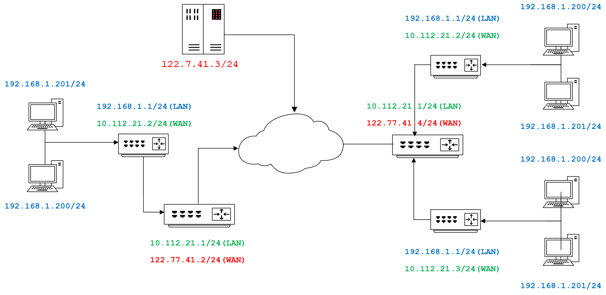
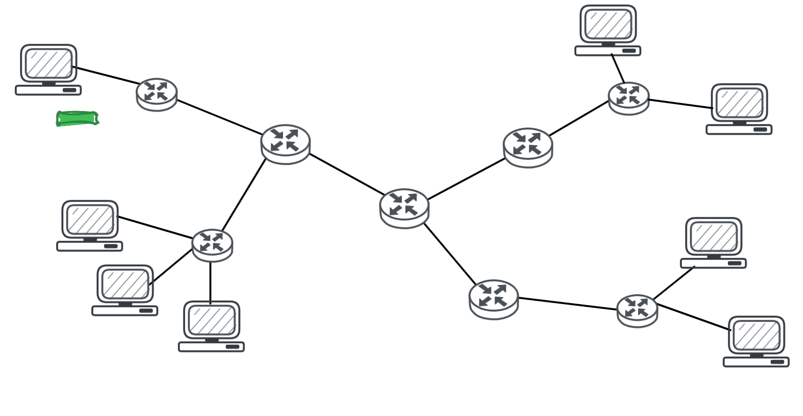
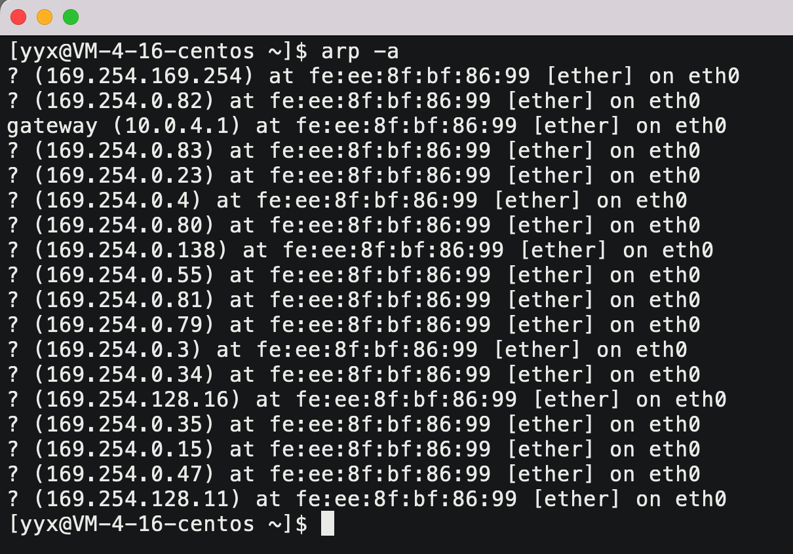

# 网络层

## 1. IP协议

对于网络传输来说，TCP负责决策，IP负责执行。 IP协议是以较大概率将数据跨网络传输到对端主机上，TCP在此基础上负责可靠性和效率。

### 1.1 IP协议段格式


| 字段         | 解释                                                         |
| ------------ | ------------------------------------------------------------ |
| 4位版本      | 表示IP协议的版本，IPv4就填4，不兼容IPv6                      |
| 4位首部长度  | 以4字节为单位，表示报头长度                                  |
| 8位服务类型  | 3位优先权，4位TOS，1位保留。支持设置最小延迟，最大吞吐量，最高可靠性，最小成本 |
| 16位总长度   | 表示整个报文的长度                                           |
| 8位生存时间  | 每经过一个节点生存时间就减1，如果生存时间减到0报文就被废弃，用来清理无效报文 |
| 8位协议      | 表示有效载荷使用的上层协议                                   |
| 32位源目的IP | IP协议需要IP地址，对应TCP协议需要端口号                      |

### 1.2 网段划分

#### 网络号和主机号

IP地址分为两个部分，网络号和主机号：

- 网络号：保证相互连接的两个网段具有不同的标识。
- 主机号：同一网段内的主机，具有不同的主机号。

根据网络号查找目标网络，进入目标网络后，再查找并对比IP中的主机号，就确定了目标主机。


#### 分类划分法

最开始时提出一种划分网络号和主机号的方案，把所有IP地址分为五类，如下图所示：


这种划分的方法叫分类划分法，分类划分法的过于粗暴局限，导致很多浪费和紧缺。

#### 子网掩码划分法

CIDR划分法在分类划分法的基础上，引入子网掩码来划分网络号和主机号。

子网掩码本质是左半部分全1右半部分全0的32位整数。IP地址和子网掩码进行按位与就是网络号，后面就是主机号。

### 1.3 公网IP和私有IP

局域网IP地址只用于局域网内的通信，不能直接连到公网上。规定用于局域网的私有IP地址：

| IP                          | 地址数             |
| --------------------------- | ------------------ |
| 10.\*/8                     | 共16,777,216个地址 |
| 172.16.\*/12 ~ 172.31.\*/12 | 共1,048,576个地址  |
| 192.168.\*/16               | 共65,536个地址     |



公网IP在整个网络都不能重复，但私网IP在不同网段内是可以重复的。

### 1.3 报文分片

链路层限制有效载荷的大小，一般为1500字节。如果IP报文过大，就必须分成多个数据包交给链路层。分片和组装都是IP协议的任务。

分片会提高报文丢失的风险，所以一般不分片。传输层控制会报文的大小，这样IP层就不需要分片。

一旦数据包丢失，所有数据包都会丢弃，反映到传输层就是触发重传。


| 字段       | 解释                                                         |
| ---------- | ------------------------------------------------------------ |
| 16位标识   | 报文的标识各不相同，分片报文的标识是一致的，可以根据标识查找分片的报文 |
| 13位片偏移 | 片偏移表示分片报文的有效载荷距原始有效载荷起始位置的偏移量   |
| 3位标志    | 1位保留，1位禁止分片，1位更多分片：为1表示中间报文，为0表示为结尾报文 |

> 如果报文丢失了，如何检验呢？

1. 如果没有查找到片偏移为0的报文，就说明首位报文丢失。
2. 如果当前报文片偏移加上报文长度不等于下一个报文的片偏移，则说明中间报文丢失。
3. 如果3位标志中最后一位为0，表示当前报文就是结尾报文。

> 一个3420字节的IP报文，可以分成3个分别是1480、1480、440，再给加上报头即可。

$$
3420=20+3400=20+(1480+1480+440)=>(20+1480)+(20+1480)+(20+440)
$$


> 接收端如何判断收到的报文是普通报文还是分片报文？

1. 如果片偏移不为零，一定是分片报文，
2. 如果片偏移为0，但3位标志最后一位为1，则一定是分片报文；
3. 除此以外，都是普通报文。

### 1.4 路由

路由器能横跨两个网络，所以要配两个IP，LAN口连接内网，WAN口连接外网。

IP数据包的传输时，路由器将目的IP与路由表进行对比：

1. 如果对应得上就说明目标主机就在自身子网内，就直接发送到目标主机
2. 如果访问的不是子网内的主机，就将源IP替换成路由器的WAN口IP，也就是将报文转发到外网。



&nbsp;

# 数据链路层

IP路径选择的能力是建立在链路层节点之间跳转的功能的基础上。凡是能够进行跳转的节点，一定在同一个网段内是直接相连的节点。

## 2. 以太网

> 以太网是一种技术标准。包含链路层和物理层的内容。以太网是应用最广泛的局域网技术，还有令牌环、无线LAN等。
>

局域网通信的方式就是一个节点将数据放到网络里，所有节点都能拿到并对比MAC地址，是给自己的就接收，不是就抛弃。

### 2.1 以太网帧格式


| 字段     | 解释                                                         |
| -------- | ------------------------------------------------------------ |
| 目的地址 | 目的MAC地址                                                  |
| 源地址   | 源MAC地址                                                    |
| 类型     | 有效载荷的类型，0800表示IP数据报，0806表示ARP请求应答，0835表示RARP请求应答 |
| PAD      | 以太网帧数据不能少于46不能大于1500字节，否则就要添加PAD就是随机值 |

> 如何进行封装和解包呢？

1. 类型决定报文的有效载荷要交付给上层那一个协议；
2. 具体类型报文的报头都是定长的，按其规则封装和解包即可。

### 2.2 MAC地址

MAC地址用来标识链路层中节点，长度为6字节48位。一般表示形式：08:00:27:03:fb:19。MAC地址随网卡绑定，一般不支持修改。

### 2.3 MTU

MTU是MAC帧的大小上限，以太网帧中的数据长度规定最小46字节，最大1500字节。ARP数据包的长度不够46字节,要在后面补填充PAD。

不同的数据链路层标准的MTU是不同的，如果一个数据包从以太网路由到拨号链路上，数据包长度大于拨号链路的MTU了，则需要对数据包进行分片。

&nbsp;

## 3. ARP协议

### 3.1 ARP协议的作用

路由器想将外界数据包转发进局域网，需要先对数据报封装MAC帧。就需要通过目的IP获得目的MAC地址，该工作由ARP协议负责。


ARP协议工作在链路层，是局域网协议，专门处理ARP请求和响应，处理完成后自动在交给MAC帧协议发送给目的主机。

### 3.2 ARP数据报格式


加粗部分是ARP协议报文格式，将ARP协议报文部分替换成有效载荷就是MAC帧协议报文格式。

| 字段                        | 解释                                                         |
| --------------------------- | ------------------------------------------------------------ |
| 硬件类型                    | 1表示以太网                                                  |
| 协议类型                    | 0x0800为IP地址                                               |
| 硬件地址长度                | 6为以太网MAC地址，不变                                       |
| 协议地址长度                | 4为IP协议地址，不变                                          |
| op                          | 1表示ARP请求，2表示ARP应答                                   |
| 发送端MAC地址，发送端IP地址 | 请求方或者响应方填写自身的MAC地址和IP地址，接收方提取以待后用 |
| 接收端MAC地址，接收端IP地址 | 请求方填写接收方的IP地址，接收方MAC地址全F表示未知           |

### 3.3 ARP的流程

> 如果路由器知道IP对应的MAC地址，那就可以直接发送，如果不知道，就要使用ARP协议获取目的MAC。

1. 路由器广播包含ARP请求的数据帧，所有主机都会向上交付给ARP协议。
2. ARP协议获取ARP请求中的目的IP地址，不是本机直接丢弃，是本机做出应答。
3. 目的主机返回ARP应答发给路由器，其中包含自身的MAC地址。


一般主机会缓存子网内其他主机IP和MAC地址。由于IP是动态分配的，缓存的生命周期一般不长。可以使用`arp -a`查看：



&nbsp;

# 其他协议

## 4. DNS协议

### 4.1 域名

主域名是用来识别主机名称和主机所属的组织机构的一种分层结构的名称。

| 性质     | 内容  | 解释                                                         |
| -------- | ----- | ------------------------------------------------------------ |
| 一级域名 | com   | 表示这是一个企业域名，同级的还有"net"网络提供商）,"org"(非盈利组织）等 |
| 二级域名 | baidu | 域名                                                         |
| 前缀     | www   | 只是一种习惯用法，来表示主机支持的协议                       |

### 4.2 输入URL后的事情

这是一个经典的面试题，能牵扯到所有网络知识点，没有固定答案越细越好，可以参考：https://blog.csdn.net/wuhenliushui/article/details/20038819/

1. 有知识框架，有条理
2. 组织语言，清晰表达
3. 掌握细节程度

针对这个问题我想分成如下三步去谈：
第一层：在应用层，将一个URL请求一直到浏览器返回，把这个过程给你详细的表述一下。
第二层：应用层谈完之后，再谈谈细节问题，因为细节太多了，所以我只能以关键字的方式给你呈现。
第三层：当把前面的两个大步骤讲完，然后还会再补充一些细节，那么这个问题呢一个大思路。

第一、我们谈第一个就是应用层，首先输入URL之后点击回车，先域名解析拿到IP地址，紧接着浏览器会发起HTTP请求，服务器会收到HTTP请求，然后读取请求，进而进行分析HTTP请求。分析完之后，根据分析字段得到要求的资源，上传的参数等等。然后构建HTTP响应，如响应行、属性、正文等等，再发送给浏览器，浏览器拿到HTTP响应要对HTTP响应做分析，更重要的是提取相应的正文比如网页，然后浏览器会解释网页的这些标签语言，同步的也要对浏览器界面进行相关的渲染，把我们所需要的网页内容给展示出来。如此就完成一整个HTTP请求和响应，这是我回答问的第一阶段。那么上面实际上是一个整体的过程，也是用户最能感知到的，也是一般程序员最清楚的。

第二、那么下面要谈的就是细节，当我们实际发起一个HTTP的时候，底层其实使用的是TCP套接字编程。底层实际上将我们的数据以字节流的方式拷贝并发送过去。然后TCP协议经过自己的流量控制、拥塞控制，确认应当、链接管理、超时重传、延迟应答等各种机制来保证自己的数据报被对方可靠高效地获取。

第三、TCP将数据交给IP层，存在各种路径选择、子网划分、查找路由表等过程，IP数据报分片组装等特殊情况，到链路层会有局域网转发、ARP协议等相关细节。当然过程中也会存在各种异常情况。

&nbsp;

## 5. ICMP协议

### 5.1 ICMP的功能

ICMP本质就相当于IP层的“调试接口”，可从应用层直接访问IP层的功能，测试IP层代码的准确性。主要功能包括：

1. 确认IP包是否成功到达目标主机。
2. 返回IP包被丢弃的原因。

> ICMP也是基于IP协议工作的，但是它并不是传输层的功能，因此仍然把它归为网络层。
>
> ICMP只能搭配IPv4使用，IPv6需要用ICMPv6。

总之，ICMP报文能够诊断出错原因。


### 5.2 基于ICMP的命令

#### ping命令

```shell
$ ping localhost
PING localhost (127.0.0.1):56 data bytes
64 bytes from 127.0.0.1: icmp_seq=0 tt1=64 time=0.086 ms
64 bytes from 127.0.0.1: icmp_seq=1 ttl=64 time=0.183 ms
64 bytes from 127.0.0.1: icmp_seq=2 ttl=64 time=0.143 ms
--- Localhost ping statistics ---
4 packets transmitted, 4 packets received, 0.0% packet loss
round-trip min/avg/max/stddev = 0.086/0.150/0.187/0.041 ms
```

ping的是域名。ping命令不光能验证网络的连通性，同时也会统计响应时间和TTL。

ping命令会先发送一个ICMP Echo Request 给对端，对端接收到之后会返回一个 ICMP Echo Reply。

> telnet是23端口, ssh是22端口, 那么ping是什么端口？

**ping 命令基于网络层的ICMP，而端口号是传输层的概念，网络层中根本就没有端口号。**

&nbsp;

## 6. NAT协议

### 6.1 NAT技术背景

NAT技术是解决IP地址不足的主要手段，是路由器的一个重要功能。

NAT能够将私有IP对外通信时转为全局IP，是一种将私有IP和全局IP相互转化的技术。

### 6.2 NAT IP转换过程

- 私有网络中的数据经路由器转发到服务器时，路由器会将IP报文中源IP替换成路由器的WAN口IP。
- 公共网络中的数据经路由器转进私有网络时，路由器会将IP报文中目的IP替换回发起请求的主机IP。

#### NATP转化表

在NAT路由器内部，有一张自动生成的用于地址转换的表。两边可以互为键值，数据出去时“向外”转换，数据进来时“向内”转换。

这种映射关系是由路由器自动维护的，第一次发送报文时就会生成这个表项。

不同主机访问同一个公网服务，或者主机的多个进程访问同一个公网服务时。报文中的源端口号会被路由器用来区分不同进程。


### 6.3 NAT技术的缺陷

由于NAT依赖这个转换表，所以有诸多限制：

- 路由器外部主机无法向内部主机建立连接；
- 转换表的生成和销毁都需要额外开销；
- 通信过程中一旦路由器异常，即使存在热备所有的TCP连接也都会断开。

### 6.4 代理服务器

#### 正向代理和反向代理

现在的路由器往往都具备NAT功能，通过NAT设备进行中转，完成子网设备和其他子网设备的通信过程。

代理服务器看起来和NAT设备有点像：

1. 客户端向代理服务器发送请求，代理服务器将请求转发给服务器；
2. 服务器返回结果给代理服务器，然后又把结果回传给客户端。


如图所示，靠近用户的代理服务器，叫做正向代理。优点有：

1. 身份认证。
2. 加速内网服务。
3. 筛查非法请求。

如图所示，靠近服务器的代理服务器，叫做反向代理。优点有：

1. 进行业务转发，实现负载均衡。
2. 防止恶意攻击服务器。

#### NAT和代理的区别

| 角度 | NAT                                | 代理服务器                               |
| ---- | :--------------------------------- | ---------------------------------------- |
| 应用 | 网络基础设备，解决的是IP不足的问题 | 贴近具体应用，比如通过代理进行加速或翻墙 |
| 底层 | 工作在网络层，直接替换IP地址       | 工作在应用层                             |
| 使用 | 一般部署在局域网的出口             | 可以在局域网，也可以在广域网，也可以跨网 |
| 位置 | 一般集成在路由器等设备上           | 需要部署在服务器上                       |
