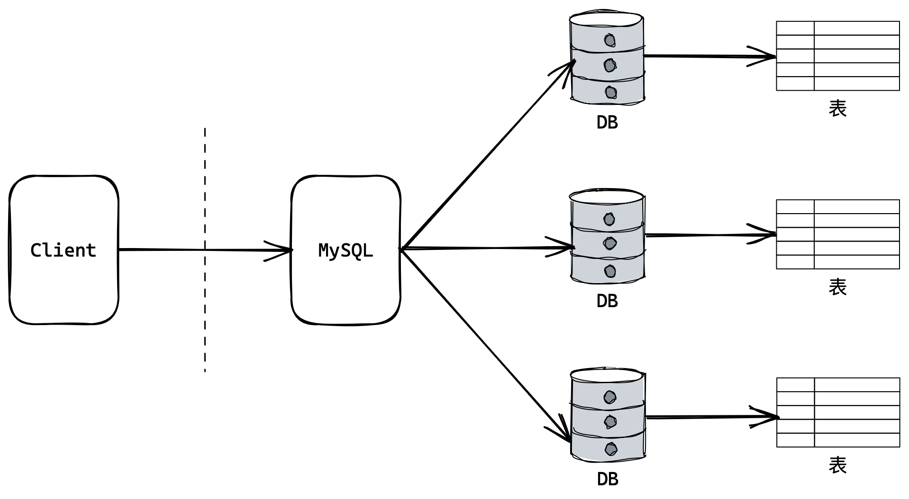
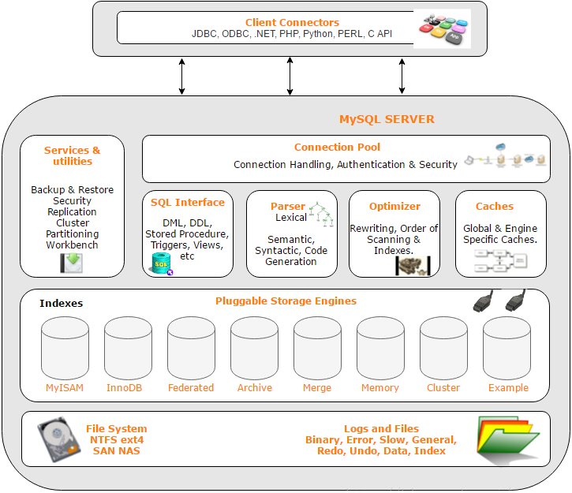

# MySQL

## 1. 基本概念

数据可以存储在文件中，但数据库更安全、便于管理查询和程序访问。数据库本质上是一套数据存储的解决方案，底层还是依托文件进行存储。

数据库通过网络的形式提供服务。用户通过客户端访问服务端，服务端对数据库进行增删查改的操作，再将结果返回给客户端。

```sql
mysql -h 127.0.0.1 -P 3306 -u root -p123456
```

<center>

</center>

> MySQL中，创建数据库本质就是创建一个目录，创建表本质就是在目录中创建文件，增删查改也就是访问该文件。

MySQL是关系型数据库，数据存储是按行列存储的。通常把一行称为记录，一列称为属性。

<center>

</center>

最底层是磁盘文件系统，往上是存储引擎，存储引擎是系统文件的封装，帮助我们进行文件操作。其上还有分析器，对SQL语句分析翻译成文件操作。

| SQL分类         | 解释                                                       |
| --------------- | ---------------------------------------------------------- |
| DDL数据定义语言 | 用来维护存储数据的结构，如：create、drop、alter            |
| DML数据操纵语言 | 对数据进行操作增删查改，如：insert、delete、update、select |
| DCL数据控制语言 | 负责权限管理和事务管理，如：grant、revoke、commit          |

&nbsp;

## 2. 库表操作

### 2.1 库的操作

创建库

```sql
create database `db_name`;
```

```sql
create database if not exists `db_name` charset=utf8 collate utf8_general_ci;

create database [if not exists] db_name [specification, ...]
specification:
	[default] character set charset_name # 指定数据库采用的字符集
    [default] collate set collation_name # 指定数据库字符集的校验规则
```

展示库

```sql
show datbases; # 显示数据库
show create database `db_name`; # 显示创建语句
```

删除库

```sql
drop database `db_name`;
```

使用库

```sql
use `db_name`;
```

查看连接情况

```sql
show processlist;
```

存储规则和校验规则

```sql
show variables like 'character_set_database';
show variables like 'collation_database';
# 如果存储规则是utf8，校验规则就应是utf8_general_ci。校验规则表示如何看待数据库中的数据，二者应该对应。
```

备份数据库

```shell
mysqldump -P3306 -u root -p123456 -B `db_name` > backup_file
```

恢复数据库

```sql
source backup_file;
```

### 2.2 表的操作

创建表

```sql
create table [if not exists] `tb_name` (
	field1 datatype,
    field2 datatype,
	field3 datatype
) [character set 字符集 collate 校验规则 engine 存储引擎];
```

删除表

```sql
drop table `tb_name`;
```

查看所有表

```sql
show tables;
show create database `tb_name`; # 查看创建表的语句
```

查看表结构

```sql
desc `tb_name`;
```

更改表名称

```sql
alter table `old_name` rename to `new_name`;
```

添加列

```sql
alter table `tb_name` add (`field_name2` datatype, ...) after `field_name1`
```

删除列

```sql
alter table `tb_name` drop (`field_name` datatype, ...)
```

修改列

```sql
alter table `tb_name` modify (`field_name` datatype, ...) # 修改列会覆盖列的原有属性
```
更改列名称

```sql
alter table `tb_name` change `old_name` `new_name` datatype; # 改列名也会覆盖列的原有属性
```
