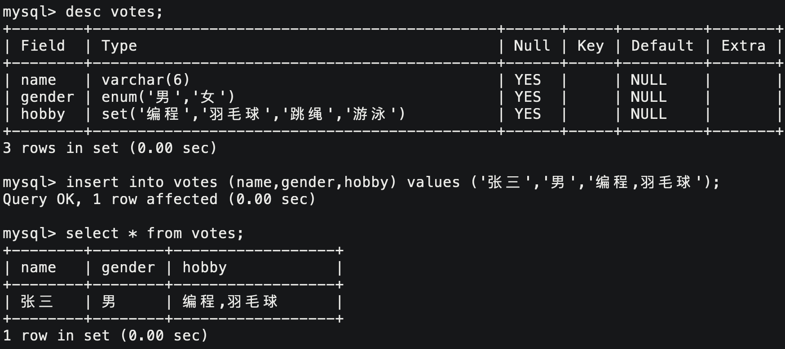
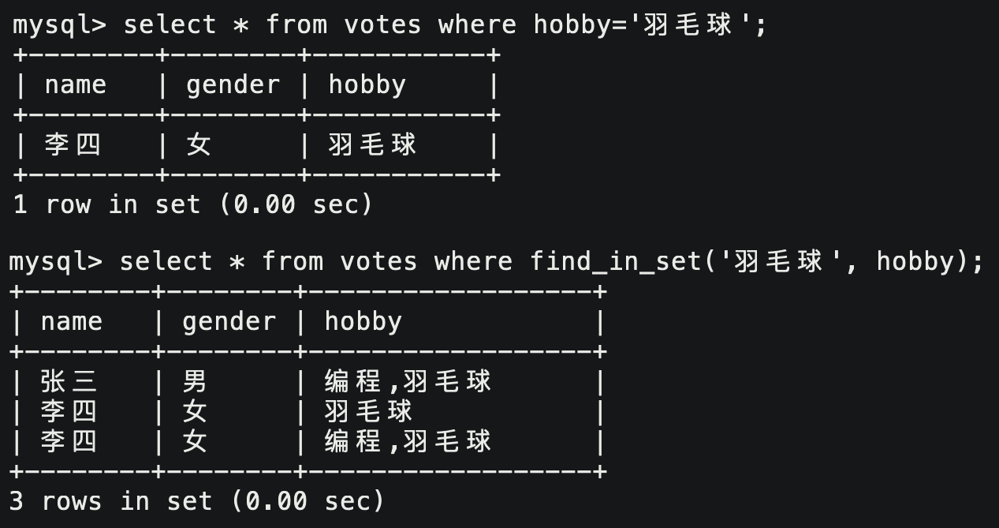

# 1. 数据类型

| 分类             | 数据类型                        | 解释                                           |
| ---------------- | ------------------------------- | ---------------------------------------------- |
| 数值类型         | **BIT (M)**                     | 位类型。M位数，默认为1范围1-64                 |
|                  | BOOL                            | 01表示真假                                     |
|                  | **TINYINT [UNSIGNED]**          | 8位整型                                        |
|                  | SMALLINT [UNDIGNED]             | 16位短整型                                     |
|                  | **INT [UNSIGNED]**              | 32位整型                                       |
|                  | BIGINT [UNSIGNED]               | 64位长整型                                     |
| 小数类型         | **FLOAT [ (M, D) ] [UNSIGNED]** | 32位浮点类型，M整体长度，D小数长度             |
|                  | DOUBLE [ (M, D) ] [UNSIGNED]    | 64位浮点类型，M整体长度，D小数长度             |
|                  | **DECIMAL (M, D) [UNSIGNED]**   | M整体长度，D小数位数                           |
| 文本、二进制类型 | **CHAR (SIZE)**                 | 定长字符串，L字符个数，最大255**字符**         |
|                  | **VARCHAR (SIZE)**              | 变长字符串，L字符个数，最大65535**字节**       |
|                  | BLOB                            | 二进制数据                                     |
|                  | **TEXT**                        | 大文本，不支持全文索引，不支持默认值           |
| 时间日期         | **DATE**                        | yyyy-mm-dd仅日期格式，占3字节                  |
|                  | **DATETIME**                    | yyyy-mm-dd hh:mm:ss格式，支持自定义，占8字节   |
|                  | **TIMESTAMP**                   | yyyy-mm-dd hh:mm:ss格式，实际是时间戳，占4字节 |
| String类型       | **ENUM**                        | 单个字符串对象，多选一                         |
|                  | **SET**                         | 字符串对象集合，多选多                         |

## 1.1. 数值

```sql
ERROR 1264 (22003): Out of range value for column 'number' at row 1
```

SQL会直接拒绝插入越界的数据。数据类型本质就是一种数据安全的约束。

- float(4,2)的范围是：-99.99~99.99，小数会自动四舍五入，大小越界报错。
- float(4,2) usigned范围是：0~99.99，正数表示范围不变。
- float小数默认显示2位，整数超过9999990只能存到9999990。
- float小数设置超过7位存在精度损失，decimal小数精度更高。
- decimal小数精度最大30位，整体最大65位。D默认为0，M默认为10。

## 1.2. 字符串

- varchar最大65535个字节，头3字节存储长度，故utf8编码varchar最大存储21844个字符。当然MySQL限制一行元素大小之和最大65535个字节。
- char类型始终占用L个字符的大小，varchar类型的占用和数据长度相关。
- 数据长度不变就用char，长度变化就用varchar；

- 定长浪费空间但效率高，变长节省空间但效率低。

## 1.3. enum和set

```sql
enum ('选项1', '选项2', '选项3', ...)
```

新增时必须插入规定的选项值中的一个。enum类型，实际存储的是从1开始的数字下标。

```sql
set  ('选项1', '选项2', '选项3', ...)
```

set类型可以选择多个选项，用逗号隔开，合并成一个字符串。



set存储时采用位图结构。下标的二进制位，从低到高每个比特位表示一个选项，为1表示具有该选项，反之则没有。


`where`只能筛选出严格匹配的记录，用`find_in_set`可以筛选出包含该选项的记录。



&nbsp;

# 2. 表的约束

MySQL为保证数据的完整性一致性，给我们提供了如下各种强约束。

## 2.1 空属性

MySQL中的NULL表示不存在、为空。列默认可以为空，not null表示不许为空。

```sql
create table stu (
    name varchar(16) not null
);
```

## 2.2 默认值

通过default设置列的默认值，可以避免该字段为空。

```sql
create table genders (
    gender char(1) default '男'
);
```

## 2.3 列描述

comment就是注释。

```sql
create table genders (
    gender char(1) comment '性别'
);
```

## 2.4 零填充

建表时MySQL自动为int字段添加(10)。设置zerofill的列，如果数据宽度低于指定位数，显示时会在前面补零，不影响存储。

```sql
alter table tb modify a(3) int unsigned zerofill;
select * from tbs;
+-----+
| a   |
+-----+
| 001 |
| 011 |
| 111 |
+-----+
```

## 2.5 主键

数据库要求表中有一个字段作为一行记录的唯一标识，就是主键。

类似于序号，根据主键能够唯一筛选出一条记录。主键字段不可为空不可重复，一张表只能有一个主键。

```sql
create table tb (
    id int primary key
);
```

删除主键

```sql
alter table `tb_name` drop primary key; # 只是为字段去掉主键约束，并不是删除整列。
```

追加主键

```sql
alter table `tb_name` add primary key(`field_name`); # 为已存在字段追加主键，如果有重复值，会追加失败。
```

### 复合主键

复合主键可以让多列合起来作为主键。这样只需要保证多列不同时重复就行。

```sql
create table `tb_name` (
	`field1` type,
    `field2` type,
    primary key (`field1`, `field2`, ...) # 设置复合主键
);
```

## 2.6 自增长

设置`auto_increment`的字段，插入时可以不给值，新记录的会自动取值为当前最大值加1。一般自增长的字段都是主键。

```sql
create table tb (
    id int primary key auto_increment
) auto_increment=100;
```

- 自增长字段默认从1开始，也可以插入数据，只要不重复即可。之后会从最大值开始递增。
- 被自增长的字段必须作为主键或者其他具有唯一性的键使用。

## 2.7 唯一键

如果存在多个字段需要保证唯一性，但主键只有一个，所以只能用唯一键约束。

```sql
create table stu (
	id1 int primary key,
	id2 int unique
);
```

- 唯一键允许为空，NULL表示不参与运算。如果将唯一键设置为not null则自动转换成主键。
- 主键因索引而唯一，唯一键因业务而唯一。
- 主键只能有一个，唯一键能设置多个。

> 主键和唯一键并不冲突，只是负责数据在不同层面的唯一性。

## 2.8 外键

外键用来将从表和主表之间建立关系。外键定义在从表上，一般外键就对应着主表的主键或者唯一键。

```sql
create table tb (
	foreign key (`field`) references `tb_master`(`field`)
)
```


通过外键产生关系的表，除了在逻辑上有关联，MySQL也会维护该逻辑对用户操作产生约束。

> 比如班级表中得先有id为30的班级，才能在学生表中添加class_id为30的学生。
>
> 要删除班级表中id为20的班级，首先必须保证学生表中没有对应班级的学生。

对于数据库用户来说，外键是为了方便业务关联，对于MySQL来说，外键是为了产生对应的外键约束，保证数据的安全。
