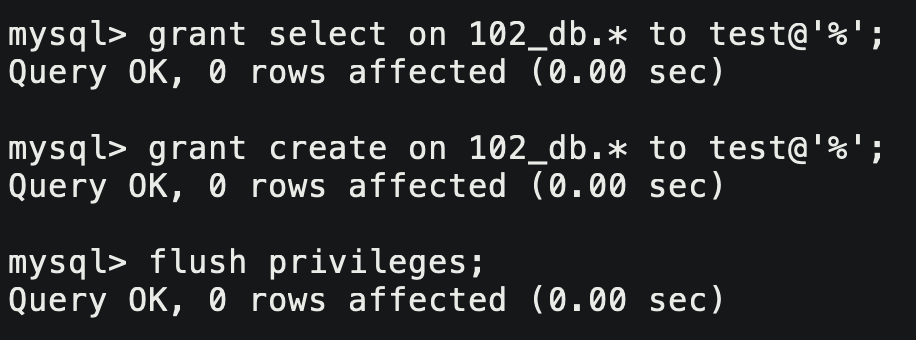

# 1. 视图

> 视图是一个不怎么重要不怎么常用的机制。

视图是一个虚拟表，其内容由查询定义。视图和真实的表一样，包含一系列带有名称的列和行数据，

## 1.1 基本使用

```sql
create view `view_name` as select ...;
```

创建视图就相当于创建一张表，并且也以文件的形式保存在MySQL目录中。

<center>

</center>

但文件只保存了结构没保存数据，每次查看视图都会临时从表中获取数据。这样有个好处是视图的数据变化会影响到基表，基表的数据变化也会影响到视图。

<center>

</center>

## 1.2 视图规定和限制

- 与表一样，必须唯一命名（不能出现同名视图或表名）
- 创建视图数目无限制，但要考虑复杂查询创建为视图之后的性能影响
- 视图不能添加索引，也不能有关联的触发器或者默认值
- 视图可以提高安全性，必须具有足够的访问权限
- order by 可以用在视图中，但是如果从该视图检索数据 select 中也含有 order by，那么该视图中的 order by 将被覆盖

&nbsp;

# 2. 用户管理

> 用户管理的思路都是大同小异，可以类比Linux用户管理。

## 2.1 用户信息

MySQL中用户信息都在库mysql的user表中。

| 字段                    | 解释                                                         |
| ----------------------- | ------------------------------------------------------------ |
| `host`                  | 这个用户的允许登陆地，如果是`localhost`表示本地，`%`表示任意 |
| `user`                  | 用户名                                                       |
| `authentication_string` | 用户密码通过password函数加密后的结果                         |
| `*_priv`                | 用户拥有的权限，后面跟Y表示允许，N表示拒绝                   |

### 创建用户

```sql
create user 'username'@'ip' identified by 'password';

SHOW VARIABLES LIKE 'validate_password%';
set global validate_password.check_user_name=0;
set global validate_password.policy=0;
set global validate_password.special_char_count=0;
SHOW VARIABLES LIKE 'validate_password%';
```

用户被创建好，也无法进行大部分操作，需要对用户进行赋权。

### 删除用户

```sql
drop user '用户名'@'主机名';
```

### 修改用户密码

 ```sql
 # 自行修改密码
 set password=password('新的密码');
 # root用户修改其他用户密码
 set password for '用户名'@'主机名'=password('新的密码');
 ```

## 2.2 用户权限

| 权限                    | 字段                  | 上下文                 |
| ----------------------- | --------------------- | ---------------------- |
| CREATE                  | Create_priv           | 数据库、表或索引       |
| DROP                    | Drop_priv             | 数据库、表             |
| GRANT OPTION            | Grant_priv            | 数据库、表或保存的程序 |
| REFERENCES              | References_priv       | 数据库或表             |
| ALTER                   | Alter_priv            | 表                     |
| DELETE                  | Delete_priv           | 表                     |
| INDEX                   | Index_priv            | 表                     |
| INSERT                  | Insert_priv           | 表                     |
| SELECT                  | Select_priv           | 表                     |
| UPDATE                  | Update_priy           | 表                     |
| CREATE VIEW             | Create_view_priy      | 视图                   |
| SHOW VIEW               | Show_view_priv        | 视图                   |
| ALTER ROUTINE           | Alter_routine_priy    | 保存的程序             |
| CREATE ROUTINE          | Create_routine_priv   | 保存的程序             |
| EXECUTE                 | Execute_priv          | 保存的程序             |
| FILE                    | File_priv             | 服务器主机上的文件访问 |
| CREATE TEMPORARY TABLES | Create_tmp_table_priv | 服务器管理             |
| LOCK TABLES             | Lock_tables_priv      | 服务器管理             |
| CREATE USER             | Create_user_priv      | 服务器管理             |
| PROCESS                 | Process_priv          | 服务器管理             |
| RELOAD                  | Reload_priv           | 服务器管理             |
| REPLICATION CLIENT      | Repl_client_priv      | 服务器管理             |
| REPLICATION SLAVE       | Repl_slave_priv       | 服务器管理             |
| SHOW_DATABASES          | Show_db_priy          | 服务器管理             |
| SHUTDOWN                | Shutdown_priy         | 服务器管理             |
| SUPER                   | Super_priv            | 服务器管理             |

### 用户赋权

```sql
grant 权限列表 on 库.对象名 to '用户名'@'登陆IP' [ identified by '密码' ];
```

赋权之后如果没反应，需要进行刷新权限：

```sql
flush privileges;
```

<center>

</center>

如果嫌麻烦的话可以直接把权限列表写成`all`。

```sql
grant all on *.* to '用户名'@'登陆IP';
```

### 回收权限

```sql
revoke 权限列表 on 库.对象名 from '用户名'@'登陆IP';
```

&nbsp;

# 3. C语言接口使用

### 安装环境

要想使用C/C++的MySQL接口，必须使用MySQL提供的库。如果当初是用yum安装MySQL的直接就有。

<center>

</center>

如果没有目录`/usr/include/mysql`，可以安装如下两个程序

```shell
# centos
$ rpm --import https://repo.mysql.com/RPM-GPG-KEY-mysql-2022 # 如果出现GPG key不匹配的问题
$ yum install -y libodb-mysql-devel.x86_64
$ yum install -y soci-mysql-devel.x86_64

# ubuntu
$ apt install mysql-client
$ apt install libmysqlclient-dev
```

链接静态库的时候，要指明库名和路径。

```makefile
# centos
mysql_test:mysql_test.cc
        g++ -o $@ $^ -lmysqlclient -L/usr/lib64/mysql -std=c++11
# ubuntu
mysql_test:mysql_test.cc
        g++ -o $@ $^ -lmysqlclient -L/usr/lib/mysql   -std=c++11
```

> 这里有一个坑，库所在路径一定要指明`/usr/lib*/mysql`，如果找不到的话。

## 3.1 接口介绍

### 创建关闭句柄

```cpp
//0. 创建MYSQL句柄
MYSQL* my = mysql_init(nullptr);
//4. 关闭数据库
mysql_close(my);
```

由此也可以看出MySQL其实是网络服务，句柄就是文件描述符。

### 连接数据库

```cpp
//1. 连接MYSQL
char* host   = "127.0.0.1";
char* user   = "test";
char* passwd = "TESTtest123456!";
char* db     = "102_db";
int   port   = 3306;

if (mysql_real_connect(my, host, user, passwd, db, port, nullptr, 0) == nullptr) {
    std::cout << "connect failed" << std::endl;
    exit(1);
}
std::cout << "connect success" << std::endl;
```

### 设置字符编码

```cpp
//2. 设置字符编码
mysql_set_character_set(my, "utf8");
```

设置字符编码为utf8，防止乱码。

### 执行SQL语句

```cpp
//3. 执行SQL语句
// 增删改
std::string sql = "insert into account values (5, '猪八戒', 8.22)";
std::string sql = "delete from account where id=5";
std::string sql = "update account set name='唐僧' where id=5";
// 查
std::string sql = "select * from account";

int res = mysql_query(my, sql.c_str());
if (res != 0) {
    std::cout << "execute: " << sql << " failed" << std::endl;
    exit(2);
}
```

传入SQL语句，返回值为0表示成功，为1表示失败。

增删改SQL执行完就完了，如果是查询select语句我们还要读取结果。

### 获取查询结果

```cpp
// 获取执行结果
MYSQL_RES* result = mysql_store_result(my);
```

依靠句柄获取最新一次查询结果，返回到`MYSQL_RES`结构体中。

同时该函数malloc了一块内存空间来存储查询过来的数据，所以一定要释放对应空间不然会造成内存泄漏。

### 获取行数列数

```cpp
// 获取行数列数
int rows = mysql_num_rows(result);
int cols = mysql_num_fields(result);
std::cout << "行数: " << rows << " 列数: " << cols << std::endl;
```

### 获取字段名称

```cpp
// 获取字段名称
MYSQL_FIELD* fields = mysql_fetch_fields(result);
for (int i = 0; i < cols; i++) {
    std::cout << fields[i].name << "\t";
}
std::cout << std::endl;
```

### 获取一行记录

```cpp
//遍历获取记录
for (int i = 0; i < rows; i++) {
    MYSQL_ROW line = mysql_fetch_row(result);
    for (int j = 0; j < cols; j++) {
        std::cout << line[j] << "\t";
    }
    std::cout << std::endl;
}
```

`mysql_fetch_row`返回值就是一个char*的数组，保存的是一条记录中的每个字段值。
