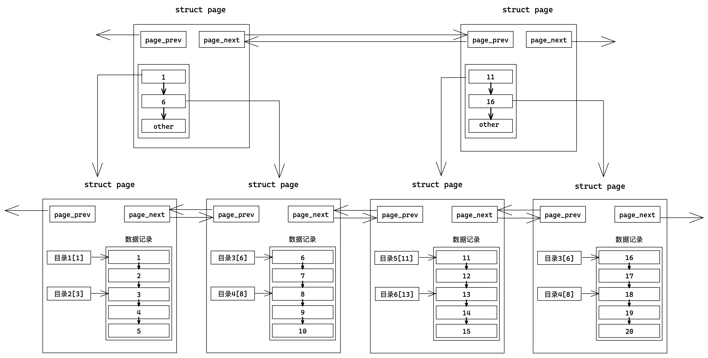

# 索引

## 1. 索引原理

索引是一个“物美价廉”的特性，用来提高数据库的性能。不需要改程序、调SQL、只需要正确的创建索引，查询速度就能提高成百上千倍，但也带来了增删速度的下降。

MySQL中的数据是以Page为单位保存在内存中的。Page之间使用前后指针构成双向链表。Page结构体内部多条记录也是使用链表形式存储。

**如果存在主键，MySQL会自动将我们插入的数据，按主键的递增顺序进行排序。**便于优化查询的效率。首先数据得有序才能方便查找。


### 1.1 主键索引

> 如何提高在单个Page中的查找效率？

针对单页Page我们可以添加“目录”，目录存储所指向的记录的键值，这是一种以空间换时间的做法，但是建立在数据有序的基础上。


> 如何提高在多个Page中的查找效率？


Page以链表的形式组织，只能线性遍历也有效率问题。

解决方法是为多个数据页配一个目录页，该目录页存储所指向的数据页的最小键值。

目录页也是页，普通页存储的是用户数据，目录页存储的是普通页的地址。这样一次查找就能排除多页，效率更高。



不过我们还需要一个管理页（可能是多个）存储其下所有目录页的最小键值，用来来管理其下所有目录页。这样每次查找从顶层管理页开始，逐步向下查找，这也就是B+树模型。


所谓索引，就是在MySQL内部，用页存储数据，再用B+树组织所有Page页。

- 叶节点存储数据，非叶节点只存目录。
- 自顶向下找，只要加载部分目录页，即可遍历整个树，大大减少了IO次数。

B+树方案解决两个问题：线性遍历和大量IO。缺点是略降增删的效率，因为插入或删除会破坏树的结构。

> 为什么选择B+树，而不是其他数据结构？

| 数据结构    | 劣势                                                       |
| ----------- | ---------------------------------------------------------- |
| 链表        | 只能线性遍历，效率太低                                     |
| 二叉搜索树  | 退化问题，可能退化成为线性结构                             |
| AVL和红黑树 | 二叉结构导致树整体过高。需要加载Page就多IO效率低           |
| Hash        | 散列随机的导致范围查找时效率不行                           |
| B树         | 底层无法线性遍历，范围查找效率不高。树体存储数据导致树过高 |

### 1.2 聚簇索引和非聚簇索引

| 概念       | 存储引擎 | 解释                           |
| ---------- | -------- | ------------------------------ |
| 聚簇索引   | InnoDB   | 叶节点存储数据                 |
| 非聚簇索引 | MyISAM   | 叶节点不存储数据，存储数据地址 |


除了主键索引，用户也有可能以其他字段建立索引，一般这种索引叫做辅助索引或者普通索引。

- 对于MyISAM，建立普通索引和主键索引没有差别（叶节点都存放数据地址）
- 对于InnoDB，建立普通索引，叶结点保存该记录的主键，需要回表查询。

&nbsp;

## 2. 索引操作

### 2.1 主键索引

创建表的时候设置主键或者后期追加设置主键，都会自动创建主键索引模型。

```sql
create table `tb_name` (`field` datatype primary key); # 方式一
create table `tb_name` ( rimary key (`field`)); # 方式二
alter table `tb_name` add primary key (id); # 方式三
```

### 2.2 唯一索引

```sql
create table `tb_name` (`field` datatype unique key); # 方式一
create table `tb_name` (unique(`field`)); # 方式二
alter table `tb_name` add unique key (id); # 方式三
```

### 2.3 普通索引

```sql
create table `tb_name` (index(`field`)); # 创建表时指定索引
create index `idx_name` on `tb_name`(`field`); # 追加索引
alter table `tb_name` add index(`field`); # 追加索引
```

### 2.4 查询索引

```sql
show index from `tb_name`\G
```

### 2.5 删除索引

```sql
alter table `tb_name` drop primary key; # 删除主键索引
alter table `tb_name` drop index `index_name`; # 删除唯一索引或普通索引
```

### 2.7 索引创建原则

- 较频繁作为查询条件的字段应该作为索引
- 唯一性太差的字段不适合作为索引
- 更新较频繁的字段不适合作为索引

> 高频查，低频改，唯一性强