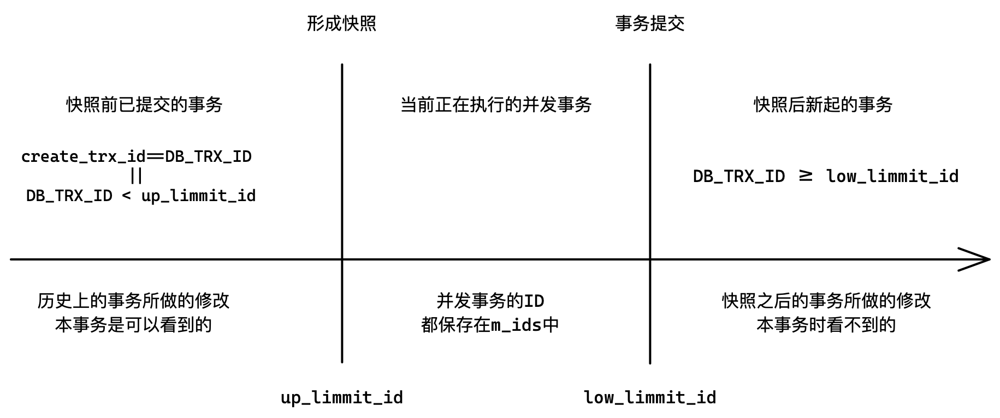

# 事务

> 数据库也是临界资源，也需要考虑并发安全。

## 1. 事务的概念

**事务就是一组能保证原子性的sql语句，属于一个整体，要么全部失败要么全部成功。是MySQL提供一种机制，保证达到原子性的效果。**

一个完整的事务需要满足四个特性：ACID

| 特性                   | 解释                                                 |
| ---------------------- | ---------------------------------------------------- |
| 原子性 **A**tomicity   | 事务提交失败，自动全部回滚，事务提交成功，数据持久化 |
| 持久性 **D**urability  | 事务一旦提交成功，数据就持久化不可在回滚             |
| 隔离性 **I**solation   | 保证并发事务受到不同程度的隔离                       |
| 一致性 **C**onsistency | 事务结束后，数据从一个一致性状态变为另一个一致性状态 |

### 1.1 查看隔离级别

隔离级别有三个变量，分别是：全局隔离级别、会话隔离级别、默认隔离级别。

全局对所有人有效、会话对本次会话登陆有效、默认和会话等级一致。

```sql
SELECT @@GLOBAL.tx_isolation, @@tx_isolation;
SELECT @@GLOBAL.transaction_isolation, @@transaction_isolation; # mysql8
+--------------------------------+-------------------------+
| @@GLOBAL.transaction_isolation | @@transaction_isolation |
+--------------------------------+-------------------------+
| REPEATABLE-READ                | REPEATABLE-READ         |
+--------------------------------+-------------------------+

set session transaction isolation level read committed;
```

### 1.2 事务的操作

```sql
start transaction; / begin; #1.启动事务

savepoint `point_name`; # 设置回滚点

rollback to `point_name`; # 回滚到回滚点
rollback # 全部回滚

commit; # 提交
```

&nbsp;

## 2. 原子性

**MySQL会自动回滚未完成的事务，以此来维护事务的原子性**。

当进行事务的一方突然发生异常，未能提交事务，那么MySQL将自动回滚，事务的操作会自动取消。反之一旦提交，数据变为永久状态。

> 实际上单条SQL也被包装成事务，所以如果突然退出，也会自动回滚。但前提是将MySQL的自动提交关闭。

持久性就是事务提交后，数据改动变成持久状态，无法在被回滚。

&nbsp;

## 3. 隔离性

多个事务同时运行的时候，一定会相互影响。**保证事务的运行过程尽量不受干扰，也就是保证隔离性**。

MySQL允许事务受到不同程度的干扰，就有描述隔离程度的重要概念：隔离级别。

| 隔离级别                     | 解释                                                         |
| ---------------------------- | ------------------------------------------------------------ |
| 读未提交（Read Uncommitted） | 事务能读到其他事务未提交的结果，相当于没有隔离，可能导致脏读 |
| 读提交（Read Committed）     | 一个事务只能读到其他事务提交后的结果，可能会造成不可重复读   |
| 可重复读（Repeatable Read）  | 确保一个事务多次读取只会看到同样的数据，可能会造成幻读       |
| 串行化（Serializable）       | 强制事务排序，不可能发生冲突，但可能会导致超时和锁竞争       |

> 大多数数据库的隔离级别都是读提交，MySQL默认的隔离级别是可重复读。

### 3.1 读未提交

读未提交，相当于没有锁，会产生很多问题。比如脏读，**读到另一个执行中事务的未提交的修改就叫脏读**。实际生产环境是不会使用的。

### 3.2 读提交

读提交可能会导致一个事务的两次读取，读到的结果不一样。这个现象就是不可重复读。

**不可重复读问题在于，不应让与当前事务并行的事务也读到修改后的数据，造成事务读取前后不一致**，会影响自身上层业务逻辑。

### 3.3 可重复读

可重复读是MySQL的默认隔离级别。就算修改事务已经提交，其他同时存在的事务也无法看到修改的数据。也就是**屏蔽与自身并发的事务所做出的修改**。

一般的数据库只能屏蔽修改删除，屏蔽不了插入操作。因为隔离性是通过给记录加锁实现的，但新增数据是不存在的，也就无法预先加锁。**多次读取读到新增数据，这种现象叫做幻读**。

> 但MySQL可以屏蔽插入操作，通过Next-Key间隙锁的机制解决的，具体不做讨论。

### 3.4 串行化

对所有修改操作加锁进行串行化，不会存在任何问题，但是效率很低。如果并发事务一方进行写入等操作，该事务就会被阻塞住，会被定时解锁。

### 3.5 总结

事务具有隔离性是为了安全，种类繁多的隔离机制是为了兼顾效率。

隔离级别越严格，安全性越高，但数据库的并发性能也就越低。

| 隔离级别 | 脏读 | 不可重复读 | 幻读 | 加锁读 |
| -------- | ---- | ---------- | ---- | ------ |
| 读未提交 | 脏读 | 不可重复读 | 幻读 | 不加锁 |
| 读提交   |      | 不可重复读 | 幻读 | 不加锁 |
| 可重复读 |      |            |      | 不加锁 |
| 串行化   |      |            |      | 加锁   |

&nbsp;

## 4. 一致性

事务执行前后，数据库都是从一个一致性状态变到另一个一致性状态。

当事务成功提交，数据库处于一致性状态。当事务未提交且已经对数据库做出修改，此时数据库就处于不正确不一致状态。

一致性表达的意思是，数据库中的数据保持一致状态，数据可有变化，但数据是有意义的。

一致性并不是MySQL中真实存在的一种具体状态，是由原子性、持久性、隔离性共同保证数据库处于一致性的状态。

一致性和用户业务逻辑相关，MySQL提供技术支持，但一致性由上层业务和底层MySQL共同决定。

&nbsp;

## 5. 隔离性理解

数据库并发场景有三种，读读： 不需要并发控制，写写：只能加锁串行化。读写：有线程安全问题，可能会造成事务隔离性问题，如脏读、幻读、不可重复读。

### 5.1 MVCC

多版本并发控制（MVCC）是一种用来解决读写冲突的无锁并发控制。

MySQL会为事务分配单向增长的事务ID，为每个修改保存一个版本，版本与事务ID关联。读操作只读该事务开始前的数据库的快照。

所以MVCC可以解决以下问题：

1. 在并发读写时，无需阻塞读写操作，提高了数据库并发读写的性能。
2. 同时还可以解决脏读，幻读，不可重复读等事务隔离问题，但不能解决更新丢失问题。

#### 3个隐藏字段

| 字段        | 解释                                                         |
| ----------- | ------------------------------------------------------------ |
| DB_TRX_ID   | 6字节，保存最近修改本条记录的事务ID                          |
| DB_ROLL_PTR | 7字节，回滚指针，指向本条记录的历史版本                      |
| DB_ROW_ID   | 6字节，隐藏主键，如果没有主键，InnoDB会自动以DB_ROW_ID产生一个聚簇索引 |

#### undo log

undo log是由MySQL开辟的一段内存，用来保存历史记录的。每一条记录被修改时，都会改前先备份一遍放在undo log中，依靠回滚指针一条一条链起来。

这样，我们就有了一个基于链表记录的历史版本链。所谓回滚，就是用历史数据覆盖当前数据。一个个版本，称之为一个个的快照。

<center>

</center>

##### 添加undo log

当前事务想要修改记录时，会先给该记录加锁，并将记录拷贝一份放到undo log中保存，再解锁并将记录中的回滚指针字段指向undo log中的上一条记录。

改完之后的记录就成了最新纪录，而undo log中的就是历史记录。

删除操作是将隐藏字段flag置为删除，如此也可以形成历史版本。如果是插入操作，新增记录没有历史记录，可以在undo log中放一条空记录即可维护历史版本。

删改的永远都是最新纪录，而查询的可能是历史记录。

##### 清空undo log

对于插入操作，自身提交后，就可以清空undo log中的插入历史纪录了，因为新增数据其他并发事务是看不见的，不需要维护隔离性。

但对于更新和删除操作，如果提交后清空undo log，其他并发事务还可能正在读取历史，只能等并发事务全部提交后才能清空。

### 5.2 隔离性的实现

在可重复读隔离级别下，一个事务看不到其他并发事务已经提交的更改，是因为并发事务删改的是最新纪录，而当前事务只能查询到历史版本，这就是隔离性的实现。那具体看到是哪一个历史版本，就是隔离级别不同的原因。

| 读取方式 | 解释                                                     |
| -------- | -------------------------------------------------------- |
| 当前读   | 增删改必须是访问最新记录，读取最新记录都可以称为当前读。 |
| 快照读   | 读取undo log中的历史版本，就称为快照读                   |

- 隔离级别中的串行化，也就是并发事务增删改查操作都要加锁，都是当前读，不需要历史版本。
- 而对于隔离级别中的可重复读，并发事务进行查询操作时都是读取历史版本的，就不需要加锁限制了，可以并行执行，提高了效率这就是MVCC的意义所在。

**事务是具有原子性的，事务能够看到的内容、哪些事务所做的修改、整个数据库数据的情况，可以认为在事务分配事务ID时就确定了。**

在此之后数据库发送的变化，该事务是看不见的，这就是隔离性的实现目标。各个事务能看到什么不能看到什么，这就是隔离性和隔离级别所要解决的问题。

> 那这样的隔离性策略如何实现的呢？

#### Read View

事务具体可以理解为MySQL的对象，Read View就是对象的成员。Read View 是事务进行快照读操作时产生的一种数据结构。

它是MySQL用来管理事务数据读取的可见性的机制，可以认为它就是“快照”，它描述了事务所能看到的数据库情况。具体是，Read View 将系统当前活跃的事务ID记录下来，加上其中的机制，就能够判断当前事务能够看到哪个版本的数据。

> 我们在源码层面简化探究一下Read View的实现机制。

```cpp
class ReadView {
    //...
private:
	trx_id_t m_low_limit_id;   // 高水位ID，大于等于该ID的事务均不可见

    trx_id_t m_up_limit_id;    // 低水位ID，小于该ID的事务均可见

    trx_id_t m_create_trx_id;  // 创建该Read View的事务ID

    ids_t m_ids;               // 创建该Read View时活跃事务ID的列表
    //...
};
```

- 低水位`m_up_limmit_id`保存的是`m_ids`中记录的最小的事务ID；
- 高水位`m_low_limmit_id`保存的是`m_ids`中记录的最大事务ID+1；
- `m_create_trx_id`意思是创建该Read View的事务ID，也就是本事务的事务ID。

> 如何判断undo log中的历史版本记录是否能够被本事务读取看到呢？

1. 如果历史版本的记录中的隐藏字段`DB_TRX_ID`大于等于高水位`m_low_limmit_id`，说明该记录对本事务不可见。
2. 如果`DB_TRX_ID`小于低水位`m_up_limmit_id`或等于当前事务ID`m_create_trx_id`，说明该记录对本事务可见。
3. 如果`DB_TRX_ID`在高低水位之间且在`m_ids`中，说明该事务在创建快照时未提交，如果不在`m_ids`中，说明该事务在创建快照时已经提交。如果已提交当前事务就能看到其所做的修改，反之则不能。

<center>

</center>

**准确的来说，事务能够看到的历史记录，在快照创建的一瞬间就确定好了**。快照创建的时间就是事务首次进行select查询操作的时间，快照一旦建立好就不在变化，此时该事务所能看到的数据也就不会发生变化了。

```cpp
bool changes_visible(trx_id_t id, const table_name_t& name) const
{
    if (id < m_up_limmit_id || id == m_creator_trx_id) {
        return true;
    }

    if (id >= m_low_limmit_id) {
        return false;
    } else if (m_ids.empty()) {
        return true;
    }

    return !std::binary_search(m_ids.data(), m_ids.data() + m_ids.size(), id);
}
```

### 5.3 RR和RC的本质区别

事务中快照读的结果是由该事务首次出现快照读的时机所决定，即某个事务中首次出现快照读，决定该事务后续快照读结果的能力。

> Read View 不变，快照读所能读到的东西也就不变。

- RR级别下，快照读生成Read View时，Read View会记录此时所有其他活动事务的快照，此**后Read view不在发生变化，故以后再进行快照读都读的内容是固定的**。
- RC级别下，**事务每次快照读都会新生成一个快照和Read View**。这就是在RC级别下的事务可以看到别的事务提交的更新的原因。

总之在RC隔离级别下每个快照读都会生成最新的Read View；在RR隔离级别下是同一个事务中的第一个快照读才会创建Read View，之后的快照读获取的都是同一个Read View。

> 正是RC每次快照读都会形成Read View，才会有不可重复读问题。
